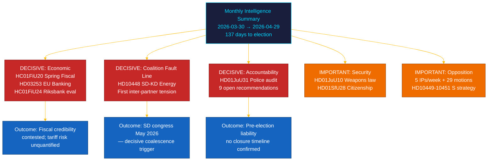

# 📋 Eksekutivt sammendrag — Riksdagens månedsoversikt: april–mai 2026

| Felt | Verdi |
|------|-------|
| **Sammendrag-ID** | BRF-2026-M05-APR-29 |
| **Klassifisering** | OFFENTLIG · Lesetid ≤ 5 minutter |
| **Dekningsperiode** | 2026-03-30 → 2026-04-29 (riksmöte 2025/26, valgspurt) |
| **Forfatter** | James Pether Sörling |
| **Metodologi** | ai-driven-analysis-guide.md v5.0 · Pass 2 |
| **Oppstrøms kontinuitet** | Inkluderer 30-dagers søsteranalyser + BRF-2026-M04 (2026-04-19) + ukeoversikt 2026-04-26 |

---

## 🎯 Kjernebudskap

> **Den siste måneden i riksmøte 2025/26 leverte en avgjørende intrakoalisjonssprekk og den mest betydningsfulle finanslovgivningen i sesjonen, mot bakgrunn av eksterne økonomiske sjokk.** Tidö-koalisjonen fremmet sin valspurtsdagenda på fem fronter simultant — økonomisk styring, finansregulering, sikkerhet, velferd og konstitusjonelt ansvar — mens **SD–KD-energiinterpellasjonen (HD10448)** avdekket den første dokumenterte inter-partnerspenningen med direkte kampanjeimplikasjoner. **Det amerikanske tollsjokket** tvang en BNP-nedjustering til 1,9% (2025) i retningslinjene for vårens fiskalproposisjon (HC01FiU20). **EUs bankpakke (HD03253)** innfører Basel III/CRR3-kapitalgulv på svenske SIB-er. **Riksrevisjonens politireformrevisjon (HD01JuU31)** gir opposisjonen et valgvåpen: 9 åpne effektivitetsanbefalinger uten bekreftet avslutningsdato. Sverige er **137 dager** fra valget 13. september 2026. `[SVÆRT HØY konfidens: A1]`

---

## 🧭 3 beslutninger dette notatet støtter

| Beslutning | Evidenslocus | Handlingsvindu |
|------------|--------------|----------------|
| **Valgkampanjestrategi** — hvilke politikkområder driver svingvelgers posisjonering i de siste 137 dagene | [`scenario-analysis.md`](scenario-analysis.md) §Tre scenarier · [`significance-scoring.md`](significance-scoring.md) Top-10 DIW | Nå — før politisk maiferie |
| **Finanssektoriell redaksjonell eksponering** — SIB-kapitalbehovsimplikasjoner av CRR3-outputgulv på 72,5% | [`risk-assessment.md`](risk-assessment.md) R-FIN-01 · [`coalition-mathematics.md`](coalition-mathematics.md) §FiU-supermajoritet | Innen 6 måneder (CRR3-transposisjonsfrist) |
| **Koalisjonsstabilitetsovervåking** i lys av SD–KD-energisprekken og HD10448 | [`threat-analysis.md`](threat-analysis.md) TH-COAL · [`forward-indicators.md`](forward-indicators.md) FI-01–FI-04 | Før SD-kongress (mai 2026) og manifestlansering (~aug 2026) |

---

## 📐 60-sekunders lesning

1. **Topphistorie: HC01FiU20 Vårens fiskalproposisjon** — fire opposisjonspartier (S, V, C, MP) bestred Tidös rammeverk; tollsjokket reviderte BNP til 1,9% (2025). `[SVÆRT HØY · A1]`
2. **SD–KD energisprekk (HD10448)** — Busch (KD) og Fransson (SD):s divergens er den første dokumenterte intrakoalisjonspenningen. SD-kongress (mai 2026) er neste trigger. `[HØY · A2]`
3. **EUs bankpakke (HD03253)** — CRR3/CRD6-transposisjon. Basel III 72,5%-outputgulv påvirker Nordea, SEB, Handelsbanken, Swedbank. `[SVÆRT HØY · A1]`
4. **Riksrevisjonens politireformrevisjon (HD01JuU31)** — 9 åpne anbefalinger uten lukkingsfrist. Opposisjon sikret frem til 2026-09-13. `[HØY · A1]`
5. **Statsborgerliggjøring (HD01SfU28)** — koalisjonskohesjonstest mellom L og SD. `[HØY · B2]`
6. **Riksbankens pengepolitiske evaluering (HC01FiU24)** — FiU godkjenner 2024-politikk; IMF WEO apr-2026 projiserer SWE KPI til ~2,0% for 2026. `[HØY · A1]`
7. **S-ansvarsliggjøringskampanje** — fem interpellasjoner på én uke (HD10449–10451, HD10454, HD10455) pluss 29+ motioner. `[HØY · B2]`
8. **10-årig grunnskolereform (HC01UbU17)** — strukturelt vesentlig; implementeringshorisont 2027–2028. `[MIDDELS · B2]`

---

## 🔭 Fremste fremtidige trigger

**SD-kongressenergiplatformsvedtak (mai 2026)** — hvis SD formelt vedtar en kjernekraftsmaksimalistisk energiplattform som kolliderer med KD:s posisjon (som varslet i HD10448), blir koalisjonsenergiforhandlingene høsten 2026 strukturelt konfliktfylte uansett valgutfall. `[HØY · B2]`

---

<!-- source-sha: aef867f928a2f4069766f065dd0ce9404a49f679 -->
