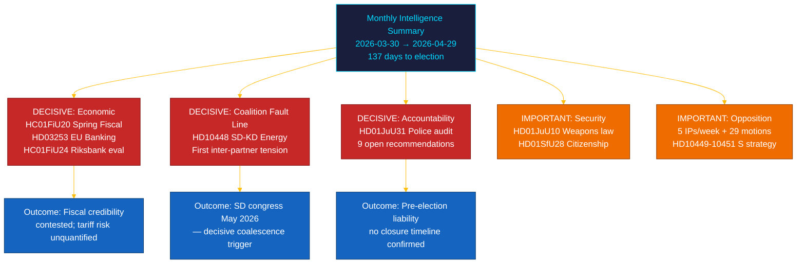

# 📋 Exekutiv sammanfattning — Riksdagens månadsöversikt: april–maj 2026

| Fält | Värde |
|------|-------|
| **Sammanfattnings-ID** | BRF-2026-M05-APR-29 |
| **Klassificering** | OFFENTLIG · Lästid ≤ 5 minuter |
| **Täckningsperiod** | 2026-03-30 → 2026-04-29 (riksmöte 2025/26, valspurt) |
| **Upphovsman** | James Pether Sörling |
| **Metodologi** | ai-driven-analysis-guide.md v5.0 · Pass 2 |
| **Uppströmskontinuitet** | Inkluderar 30-dagars systeranalyser + BRF-2026-M04 (2026-04-19) + veckoöversikt 2026-04-26 |

---

## 🎯 Kärnbudskap

> **Riksmötets sista månad 2025/26 levererade en avgörande intrakoalitionell spricka och den mest betydelsefulla finanslagstiftningen under sessionen, mot bakgrund av externa ekonomiska chocker.** Tidökoalitionen drev sin valagenda på fem fronter simultant — ekonomisk styrning, finansreglering, säkerhet, välfärd och konstitutionellt ansvarsutkrävande — medan **SD–KD-energiinterpellationen (HD10448)** exponerade den första dokumenterade interpartnersspänningen med direkta kampanjimplikationer. **Den amerikanska tullchocken** tvingade fram en BNP-nedrevidering till 1,9% (2025) i riktlinjerna för vårens fiskalproposition (HC01FiU20), vilket underminerar regeringens trovärdighetsanspråk. **EU:s bankpaket (HD03253)** inför Basel III/CRR3-kapitalgolv på svenska SIB:er. **Riksrevisionens granskning av polisreformen (HD01JuU31)** ger oppositionen ett vallvapen: 9 öppna effektivitetsrekommendationer utan bekräftat avslutsdatum. Sverige befinner sig **137 dagar** från valet den 13 september 2026. `[MYCKET HÖG konfidensgrad: A1]`

---

## 🧭 3 beslut detta underlag stödjer

| Beslut | Bevislocus | Åtgärdsfönster |
|--------|------------|----------------|
| **Valrörelsestrategi** — vilka politikområden driver svingväljares positionering under de sista 137 dagarna | [`scenario-analysis.md`](scenario-analysis.md) §Tre scenarier · [`significance-scoring.md`](significance-scoring.md) Top-10 DIW | Nu — före politisk majsemester |
| **Finanssektoriell redaktionell exponering** — SIB-kapitalbehovsimplikationer av CRR3-outputgolv på 72,5% | [`risk-assessment.md`](risk-assessment.md) R-FIN-01 · [`coalition-mathematics.md`](coalition-mathematics.md) §FiU-supermajoritet | Inom 6 månader (CRR3-transponeringsdeadline) |
| **Koalitionsstabilitetsövervakning** mot bakgrund av SD–KD-energisprickan och HD10448 | [`threat-analysis.md`](threat-analysis.md) TH-COAL · [`forward-indicators.md`](forward-indicators.md) FI-01–FI-04 | Före SD:s kongress (maj 2026) och manifestlansering (~aug 2026) |

---

## 📐 60-sekunders läsning

1. **Topnyhet: HC01FiU20 Vårens fiskalproposition** — fyra oppositionspartier (S, V, C, MP) ifrågasatte Tidös ekonomiska ramverk; den amerikanska tullchocken reviderade BNP till 1,9% (2025). Regeringens tillväxtstrategi möter externa motvindar för första gången. `[MYCKET HÖG · A1]`
2. **SD–KD energispricka (HD10448)** — Busch (KD, energiminister) och Fransson (SD):s interpellationsdivergense är den första dokumenterade intrakoalitionsspänningen med valstrategiska insatser. SD:s kongress (maj 2026) är nästa triggerpunkt. `[HÖG · A2]`
3. **EU:s bankpaket (HD03253)** — transponering av CRR3/CRD6. Basel III 72,5%-outputgolv påverkar Nordea, SEB, Handelsbanken, Swedbank. Obligatorisk EU-efterlevnad men inhemska Finansinspektionens pelare-2-val förblir synliga vid remissvar-hearingar i maj–juni. `[MYCKET HÖG · A1]`
4. **Riksrevisionens polisreformgranskning (HD01JuU31)** — 9 öppna effektivitetsrekommendationer utan avslutstidslinje. Oppositionen kan utnyttja detta fram till 2026-09-13. `[HÖG · A1]`
5. **Medborgarskapsskärpning (HD01SfU28)** — koalitionskohesionstest mellan L (liberala värden) och SD (restriktionsprioritet). L:s slutliga position är en koalitionsstabilitetsindikator. `[HÖG · B2]`
6. **Riksbankens penningpolitiksutvärdering (HC01FiU24)** — FiU godkänner 2024 års policyresultat och signalerar inflationsnormaliseringsväg 2025–2026; IMF WEO apr-2026 projekterar SWE KPI till ~2,0% för 2026. `[HÖG · A1]`
7. **S:s ansvarsutkrävandekampanj** — fem interpellationer på en vecka (HD10449–10451, HD10454, HD10455) plus 29+ motioner signalerar koordinerat lagstiftningstryck inför valet. `[HÖG · B2]`
8. **10-årig grundskolereform (HC01UbU17)** — strukturellt betydelsefull utbildningslagstiftning; oppositionen (V, MP, C) lämnade motmotioner; implementeringshorisont 2027–2028. `[MEDEL · B2]`

---

## 🔭 Främsta framtida trigger

**SD:s kongressenergiplatforms antagande (maj 2026)** — om SD formellt antar en kärnkraftsmaximalistisk energiplattform som kolliderar med KD:s diversifierade förnybartsposition (som förebådades i HD10448), blir koalitionsenergiförhandlingarna hösten 2026 strukturellt konfliktfyllda oavsett valutgång. Övervaka: SD:s kongressresolutionsspråk, Busch (KD):s publika svar och regeringens gemensamma uttalande (eller frånvaro därav). `[HÖG · B2]`

---

<!-- source-sha: aef867f928a2f4069766f065dd0ce9404a49f679 -->
