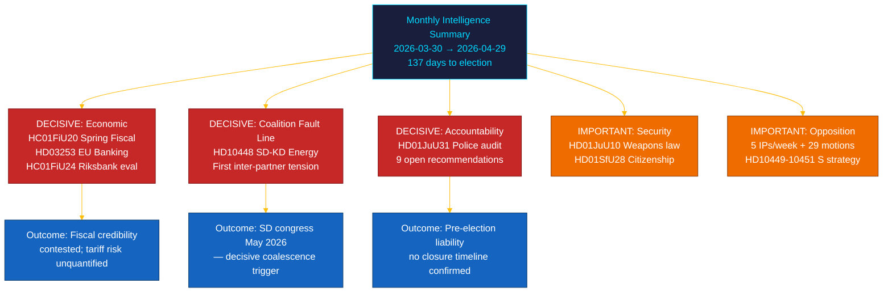

# 📋 执行简报 — 瑞典议会月度回顾：2026年4月至5月

| 项目 | 内容 |
|------|------|
| **简报ID** | BRF-2026-M05-APR-29 |
| **密级** | 公开 · 阅读时间 ≤ 5分钟 |
| **覆盖期间** | 2026-03-30 → 2026-04-29 (riksmöte 2025/26，选举冲刺) |
| **作者** | James Pether Sörling |
| **方法论** | ai-driven-analysis-guide.md v5.0 · 第2轮 |
| **上游连续性** | 30天姊妹分析 + BRF-2026-M04 (2026-04-19) + 周报2026-04-26 |

---

## 🎯 核心要点 (BLUF)

> **riksmöte 2025/26的最后一个月在外部经济冲击背景下，带来了联合政府内的决定性裂痕和本届会期最重要的财政立法。** Tidö联合政府在经济治理、金融监管、安全、福利和宪法责任五条战线上同时推进选前议程，**SD–KD能源质询(HD10448)**揭示了联合伙伴间首次有据可查的、对选举有直接影响的紧张关系。**美国关税冲击**导致春季财政方案(HC01FiU20)中的GDP指引下调至1.9%（2025年）。**欧盟银行业监管包(HD03253)**对瑞典系统重要性银行施加Basel III/CRR3资本下限。**Riksrevisionen警察改革审计(HD01JuU31)**为反对党提供了选举武器：9项未解决的效率建议，无确认关闭时间表。距2026年9月13日选举还有**137天**。`[极高可信度：A1]`

---

## 🧭 本简报支持的三项决策

| 决策 | 证据位置 | 行动窗口 |
|-----|---------|---------|
| **选举竞选策略** — 在剩余137天内左右无党派选民的政策领域 | [`scenario-analysis.md`](scenario-analysis.md) §三种情景 · [`significance-scoring.md`](significance-scoring.md) DIW前10 | 现在 — 5月政治假期前 |
| **金融行业编辑风险敞口** — CRR3产出下限72.5%对SIB资本要求的影响 | [`risk-assessment.md`](risk-assessment.md) R-FIN-01 · [`coalition-mathematics.md`](coalition-mathematics.md) §FiU超多数 | 6个月内（CRR3过渡截止日前） |
| **联合政府稳定性监测** 以HD10448为鉴的SD–KD能源裂痕 | [`threat-analysis.md`](threat-analysis.md) TH-COAL · [`forward-indicators.md`](forward-indicators.md) FI-01–FI-04 | SD党代会（2026年5月）和竞选纲领发布（约2026年8月）前 |

---

## 📐 60秒速读

1. **头条新闻：HC01FiU20春季财政方案** — 4个反对党(S, V, C, MP)质疑Tidö的经济框架；美国关税冲击使GDP修订为1.9%（2025）。`[极高 · A1]`
2. **SD–KD能源裂痕(HD10448)** — Busch(KD)与Fransson(SD)的对立是具有选举赌注的首次联合政府内部紧张。SD党代会（2026年5月）是下一个触发点。`[高 · A2]`
3. **欧盟银行业监管包(HD03253)** — CRR3/CRD6过渡。Basel III 72.5%下限影响Nordea、SEB、Handelsbanken、Swedbank。`[极高 · A1]`
4. **Riksrevisionen警察改革审计(HD01JuU31)** — 无关闭时间表的9项未解决建议。反对党已锁定至2026-09-13。`[高 · A1]`
5. **公民身份收紧(HD01SfU28)** — L与SD之间的联合凝聚力测试。`[高 · B2]`
6. **Riksbank货币政策评估(HC01FiU24)** — FiU批准2024年政策；IMF WEO 2026年4月预测SWE CPI约2.0%（2026年）。`[高 · A1]`
7. **S的问责运动** — 一周内5项质询(HD10449–10451, HD10454, HD10455)加29项以上动议。`[高 · B2]`
8. **十年初等教育改革(HC01UbU17)** — 具有结构性重要意义的教育立法；预计2027–2028年实施。`[中 · B2]`

---

## 🔭 最重要的前瞻触发点

**SD党代会能源纲领采纳（2026年5月）** — 如SD正式采纳与KD立场不相容的核能最大化纲领（与HD10448预示一致），则2026年秋季联合政府能源谈判将在无论选举结果如何的情况下在结构上呈对抗性。`[高 · B2]`

---

<!-- source-sha: aef867f928a2f4069766f065dd0ce9404a49f679 -->
