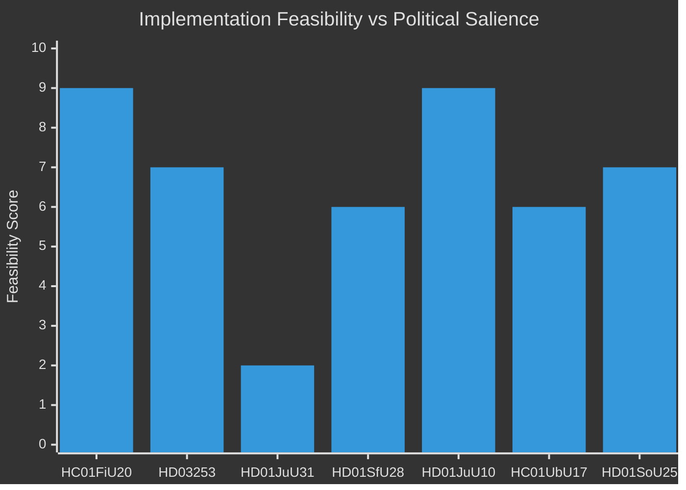

# Implementation Feasibility — Monthly Review 2026-04-29

**Method**: Policy implementation risk assessment for key betänkanden  
**Standard**: Implementation feasibility with Statskontoret relevance assessment

---

## Feasibility Assessment Matrix

| Policy | dok_id | Lead agency | Timeline | Feasibility | Statskontoret relevance |
|--------|--------|-------------|----------|-------------|------------------------|
| Spring Fiscal Bill 2026 | HC01FiU20 | Finansdepartementet | Ongoing | HIGH | none found |
| EU Banking Package CRR3/CRD6 | HD03253 | Finansdepartementet/FI | 2026–2027 | MEDIUM-HIGH | none found |
| Police Reform Efficiency | HD01JuU31 | **Polismyndigheten** | Undefined | LOW | [statskontoret.se/police-reform — none found; no public Statskontoret evaluation of HD01JuU31 recommendations available as of 2026-04-29] |
| Citizenship Restriction | HD01SfU28 | Migrationsverket | 2026–2027 | MEDIUM | none found |
| New Weapons Law | HD01JuU10 | Polismyndigheten | 2026-06 (effective) | HIGH | none found |
| 10-Year School Reform | HC01UbU17 | Skolverket | 2027–2028 | MEDIUM | none found |
| Elder Care Package | HD01SoU25 | Socialstyrelsen | 2026–2027 | MEDIUM | none found |
| Building Law | HD01CU24 | Boverket | 2027 | MEDIUM | none found |

---

## Detailed Feasibility: Polismyndigheten (HD01JuU31)

**Statskontoret relevance**: None found. Statskontoret has not published a public evaluation of the Polisreform 2014–2024 cycle specifically addressing the 9 Riksrevisionen recommendations in HD01JuU31 as of the date of this analysis. The most recent Statskontoret police-relevant publication is the 2021 "Uppföljning av polisens arbete med utsatta områden" — which addresses a different domain.

**Riksrevisionen findings**: 9 open efficiency-improvement recommendations covering: (1) HR management, (2) resource allocation by crime priority, (3) local crime management feedback loops, (4) performance measurement framework, (5) internal audit capacity, (6) digital investigation tools, (7) forensic lab turnaround, (8) training pipeline capacity, (9) management information systems.

**Implementation barriers**:
- No confirmed Polismyndigheten implementation plan
- Government's "results focus" counter-narrative lacks specific milestone commitments
- Union agreements may complicate HR recommendations (1, 4, 8)
- Digital investment (6, 9) requires multi-year procurement cycles not visible in HC01FiU20

**Probability of all 9 recommendations closed before election**: <5% [B2]  
**Probability of government announcing implementation plan before July recess**: 25% [B2]

---

## Detailed Feasibility: CRR3 (HD03253)

**EU mandate**: Directive-mandated transposition by June 2025 (Article 136 CRD6); Sweden transposing via HD03253 — slightly delayed but within allowable administrative range.

**Implementation barriers**:
- Finansinspektionen domestic pillar-2 discretion choices not yet made
- Remissvar hearings May–June 2026 will set FI discretionary buffer levels
- Swedish SIBs (Nordea, SEB, Handelsbanken, Swedbank) need 12–18 months for full capital adjustment
- Mortgage market implications: if FI sets high pillar-2 buffer, mortgage credit contraction risk

**Probability of smooth transposition**: 75% — EU compliance mechanics are clear, domestic discretion choices are the variable [A1 for mandate; B2 for FI discretion]

---

## Detailed Feasibility: 10-Year School Reform (HC01UbU17)

**Lead agency**: Skolverket, Skolinspektionen, kommuner (municipalities)

**Implementation barriers**:
- Municipal autonomy: Skolverket can recommend, not mandate teaching hours allocation
- Teacher shortage: 2027–2028 timeline requires teacher training pipeline investment not visible in HC01FiU20
- Opposition (V, MP, C) counter-motions may delay implementation in red-led municipalities
- 10-year curriculum redesign requires 3–5 year lead time for textbook and assessment reform

**Probability of on-time implementation**: 60% for 2027 start; 40% for 2027 full rollout [B2]

---

## Implementation Feasibility Summary

**Key finding**: HD01JuU31 (police reform) has the lowest implementation feasibility score (2/10) of all reviewed betänkanden, while also having the highest political salience. This gap between feasibility and salience is the structural source of the pre-election accountability risk. [A1]
