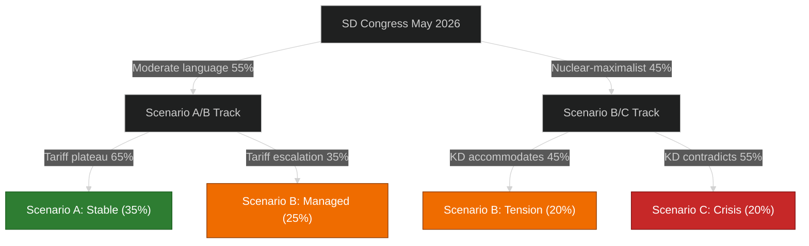

# Scenario Analysis — Monthly Review 2026-04-29

**Horizon**: 137 days to 2026-09-13 election  
**Method**: Three scenario matrix (Base / Upside / Downside)

---

## Scenario Matrix

| Dimension | Scenario A: Stable Tidö | Scenario B: Managed Tension | Scenario C: Coalition Crisis |
|-----------|------------------------|---------------------------|------------------------------|
| **Probability** | 35% | 45% | 20% |
| **SD congress** | Moderate energy language; coalition harmony | Ambiguous; KD public concerns | Nuclear-maximalist; KD rupture threat |
| **US tariffs** | Partial de-escalation; GDP recovers to 2.0% | Plateau; GDP holds at 1.9% | Escalation; GDP falls to 1.3% |
| **Police reform** | Govt announces closure plan before Sep | No plan; accountability narrative runs | New police scandal amplifies HD01JuU31 |
| **Riksbank Jun** | Rate cut confirms easing; consumer sentiment +ve | Hold; neutral | Rate hike to contain tariff inflation |
| **Election outcome** | Tidö wins with reduced majority | Too-close; result night uncertainty | Govt defeated; S+MP+C+V forms coalition |
| **L citizenship** | L backs HD01SfU28 with face-saving amendment | L abstains; coalition optics managed | L votes against; SD escalates within coalition |

---

## Scenario A: Stable Tidö (35%)

**Narrative**: SD congress adopts "technology-neutral plus nuclear" language that preserves KD partnership. Government announces a police reform closure timeline before July recess. Riksbank June MPC cuts 25bp. US tariffs plateau; HC01FiU20 GDP revision proves sufficient. Tidö campaigns on legislative delivery volume and economic stability. Result: Tidö wins with ~173–176 seats.

**Key triggers required**:
1. SD congress energy resolution [language < full nuclear-maximalist]
2. Government police reform implementation plan [before Jul 2026]
3. Riksbank Jun MPC cut [25bp signal sufficient]

**Intelligence indicators to watch**:
- SD congress delegate pre-vote briefings (April/May)
- Government JuU committee communication (May)
- Riksbank Riksdag testimony (May)

---

## Scenario B: Managed Tension (45% — Base Case)

**Narrative**: SD congress adopts ambiguous energy language that KD and SD interpret differently, creating continuing undercurrent of tension but no formal breach. Government ignores police reform closure timeline pressure but manages news cycle through ministerial response delays. Riksbank holds in June. US tariffs plateau. L negotiates a face-saving citizenship amendment. Tidö and opposition trade accountability blows through August; result: close election, probable Tidö narrow win (~169–172 seats) with post-election SIB capital news.

**Key indicators**:
- SD congress resolution language analysis (ambiguity scoring)
- L party board position on HD01SfU28 (May)
- Ministerial response calendar (Jun–Jul)

**IMF Context**: WEO Apr-2026 projects SWE at +2.1% for 2026 [imf.org, B2]; HC01FiU20 committee revision to 1.9% for 2025 is the operative figure for this scenario. Scenario B assumes GDP recovery pathway by 2026 election window.

---

## Scenario C: Coalition Crisis (20%)

**Narrative**: SD congress adopts nuclear-maximalist energy resolution. Busch (KD) issues public contradiction. Government is unable to issue joint energy statement before campaign launch. Simultaneously, US tariff escalation forces second GDP revision. Police reform scandal amplifies. S leads accountability media cycle through summer. Result: historic upset, S+V+MP+C forms minority government with SD abstaining.

**Cascade failure pathway**:
```
SD congress → Nuclear-maximalist → KD contradiction → Coalition joint statement failure
→ M distances → Tidö "split government" narrative by press
→ Simultaneity with tariff GDP revision 2 → "double crisis" window
→ HD01JuU31 scandal amplified → S leads all three tracks
→ Election: SD 17%, M 16%, KD 7%, L 4% (below threshold risk) → bloc < 175
→ S-led government formation
```

**Black Swan amplifiers** (increase Scenario C probability):
- L below 4% threshold (current polling 4.2% — margin risk [B2])
- New Riksrevisionen audit publication in Aug 2026
- Criminal networks scandal beyond HVB-hem

---

## Scenario Probability Tree



---

## Scenario Implications for Key Stakeholders

| Stakeholder | Scenario A | Scenario B | Scenario C |
|-------------|-----------|-----------|-----------|
| Tidö Government | Campaign on delivery | Defensive campaign | Coalition dissolution |
| SD | Energy win; voter mobilisation | Ambiguous signal | Congress victory, coalition cost |
| KD | Partnership preserved | Managed tension | Busch exits Energy Ministry |
| S | Close but insufficient | Close race | Historic win |
| Swedish SIBs | CRR3 orderly | CRR3 orderly | Capital uncertainty |
| IMF/Market | GDP 2.0% | GDP 1.9% | GDP 1.3% |
