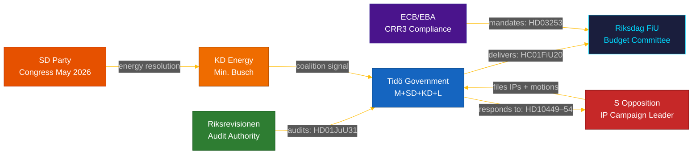

# Stakeholder Perspectives — Monthly Review 2026-04-29

**Frame**: Multi-actor analysis of April 2026 legislative window  
**Method**: Per-actor position + interest + instrument + outcome assessment

---

## Actor Map

---

## Per-Stakeholder Analysis

### 1. Tidö Government (M+SD+KD+L)

**Interest**: Consolidate pre-election record; contain SD–KD fault line; defend economic framework against tariff headwinds.

**Position on key files**:
- HC01FiU20: Defended. Acknowledged GDP revision publicly. "Three-pillar growth strategy" maintained. [A1]
- HD10448: Silent as coalition (no joint statement). Individual positions divergent. [A2]
- HD01JuU31: Contested Riksrevisionen framing; claimed "results focus" as counter-narrative. [A1]
- HD03253: Supported. EU compliance leadership framing. [A1]

**Instruments**: Ministerial responses (7 due), FiU majority control, KU scrutiny management.

**Vulnerability**: All four weaknesses identified in SWOT (police, energy, GDP, citizenship) materialised simultaneously.

---

### 2. Socialdemokraterna (S)

**Interest**: Maximise accountability damage in 137-day window; force government onto defensive across all domains.

**Strategy**: Coordinated interpellation salvo (5 IPs/week) + 29 motions + counter-frame HC01FiU20 as "responsibility-free economics" under tariff risk. [A1]

**Position on key files**:
- HC01FiU20: Opposition reservation. "No long-term fiscal sustainability under US tariff conditions." [A1]
- HD01JuU31: Amplifying. Using Riksrevisionen authority. [A1]
- HD10454: HD10454 HVB-hem — S MP filed; personal accountability focus. [B2]

**Instruments**: Interpellations (constitutional), motions (committee), media access.

**Strength**: Riksrevisionen audit (HD01JuU31) as external credibility anchor, beyond government contestation.

---

### 3. Sverigedemokraterna (SD)

**Interest**: Consolidate electoral base on energy (high-cost household relief), law-and-order, immigration. Differentiate from M and KD without breaking coalition.

**Key move**: HD10448 interpellation — filing interpellation against Energy Minister (KD, same coalition) is constitutionally unusual. Signals SD views HD10448 as within bounds of coalition criticism. [A2]

**SD congress (May 2026)**: The most consequential near-term event in this stakeholder analysis. Energy platform adoption will determine whether TH-COAL-01 escalates or de-escalates. [B2]

**Vulnerability**: If congress adopts nuclear-maximalist language, SD is locked into a position that limits flexibility with KD post-election.

---

### 4. Kristdemokraterna (KD) — Energy Minister Busch

**Interest**: Maintain diversified energy transition (nuclear + renewables) as KD brand differentiator from SD's pure-nuclear positioning.

**Response to HD10448**: Defended "technology-neutral" framework. Avoided direct confrontation. [A2]

**Vulnerability**: If SD congress passes nuclear-maximalist resolution, Busch must choose between KD policy and coalition solidarity. This is a personally exposed ministerial position entering the campaign.

---

### 5. Liberalerna (L)

**Interest**: Maintain social-liberal brand; prevent citizenship restrictions that conflict with rule-of-law values (HD01SfU28 coalition tension).

**Coalition management**: L's chamber vote on HD01SfU28 is the test of whether L can sustain dual allegiance (coalition + values base) through September. [A1]

---

### 6. Riksrevisionen

**Interest**: Institutional credibility maintenance; ensure audit findings receive government implementation plans.

**HD01JuU31 outcome**: 9 open recommendations, no closure date. Riksrevisionen's credibility in the HD01JuU31 report is the opposition's most durable accountability weapon. [A1]

---

### 7. Finansinspektionen / Swedish SIBs

**Interest**: Maximum domestic pillar-2 discretion within CRR3/CRD6 transposition (HD03253); orderly capital management timeline.

**Key decision point**: May–June remissvar hearings on CRR3 transposition — Finansinspektionen's discretionary choices will determine mortgage-market capital adjustment timeline. [A1]

**Stakeholders affected**: Nordea, SEB, Handelsbanken, Swedbank (Swedish SIBs). Combined balance sheet adjustment estimated at ~SEK 150–200bn equivalent capital floor impact. [B2]

---

## Stakeholder Coalition Map (May–June 2026)

| Coalition | Members | Interest | Alignment |
|-----------|---------|----------|-----------|
| Tidö Stable | M, SD, KD, L | Pre-election delivery | Contested on energy |
| Opposition Bloc | S, V, MP, C | Accountability | Aligned on Tidö critique |
| Audit Authority | Riksrevisionen | Implementation | Neutral/Opposition-accessible |
| Financial Regulator | FI, Riksbank | EU compliance | Technical |
| EU Mandaters | ECB/EBA | CRR3 compliance | Non-partisan |
