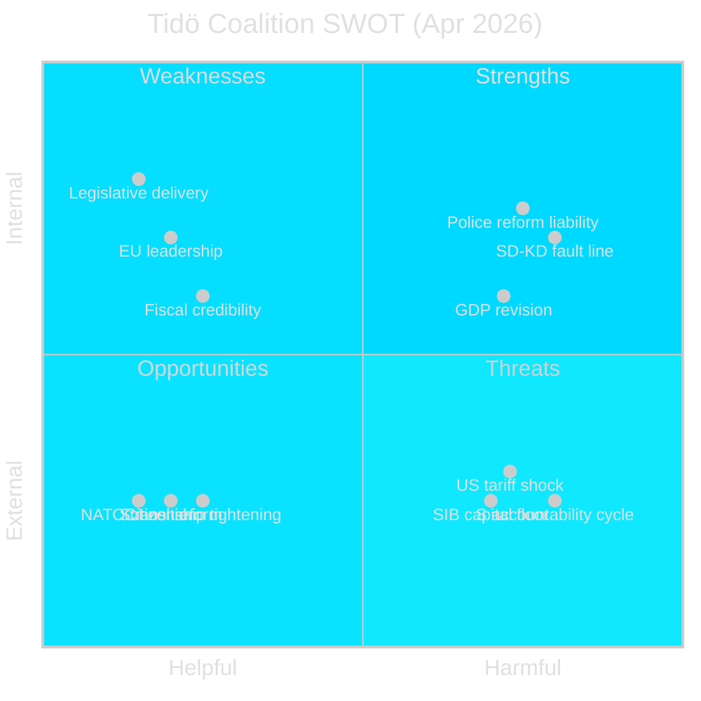

# SWOT Analysis — Monthly Review 2026-04-29

**Frame**: Tidö Coalition vs. Opposition entering 137-day pre-election window  
**Method**: Political SWOT with evidence attribution

---

## Government / Tidö Coalition SWOT

### Strengths
| Item | Evidence | Confidence |
|------|----------|------------|
| **Legislative delivery volume** — 10+ betänkanden advanced in final sprint | HC01FiU20, HD01JuU10, HC01UbU17, HC01KU20 | A1 |
| **EU Banking Package compliance leadership** — first-mover transposition credibility | HD03253, FiU committee report | A1 |
| **Riksbank policy endorsement** — HC01FiU24 FiU endorsement of 2024 record | HC01FiU24, riksdagen.se | A1 |
| **10-year school reform (HC01UbU17)** — structural legacy legislation for 2027–2028 | HC01UbU17 | A1 |
| **NATO integration continuity** — no credible opposition to defence posture | Multiple defence docs | B2 |

### Weaknesses
| Item | Evidence | Confidence |
|------|----------|------------|
| **Police reform credibility gap** — 9 open Riksrevisionen recommendations, no closure date | HD01JuU31, riksdagen.se | A1 |
| **SD–KD energy policy divergence** — publicly documented intra-coalition tension | HD10448, interpellation record | A2 |
| **GDP credibility downgrade** — from 2.4% to 1.9% (2025) acknowledged mid-cycle | HC01FiU20, committee proceedings | A1 |
| **Citizenship L–SD coalition management** — L social-liberal values vs SD restriction priority | HD01SfU28, SfU report | A1 |
| **Limited opposition engagement** — all 4 main opposition parties contested HC01FiU20 framework | HC01FiU20, reservations | A1 |

### Opportunities
| Item | Evidence | Confidence |
|------|----------|------------|
| **CRR3 pillar-2 remissvar (May–Jun)** — opportunity to set SIB-friendly domestic discretion | HD03253, FiU process | A1 |
| **SD congress (May 2026)** — if SD adopts moderate energy language, fault line de-escalates | HD10448 fwd indicator | B2 |
| **JuU police reform implementation** — if government announces closure timeline before Sep 2026 | HD01JuU31 | B2 |
| **Riksbank rate easing (Riksbank Jun MPC)** — positive consumer sentiment before election | HC01FiU24, IMF WEO | B2 |

### Threats
| Item | Evidence | Confidence |
|------|----------|------------|
| **Rolling S accountability cycle** — 7 ministerial responses due May–Jun 2026 | HD10449–10454 | B2 |
| **US tariff escalation** — further GDP downside not quantified in HC01FiU20 | HC01FiU20, IMF B2 vintage | B2 |
| **SIB capital stress** — Basel III implementation costs affect mortgage market timing | HD03253 | B2 |
| **SD congress nuclear-maximalist energy resolution** — structurally adversarial for post-election coalition | HD10448 fwd trigger | B2 |

---

## Opposition (S-led bloc) SWOT

### Strengths
| Item | Evidence | Confidence |
|------|----------|------------|
| **Coordinated accountability strategy** — 5 IPs in one week + 29 motions | HD10449–10454 | A2 |
| **Police reform audit (HD01JuU31)** — Riksrevisionen credibility as accountability anchor | HD01JuU31 | A1 |
| **Economic vulnerability window** — GDP downgrade + tariff uncertainty for attack surface | HC01FiU20 | A1 |
| **HVB-hem security narrative** — organised crime infiltration of care homes (HD10454) | HD10454 | B2 |

### Weaknesses
| Item | Evidence | Confidence |
|------|----------|------------|
| **No credible alternative budget framework** — reservation statements did not quantify alternative | HC01FiU20 reservation analysis | B2 |
| **V–MP fractured green-left flank** — conflicting priorities on citizenship (HD01SfU28) | HD01SfU28 debate | B2 |
| **137-day countdown disadvantage** — insufficient time for large-scale policy reframes | Electoral calendar | A1 |

---

## Net Assessment

The Tidö coalition enters the pre-election sprint with a **defensive strength posture**: substantial legislative delivery but a deteriorating economic credibility narrative and one confirmed intra-coalition fault line. The opposition enters with a **coordinated attack posture**: well-resourced accountability instruments but no positive alternative programme. The decisive variable is **SD's May congress energy resolution** — the single event with binary coalition-stability implications within the 137-day window.
