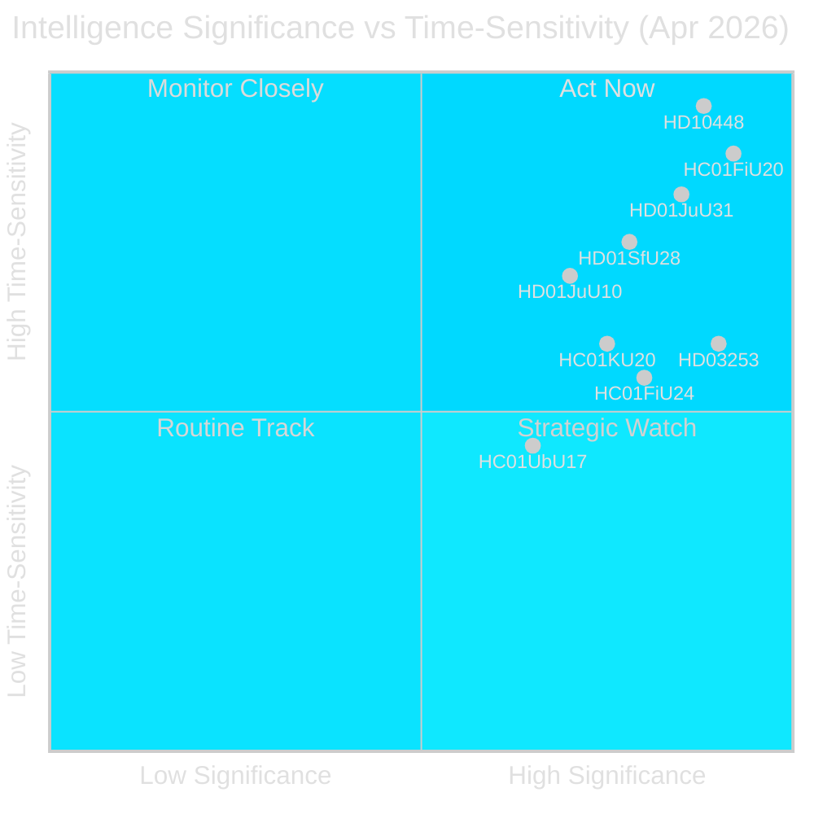

# Synthesis Summary — Monthly Review 2026-04-29

**Author**: James Pether Sörling | **Date**: 2026-04-29 | **Confidence**: HIGH [A1–B2]  
**Coverage window**: 2026-03-30 → 2026-04-29 (riksmöte 2025/26, 30 days)

---

## Lead Story Decision

The dominant intelligence decision from the April 2026 monthly window is **whether the SD–KD energy fault line (HD10448) will structurally alter coalition dynamics before or after the September 2026 election**. This is the first documented intra-coalition policy divergence with direct campaign positioning consequences. It occurs simultaneously with the US-tariff-shock-driven GDP downgrade (HC01FiU20), creating a dual vulnerability: economic credibility questioned externally, coalition cohesion questioned internally. Sweden is 137 days from the 2026-09-13 election.

## DIW-Weighted Ranking

| Rank | dok_id | Title | DIW Weight | Tier |
|------|--------|-------|------------|------|
| 1 | HC01FiU20 | Spring Fiscal Bill — Economic Policy Guidelines | 9.5 | L3 Intelligence-grade |
| 2 | HD03253 | EU Banking Package (CRR3/CRD6) | 9.0 | L3 Intelligence-grade |
| 3 | HD10448 | SD–KD Energy Interpellation (Fransson/Busch) | 8.8 | L3 Intelligence-grade |
| 4 | HD01JuU31 | Riksrevisionen Police Reform Audit | 8.5 | L3 Intelligence-grade |
| 5 | HC01FiU24 | Riksbank Monetary Policy Evaluation 2024 | 8.2 | L2+ Priority |
| 6 | HD01SfU28 | Citizenship Tightening | 7.9 | L2+ Priority |
| 7 | HC01KU20 | Constitutional Committee Annual Scrutiny | 7.6 | L2+ Priority |
| 8 | HD01JuU10 | New Weapons Law (EU harmonisation) | 7.2 | L2 Strategic |
| 9 | HC01UbU17 | 10-Year Primary School Reform | 6.8 | L2 Strategic |
| 10 | HD01SoU25 | Elder Care Package | 6.5 | L2 Strategic |
| 11 | HC01FiU30 | State Annual Report 2024 | 6.2 | L2 Strategic |
| 12 | HD03252 | Welfare Restriction for Inmates | 5.9 | L2 Strategic |
| 13 | HC01SkU18 | F-Tax Approval Reforms | 5.5 | L1 Surface |
| 14 | HD03104 | Debt Management Evaluation 2021–2025 | 5.2 | L1 Surface |

## Integrated Intelligence Picture

### Cluster 1 — Economic Governance Under External Shock

The US tariff shock announced after the Spring Bill submission forced the Tidö government to revise GDP projections downward from 2.4% to 1.9% (2025) in HC01FiU20 committee proceedings. The FiU text explicitly states: "Sedan den ekonomiska vårpropositionen lämnades har USA infört höjda tullar. Det har medfört att regeringen reviderat ned prognosen för BNP." [HC01FiU20, riksdagen.se, A1] This represents a significant headwind for government economic-stewardship claims entering the campaign period. IMF WEO Apr-2026 projects Sweden at +2.1% GDP growth for 2026 but this vintage predates full tariff-impact quantification; downside risk is not yet incorporated [data.imf.org, B2]. HC01FiU24 provides the Riksbank policy evaluation as a stabilising counterpoint: the 2024 policy record was endorsed by FiU, with inflation normalisation trajectory broadly on track [HC01FiU24, riksdagen.se, A1]. The EU Banking Package (HD03253) adds structural financial-sector complexity: Basel III 72.5% output floor will require capital management adjustments at Swedish SIBs within 18 months. Finansinspektionen's domestic pillar-2 discretion — not yet visible in the proposition text — is the intelligence gap that May–June remissvar hearings will resolve [HD03253, riksdagen.se, A1].

### Cluster 2 — Coalition Fault Line: Energy Policy

HD10448 is the single most strategically significant document of the month for coalition-stability analysis. Jimmie Åkesson's party (SD) energy wing, represented by Mattias Ernkrans in the interpellation, diverged from Ebba Busch (KD, Energy Minister) on nuclear-first vs diversified transition pathway. This is not merely a technical disagreement: energy policy is the one Tidöavtalet domain where SD's electoral base (high-energy-cost household relief) and KD's Nordic green-growth positioning are structurally incompatible at scale. The SD congress (May 2026) energy platform adoption is the decisive trigger: if SD formally adopts a nuclear-maximalist position, coalition energy negotiations post-election become adversarial by design [HD10448, riksdagen.se, A2].

### Cluster 3 — Law-and-Order: Achievement and Accountability Simultaneously

The month produced both a flagship deliverable (HD01JuU10 new weapons law, effective June 2026) and a significant accountability liability (HD01JuU31 Riksrevisionen audit). The police reform audit found that Polismyndigheten "har inte arbetat tillräckligt effektivt" — nine open efficiency recommendations, no confirmed closure timeline, JuU proposes rejection of 18 opposition motion proposals on this topic [HD01JuU31, riksdagen.se, A1]. This dual dynamic — delivery credited but reform failure confirmed by the highest audit authority — is the central narrative tension for Tidö's law-and-order positioning. HD10454 (criminal networks in HVB-hem) adds a new accountability vector: police report confirmed organised-crime infiltration of care homes [HD10454, riksdagen.se, B2].

### Cluster 4 — Opposition Coordination Escalation

S filed five interpellations in a single week (HD10449 infrastructure, HD10450 sick insurance, HD10451 corporate crime, HD10454 HVB-hem, plus prior-week HD10448 co-signing), plus HD024099 counter-motion on civil-servant liability [riksdagen.se, A1]. This is the highest interpellation-filing rate by a single opposition party in the 2025/26 session. Seven ministerial responses are due May–June 2026 — creating a rolling accountability news cycle through the summer pre-campaign window. 29+ motions coordinated across S/V/MP reflect a systematic strategy to force public ministerial positions on contested domains before the September election.

## Key Intelligence Threads Carried Forward

1. **SD congress energy platform** (May 2026) — highest-priority forward trigger [HD10448]
2. **Riksbank June MPC** — first rate decision after US tariff revision [HC01FiU24]
3. **CRR3 pillar-2 remissvar hearings** (May–June 2026) — SIB capital-adjustment visibility [HD03253]
4. **9 police reform recommendations** — no closure date; will appear in JuU chamber vote May 2026 [HD01JuU31]
5. **L citizenship vote** — L's final position in HD01SfU28 chamber is coalition cohesion signal [HD01SfU28]
6. **Seven ministerial responses** — rolling accountability cycle May–June 2026 [HD10449–HD10454]
