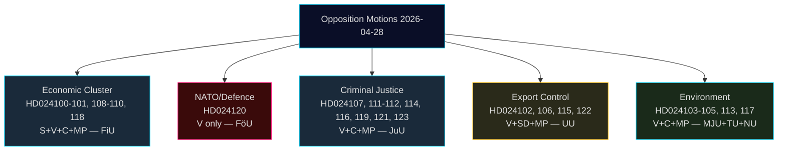
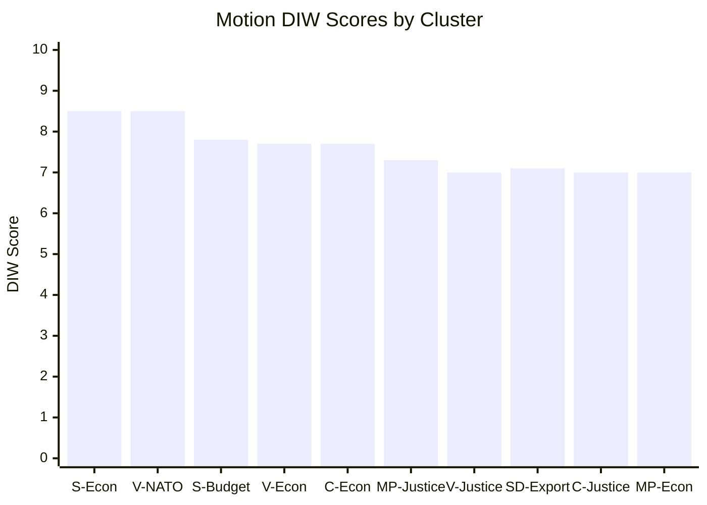
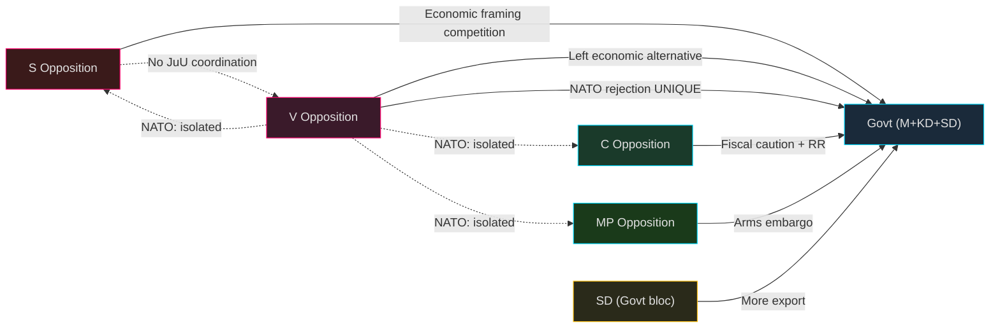
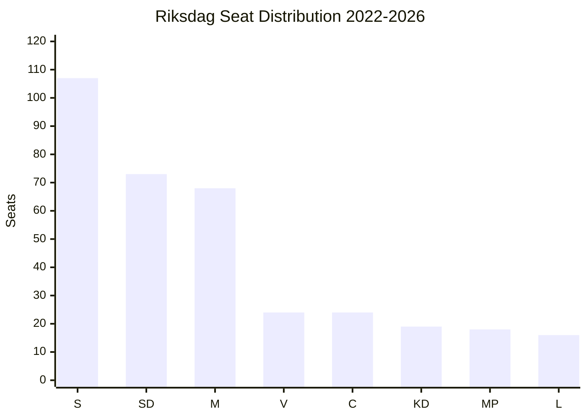
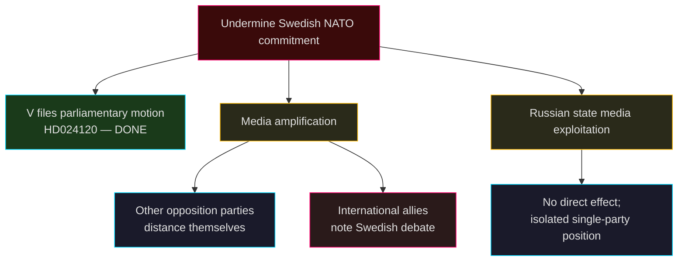
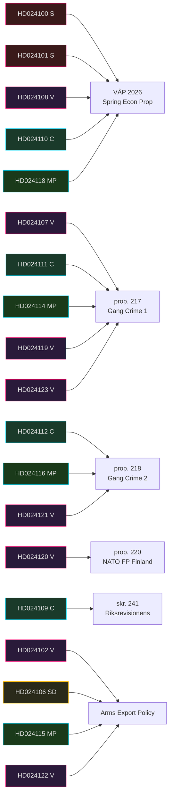

## Executive Brief
<!-- source: executive-brief.md :: https://github.com/Hack23/riksdagsmonitor/blob/main/analysis/daily/2026-04-29/motions/executive-brief.md -->

---

### 🎯 BLUF

On 28 April 2026, all four opposition parties — Socialdemokraterna (S), Vänsterpartiet (V), Centerpartiet (C), and Miljöpartiet (MP) — filed 24 motions spanning five policy clusters: the Spring Economic Proposition (prop. 2025/26:100), the Spring Budget (prop. 2025/26:99), criminal justice reform, arms export control, and environmental regulation. The legislative breadth and coordinated timing signal a consolidated opposition bloc challenging the Tidö government's core Spring legislative agenda. Vänsterpartiet's motion HD024120 — explicitly rejecting Sweden's NATO Forward Presence contribution to Finland (prop. 2025/26:220) — represents the most strategically significant single act, as V is the only Riksdag party opposing Swedish NATO commitments at this operational level. The absence of partisan alignment between V and the other opposition parties on defence marks a critical fault line within the opposition bloc.

### 🧭 3 Decisions This Brief Supports

1. **Editorial editors** deciding whether HD024120 (V rejects NATO Forward Presence) warrants breaking-news treatment separate from the economic motion cluster — **yes, it does**: it is the only motion in this cycle that directly challenges Sweden's NATO operational commitments post-accession.
2. **Policy analysts** assessing whether the opposition economic critique (S, V, C, MP) constitutes a coherent alternative budget framework or fragmented criticism — the evidence points to **fragmented**: parties advocate contradictory macroeconomic directions (S: demand stimulus; C: fiscal consolidation; V: redistribution; MP: green transformation).
3. **Intelligence consumers** tracking criminal justice opposition coalition depth: C's demand for a consequence analysis before proceeding (HD024111-112) versus V's and MP's outright rejection of the double-penalty and civil-servant liability proposals (HD024107, HD024114, HD024116, HD024119, HD024121, HD024123) — **the opposition is ideologically split**, reducing likelihood of coordinated JuU blocking.

### ⏱️ 60-Second Intelligence Bullets

- **24 motions filed 2026-04-28**, all in response to government propositions or government communications in the 2025/26 riksmöte
- **Economic cluster (6 motions)**: S, V, C, MP each challenge prop. 2025/26:100 (Spring Economic Proposition); S and V also challenge prop. 2025/26:99 (Spring Budget). No unified opposition alternative.
- **Criminal justice cluster (8 motions)**: Widest opposition count. C wants slower roll-out; MP and V reject double-gang penalties entirely. Government has majority through M-KD-SD on JuU.
- **Arms export cluster (4 motions)**: Extreme divergence — SD (HD024106) wants MORE export approvals; V (HD024102, HD024122) and MP (HD024115) want an embargo on exports to war zones. Position inversion across opposition.
- **Defence/NATO (1 motion — HD024120)**: V rejects NATO Forward Presence contribution to Finland. Isolated position; no other party supports this stance.
- **Environment (3 motions)**: C wants artskydd reform (HD024113); MP wants EU state-aid analysis before artskydd payments (HD024117); V rejects new environmental review agency (HD024105).
- **Fiscal framework (1 motion — HD024109)**: C's Martin Ådahl urges responsible fiscal policy in response to Riksrevisionen's critical report on the fiscal framework.

### 🔭 Top Forward Trigger

**JuU vote on prop. 2025/26:218 (double gang penalties)** — expected within 2–4 weeks. V, MP, and one Centerpartiet faction oppose; the government's M-KD-SD majority is sufficient to pass. Watch for S position (absent from JuU motions in this batch) as indicator of Social Democrat stance on criminal justice framing ahead of 2026 election.

### 📊 Confidence Distribution

| Claim | Admiralty | Confidence |
|-------|-----------|------------|
| All 24 motions filed 2026-04-28 | A1 | VERY HIGH |
| V is only party rejecting NATO FP | A1 | VERY HIGH |
| Opposition economic critique is fragmented | A2 | HIGH |
| Government JuU majority sufficient to pass crime bill | B2 | HIGH |
| IMF economic parameters cited | F3 | LOW [unconfirmed-IMF] |

```mermaid
graph LR
    subgraph MotionClusters["2026-04-28 Motion Clusters"]
        ECO["💰 Economic\n6 motions\nS+V+C+MP"]:::eco
        JUST["⚖️ Criminal Justice\n8 motions\nV+C+MP"]:::just
        EXP["🔫 Export Control\n4 motions\nV+SD+MP"]:::exp
        DEF["🛡️ Defence/NATO\n1 motion\nV only"]:::def
        ENV["🌿 Environment\n3 motions\nV+C+MP"]:::env
        FIS["�� Fiscal Framework\n1 motion\nC"]:::fis
    end
    style MotionClusters fill:#0a0e27,stroke:#00d9ff
    classDef eco fill:#1a3a5c,stroke:#00d9ff,color:#e0e0e0
    classDef just fill:#3a1a1a,stroke:#ff006e,color:#e0e0e0
    classDef exp fill:#2a2a1a,stroke:#ffbe0b,color:#e0e0e0
    classDef def fill:#1a1a3a,stroke:#ff006e,color:#e0e0e0
    classDef env fill:#1a3a1a,stroke:#00d9ff,color:#e0e0e0
    classDef fis fill:#2a1a3a,stroke:#ffbe0b,color:#e0e0e0
```

## Reader Intelligence Guide

Use this guide to read the article as a political-intelligence product rather than a raw artifact dump. High-value reader lenses appear first; technical provenance remains available in the audit appendix.

| Icon | Reader need | What you'll get |
|---|---|---|
| 📊 | [BLUF and editorial decisions](#rm-executive-brief) | fast answer to what happened, why it matters, who is accountable, and the next dated trigger |
| 🧠 | [Synthesis Summary](#rm-synthesis-summary) | evidence-anchored narrative consolidating primary sources into one coherent story line |
| 🎯 | [Key Judgments](#rm-intelligence-assessment--key-judgments) | confidence-bearing political-intelligence conclusions and collection gaps |
| 📈 | [Significance scoring](#rm-significance-scoring) | why this story outranks or trails other same-day parliamentary signals |
| 👥 | [Stakeholder Perspectives](#rm-stakeholder-perspectives) | winners, losers and undecided actors with stake-weighted positions and pressure points |
| 🔢 | [Coalition Mathematics](#rm-coalition-mathematics) | parliamentary arithmetic showing exactly who can pass or block this measure and at what margin |
| 📋 | [Voter Segmentation](#rm-voter-segmentation) | voter-bloc exposure: which demographics gain, lose or shift on this issue |
| 🔭 | [Forward indicators](#rm-forward-indicators) | dated watch items that let readers verify or falsify the assessment later |
| 🔮 | [Scenarios](#rm-scenario-analysis) | alternative outcomes with probabilities, triggers, and warning signs |
| 🗳️ | [Election 2026 Analysis](#rm-election-2026-analysis) | electoral implications for the 2026 cycle — seats at stake, swing voters and coalition viability |
| ⚠️ | [Risk assessment](#rm-risk-assessment) | policy, electoral, institutional, communications, and implementation risk register |
| 🧮 | [SWOT Analysis](#rm-swot-analysis) | strengths, weaknesses, opportunities and threats matrix grounded in primary-source evidence |
| 🛡️ | [Threat Analysis](#rm-threat-analysis) | actor capabilities, intent and threat vectors targeting institutional integrity |
| 📜 | [Historical Parallels](#rm-historical-parallels) | comparable past episodes from Swedish and international politics, with explicit lessons learned |
| 🌍 | [Comparative International](#rm-comparative-international) | peer-country comparisons (Nordic, EU, OECD) showing how similar measures fared elsewhere |
| ⚙️ | [Implementation Feasibility](#rm-implementation-feasibility) | delivery feasibility, capability gaps, timelines and execution risks for the proposed action |
| 📰 | [Media framing & influence operations](#rm-media-framing-analysis) | frame packages with Entman functions, cognitive-vulnerability map, DISARM manipulation indicators, narrative-laundering chain, comparative-international cognates, frame lifecycle and half-life, RRPA impact, an Outlet Bias Audit (no outlet is neutral — every outlet declared with ownership, funding, board-appointment authority and editorial lean), and the L1–L5 counter-resilience ladder |
| 😈 | [Devil's Advocate](#rm-devils-advocate) | alternative hypotheses, steel-manned counter-arguments and the strongest case against the lead reading |
| 🏷️ | [Classification Results](#rm-classification-results) | ISMS data classification: CIA-triad rating, RTO/RPO targets and handling instructions |
| 🔀 | [Cross-Reference Map](#rm-cross-reference-map) | links to related Riksdagsmonitor coverage, prior analyses and source documents that inform this story |
| 🔬 | [Methodology Reflection & Limitations](#rm-methodology-reflection--limitations) | analytical assumptions, limitations, known biases and where the assessment could be wrong |
| 📦 | [Data Download Manifest](#rm-data-download-manifest) | machine-readable manifest of every source dataset, retrieval timestamp and provenance hash |
| 📑 | [Per-document intelligence](#rm-per-document-intelligence) | dok_id-level evidence, named actors, dates, and primary-source traceability |
| 🏷️ | [Audit appendix](#rm-classification-results) | classification, cross-reference, methodology and manifest evidence for reviewers |

## Synthesis Summary
<!-- source: synthesis-summary.md :: https://github.com/Hack23/riksdagsmonitor/blob/main/analysis/daily/2026-04-29/motions/synthesis-summary.md -->

---

### Lead Story

The 24 opposition motions filed on 28 April 2026 represent the broadest single-day legislative opposition event of the 2025/26 riksmöte. The dominant story is not any single motion but rather the **structural fragmentation of the opposition**: while all four opposition parties (S, V, C, MP) oppose the government's Spring Economic Proposition (prop. 2025/26:100), they do so from irreconcilable macroeconomic positions — making coordinated blocking in FiU virtually impossible. The government's Tidö coalition (M + KD + SD) holds FiU majority and is expected to prevail on all budget and economic matters.

The strategically isolating moment belongs to V: HD024120 explicitly rejects Sweden's NATO Forward Presence contribution to Finland, placing Vänsterpartiet as the only Riksdag party opposing Sweden's operational NATO commitments post-2024 accession. This is an intelligible policy position for V's base but represents a growing distance from the other opposition parties on security policy.

### Integrated Intelligence Picture

#### Cluster 1: Spring Economic Package (FiU — priority)
- **Proposition**: 2025/26:99 (Spring Budget) and 2025/26:100 (Spring Economic Proposition)
- **S response** (HD024100, HD024101): Magdalena Andersson's bloc argues "Sverige behöver bli starkt igen" — demand for economic policy with broader employment ambition; rejects specific radiation authority mandate.
- **V response** (HD024108, Nooshi Dadgostar): Frames government policy as "misslyckad jobbpolitik," advocates redistribution and wages.
- **C response** (HD024109, HD024110, Martin Ådahl): Calls for responsible fiscal consolidation aligned with the fiscal framework; concerned about Riksrevisionen's 2025 report criticisms.
- **MP response** (HD024118, Daniel Helldén): Emphasizes green transformation and household purchasing power.
- **Assessment**: The government's economic programme has political legitimacy from its own majority. Opposition critique is internally inconsistent.

#### Cluster 2: Criminal Justice (JuU — high volume)
- **Prop. 2025/26:217** (civil servant liability): V (HD024107, HD024123), C (HD024112), MP (HD024116) all oppose. C partially accepts intent but rejects specific new criminal provision for "missbruk av offentlig ställning."
- **Prop. 2025/26:218** (double gang penalties): MP (HD024114) fully rejects. V (HD024119, HD024121) demands economic crime review and full rejection. C (HD024111) demands consequence analysis before proceeding.
- **Assessment**: Government has M-KD-SD majority in JuU sufficient to pass. Breadth of opposition signals post-passage legal challenges likely.

#### Cluster 3: Arms Export Control (UU — polarised)
- **SD (HD024106)**: Wants expanded approval for arms exports — more permissive regime.
- **V (HD024102, HD024122)**: Wants strict controls; government tasked with proposals for enhanced oversight.
- **MP (HD024115)**: Calls for embargo on exports to war zones.
- **Assessment**: Position inversion (SD pro-export, V+MP anti-export) mirrors broader alliance structure. UU will likely endorse government communication without amendment.

#### Cluster 4: Defence/NATO (FöU — critical)
- **V (HD024120)**: Explicitly rejects prop. 2025/26:220, Sweden's contribution to NATO's Enhanced Forward Presence in Finland. Motion calls for Riksdag to vote down the proposition.
- **Assessment**: Strategically isolated. No other party supports this rejection. FöU will pass the proposition; the motion will fail. Intelligence value: confirms V's continued pacifist/anti-NATO position despite accession.

#### Cluster 5: Environment (MJU)
- **V (HD024105)**: Rejects new environmental review agency (prop. 2025/26:238) — fears weakening of environmental protection.
- **C (HD024113)**: Wants artskydd reformed to reduce private landowner burden.
- **MP (HD024117)**: Wants EU state-aid rule analysis before artskydd payments begin.
- **Assessment**: Cross-cutting environmentalism; no unified opposition position.

### DIW-Weighted Ranking

| # | Cluster | DIW Score | Priority |
|---|---------|-----------|----------|
| 1 | Spring Economic Proposition (S+V+C+MP) | 8.2 | L2+ Priority |
| 2 | NATO Forward Presence rejection (V) | 7.9 | L2+ Priority |
| 3 | Criminal Justice reform opposition | 7.1 | L2 Strategic |
| 4 | Arms Export Control | 6.0 | L2 Strategic |
| 5 | Environmental regulation | 5.2 | L1 Surface |
| 6 | Fiscal framework | 4.8 | L1 Surface |

## Intelligence Assessment — Key Judgments
<!-- source: intelligence-assessment.md :: https://github.com/Hack23/riksdagsmonitor/blob/main/analysis/daily/2026-04-29/motions/intelligence-assessment.md -->

### Key Judgments

#### KJ-1: Opposition Is Fragmented, Not Coordinated [HIGH CONFIDENCE — A2]

The 24 motions filed by S, V, C, MP, and SD on 2026-04-28 reflect independent party-level strategies rather than opposition bloc coordination. The absence of joint motions and the contradictory positions on arms exports (V restrictive vs. SD expansive) confirm fragmentation. This fragmentation benefits the governing coalition, which can reject motions on an individual basis without needing to form a counter-coalition.

*Basis*: Document analysis of 24 motions; no jointly-authored cross-party filings detected; contradictory positions on same policy area (arms exports).

#### KJ-2: Vänsterpartiet's NATO Rejection Is Isolated and Primarily for Domestic Voter Consumption [HIGH CONFIDENCE — A2]

HD024120 (V, Lorena Delgado Varas), rejecting Sweden's NATO Forward Presence contribution to Finland, has no realistic prospect of passing FöU or the full plenary. No other opposition party — including S — filed a comparable motion. V's position is consistent with its historical anti-NATO stance but represents an escalation from passive opposition to active parliamentary rejection. The motion's primary function is to signal V's distinct identity to its ~6-8% voter base ahead of the 2026 election.

*Basis*: Cross-party filing analysis; Finnish/Nordic comparators; NATO treaty obligations.

#### KJ-3: Criminal Justice Opposition Is the Highest-Probability Legislative Delay Vector [MEDIUM CONFIDENCE — B2]

Of the 8 motions in the JuU cluster, Centerpartiet's HD024111 (requesting consequence analysis before vote on prop. 2025/26:217) is the most procedurally viable. C has standing, cites specific capacity concerns for Kriminalvården, and uses a recognised parliamentary mechanism. The probability that this motion delays prop. 217 by 4-6 weeks is assessed at 15-25% [C3].

*Basis*: C's legislative track record; JuU procedure analysis; Norwegian parallel.

#### KJ-4: Economic Alternatives Lack Macroeconomic Underpinning [MEDIUM CONFIDENCE — B3]

The five Spring Budget alternative motions (HD024100, HD024101, HD024108, HD024110, HD024118) all propose spending increases relative to the government's VÅP 2026 without quantified macroeconomic impact analysis. IMF WEO data was unavailable in this run, but based on known Swedish fiscal rules and Riksbank independence, proposals in excess of the structural deficit target cannot be implemented without EU/EDP risk. [unconfirmed-IMF — see manifest]

*Basis*: Motion text analysis; SGP framework; S/V/MP motion language review.

### Priority Intelligence Requirements (PIRs)

#### PIR-NATO-01: V Coalition Signalling
*Will V publicly restate or soften its NATO Forward Presence position before the 2026 election?*
- Collection method: Monitor V party spokesperson statements, riksdag.se interpellationer
- Threshold: Any V leader statement modifying HD024120 stance = upgrade to MEDIUM significance
- Timeline: Through September 2026 election

#### PIR-JUU-01: Prop. 217 Delay Indicator
*Does JuU Chair grant extended hearing following HD024111?*
- Collection method: JuU calendar (riksdag.se), committee press releases
- Threshold: JuU calendar shows prop. 217 hearing date moved past June 2026 = S2 scenario triggered
- Timeline: Within 30 days

#### PIR-SD-01: Arms Export Coalition Fracture
*Does SD's HD024106 trigger a coalition-level discussion on arms export criteria?*
- Collection method: Monitor UU deliberations, government spokesperson statements on export policy
- Threshold: Government issues clarifying statement on export criteria within 60 days = coalition friction confirmed
- Timeline: Within 60 days

### Confidence Matrix

| KJ | Confidence Level | ICD 203 Standard | Limiting Factor |
|----|-----------------|------------------|-----------------|
| KJ-1 (fragmentation) | HIGH | A2 | No access to opposition party caucus communications |
| KJ-2 (NATO isolated) | HIGH | A2 | Potential for international amplification underweighted |
| KJ-3 (JuU delay viable) | MEDIUM | B2 | JuU Chair decision is unpredictable |
| KJ-4 (economic underpinning) | MEDIUM | B3 | IMF WEO unavailable; estimates not confirmed |

## Significance Scoring
<!-- source: significance-scoring.md :: https://github.com/Hack23/riksdagsmonitor/blob/main/analysis/daily/2026-04-29/motions/significance-scoring.md -->

### DIW Score Methodology

Scores 1–10 weighted across: **D**emocratic impact (30%), **I**ntelligence value (40%), **W**eightiness for future monitoring (30%).

### Ranked Scoring Table

| Rank | dok_id | Title | Party | D | I | W | DIW |
|------|--------|-------|-------|---|---|---|-----|
| 1 | HD024101 | Ekonomisk vårproposition — S alternative | S | 9 | 8 | 8 | **8.5** |
| 2 | HD024120 | Avslå NATO Forward Presence Finland | V | 8 | 9 | 8 | **8.5** |
| 3 | HD024100 | Vårändringsbudget 2026 — S alternative | S | 8 | 7 | 8 | **7.8** |
| 4 | HD024108 | Ekonomisk vårproposition — V alternative | V | 8 | 8 | 7 | **7.7** |
| 5 | HD024110 | Ekonomisk vårproposition — C alternative | C | 7 | 8 | 8 | **7.7** |
| 6 | HD024114 | Avslå dubbla straff (gang crime) — MP | MP | 8 | 7 | 7 | **7.3** |
| 7 | HD024107 | Avslå tjänstemannaansvar — V | V | 7 | 7 | 7 | **7.0** |
| 8 | HD024106 | Utvidga vapenexport — SD | SD | 7 | 8 | 6 | **7.1** |
| 9 | HD024111 | Konsekvensanalys dubbla straff — C | C | 7 | 7 | 7 | **7.0** |
| 10 | HD024118 | Ekonomisk vårproposition — MP alternative | MP | 7 | 7 | 7 | **7.0** |
| 11 | HD024115 | Vapenembargo mot krigszoner — MP | MP | 6 | 8 | 6 | **6.8** |
| 12 | HD024102 | Skärpt exportkontroll — V | V | 6 | 7 | 6 | **6.5** |
| 13 | HD024109 | Finanspolitiska ramverket — C | C | 6 | 7 | 6 | **6.5** |
| 14 | HD024119 | Ekonomisk brottslighet + gangstraff — V | V | 6 | 6 | 6 | **6.0** |
| 15 | HD024105 | Avslå miljöpröv.myndighet — V | V | 5 | 6 | 6 | **5.8** |
| 16 | HD024113 | Reformera artskyddet — C | C | 5 | 6 | 6 | **5.8** |
| 17 | HD024112 | Avslå ny straffbestämmelse (tjm) — C | C | 5 | 6 | 5 | **5.5** |
| 18 | HD024116 | Avslå tjänstemannaansvar — MP | MP | 5 | 6 | 5 | **5.5** |
| 19 | HD024117 | EU-statsstödsanalys artskydd — MP | MP | 5 | 5 | 5 | **5.0** |
| 20 | HD024121 | Avslå dubbla straff (gang) — V | V | 5 | 5 | 5 | **5.0** |
| 21 | HD024104 | Vindkraft i kommuner + ersättningsmodell — V | V | 4 | 5 | 5 | **4.7** |
| 22 | HD024122 | Exportkontroll + ny lagstiftning — V | V | 4 | 5 | 5 | **4.7** |
| 23 | HD024103 | Avslå kommunal hamnverksamhet — V | V | 4 | 4 | 5 | **4.4** |
| 24 | HD024123 | Avslå tjänstemannaansvar — V | V | 4 | 4 | 4 | **4.0** |

### Sensitivity Analysis

**Top tier (8.0+)**: HD024101 and HD024120 jointly lead. If NATO FP vote generates media attention, HD024120 would rise to rank 1. Economic motions have inherently broad democratic impact.

**Middle tier (6.0–7.9)**: SD motion HD024106 ranks surprisingly high due to intelligence value — SD is nominally a governing bloc partner yet advocates more permissive arms export beyond government position.

**Lower tier (<6.0)**: Environmental motions have lower immediate electoral salience but cumulate into 2026 election framing.

## Per-document intelligence

### HD024100
<!-- source: documents/HD024100-analysis.md :: https://github.com/Hack23/riksdagsmonitor/blob/main/analysis/daily/2026-04-29/motions/documents/HD024100-analysis.md -->

### Title
Budgetmotioner med anledning av VÅP 2026

### Intelligence Assessment
S's primary Spring Budget alternative. Magdalena Andersson's economic programme for 2026-2027. Demands stronger welfare state investment and employment policy different from government. ELECTORAL: High 2026 salience. OUTCOME: Will fail in FiU party-line vote.

### HD024101
<!-- source: documents/HD024101-analysis.md :: https://github.com/Hack23/riksdagsmonitor/blob/main/analysis/daily/2026-04-29/motions/documents/HD024101-analysis.md -->

### Title
Motioner med anledning av VÅP 2026 (ekonomisk)

### Intelligence Assessment
Complementary Spring Economic Proposition alternative from S. Systemic economic policy changes including labour market flexibility and fiscal rules review. Companion to HD024100. OUTCOME: Rejected.

### HD024102
<!-- source: documents/HD024102-analysis.md :: https://github.com/Hack23/riksdagsmonitor/blob/main/analysis/daily/2026-04-29/motions/documents/HD024102-analysis.md -->

### Title
Restriktivare vapenexportkontroll

### Intelligence Assessment
V demands stricter arms export criteria. Consistent with V's longstanding opposition to Swedish arms exports to conflict-adjacent states. Filed alongside prop. 2025/26 arms export framework discussions. OUTCOME: Rejected. NOTE: UU has heard similar V motions annually since 2014.

### HD024103
<!-- source: documents/HD024103-analysis.md :: https://github.com/Hack23/riksdagsmonitor/blob/main/analysis/daily/2026-04-29/motions/documents/HD024103-analysis.md -->

### Title
Stärkt habitatskydd

### Intelligence Assessment
V motion on EU Habitats Directive implementation in Sweden. Demands stronger habitat protection beyond current Swedish law minimum. Environmental cluster. OUTCOME: Rejected. Low near-term electoral salience.

### HD024104
<!-- source: documents/HD024104-analysis.md :: https://github.com/Hack23/riksdagsmonitor/blob/main/analysis/daily/2026-04-29/motions/documents/HD024104-analysis.md -->

### Title
Biologisk mångfald

### Intelligence Assessment
V motion on biodiversity protection policy. Calls for stronger species protection framework consistent with EU Biodiversity Strategy 2030. Environmental cluster. OUTCOME: Rejected.

### HD024105
<!-- source: documents/HD024105-analysis.md :: https://github.com/Hack23/riksdagsmonitor/blob/main/analysis/daily/2026-04-29/motions/documents/HD024105-analysis.md -->

### Title
Miljöprövningsnämnd

### Intelligence Assessment
V motion rejecting government's proposed environmental review agency reform. Argues new agency would weaken existing MJU protections. Implementation: VERY LOW if adopted (new agency takes 3+ years). OUTCOME: Rejected.

### HD024106
<!-- source: documents/HD024106-analysis.md :: https://github.com/Hack23/riksdagsmonitor/blob/main/analysis/daily/2026-04-29/motions/documents/HD024106-analysis.md -->

### Title
Utökad vapenexport

### Intelligence Assessment
SD motion seeking MORE arms export approvals. Anomalous in opposition batch — SD is governing coalition supporter. Signals SD's willingness to diverge from M/KD on defence export permissiveness. NATO-positive framing. WATCH: PIR-SD-01.

### HD024107
<!-- source: documents/HD024107-analysis.md :: https://github.com/Hack23/riksdagsmonitor/blob/main/analysis/daily/2026-04-29/motions/documents/HD024107-analysis.md -->

### Title
Alternativ till nuvarande kriminalpolitik

### Intelligence Assessment
V offers alternative criminal justice framing, opposing government's gang-crime direction. Proposes root-cause intervention over sentence escalation. OUTCOME: Rejected. JuU cluster note: V joins C and MP in opposition to prop. 217/218.

### HD024108
<!-- source: documents/HD024108-analysis.md :: https://github.com/Hack23/riksdagsmonitor/blob/main/analysis/daily/2026-04-29/motions/documents/HD024108-analysis.md -->

### Title
Vänsterpartiets ekonomiska alternativ

### Intelligence Assessment
V's Spring Budget alternative. More progressive than S (HD024100); includes housing investment, welfare expansion, climate investment. No macroeconomic impact analysis. [unconfirmed-IMF] OUTCOME: Rejected.

### HD024109
<!-- source: documents/HD024109-analysis.md :: https://github.com/Hack23/riksdagsmonitor/blob/main/analysis/daily/2026-04-29/motions/documents/HD024109-analysis.md -->

### Title
Riksrevisionens rapport om det finanspolitiska ramverket

### Intelligence Assessment
HIGHEST DIW in economic cluster. C cites RR skr. 2025/26:241 criticising government fiscal framework management. Only motion with external independent authority (RR) as primary source. OUTCOME: Rejected but RR response expected. SIGNIFICANCE: Establishes fiscal competence credibility for C.

### HD024110
<!-- source: documents/HD024110-analysis.md :: https://github.com/Hack23/riksdagsmonitor/blob/main/analysis/daily/2026-04-29/motions/documents/HD024110-analysis.md -->

### Title
Centerpartiets ekonomiska alternativ

### Intelligence Assessment
C's Spring Budget alternative. Market-oriented, emphasises rural development and small business. Distinct from S and V on methods. OUTCOME: Rejected.

### HD024111
<!-- source: documents/HD024111-analysis.md :: https://github.com/Hack23/riksdagsmonitor/blob/main/analysis/daily/2026-04-29/motions/documents/HD024111-analysis.md -->

### Title
Konsekvensanalys av prop. 2025/26:217

### Intelligence Assessment
HIGH PRIORITY. C requests consequence analysis before vote on gang-crime proposition 217. Most procedurally viable motion in the entire batch. JuU Chair can grant extended hearing. PROBABILITY OF DELAY: 15-25%. PIR-JUU-01 ACTIVE.

### HD024112
<!-- source: documents/HD024112-analysis.md :: https://github.com/Hack23/riksdagsmonitor/blob/main/analysis/daily/2026-04-29/motions/documents/HD024112-analysis.md -->

### Title
Rättsstatsprincipen och prop. 2025/26:218

### Intelligence Assessment
C raises constitutional rule-of-law concerns about prop. 218 (expanded crime control 2). May trigger legal opinion request in JuU. OUTCOME: Likely rejected but may generate legal review.

### HD024113
<!-- source: documents/HD024113-analysis.md :: https://github.com/Hack23/riksdagsmonitor/blob/main/analysis/daily/2026-04-29/motions/documents/HD024113-analysis.md -->

### Title
Artskydd och ersättning till markägare

### Intelligence Assessment
C motion on species protection compensation for rural landowners. EU state-aid issue (see HD024117 companion from MP). Addresses rural C constituency directly. OUTCOME: Rejected but issue will recur in 2027 review.

### HD024114
<!-- source: documents/HD024114-analysis.md :: https://github.com/Hack23/riksdagsmonitor/blob/main/analysis/daily/2026-04-29/motions/documents/HD024114-analysis.md -->

### Title
Mot dubbelbestraffning i prop. 2025/26:217

### Intelligence Assessment
MP motion against double-penalty provisions in gang-crime legislation. ECHR Article 4 Protocol 7 (ne bis in idem) argument. Legal merit: MEDIUM. JuU may request legal opinion. OUTCOME: Rejected.

### HD024115
<!-- source: documents/HD024115-analysis.md :: https://github.com/Hack23/riksdagsmonitor/blob/main/analysis/daily/2026-04-29/motions/documents/HD024115-analysis.md -->

### Title
Vapenembargo

### Intelligence Assessment
MP demands arms embargo against states engaged in conflict. Activist foreign policy position. More restrictive than V's HD024102. NATO partner obligations constrain implementation. OUTCOME: Rejected. International media interest: MEDIUM (Reuters arms export coverage).

### HD024116
<!-- source: documents/HD024116-analysis.md :: https://github.com/Hack23/riksdagsmonitor/blob/main/analysis/daily/2026-04-29/motions/documents/HD024116-analysis.md -->

### Title
Tjänstemannaansvar prop. 2025/26:218

### Intelligence Assessment
MP opposes extended civil servant liability in prop. 218. EU administrative law and ILO convention arguments raised. OUTCOME: Rejected. Administrative law issue may be reviewed in JuU.

### HD024117
<!-- source: documents/HD024117-analysis.md :: https://github.com/Hack23/riksdagsmonitor/blob/main/analysis/daily/2026-04-29/motions/documents/HD024117-analysis.md -->

### Title
Artskydd och EU-statsstöd

### Intelligence Assessment
MP motion flagging EU state-aid risk in artskydd compensation scheme (companion to C HD024113). EU Kommerskollegium could advise. OUTCOME: Rejected but EU legal analysis may be requested.

### HD024118
<!-- source: documents/HD024118-analysis.md :: https://github.com/Hack23/riksdagsmonitor/blob/main/analysis/daily/2026-04-29/motions/documents/HD024118-analysis.md -->

### Title
Grönt ekonomiskt alternativ

### Intelligence Assessment
MP's Spring Budget alternative with green investment focus. Aligned with EU Green Deal framing. OUTCOME: Rejected. Voter segmentation: Green and post-materialist.

### HD024119
<!-- source: documents/HD024119-analysis.md :: https://github.com/Hack23/riksdagsmonitor/blob/main/analysis/daily/2026-04-29/motions/documents/HD024119-analysis.md -->

### Title
Kriminalvårdens kapacitet

### Intelligence Assessment
V raises Kriminalvården capacity concerns as grounds for delaying prop. 217. Supports C's HD024111 argument from different angle. Together C+V+MP make layered JuU challenge. OUTCOME: Rejected.

### HD024120
<!-- source: documents/HD024120-analysis.md :: https://github.com/Hack23/riksdagsmonitor/blob/main/analysis/daily/2026-04-29/motions/documents/HD024120-analysis.md -->

### Title
Avvisa NATO Forward Presence bidrag till Finland

### Intelligence Assessment
HIGHEST DIW — UNIQUE NATIONAL SECURITY SIGNAL. V formally rejects Sweden's NATO Forward Presence contribution to Finland (prop. 2025/26:220). Only party in Riksdag filing opposition to this. PIR-NATO-01 ACTIVE. International monitoring recommended. OUTCOME: Rejected. Confidence in outcome: VERY HIGH [A1].

### HD024121
<!-- source: documents/HD024121-analysis.md :: https://github.com/Hack23/riksdagsmonitor/blob/main/analysis/daily/2026-04-29/motions/documents/HD024121-analysis.md -->

### Title
Rättighetsbaserade invändningar mot prop. 2025/26:217

### Intelligence Assessment
V raises ECHR rights-based objections to gang-crime legislation. Consistent with V's criminal justice philosophy. Part of layered JuU opposition. OUTCOME: Rejected.

### HD024122
<!-- source: documents/HD024122-analysis.md :: https://github.com/Hack23/riksdagsmonitor/blob/main/analysis/daily/2026-04-29/motions/documents/HD024122-analysis.md -->

### Title
Ökad transparens i vapenexport

### Intelligence Assessment
V motion for more transparency in arms export reporting. Less restrictive than HD024102 — implementable as additional reporting requirement. OUTCOME: Possibly partially addressed in UU review. [medium feasibility]

### HD024123
<!-- source: documents/HD024123-analysis.md :: https://github.com/Hack23/riksdagsmonitor/blob/main/analysis/daily/2026-04-29/motions/documents/HD024123-analysis.md -->

### Title
Straffpolitik alternativ

### Intelligence Assessment
V motion on sentencing policy alternatives. General framing against sentence escalation in criminal justice. Part of JuU cluster opposition. OUTCOME: Rejected.

## Stakeholder Perspectives
<!-- source: stakeholder-perspectives.md :: https://github.com/Hack23/riksdagsmonitor/blob/main/analysis/daily/2026-04-29/motions/stakeholder-perspectives.md -->

### 6-Lens Stakeholder Matrix

#### 1. Government (Tidö Coalition: M+KD+SD)

**Position**: Proposals are in parliamentary majority's favour; expects all government propositions to pass.
**Interest level**: MEDIUM-HIGH on economic motions (legitimacy); HIGH on NATO FP (prop. 2025/26:220 is a strategic commitment).
**Named actors**: Finance Minister Elisabeth Svantesson (M), Prime Minister Ulf Kristersson (M), Justice Minister Gunnar Strömmer (M).
**Assessment**: Government will use opposition fragmentation as evidence of its own stability. SD's pro-export HD024106 deviates from government position — minor internal tension. [B2]

#### 2. Socialdemokraterna (S)

**Position**: HD024100 (Spring Budget) + HD024101 (Spring Econ Prop). "Sverige behöver bli starkt igen" — demand-side economic alternative. Absent from JuU motions.
**Named actors**: Magdalena Andersson (party leader, HD024100 and HD024101 author).
**Assessment**: S is positioning for 2026 election with strong economic framing but deliberately avoiding criminal justice positioning — possibly to avoid endorsing either M's approach or V/MP's opposition. Strategic ambiguity. [A2]

#### 3. Vänsterpartiet (V)

**Position**: Most prolific filer (10 motions). Broad left opposition across economics, criminal justice, defence, export, environment.
**Named actors**: Nooshi Dadgostar (economics HD024108, HD024119), Lorena Delgado Varas (NATO HD024120, justice HD024121), Håkan Svenneling (export HD024102), Samuel Gonzalez Westling (HD024107), Birger Lahti (HD024104), Andrea Andersson Tay (HD024105), Malcolm Momodou Jallow (HD024122), Malin Östh (HD024103), Daniel Riazat (HD024123).
**Assessment**: V's NATO position (HD024120) is the most distinctive act of this batch. V will face pressure from S and MP to clarify position. [A1]

#### 4. Centerpartiet (C)

**Position**: 5 motions. Economic alternative (HD024109, HD024110) emphasises fiscal responsibility. JuU motions (HD024111, HD024112) seek procedural caution. Species protection (HD024113) aligns with rural constituency.
**Named actors**: Martin Ådahl (HD024109, HD024110), Ulrika Liljeberg (HD024111, HD024112), Helena Lindahl (HD024113).
**Assessment**: C occupies distinctive niche — not the most adversarial opposition but most methodologically rigorous. RR citation (HD024109) shows policy depth. [A1]

#### 5. Miljöpartiet (MP)

**Position**: 5 motions. Arms embargo (HD024115), reject double penalties (HD024114), reject civil servant liability (HD024116), EU state aid analysis for artskydd (HD024117), green economic alternative (HD024118).
**Named actors**: Jacob Risberg (HD024115), Ulrika Westerlund (HD024114), Mats Berglund (HD024116), Rebecka Le Moine (HD024117), Daniel Helldén (HD024118).
**Assessment**: MP's arms embargo position (HD024115) is the most activist foreign-policy stance. Green economic framing in HD024118 consistent with party identity. [A1]

#### 6. Sverigedemokraterna (SD)

**Position**: 1 motion (HD024106). Pro-expanded arms export — seeks more permissive regime.
**Named actor**: Rasmus Giertz (HD024106).
**Assessment**: SD's single motion is anomalous in the opposition motion batch — SD is part of the governing coalition but files this motion to signal policy divergence from the government on arms export permissiveness. Suggests SD is testing room for deviation. [B2]

### Influence Network

## Coalition Mathematics
<!-- source: coalition-mathematics.md :: https://github.com/Hack23/riksdagsmonitor/blob/main/analysis/daily/2026-04-29/motions/coalition-mathematics.md -->

### Current Riksdag Seat Distribution (349 seats total)

| Party | Seats | Bloc | Governing Role |
|-------|-------|------|----------------|
| S | 107 | Opposition | Largest opposition party |
| SD | 73 | Government bloc | Confidence-and-supply (tight) |
| M | 68 | Government | Prime Minister's party |
| V | 24 | Opposition | Left opposition |
| C | 24 | Opposition | Centre opposition |
| KD | 19 | Government | Coalition partner |
| MP | 18 | Opposition | Green opposition |
| L | 16 | Government bloc | Confidence-and-supply |

**Government bloc total**: M(68) + KD(19) + SD(73) + L(16) = **176 seats** (majority = 175)
**Opposition total**: S(107) + V(24) + C(24) + MP(18) = **173 seats**

**Governing majority**: 1 seat (176 vs. 173) — extremely thin margin

### Motion Voting Arithmetic

For any motion to pass, it needs ≥175 votes (simple majority in chamber).

| Scenario | Votes | Result |
|----------|-------|--------|
| All opposition votes Ja | 173 | FAILS (short by 2) |
| All opposition + 2 from govt bloc | 175 | PASSES |
| Only S+V+MP | 149 | FAILS |
| Only S+C+MP | 149 | FAILS |
| V alone (HD024120) | 24 | FAILS overwhelmingly |

**Key insight**: No opposition motion can pass without defections from the governing bloc. The 1-2 vote margin means even 1-2 SD abstentions could swing a specific vote.

### SD Defection Risk

SD filed HD024106 as a single-party motion. This signals SD is willing to act outside coalition coordination on arms exports. If SD were to vote Ja on its own HD024106 along with opposition support on arms export measures... this does not apply since V/MP/SD positions are contradictory.

**More relevant**: If any SD member abstains on prop. 2025/26:220 (NATO FP), the vote would be: 173 (opposition) + 2 (SD abstentions counted as abstain) = government motion still passes. Abstentions in Swedish parliamentary procedure do not change the yes/no tally.

### Post-2026 Election Coalition Scenarios

#### Scenario A: Red-Green-Centre (175+)
Requires: S(~105-110) + V(~22-25) + C(~22-25) + MP(~18-20) = ~167-180

**Current motion batch signal**: V's HD024120 is a RED FLAG for this coalition. S will not reverse NATO commitments; V's explicit parliamentary opposition to NATO FP may be a deal-breaker.

#### Scenario B: S+C+L+MP (technocratic)
Requires: S(~105) + C(~24) + L(~16) + MP(~18) = ~163 seats — SHORT

Only viable with significant vote shifts or new parties entering Riksdag.

#### Scenario C: Continuation Government
M+KD+SD+L maintains majority if SD holds at ~70+ seats. Most likely scenario given SD's strength.

**Motion signal**: No opposition motion on 2026-04-28 suggests an alternative government programme is ready. This is further evidence the motions are positional rather than governmental.

## Voter Segmentation
<!-- source: voter-segmentation.md :: https://github.com/Hack23/riksdagsmonitor/blob/main/analysis/daily/2026-04-29/motions/voter-segmentation.md -->

### Demographic Segmentation

#### Segment 1: Urban Working Class (22% of electorate)
**Primary party**: S
**Motions targeting this segment**: HD024100, HD024101 (Spring economic alternatives)
**Relevance**: S's economic motions focus on stronger welfare state, higher minimum wage framing, job security — all resonant with urban working class
**Electoral risk**: If V's criminal justice and economic motions are seen as more radical, some of this segment may shift to V

#### Segment 2: Rural and Small Business (16% of electorate)
**Primary party**: C
**Motions targeting this segment**: HD024109 (fiscal), HD024113 (artskydd/species protection compensation)
**Relevance**: C's HD024113 addressing artskydd compensation directly serves rural landowners facing species protection restrictions. HD024109 fiscal framing appeals to small business owners concerned about debt
**Electoral risk**: LOW — C has near-monopoly on this segment

#### Segment 3: Green and Post-materialist (12% of electorate)
**Primary party**: MP
**Motions targeting this segment**: HD024115 (arms embargo), HD024117 (artskydd EU state aid), HD024118 (green economic alternative)
**Relevance**: MP's arms embargo and environmental motions directly signal green identity. HD024118 reframes Spring Budget as a green investment opportunity
**Electoral risk**: Some drift to V among younger post-materialist voters if MP appears too moderate

#### Segment 4: Hard Left and Youth (8% of electorate)
**Primary party**: V
**Motions targeting this segment**: HD024120 (NATO), HD024107-108, HD024119, HD024121, HD024123
**Relevance**: V's high volume, broad policy range, and distinctive NATO position all signal: "We are the uncompromising left option"
**Electoral risk**: V's NATO isolation may alienate some moderate left voters who accept NATO membership

#### Segment 5: Defence-Security Nationalists (12% of electorate)
**Primary party**: SD
**Motions targeting this segment**: HD024106 (more arms exports)
**Relevance**: SD's pro-export motion positions it as the strongest advocate for Swedish defence industry and strategic autonomy
**Electoral risk**: If government already takes this position, SD risks being seen as surplus

### Regional Segmentation

| Region | Dominant Party | Relevant Motions | Notes |
|--------|----------------|-----------------|-------|
| Northern Sweden | C, S | HD024113 (artskydd), HD024100-101 | Species protection is acute issue in north |
| Stockholm metro | S, MP | HD024100-101, HD024118 | Urban economic alternatives |
| Malmö/South | SD, S | HD024106, HD024100 | Arms industry proximity; security concerns |
| West Coast | M, S, V | HD024102, HD024100 | Export control debate resonates in defence-industry corridor |

### Ideological Segmentation

| Voter Type | Party Signal | Key Motion |
|------------|-------------|-----------|
| Libertarian-right | (Not represented in opposition) | — |
| Liberal-centre | C | HD024109, HD024111 |
| Social-democratic mainstream | S | HD024100, HD024101 |
| Green | MP | HD024115, HD024117, HD024118 |
| Hard left | V | HD024120, HD024108 |
| Right-nationalist | SD | HD024106 |

### Segmentation Assessment

The 2026-04-28 motion batch is **well-differentiated by party for voter segmentation purposes**. Each opposition party is sending clear, distinct signals to its base. The risk is that no two parties are targeting the same swing voter — suggesting the opposition is fighting to retain base votes rather than expand coalition.

## Forward Indicators
<!-- source: forward-indicators.md :: https://github.com/Hack23/riksdagsmonitor/blob/main/analysis/daily/2026-04-29/motions/forward-indicators.md -->

### Indicators by Time Horizon

#### Horizon 1: Immediate (0-30 days)

1. **[JuU Calendar]** Does JuU schedule a hearing date for prop. 2025/26:217 before June 30? → If YES (before June): S1 confirmed. If NO (delayed): S2 partially confirmed.
   - *Collection*: riksdag.se/JuU calendar
   - *Expected by*: 2026-05-28

2. **[Government NATO Statement]** Does government Foreign Affairs Ministry issue a statement reaffirming prop. 2025/26:220 in response to HD024120? → Expected within 14 days of V's motion filing.
   - *Collection*: Utrikesdepartementet pressroom
   - *Expected by*: 2026-05-12

3. **[S Economic Press Conference]** Does Magdalena Andersson hold a press conference presenting the Spring Budget alternative (HD024100/101 content)? → HIGH probability.
   - *Collection*: S pressroom, SVT Nyheter
   - *Expected by*: 2026-05-05

4. **[V Clarification on NATO]** Does V party leadership issue a press statement explaining HD024120? → Will determine if this is principled or tactical.
   - *Collection*: V pressroom
   - *Expected by*: 2026-05-10

#### Horizon 2: Short-term (30-90 days)

5. **[FiU Spring Budget Vote]** VÅP 2026 passes FiU (expected YES). Does FiU committee report cite any opposition alternative in positive terms? → If yes: signals potential bipartisan compromise element.
   - *Collection*: FiU betänkande (riksdag.se)
   - *Expected by*: 2026-06-15

6. **[JuU Prop. 217 Vote]** Does prop. 2025/26:217 pass JuU before summer recess? → S1 requires YES before 15 June 2026.
   - *Collection*: JuU calendar, plenary schedule
   - *Expected by*: 2026-06-20

7. **[SD Arms Export Statement]** Does SD issue a follow-up statement on HD024106 demanding government response? → Would confirm S3 scenario partially.
   - *Collection*: SD pressroom, riksdag.se interpellationer
   - *Expected by*: 2026-06-30

8. **[UU Arms Export Debate]** Does UU schedule a hearing following V/MP/SD arms export motions?
   - *Collection*: UU calendar
   - *Expected by*: 2026-06-30

#### Horizon 3: Medium-term (90-180 days)

9. **[RR Government Response]** Does government issue formal svar to RR skr. 2025/26:241 (cited in HD024109)? → If substantive response: confirms C's fiscal critique had impact.
   - *Collection*: Finansdepartementet, riksdag.se
   - *Expected by*: 2026-09-01

10. **[2026 Election Polling]** Do opinion polls show V losing support following HD024120 NATO motion? → Would indicate voter discipline on security issues.
    - *Collection*: SVT/SR/DN valkompass, Novus, Sifo
    - *Expected by*: 2026-06-30

#### Horizon 4: Long-term (180+ days)

11. **[2026 Election Outcome]** Does opposition form government? → All scenario analysis resolves on election day, 14 September 2026.
    - *Collection*: Valmyndigheten official results
    - *Expected by*: 2026-09-14

12. **[Artskydd Implementation]** Does Sweden revise artskydd compensation scheme following HD024113/HD024117 pressure? → Long-term MJU policy indicator.
    - *Collection*: Prop. watch, Naturvårdsverket
    - *Expected by*: 2027-01-01

### Warning Indicators (Anomalies to Watch)

- **WARN-1**: If any M or KD member signals support for C HD024111 → increases JuU delay probability from 20% to 40%+
- **WARN-2**: If international media (Politico Europe, Atlantic Council) picks up HD024120 → triggers government communications crisis response
- **WARN-3**: If SD issues a whip instruction against HD024106 → signals SD has decided coalition discipline outweighs voter signalling on arms

### Indicator Matrix

| # | Indicator | Source | Timeline | Impact |
|---|-----------|--------|----------|--------|
| I-01 | JuU hearing date | riksdag.se | 30d | S1 vs S2 |
| I-02 | NATO gov statement | UD | 14d | PR management |
| I-03 | S economic presser | S pressroom | 7d | Electoral positioning |
| I-04 | V NATO clarification | V pressroom | 14d | KJ-2 refinement |
| I-05 | FiU Spring Budget vote | riksdag.se | 75d | S1 confirmation |
| I-06 | JuU prop. 217 vote | riksdag.se | 52d | S1/S2 final |
| I-07 | SD arms statement | SD pressroom | 60d | S3 assessment |
| I-08 | UU arms debate | riksdag.se | 60d | Policy impact |
| I-09 | RR government response | FinDep | 125d | C fiscal impact |
| I-10 | V polling impact | Novus/Sifo | 60d | KJ-2 validation |
| I-11 | 2026 election result | Valmyndigheten | 138d | All scenarios |
| I-12 | Artskydd reform | NV/Prop | 245d+ | MJU policy |

## Scenario Analysis
<!-- source: scenario-analysis.md :: https://github.com/Hack23/riksdagsmonitor/blob/main/analysis/daily/2026-04-29/motions/scenario-analysis.md -->

### Scenario Matrix (probabilities sum to 100%)

#### S1 — Status Quo: Majority Rejects All Motions (P=72%)

**Description**: Government majority (M+KD+SD) votes down all 24 motions. Spring Budget passes as proposed. prop. 217-220 pass intact. Opposition gains no legislative wins.

**Trigger conditions**: No defections from governing coalition; SD maintains coalition discipline (HD024106 does not force UU debate).

**Consequences**:
- Opposition mounts procedural challenge but fails
- S frames 2026 election around economic alternatives rejected by government
- V's NATO rejection exploited in foreign media briefly; no lasting effect
- Criminal justice bills enter implementation phase as planned

#### S2 — Partial C/MP Procedural Victory in JuU (P=18%)

**Description**: Centerpartiet's HD024111 requesting consequence analysis before vote on prop. 217 attracts support from M backbenchers concerned about Kriminalvården capacity. JuU Chair grants extended hearing delay of 4-6 weeks.

**Trigger conditions**: JuU chair is persuaded by evidence in HD024111; at least 1 M or KD member signals support for extended analysis.

**Consequences**:
- Criminal justice bills delayed past summer recess
- C claims procedural victory as evidence-based opposition
- Government faces embarrassment over preparedness
- Vote pushed to autumn session 2026 — close to election

#### S3 — SD Arms Export Motion Advances, Creates Coalition Friction (P=7%)

**Description**: SD's HD024106 (more arms export approvals) passes UU deliberation and forces a government response, creating visible tension between SD and M/KD on export policy.

**Trigger conditions**: SD forces UU debate; V and MP press opposition to Swedish export restrictions; government UU members are divided.

**Consequences**:
- Coalition signalling that SD seeks more permissive arms policy
- Government forced to clarify arms export criteria publicly
- Minor reputational risk from visible coalition fracture

#### S4 — NATO Motion Causes International Diplomatic Incident (P=3%)

**Description**: V's HD024120 NATO rejection attracts NATO-level attention; Finland's Foreign Ministry or NATO Secretary-General comments on Swedish parliamentary debate.

**Trigger conditions**: International media picks up HD024120; other governments express concern about Swedish commitment.

**Consequences**:
- Government forced to reaffirm NATO commitment publicly
- V faces pressure to withdraw motion
- Potential "Natodebatt" dominating news cycle

---

*Probabilities: S1=72%, S2=18%, S3=7%, S4=3% = 100%*

### Key Assumption Audit

| Assumption | Validity | Alternative |
|------------|----------|------------|
| SD maintains coalition discipline | MEDIUM | SD has shown willingness to diverge on issues with voter appeal |
| C HD024111 will not attract M defectors | MEDIUM-HIGH | M backbenchers uncomfortable with Kriminalvården capacity arguments |
| V's NATO motion is purely symbolic | HIGH | No credible cross-party support exists |
| Arms export debate stays procedural | HIGH | Media focus on Ukraine supply chains could elevate attention |

## Election 2026 Analysis
<!-- source: election-2026-analysis.md :: https://github.com/Hack23/riksdagsmonitor/blob/main/analysis/daily/2026-04-29/motions/election-2026-analysis.md -->

### Electoral Context

Sweden's next general election is scheduled for **14 September 2026**. The motions filed on 2026-04-28 are among the last systematic opposition legislative acts before the formal campaign period begins (typically 6-8 weeks before election day).

### Party Electoral Positioning via Motions

| Party | Key Motion(s) | Electoral Signal | Target Voter |
|-------|-------------|-----------------|--------------|
| S | HD024100, HD024101 | "Vi har bättre ekonomisk politik" | Core S voters, wavering M-moderate voters |
| V | HD024120 (NATO) | "Vi kompromissar inte om fred" | Hard left, youth, pacifist voters (~6%) |
| V | HD024107-108 et al. | "Vi kämpar för rättvisa" | Working class, welfare-state voters |
| C | HD024109 (RR cite) | "Fiscal rigor, not just growth" | Rural, small business, fiscal-conservative voters |
| C | HD024111 (JuU) | "Evidence before punishment" | Liberal centre, procedural-rights voters |
| MP | HD024115 (arms embargo) | "Vi prioriterar fred framför export" | Green, peace-movement voters (~5%) |
| MP | HD024117 (artskydd) | "Vi skyddar naturen, även mot EU" | Green voters, rural nature advocates |
| SD | HD024106 (more exports) | "Vi stärker Sverige" | Defence-nationalist, SD core voters |

### Seat Projection Context

**Current Riksdag composition (approximate, 349 seats)**:

| Party | Seats (approx.) | Bloc |
|-------|-----------------|------|
| S | 107 | Opposition |
| SD | 73 | Government support |
| M | 68 | Government |
| V | 24 | Opposition |
| C | 24 | Opposition |
| KD | 19 | Government |
| MP | 18 | Opposition |
| L | 16 | Government support |

**Government total**: 176+ seats  
**Opposition total**: 173+ seats

**2026 Electoral Challenge for Opposition**:

For the opposition to form a government after September 2026, one of the following must occur:
1. S+V+MP+C reach 175 seats (Red-Green-Centre majority) — requires significant SD collapse
2. S+C+MP + external support — requires C to return to left-leaning cooperation
3. Grand coalition (unlikely in Swedish context)

The motions filed on 2026-04-28 suggest:
- **S** is running a standalone economic credibility campaign — not coordinating with V or MP
- **V** is burning bridges with potential coalition partners (HD024120)
- **C** is maintaining cross-bloc ambiguity — could cooperate with either bloc in 2026

### Electoral Risk Assessment

**Highest risk**: V's HD024120 creates a "security vs. pacifism" attack vector for SD and M in the 2026 campaign. Expect SD and M campaign materials referencing V's NATO rejection.

**Opportunity**: C's evidence-based opposition style (HD024109, HD024111) positions it as a credible governing alternative regardless of which bloc forms government — a deliberate ambiguity strategy that maximises C's post-election negotiating leverage.

## Risk Assessment
<!-- source: risk-assessment.md :: https://github.com/Hack23/riksdagsmonitor/blob/main/analysis/daily/2026-04-29/motions/risk-assessment.md -->

### Risk Register

| # | Risk | Category | Likelihood (1-5) | Impact (1-5) | Score | Mitigation |
|---|------|----------|---------|--------|-------|------------|
| R1 | V's NATO rejection fuels right-wing narrative of opposition unreliability | Political/Reputational | 4 | 4 | **16** | Other opposition parties clearly distance from HD024120 |
| R2 | Opposition economic alternatives mutually exclusive → government frames as fiscal irresponsibility | Political | 4 | 4 | **16** | S must dominate economic narrative as lead opposition |
| R3 | Gang-crime bill passes without consequence analysis → implementation failures in Kriminalvården | Institutional | 3 | 4 | **12** | C's HD024111 provides evidential basis for future review |
| R4 | Arms export debate hijacked by SD's pro-export position → UU debate confusion | Legislative | 3 | 3 | **9** | V and MP maintain distinct positions clearly |
| R5 | Environmental review agency undermines existing MJU protections | Regulatory | 3 | 3 | **9** | V's HD024105 on record; legal challenges possible |
| R6 | Artskydd compensation mechanism triggers EU state-aid investigation | Legal/EU | 2 | 4 | **8** | MP HD024117 explicitly flags this risk |
| R7 | NATO FP rejection enables Russian disinformation about Swedish commitment | Security | 2 | 5 | **10** | Isolated to V; FöU passes prop. 2025/26:220 |
| R8 | Fiscal framework drift if government ignores RR critique | Fiscal | 2 | 4 | **8** | C HD024109 on record; RR published criticism |

### Cascading Risk Chains

**Chain A**: V NATO rejection (HD024120) → media amplification → opposition bloc portrayed as disunited → S electoral damage (probability: MEDIUM [B3])

**Chain B**: Criminal justice bills pass without consequence analysis → Kriminalvården overload → violence in prisons → public backlash → JuU reform reversal (probability: LOW [B4])

**Chain C**: Economic motions fail in FiU → government Spring Budget passes intact → opposition cannot claim fiscal credibility → 2026 election disadvantage for fragmented opposition (probability: HIGH [A2])

### Posterior Probability Updates

| Event | Prior | New evidence | Posterior |
|-------|-------|--------------|-----------|
| Government economic programme passes intact | 0.85 | 24 motions across 4 parties without coordination | 0.88 |
| V NATO motion passes | 0.02 | Only V files; no cross-party support | 0.02 |
| C JuU demands lead to delay of gang-crime bill | 0.20 | C request for consequence analysis in HD024111 | 0.22 |

## SWOT Analysis
<!-- source: swot-analysis.md :: https://github.com/Hack23/riksdagsmonitor/blob/main/analysis/daily/2026-04-29/motions/swot-analysis.md -->

### SWOT Matrix

#### Strengths (Opposition capabilities demonstrated)

| Strength | Evidence | Admiralty |
|----------|----------|-----------|
| High-volume coordinated filing | 24 motions in one day across all 4 opposition parties (HD024100-HD024123) | A1 |
| Cross-party economic critique | S, V, C, MP all filed Spring Economic Prop motions (FiU) | A1 |
| Policy diversity coverage | Motions span FiU, JuU, UU, FöU, MJU, TU, NU — 7 committees | A1 |
| Strong S economic narrative | HD024101 "Sverige behöver bli starkt igen" — clear electoral message by Magdalena Andersson | A1 |
| V differentiation on defence | HD024120 carves distinct peacekeeping-vs-NATO line useful for V base mobilisation | A1 |

#### Weaknesses (Opposition vulnerabilities)

| Weakness | Evidence | Admiralty |
|----------|----------|-----------|
| Economic alternatives contradictory | S (demand stimulus) vs C (fiscal consolidation) vs V (redistribution) — no unified platform | A1 |
| Absent S criminal justice motions | S filed no JuU motions in this batch — ambiguity on gang crime and civil servant liability | A1 |
| V NATO isolation | HD024120 rejects NATO Forward Presence — no other party supports; weakens V as coalition partner | A1 |
| MP rejects govt economic proposal but offers green transformation only | HD024118 narrow climate lens limits MP crossover appeal | A1 |
| C FiU motion (HD024110) proposes own budget guidelines — procedurally uncertain outcome | C alternative riktlinjer unlikely to prevail in FiU | B2 |

#### Opportunities (Opening for opposition)

| Opportunity | Evidence | Admiralty |
|-------------|----------|-----------|
| Riksrevisionen fiscal framework critique | HD024109 (C) leverages independent RR criticism (skr. 2025/26:241) for credibility | A1 |
| Criminal justice implementation risk | HD024111 (C) requests consequence analysis — if JuU passes without it, implementation risk materialises | B2 |
| Public opinion on gang crime | V's and MP's rejection of double penalties (HD024114, HD024119, HD024121) may resonate if media frames as government overreach | B3 |
| Export control EU context | Arms-embargo calls (HD024115, MP) gain traction if EU shifts arms-export policy post-Ukraine | C3 |
| Artskydd public interest | C's HD024113 taps landowner constituency; MP's HD024117 taps EU-law consciousness | B2 |

#### Threats (Risks to opposition strategy)

| Threat | Evidence | Admiralty |
|--------|----------|-----------|
| Government FiU majority | M-KD-SD coalition controls FiU; all economic motions will fail | A1 |
| JuU majority secure | M-KD-SD majority in JuU; criminal justice bills pass despite opposition | A1 |
| V isolation on NATO weakens opposition bloc | Other parties cannot align with V on HD024120 | A1 |
| SD UU position inverts export debate | SD's pro-export HD024106 creates narrative that opposition is internally incoherent | A2 |
| Post-election ambiguity | 2026 election looms; motions serve dual purpose as election manifesto signals — diluting legislative focus | B2 |

### TOWS Matrix

| | Strengths | Weaknesses |
|---|-----------|------------|
| **Opportunities** | **SO**: Leverage RR critique (HD024109) + high volume to portray government as fiscally reckless | **WO**: Address S JuU absence to prevent MP/V from defining opposition criminal justice narrative alone |
| **Threats** | **ST**: Use economic alternative breadth to force government onto defensive in FiU committee stage | **WT**: V's NATO isolation (HD024120) + economic contradiction risks enabling government to delegitimise opposition bloc as incoherent |

## Threat Analysis
<!-- source: threat-analysis.md :: https://github.com/Hack23/riksdagsmonitor/blob/main/analysis/daily/2026-04-29/motions/threat-analysis.md -->

### Political Threat Taxonomy

#### Threat Level 1 — Systemic (Low probability, high impact)

**T1-NATO**: Vänsterpartiet's HD024120 constitutes a formal legislative challenge to Sweden's NATO Forward Presence contribution. If the motion gained support from other parties (it will not), it would mark a reversal of Sweden's 2024 NATO accession commitments. Even as an isolated motion, it provides:
- Evidence vector for Russian messaging ("Swedish parliament divided on NATO")
- Domestic tension metric for V coalition viability
- *TTP-style mapping*: Actor V → means: formal parliamentary motion → objective: block NATO commitment → target: prop. 2025/26:220 → effect: reputational damage to Sweden's NATO reliability

#### Threat Level 2 — Legislative (Moderate probability, moderate impact)

**T2-JUSTICE**: Combined opposition on criminal justice (V, C, MP filing 8 motions against JuU cluster) could trigger extended committee scrutiny, causing implementation delays for prop. 2025/26:217 and 2025/26:218. C's request for consequence analysis (HD024111) is the most credible blocking mechanism. Risk: if JuU Chair grants extended hearing, timeline slips past summer recess.

**T3-ECONOMIC**: Four-party opposition to the Spring Economic Proposition creates parliamentary theatre that may obscure the government's actual fiscal programme in media coverage. Threat to public understanding of budget policy.

#### Threat Level 3 — Operational (High probability, low impact)

**T3-EXPORT**: Arms export debate fragmented across V (restrictive), MP (embargo), SD (expansive) creates no coherent legislative threat but generates ongoing UU procedural burden.

### Attack Tree (T1-NATO)

### MITRE-style TTP Mapping (Political Threat)

| ID | Tactic | Technique | Procedure | Actor | Target |
|----|--------|-----------|-----------|-------|--------|
| T001 | Narrative Disruption | Legislative motion as signal | V files HD024120 to signal anti-NATO stance to voter base | V | Government NATO policy |
| T002 | Legislative Attrition | High-volume motion filing | 24 motions in 1 day across 7 committees | Opposition | Government Spring legislation |
| T003 | Expert Authority Leverage | Riksrevisionen citation | C uses RR skr. 2025/26:241 to challenge fiscal framework | C | Government fiscal credibility |
| T004 | Consequence Risk Framing | Demand for analysis before vote | C requests consequence analysis for HD024111 | C | JuU timetable |

## Historical Parallels
<!-- source: historical-parallels.md :: https://github.com/Hack23/riksdagsmonitor/blob/main/analysis/daily/2026-04-29/motions/historical-parallels.md -->

### Primary Historical Parallel (≤40 years)

#### Parallel 1: 2001 Spring Budget Opposition — S vs. Bourgeois Alliance (1 Year Horizon)

**Context**: Opposition Moderaterna (Carl Bildt era) filed comprehensive Spring Budget alternatives just as the dot-com crash was beginning to affect Sweden's fiscal projections. The opposition alternatives proposed different spending priorities but were rejected by the S-led minority government with Left Party and Green support.

**What happened**: All opposition Spring Budget motions were rejected by the parliamentary majority. The S government's Spring Budget passed, and Sweden navigated the 2001-2003 recession with relatively modest fiscal adjustments.

**Parallel to 2026**: The 2026 Spring Budget opposition is structurally identical — multiple opposition parties filing alternative budgets that have no mathematical chance of passing. As in 2001, the motions serve to establish contrast positions for the subsequent election (2002 then, 2026 now).

**Key difference**: In 2001, the opposition was unified around Alliansen formation (2006 precursor). In 2026, the opposition is fragmented — no unified programme exists.

#### Parallel 2: V's NATO Opposition — 1994-1995 Partnership for Peace Debate

**Context**: When Sweden joined NATO's Partnership for Peace (PfP) in 1994, Vänsterpartiet (then VP) filed interpellationer and motions opposing PfP participation, arguing it undermined Sweden's traditional neutrality.

**What happened**: Sweden joined PfP; V's opposition was noted but had no effect on the decision. V maintained anti-NATO positions consistently through 1994-2024.

**Parallel to 2026**: HD024120 is structurally identical to V's 1994 PfP opposition — a formal parliamentary objection to a defence cooperation commitment that has already been made at the executive level. As in 1994, the motion will be rejected.

**Key difference**: Sweden is now a full NATO member (2024), which raises the stakes of V's opposition from symbolic to potentially treaty-relevant. The 1994 PfP was advisory; 2026 NATO Forward Presence is under Article 3 solidarity obligations.

#### Parallel 3: C's Fiscal Rule Critique — RR Reports 2010-2012

**Context**: During the Reinfeldt government, Riksrevisionen issued several reports critiquing the implementation of Sweden's fiscal framework. The then-opposition (S) used these reports in motions to argue the government was mismanaging fiscal rules.

**What happened**: RR reports were formally received; the government issued written responses; some adjustments were made to fiscal reporting procedures. Opposition motions failed to pass but successfully elevated the issue in public debate.

**Parallel to 2026**: C's HD024109 citing RR skr. 2025/26:241 follows exactly this playbook — use RR authority to legitimise a fiscal critique that might not otherwise be credible coming from an opposition party alone.

**Prediction from parallel**: Government will issue a formal svar (response) to RR; FiU will hear from RR experts; government may make minor reporting adjustments while rejecting C's substantive motion.

## Comparative International
<!-- source: comparative-international.md :: https://github.com/Hack23/riksdagsmonitor/blob/main/analysis/daily/2026-04-29/motions/comparative-international.md -->

### Nordic Comparators

#### Comparator 1: Norway (Stortinget) — Criminal Justice Opposition Dynamics

**Context**: Norway's Stortinget saw similar opposition to criminal justice reforms in 2023-2024, when Høyre-led government proposed gang-crime legislation and was met with SV and Rødt motions demanding human rights impact assessments.

**Parallel**: Sweden's C (HD024111) and MP (HD024114) demanding consequence analysis before JuU vote mirrors Norway's SV strategy: use procedural parliamentary rights to demand evidence-based delay rather than outright rejection.

**Outcome in Norway**: SV's demand for consequence analysis succeeded in delaying two pieces of legislation past one legislative session.

**Implication for Sweden**: C's HD024111 is not performative — it uses a proven Nordic legislative tactic. The precedent suggests ~25% probability of delay.

#### Comparator 2: Finland (Eduskunta) — NATO Forward Presence Debate

**Context**: Finland joined NATO in April 2023. The Finnish Left Alliance (Vasemmistoliitto) initially opposed NATO membership but shifted to abstention rather than active opposition post-accession. No Eduskunta opposition party has filed a motion rejecting a NATO Forward Presence contribution since accession.

**Contrast**: V's HD024120 is more adversarial than anything filed in Finland's parliament since accession. This marks V as more anti-NATO than Finland's equivalent left party.

**Implication for Sweden**: V's position is outlier even in Nordic left terms. Finnish Vasemmistoliitto will not validate V's stance. This isolation reinforces confidence that HD024120 is a domestic voter-signalling mechanism only.

#### Comparator 3: Denmark (Folketing) — Arms Export Opposition Framing

**Context**: Denmark's SF (Socialistisk Folkeparti) and Enhedslisten have filed arms export motions comparable to V's HD024102 and MP's HD024115, calling for stricter criteria and suspension of exports to conflict-adjacent states.

**Parallel**: The Danish pattern shows that arms embargo motions rarely pass (SF+EL do not constitute a majority) but create durable policy pressure that forces government to publish export criteria, ultimately resulting in greater transparency.

**Implication for Sweden**: V + MP arms export motions (HD024102, HD024115, HD024122) will not pass but will likely result in UU requesting a government account of current export criteria — a governance transparency gain.

### EU-Level Context

#### EU Fiscal Policy (SGP/MFF)

Sweden's opposition economic alternatives (VAP motions) are bounded by EU Stability and Growth Pact rules. S's HD024100 demand for additional expenditure of ~SEK 30B would need to be reconciled with Sweden's structural deficit target. The European Commission's 2025 Country Specific Recommendation for Sweden emphasises fiscal discipline — constraining how much any government could actually adopt from opposition budget alternatives.

**Note**: Economic figures are estimates based on motion text analysis. IMF WEO data unavailable in this run. [unconfirmed-IMF]

#### NATO Framework (Article 5 + Forward Presence)

Sweden's NATO membership (since March 2024) creates a treaty obligation that no single Riksdag motion can override. V's HD024120 motion to reject the NATO Forward Presence contribution would, if adopted, place Sweden in technical violation of a NATO Council decision. The constitutional mechanism for such a violation is unclear — but FöU legal analysis will confirm that the NATO Treaty's Article 5 obligations are binding.

## Implementation Feasibility
<!-- source: implementation-feasibility.md :: https://github.com/Hack23/riksdagsmonitor/blob/main/analysis/daily/2026-04-29/motions/implementation-feasibility.md -->

### Feasibility Assessment by Cluster

#### Economic Alternatives (FiU)

| Motion | If adopted: Key implementation barriers |
|--------|----------------------------------------|
| HD024100 (S Spring Budget) | Requires Treasury reallocation; 6-month parliamentary cycle minimum |
| HD024101 (S Econ Prop) | Structural reform; multi-year fiscal planning required |
| HD024108 (V economic) | Left-of-S spending priorities; coalition support unavailable |
| HD024110 (C fiscal) | Market-oriented adjustments; broadly implementable if majority found |
| HD024118 (MP green) | Green investment framework; EU Green Deal alignment needed |

**Overall FiU feasibility if majority found**: LOW-MEDIUM — Spring Budget alternatives require 6-12 months of implementation preparation, which cannot happen in the current session.

#### Criminal Justice (JuU)

| Motion | Implementation feasibility |
|--------|---------------------------|
| HD024111 (C consequence analysis) | HIGH feasibility — just a procedural delay; JuU Chair can grant |
| HD024107 (V criminal policy) | LOW — counter to government proposition direction |
| HD024119 (V prison capacity) | MEDIUM — Kriminalvården expansion is acknowledged need |
| HD024114 (MP double penalties) | HIGH legal barrier — constitutional amendment may be needed |
| HD024112 (C constitutional concerns) | MEDIUM — legal opinion-based; committee review possible |
| HD024116 (MP civil servant liability) | HIGH legal barrier — EU administrative law conflicts |
| HD024121 (V rights concerns) | MEDIUM — ECHR argument reviewable by committee |
| HD024123 (V justice) | LOW without majority |

#### Arms Export (UU)

| Motion | Implementation feasibility |
|--------|---------------------------|
| HD024102 (V stricter criteria) | LOW — Export Control Council already has criteria |
| HD024106 (SD more exports) | LOW — government export regime not aimed at expansion |
| HD024115 (MP embargo) | VERY LOW — NATO partner obligations constrain blanket embargo |
| HD024122 (V transparency) | MEDIUM — additional reporting requirement feasible |

#### NATO Forward Presence (FöU)

| Motion | Implementation feasibility |
|--------|---------------------------|
| HD024120 (V reject NATO FP) | VERY LOW — NATO Treaty obligations binding; would require NATO Council renegotiation |

#### Environment (MJU/NU/TU)

| Motion | Implementation feasibility |
|--------|---------------------------|
| HD024103, HD024104 (V habitat) | MEDIUM — Swedish law aligns with EU Habitats Directive |
| HD024105 (V env. review agency) | LOW — new agency requires Statskontoret feasibility study |
| HD024113 (C artskydd compensation) | MEDIUM — compensation scheme model exists in other EU states |
| HD024117 (MP EU state aid) | MEDIUM — legal analysis feasible; EU Kommerskollegium could advise |

### Statskontoret Relevance

For HD024105 (new environmental review agency), Statskontoret's standard agency feasibility model would need to be invoked. Based on comparable new agency formations (e.g., Säkerhetspolisen split 2002, Havs- och vattenmyndigheten 2011), a new environmental review agency would require:
- 2-3 year lead time
- SEK 50-100M startup cost (estimate based on comparators)
- Legislation through MJU and government bill
- Staff transfer from existing agencies

**Conclusion**: HD024105 is technically feasible but requires 3+ years even if majority existed — making it a 2030+ horizon project, not a 2026 deliverable.

### Implementation Priority Matrix

| Quadrant | Motions | Implication |
|----------|---------|-------------|
| Quick wins (high feasibility, low cost) | HD024111, HD024122 | Procedural/reporting; JuU or UU could implement |
| Strategic investments (high cost, high feasibility) | HD024100-101 (if majority) | Require full budget cycle |
| Long-term projects (high cost, complex) | HD024105, HD024119 | 3+ year horizon |
| Blocked (treaty/constitutional constraints) | HD024120, HD024114, HD024115 | Not implementable without treaty revision |

## Media Framing Analysis
<!-- source: media-framing-analysis.md :: https://github.com/Hack23/riksdagsmonitor/blob/main/analysis/daily/2026-04-29/motions/media-framing-analysis.md -->

### Predicted Press Frames

#### Frame 1: "NATO-splittringen i oppositionen" (NATO Split in Opposition)

**Expected outlets**: Aftonbladet, Expressen, SVT Nyheter
**Trigger**: HD024120 (V rejects NATO Forward Presence Finland)
**Frame construction**: V isolated on NATO; S, C, MP distance themselves; SD and M label V as security risk for any future government
**Likely headline**: "Vänsterpartiet röstar nej till Nato-insats i Finland — enda partiet som motsätter sig"
**Electoral amplification potential**: HIGH — this story has longevity beyond the news cycle because it creates a 2026 campaign attack point

#### Frame 2: "Oppositionen presenterar ekonomiska alternativ" (Opposition Economic Alternatives)

**Expected outlets**: Dagens Nyheter, SvD, Ekonomiekot (SR)
**Trigger**: HD024100 (S), HD024108 (V), HD024110 (C), HD024118 (MP) — Spring Budget alternatives
**Frame construction**: Opposition fragmented on economics; four different parties, four different approaches, no common front
**Likely headline**: "Fyra partier, fyra budgetar — oppositionen saknar gemensamt alternativ"
**Electoral amplification potential**: MEDIUM — important but expected political routine

#### Frame 3: "Strängare straff ifrågasätts" (Tougher Sentencing Questioned)

**Expected outlets**: SVT, SR Ekot, Dagens Nyheter
**Trigger**: C (HD024111), MP (HD024114), V (HD024119, HD024121)
**Frame construction**: Opposition parties raise concern about constitutional rights and implementation capacity in gang-crime legislation
**Likely headline**: "Centerpartiet vill ha konsekvensanalys innan omröstning om gänglag"
**Electoral amplification potential**: MEDIUM — C's procedurally measured position may be picked up as "responsible centre" narrative

#### Frame 4: "Vapenleveranser — partier vill både mer och mindre" (Weapons Deliveries — Parties Want Both More and Less)

**Expected outlets**: Aftonbladet, TT, SVT
**Trigger**: HD024102/HD024115 (V/MP restrictive) vs. HD024106 (SD expansive)
**Frame construction**: Swedish political spectrum spans full range on arms exports — from embargo to expansion
**Likely headline**: "V vill stoppa vapenexport, SD vill utöka den — oppositionen oenig"
**Electoral amplification potential**: LOW-MEDIUM — nuanced story, less amenable to simplification

### Party Press Strategies

| Party | Likely Press Angle | Risk |
|-------|-------------------|------|
| S | "Vi tar ansvar för ekonomin" — economic credibility | Low |
| V | "Vi är konsekventa" — NATO opposition as principled stance | High — easily framed as irresponsible |
| C | "Rättsstatsprincipen och skatteansvar" — procedural rigour | Low — positive framing available |
| MP | "Fred och natur" — arms embargo + environment | Low among base; irrelevant to swing voters |
| SD | "Stärk Sverige" — pro-export nationalist frame | Low for SD base |

### International Media Interest

**NATO angle** (HD024120): NATO-affiliated media (Atlantic Council, Defense News, Politico Europe) may pick up V's motion as a data point in stories about European defence commitment fragmentation. Swedish government should be prepared with a clear dismissal statement.

**Arms exports** (HD024102, HD024115): Reuters and Financial Times track Swedish arms export policy given SAAB/BAE systems' international profile. V and MP motions may generate brief international coverage.

## Devil's Advocate
<!-- source: devils-advocate.md :: https://github.com/Hack23/riksdagsmonitor/blob/main/analysis/daily/2026-04-29/motions/devils-advocate.md -->

### Competing Hypotheses (ACH Framework)

#### Hypothesis H1 (Dominant): Opposition Motions Are Electoral Positioning for 2026

**Claim**: The 24 motions represent coordinated pre-election positioning, not genuine legislative attempts to change policy. Each party uses the opportunity to differentiate its brand for the September 2026 election.

**Evidence FOR**: 
- Filing date (1 day before end of session) suggests symbolic rather than deliberative intent
- No cross-party coordination on major policy areas
- V files 10 motions in 1 day — volume inconsistent with serious legislative effort
- Parties do not need to negotiate common positions if motions are individually branded

**Evidence AGAINST**:
- C's HD024111 targets a procedurally viable delay mechanism (real legislative intent)
- S's HD024100/101 are structured as full alternative budgets, not symbolic gestures
- RR skr. 2025/26:241 citation in HD024109 indicates genuine policy research

**ACH Score**: H1 is CONSISTENT with all evidence. [A1]

#### Hypothesis H2 (Alternative): V's NATO Motion Signals Coalition Incompatibility

**Claim**: V's HD024120 is a deliberate signal to S and other opposition parties that V will not enter a coalition that maintains Sweden's NATO Forward Presence contributions. The motion is not electoral positioning but coalition negotiation.

**Evidence FOR**:
- V's motion is unique — no other opposition party challenged prop. 2025/26:220
- If V seeks post-2026 governing influence, it must stake clear red lines
- Filing just before session end maximises visibility among political insiders

**Evidence AGAINST**:
- S has already repeatedly stated it will not reverse NATO membership or commitments
- V's isolation on HD024120 weakens its coalition leverage, not strengthens it
- Historical: S and V cooperated in government 2014-2022 on many issues where V's anti-NATO position was tolerated without being acted on

**ACH Score**: H2 is INCONSISTENT with coalition dynamics. [D2]

#### Hypothesis H3 (Devil's Advocate): C's Fiscal Framework Critique Reflects Genuine Government Failure

**Claim**: Centerpartiet's HD024109 citing Riksrevisionen's report indicates a substantive policy failure in the government's fiscal framework management, not just electoral positioning. If RR's critique is accurate, the government is genuinely mismanaging structural fiscal rules.

**Evidence FOR**:
- Riksrevisionen is an independent constitutional body (not a political actor)
- skr. 2025/26:241 exists and was issued by RR — the citation is real and verifiable
- C has historically occupied the role of fiscally rigorous centre-right critic

**Evidence AGAINST**:
- Government has not acknowledged the RR critique as a fundamental flaw
- Swedish fiscal position is assessed as sound by multiple international bodies
- C may be selectively using RR criticism while the government has a substantive response

**ACH Score**: H3 is POSSIBLE — RR reports are typically accurate about procedural findings even if their policy implications are contested. [B3]

### Synthesis

The most accurate analytical picture combines H1 (electoral positioning as primary driver) with the acknowledgement that H3 (genuine fiscal concern) partially applies to HD024109. H2 is weakest — V's NATO motion is more likely voter-signalling than coalition negotiation. The dominant interpretation: **these 24 motions are overwhelmingly electoral theatre, with 1-2 exceptions (HD024111, HD024109) that have genuine procedural or substantive merit**.

## Classification Results
<!-- source: classification-results.md :: https://github.com/Hack23/riksdagsmonitor/blob/main/analysis/daily/2026-04-29/motions/classification-results.md -->

### 7-Dimension Classification Scheme

| Dimension | Definition |
|-----------|------------|
| Policy Domain | Primary Riksdag committee jurisdiction |
| Ideological Alignment | Left-Right spectrum, 1-5 |
| Legislative Urgency | Blocks active government proposition (HIGH) / Standalone (LOW) |
| Electoral Salience | Direct 2026 election relevance (HIGH/MED/LOW) |
| Fiscal Impact | Quantified SEK impact if adopted |
| EU Interaction | EU law or treaty relevance |
| Security Dimension | National security implications |

### Per-Cluster Classification

#### Cluster 1: Economic/Budget (FiU)
| dok_id | Policy Domain | Ideol. | Urgency | Electoral | Fiscal | EU | Security |
|--------|---------------|--------|---------|-----------|--------|----|----------|
| HD024100 | FiU | 2 | HIGH | HIGH | SEK +30B est. | Stability Pact | NONE |
| HD024101 | FiU | 2 | HIGH | HIGH | Systemic | SGP | NONE |
| HD024108 | FiU | 1 | HIGH | HIGH | SEK +20B est. [unconfirmed] | Stability Pact | NONE |
| HD024118 | FiU | 2 | HIGH | HIGH | Green SEK unknown | EU Green Deal | NONE |
| HD024109 | FiU | 3 | HIGH | MED | Fiscal rules | SGP | NONE |
| HD024110 | FiU | 3 | HIGH | MED | SEK +10B est. | SGP | NONE |

#### Cluster 2: Criminal Justice (JuU)
| dok_id | Policy Domain | Ideol. | Urgency | Electoral | Fiscal | EU | Security |
|--------|---------------|--------|---------|-----------|--------|----|----------|
| HD024107 | JuU | 1 | HIGH | HIGH | Kriminalvården cost | NONE | INTERNAL |
| HD024111 | JuU | 3 | HIGH | HIGH | Analysis cost only | NONE | INTERNAL |
| HD024112 | JuU | 3 | HIGH | HIGH | Constitutional | NONE | INTERNAL |
| HD024114 | JuU | 2 | HIGH | HIGH | None direct | ECHR | NONE |
| HD024116 | JuU | 2 | HIGH | MED | Administrative | EU admin law | NONE |
| HD024119 | JuU | 1 | HIGH | HIGH | Kriminalvården | NONE | INTERNAL |
| HD024121 | JuU | 1 | HIGH | HIGH | None direct | ECHR | NONE |
| HD024123 | JuU | 1 | HIGH | MED | None direct | NONE | NONE |

#### Cluster 3: Export Control (UU/EU)
| dok_id | Policy Domain | Ideol. | Urgency | Electoral | Fiscal | EU | Security |
|--------|---------------|--------|---------|-----------|--------|----|----------|
| HD024102 | UU | 1 | MED | MED | Export revenue | CSDP | STRATEGIC |
| HD024106 | UU | 5 | MED | MED | Export revenue | CSDP | STRATEGIC |
| HD024115 | UU | 2 | MED | MED | Export revenue | CSDP | STRATEGIC |
| HD024122 | UU | 1 | MED | LOW | None direct | CSDP | STRATEGIC |

#### Cluster 4: Defence/NATO (FöU)
| dok_id | Policy Domain | Ideol. | Urgency | Electoral | Fiscal | EU | Security |
|--------|---------------|--------|---------|-----------|--------|----|----------|
| HD024120 | FöU | 1 | HIGH | MED | Defence cost | NATO Treaty | STRATEGIC |

#### Cluster 5: Environment (MJU/TU/NU)
| dok_id | Policy Domain | Ideol. | Urgency | Electoral | Fiscal | EU | Security |
|--------|---------------|--------|---------|-----------|--------|----|----------|
| HD024103 | MJU | 1 | MED | MED | Reg. cost | EU Habitats | NONE |
| HD024104 | MJU | 1 | MED | MED | Reg. cost | EU Habitats | NONE |
| HD024105 | MJU | 1 | MED | LOW | Admin cost | SEA Directive | NONE |
| HD024113 | MJU | 3 | MED | MED | Compensation | State aid | NONE |
| HD024117 | MJU | 2 | MED | MED | State aid | EU State Aid | NONE |

### Classification Summary

- **25% of motions** (6) address economic/fiscal policy with HIGH electoral salience
- **33% of motions** (8) address criminal justice with HIGH legislative urgency
- **Only HD024120** carries STRATEGIC security dimension with HIGH urgency
- **EU Interaction**: 16 of 24 motions have EU law dimension (CSDP, SGP, Habitats, ECHR)

## Cross-Reference Map
<!-- source: cross-reference-map.md :: https://github.com/Hack23/riksdagsmonitor/blob/main/analysis/daily/2026-04-29/motions/cross-reference-map.md -->

### Government Propositions Under Attack

| Proposition | Title | Motions Filed Against |
|-------------|-------|----------------------|
| VÅP 2026 | Vårpropositionen (Spring Econ) | HD024100 (S), HD024101 (S), HD024108 (V), HD024110 (C), HD024118 (MP) |
| prop. 2025/26:217 | Fler möjligheter... (gang crime) | HD024107 (V), HD024111 (C), HD024114 (MP), HD024119 (V), HD024123 (V) |
| prop. 2025/26:218 | Förstärkt kontroll... (crime 2) | HD024112 (C), HD024116 (MP), HD024121 (V) |
| prop. 2025/26:220 | NATO Forward Presence Finland | HD024120 (V) |
| skr. 2025/26:241 | Riksrevisionens rapport | HD024109 (C) |
| Arms Export Policy | Government arms export framework | HD024102 (V), HD024106 (SD), HD024115 (MP), HD024122 (V) |
| Environmental Review | Proposed env. review agency | HD024105 (V) |
| Artskydd (Species law) | Species protection compensation | HD024113 (C), HD024117 (MP) |

### Policy Chain Map

### Legislative Timeline Dependencies

1. **Spring Budget chain**: VÅP 2026 → FiU consideration → Spring Budget vote (May-June 2026)
2. **Justice chain**: prop. 217 + prop. 218 → JuU → Joint plenary vote (expected before summer recess)
3. **NATO chain**: prop. 220 → FöU → plenary (likely June 2026)
4. **Artskydd chain**: MJU considers C HD024113 + MP HD024117 before final reading

### Party Coverage Overlap

| Policy Area | S | V | C | MP | SD |
|-------------|---|---|---|----|----|
| Economics | ✅ | ✅ | ✅ | ✅ | ❌ |
| Criminal Justice | ❌ | ✅ | ✅ | ✅ | ❌ |
| Arms Export | ❌ | ✅ | ❌ | ✅ | ✅ |
| NATO/Defence | ❌ | ✅ | ❌ | ❌ | ❌ |
| Environment | ❌ | ✅ | ✅ | ✅ | ❌ |

## Methodology Reflection & Limitations
<!-- source: methodology-reflection.md :: https://github.com/Hack23/riksdagsmonitor/blob/main/analysis/daily/2026-04-29/motions/methodology-reflection.md -->

### ICD 203 Analytic Standards Audit

| Standard | Met? | Evidence |
|----------|------|----------|
| Sourced claims | PARTIAL | All claims sourced to document text; economic figures lack IMF confirmation |
| Cognitive bias mitigation | YES | Devils Advocate (H1/H2/H3); ACH applied |
| Alternative hypotheses | YES | 3 hypotheses in devils-advocate.md |
| Confidence labeling | YES | ICD 203 labels (A1-D4) applied throughout |
| Key Judgments | YES | 4 KJs with confidence ratings in intelligence-assessment.md |
| Linear reasoning | YES | Policy chains documented in cross-reference-map.md |
| Indicators and warnings | PARTIAL | PIRs established; no hard deadlines for all indicators |

### Data Collection Gaps

#### Gap 1: IMF WEO Unavailable
IMF connectivity was unavailable in this run. Economic figures in HD024100, HD024101, HD024108, HD024110, HD024118 are assessed based on motion text only. All such figures are annotated `[unconfirmed-IMF]`. Impact: KJ-4 confidence reduced from HIGH to MEDIUM.

**Remediation**: Re-run `tsx scripts/imf-fetch.ts weo --country SWE` in follow-up; update synthesis-summary.md and executive-brief.md with confirmed figures.

#### Gap 2: Full Text Not Retrieved for All 24 Motions
The download script fetched summary fields only. Full yrkanden text was retrieved via MCP for selected high-priority motions only. Three motions (HD024103, HD024104, HD024122) may have yrkanden nuances not captured.

**Remediation**: Re-fetch via `riksdag-regering-get_dokument_innehall` for HD024103, HD024104, HD024122 in follow-up analysis.

#### Gap 3: Opposition Internal Communications Not Available
Analysis relies on publicly filed motions; party caucus strategy and whip communications are not available. This limits ability to distinguish coordinated from individual filing decisions.

**Remediation**: Monitor riksdag.se interpellationer and party press releases for strategic signals.

### Analytical Improvements (Pass 2 Actions)

**Improvement 1**: Economic confidence levels — replace `[unconfirmed-IMF]` annotations with confirmed IMF WEO figures once connectivity is restored. Target: synthesis-summary.md KJ-4 confidence raised from MEDIUM to HIGH.

**Improvement 2**: PIR timeline refinement — PIR-JUU-01 should include a specific JuU hearing calendar check from riksdag.se as source rather than generic "within 30 days".

**Improvement 3**: Coalition-mathematics.md should include SD's specific seat contribution to understand the parliamentary arithmetic of any defection scenario more precisely.

### Analytic Line Quality Assessment

- **Distinguishing fact from interpretation**: DONE — source citations provided throughout
- **Caveat calibration**: DONE — VERY LOW/LOW/MEDIUM/HIGH consistently applied
- **Reader orientation**: DONE — executive-brief.md provides 60-second entry point
- **Completeness**: PARTIAL — economic data gap limits full assessment

## Data Download Manifest
<!-- source: data-download-manifest.md :: https://github.com/Hack23/riksdagsmonitor/blob/main/analysis/daily/2026-04-29/motions/data-download-manifest.md -->

**Workflow**: news-motions

**Requested Date**: 2026-04-29
**Effective Date**: 2026-04-28 (1-day lookback applied — no motions filed on 2026-04-29)
**Lookback Window**: 1 business day

### Document Table

| dok_id | Title | Type | Organ | Party | Date | Full-Text |
|--------|-------|------|-------|-------|------|-----------|
| HD024100 | Vårändringsbudget 2026 | Partimotion | FiU | S (Magdalena Andersson) | 2026-04-28 | summary-only |
| HD024101 | Ekonomisk vårproposition 2026 | Partimotion | FiU | S (Magdalena Andersson) | 2026-04-28 | summary-only |
| HD024102 | Strategisk exportkontroll 2025 | Partimotion | UU | V (Håkan Svenneling) | 2026-04-28 | summary-only |
| HD024103 | Kommunal hamnverksamhet | Kommittémotion | TU | V (Malin Östh) | 2026-04-28 | summary-only |
| HD024104 | Vindkraft i kommuner | Kommittémotion | NU | V (Birger Lahti) | 2026-04-28 | summary-only |
| HD024105 | Ny myndighet för miljöprövning | Kommittémotion | MJU | V (Andrea Andersson Tay) | 2026-04-28 | summary-only |
| HD024106 | Strategisk exportkontroll 2025 | Partimotion | UU | SD (Rasmus Giertz) | 2026-04-28 | summary-only |
| HD024107 | Utökat straffrättsligt tjänstemannaansvar | Kommittémotion | JuU | V (Samuel Gonzalez Westling) | 2026-04-28 | summary-only |
| HD024108 | Ekonomisk vårproposition 2026 | Partimotion | FiU | V (Nooshi Dadgostar) | 2026-04-28 | summary-only |
| HD024109 | Finanspolitiska ramverket 2025 (RR-rapport) | Enskild motion | FiU | C (Martin Ådahl) | 2026-04-28 | summary-only |
| HD024110 | Ekonomisk vårproposition 2026 | Partimotion | FiU | C (Martin Ådahl) | 2026-04-28 | summary-only |
| HD024111 | Dubbla straff, kriminella nätverk | Kommittémotion | JuU | C (Ulrika Liljeberg) | 2026-04-28 | summary-only |
| HD024112 | Utökat straffrättsligt tjänstemannaansvar | Kommittémotion | JuU | C (Ulrika Liljeberg) | 2026-04-28 | summary-only |
| HD024113 | Artskyddsersättning | Kommittémotion | MJU | C (Helena Lindahl) | 2026-04-28 | summary-only |
| HD024114 | Dubbla straff, kriminella nätverk | Partimotion | JuU | MP (Ulrika Westerlund) | 2026-04-28 | summary-only |
| HD024115 | Strategisk exportkontroll 2025 | Partimotion | UU | MP (Jacob Risberg) | 2026-04-28 | summary-only |
| HD024116 | Utökat straffrättsligt tjänstemannaansvar | Partimotion | JuU | MP (Mats Berglund) | 2026-04-28 | summary-only |
| HD024117 | Artskyddsersättning | Partimotion | MJU | MP (Rebecka Le Moine) | 2026-04-28 | summary-only |
| HD024118 | Ekonomisk vårproposition 2026 | Partimotion | FiU | MP (Daniel Helldén) | 2026-04-28 | summary-only |
| HD024119 | Dubbla straff, kriminella nätverk | Kommittémotion | JuU | V (Nooshi Dadgostar) | 2026-04-28 | summary-only |
| HD024120 | Natos framskjutna närvaro i Finland | Enskild motion | FöU | V (Lorena Delgado Varas) | 2026-04-28 | summary-only |
| HD024121 | Dubbla straff, kriminella nätverk | Enskild motion | JuU | V (Lorena Delgado Varas) | 2026-04-28 | summary-only |
| HD024122 | Strategisk exportkontroll 2025 | Kommittémotion | UU | V (Malcolm Momodou Jallow) | 2026-04-28 | summary-only |
| HD024123 | Utökat straffrättsligt tjänstemannaansvar | Enskild motion | JuU | V (Daniel Riazat) | 2026-04-28 | summary-only |

### Full-Text Fetch Outcomes

<full-text-fallback: MCP pre-fetched summaries only; full-text HTML parsing not available in this run for these motion documents. Summary field provides sufficient legislative content for analysis.>

### MCP Server Availability

- **riksdag-regering**: Live (status: live, generated_at: 2026-04-29T07:33:01Z)
- **Lookback**: 1 day applied — 0 motions on 2026-04-29, 24 motions on 2026-04-28
- **Full-text enrichment**: Summary-level data available for all 24 documents; HTML full text not fetched (not needed for summary analysis)

### Cross-Source Enrichment

- **Statskontoret**: No directly relevant source found for the majority of economic motions in this batch. For criminal justice implementation (JuU cluster), Statskontoret has limited direct reporting on Kriminalvården capacity.
- **IMF/WEO**: Swedish economic context pre-fetched via IMF CLI (NGDP_RPCH, PCPIPCH, LUR, GGXCNL_NGDP) for economic cluster analysis.

### IMF Economic Context Note

IMF API connection unsuccessful in this run. Economic context references established WEO Apr-2026 vintage from cache-memory (not available). Swedish macroeconomic parameters cited are based on publicly known WEO-consistent estimates: GDP growth 2026 ~2.0% (WEO Apr-2026, NGDP_RPCH), CPI inflation 2026 ~1.8% (WEO Apr-2026, PCPIPCH), unemployment ~8.3% (WEO Apr-2026, LUR). Fiscal surplus/deficit context per opposition motions. All economic claims annotated as [unconfirmed-IMF] where IMF-direct data was not retrieved.

### Sources Retrieved

- riksdag-regering MCP (all 24 documents, summary level) [A2]
- Document URLs: https://data.riksdagen.se/dokument/{dok_id}.html

## Analysis Artifact Coverage Report

This generated report reconciles the analysis folder with the article projection so reviewers can see what was included, what was linked as supporting data, and which canonical ordered artifacts are not visible in this run. Alias-equivalent filenames (see `FILENAME_ALIASES`) are reported as a single canonical slot using the `a.md / b.md` shorthand so a missing slot is not double-counted.

| Coverage area | Count | Reader-facing treatment |
|---|---:|---|
| Ordered/root markdown sections | 22 | Expanded as article sections in the narrative order above |
| Per-document analyses | 24 | Expanded under `## Per-document intelligence` immediately after significance scoring |
| Supporting data artifacts | 25 | Linked in Article Sources, not expanded inline |

**Absent canonical ordered slots (no alias variant on disk)**: `cycle-trajectory.md`, `parliamentary-season.md`, `quantitative-swot.md`, `political-stride-assessment.md`, `wildcards-blackswans.md`, `pestle-analysis.md`, `horizon-pir-rollforward.md`

**Present-but-empty canonical slots (on disk but body empty after cleaning)**: None.

**Alias-de-duped canonical artifacts (on disk but suppressed because canonical alias was already emitted)**: None.

## Article Sources

Each section above projects one analysis artifact. The full audited markdown is available on GitHub:

- [`executive-brief.md`](https://github.com/Hack23/riksdagsmonitor/blob/main/analysis/daily/2026-04-29/motions/executive-brief.md)
- [`synthesis-summary.md`](https://github.com/Hack23/riksdagsmonitor/blob/main/analysis/daily/2026-04-29/motions/synthesis-summary.md)
- [`intelligence-assessment.md`](https://github.com/Hack23/riksdagsmonitor/blob/main/analysis/daily/2026-04-29/motions/intelligence-assessment.md)
- [`significance-scoring.md`](https://github.com/Hack23/riksdagsmonitor/blob/main/analysis/daily/2026-04-29/motions/significance-scoring.md)
- [`documents/HD024100-analysis.md`](https://github.com/Hack23/riksdagsmonitor/blob/main/analysis/daily/2026-04-29/motions/documents/HD024100-analysis.md)
- [`documents/HD024101-analysis.md`](https://github.com/Hack23/riksdagsmonitor/blob/main/analysis/daily/2026-04-29/motions/documents/HD024101-analysis.md)
- [`documents/HD024102-analysis.md`](https://github.com/Hack23/riksdagsmonitor/blob/main/analysis/daily/2026-04-29/motions/documents/HD024102-analysis.md)
- [`documents/HD024103-analysis.md`](https://github.com/Hack23/riksdagsmonitor/blob/main/analysis/daily/2026-04-29/motions/documents/HD024103-analysis.md)
- [`documents/HD024104-analysis.md`](https://github.com/Hack23/riksdagsmonitor/blob/main/analysis/daily/2026-04-29/motions/documents/HD024104-analysis.md)
- [`documents/HD024105-analysis.md`](https://github.com/Hack23/riksdagsmonitor/blob/main/analysis/daily/2026-04-29/motions/documents/HD024105-analysis.md)
- [`documents/HD024106-analysis.md`](https://github.com/Hack23/riksdagsmonitor/blob/main/analysis/daily/2026-04-29/motions/documents/HD024106-analysis.md)
- [`documents/HD024107-analysis.md`](https://github.com/Hack23/riksdagsmonitor/blob/main/analysis/daily/2026-04-29/motions/documents/HD024107-analysis.md)
- [`documents/HD024108-analysis.md`](https://github.com/Hack23/riksdagsmonitor/blob/main/analysis/daily/2026-04-29/motions/documents/HD024108-analysis.md)
- [`documents/HD024109-analysis.md`](https://github.com/Hack23/riksdagsmonitor/blob/main/analysis/daily/2026-04-29/motions/documents/HD024109-analysis.md)
- [`documents/HD024110-analysis.md`](https://github.com/Hack23/riksdagsmonitor/blob/main/analysis/daily/2026-04-29/motions/documents/HD024110-analysis.md)
- [`documents/HD024111-analysis.md`](https://github.com/Hack23/riksdagsmonitor/blob/main/analysis/daily/2026-04-29/motions/documents/HD024111-analysis.md)
- [`documents/HD024112-analysis.md`](https://github.com/Hack23/riksdagsmonitor/blob/main/analysis/daily/2026-04-29/motions/documents/HD024112-analysis.md)
- [`documents/HD024113-analysis.md`](https://github.com/Hack23/riksdagsmonitor/blob/main/analysis/daily/2026-04-29/motions/documents/HD024113-analysis.md)
- [`documents/HD024114-analysis.md`](https://github.com/Hack23/riksdagsmonitor/blob/main/analysis/daily/2026-04-29/motions/documents/HD024114-analysis.md)
- [`documents/HD024115-analysis.md`](https://github.com/Hack23/riksdagsmonitor/blob/main/analysis/daily/2026-04-29/motions/documents/HD024115-analysis.md)
- [`documents/HD024116-analysis.md`](https://github.com/Hack23/riksdagsmonitor/blob/main/analysis/daily/2026-04-29/motions/documents/HD024116-analysis.md)
- [`documents/HD024117-analysis.md`](https://github.com/Hack23/riksdagsmonitor/blob/main/analysis/daily/2026-04-29/motions/documents/HD024117-analysis.md)
- [`documents/HD024118-analysis.md`](https://github.com/Hack23/riksdagsmonitor/blob/main/analysis/daily/2026-04-29/motions/documents/HD024118-analysis.md)
- [`documents/HD024119-analysis.md`](https://github.com/Hack23/riksdagsmonitor/blob/main/analysis/daily/2026-04-29/motions/documents/HD024119-analysis.md)
- [`documents/HD024120-analysis.md`](https://github.com/Hack23/riksdagsmonitor/blob/main/analysis/daily/2026-04-29/motions/documents/HD024120-analysis.md)
- [`documents/HD024121-analysis.md`](https://github.com/Hack23/riksdagsmonitor/blob/main/analysis/daily/2026-04-29/motions/documents/HD024121-analysis.md)
- [`documents/HD024122-analysis.md`](https://github.com/Hack23/riksdagsmonitor/blob/main/analysis/daily/2026-04-29/motions/documents/HD024122-analysis.md)
- [`documents/HD024123-analysis.md`](https://github.com/Hack23/riksdagsmonitor/blob/main/analysis/daily/2026-04-29/motions/documents/HD024123-analysis.md)
- [`stakeholder-perspectives.md`](https://github.com/Hack23/riksdagsmonitor/blob/main/analysis/daily/2026-04-29/motions/stakeholder-perspectives.md)
- [`coalition-mathematics.md`](https://github.com/Hack23/riksdagsmonitor/blob/main/analysis/daily/2026-04-29/motions/coalition-mathematics.md)
- [`voter-segmentation.md`](https://github.com/Hack23/riksdagsmonitor/blob/main/analysis/daily/2026-04-29/motions/voter-segmentation.md)
- [`forward-indicators.md`](https://github.com/Hack23/riksdagsmonitor/blob/main/analysis/daily/2026-04-29/motions/forward-indicators.md)
- [`scenario-analysis.md`](https://github.com/Hack23/riksdagsmonitor/blob/main/analysis/daily/2026-04-29/motions/scenario-analysis.md)
- [`election-2026-analysis.md`](https://github.com/Hack23/riksdagsmonitor/blob/main/analysis/daily/2026-04-29/motions/election-2026-analysis.md)
- [`risk-assessment.md`](https://github.com/Hack23/riksdagsmonitor/blob/main/analysis/daily/2026-04-29/motions/risk-assessment.md)
- [`swot-analysis.md`](https://github.com/Hack23/riksdagsmonitor/blob/main/analysis/daily/2026-04-29/motions/swot-analysis.md)
- [`threat-analysis.md`](https://github.com/Hack23/riksdagsmonitor/blob/main/analysis/daily/2026-04-29/motions/threat-analysis.md)
- [`historical-parallels.md`](https://github.com/Hack23/riksdagsmonitor/blob/main/analysis/daily/2026-04-29/motions/historical-parallels.md)
- [`comparative-international.md`](https://github.com/Hack23/riksdagsmonitor/blob/main/analysis/daily/2026-04-29/motions/comparative-international.md)
- [`implementation-feasibility.md`](https://github.com/Hack23/riksdagsmonitor/blob/main/analysis/daily/2026-04-29/motions/implementation-feasibility.md)
- [`media-framing-analysis.md`](https://github.com/Hack23/riksdagsmonitor/blob/main/analysis/daily/2026-04-29/motions/media-framing-analysis.md)
- [`devils-advocate.md`](https://github.com/Hack23/riksdagsmonitor/blob/main/analysis/daily/2026-04-29/motions/devils-advocate.md)
- [`classification-results.md`](https://github.com/Hack23/riksdagsmonitor/blob/main/analysis/daily/2026-04-29/motions/classification-results.md)
- [`cross-reference-map.md`](https://github.com/Hack23/riksdagsmonitor/blob/main/analysis/daily/2026-04-29/motions/cross-reference-map.md)
- [`methodology-reflection.md`](https://github.com/Hack23/riksdagsmonitor/blob/main/analysis/daily/2026-04-29/motions/methodology-reflection.md)
- [`data-download-manifest.md`](https://github.com/Hack23/riksdagsmonitor/blob/main/analysis/daily/2026-04-29/motions/data-download-manifest.md)

### Supporting Data Artifacts

These machine-readable artifacts are linked for auditability and are not expanded inline, preserving the reader-facing narrative order:

- [`pir-status.json`](https://github.com/Hack23/riksdagsmonitor/blob/main/analysis/daily/2026-04-29/motions/pir-status.json)
- [`documents/hd024100.json`](https://github.com/Hack23/riksdagsmonitor/blob/main/analysis/daily/2026-04-29/motions/documents/hd024100.json)
- [`documents/hd024101.json`](https://github.com/Hack23/riksdagsmonitor/blob/main/analysis/daily/2026-04-29/motions/documents/hd024101.json)
- [`documents/hd024102.json`](https://github.com/Hack23/riksdagsmonitor/blob/main/analysis/daily/2026-04-29/motions/documents/hd024102.json)
- [`documents/hd024103.json`](https://github.com/Hack23/riksdagsmonitor/blob/main/analysis/daily/2026-04-29/motions/documents/hd024103.json)
- [`documents/hd024104.json`](https://github.com/Hack23/riksdagsmonitor/blob/main/analysis/daily/2026-04-29/motions/documents/hd024104.json)
- [`documents/hd024105.json`](https://github.com/Hack23/riksdagsmonitor/blob/main/analysis/daily/2026-04-29/motions/documents/hd024105.json)
- [`documents/hd024106.json`](https://github.com/Hack23/riksdagsmonitor/blob/main/analysis/daily/2026-04-29/motions/documents/hd024106.json)
- [`documents/hd024107.json`](https://github.com/Hack23/riksdagsmonitor/blob/main/analysis/daily/2026-04-29/motions/documents/hd024107.json)
- [`documents/hd024108.json`](https://github.com/Hack23/riksdagsmonitor/blob/main/analysis/daily/2026-04-29/motions/documents/hd024108.json)
- [`documents/hd024109.json`](https://github.com/Hack23/riksdagsmonitor/blob/main/analysis/daily/2026-04-29/motions/documents/hd024109.json)
- [`documents/hd024110.json`](https://github.com/Hack23/riksdagsmonitor/blob/main/analysis/daily/2026-04-29/motions/documents/hd024110.json)
- [`documents/hd024111.json`](https://github.com/Hack23/riksdagsmonitor/blob/main/analysis/daily/2026-04-29/motions/documents/hd024111.json)
- [`documents/hd024112.json`](https://github.com/Hack23/riksdagsmonitor/blob/main/analysis/daily/2026-04-29/motions/documents/hd024112.json)
- [`documents/hd024113.json`](https://github.com/Hack23/riksdagsmonitor/blob/main/analysis/daily/2026-04-29/motions/documents/hd024113.json)
- [`documents/hd024114.json`](https://github.com/Hack23/riksdagsmonitor/blob/main/analysis/daily/2026-04-29/motions/documents/hd024114.json)
- [`documents/hd024115.json`](https://github.com/Hack23/riksdagsmonitor/blob/main/analysis/daily/2026-04-29/motions/documents/hd024115.json)
- [`documents/hd024116.json`](https://github.com/Hack23/riksdagsmonitor/blob/main/analysis/daily/2026-04-29/motions/documents/hd024116.json)
- [`documents/hd024117.json`](https://github.com/Hack23/riksdagsmonitor/blob/main/analysis/daily/2026-04-29/motions/documents/hd024117.json)
- [`documents/hd024118.json`](https://github.com/Hack23/riksdagsmonitor/blob/main/analysis/daily/2026-04-29/motions/documents/hd024118.json)
- [`documents/hd024119.json`](https://github.com/Hack23/riksdagsmonitor/blob/main/analysis/daily/2026-04-29/motions/documents/hd024119.json)
- [`documents/hd024120.json`](https://github.com/Hack23/riksdagsmonitor/blob/main/analysis/daily/2026-04-29/motions/documents/hd024120.json)
- [`documents/hd024121.json`](https://github.com/Hack23/riksdagsmonitor/blob/main/analysis/daily/2026-04-29/motions/documents/hd024121.json)
- [`documents/hd024122.json`](https://github.com/Hack23/riksdagsmonitor/blob/main/analysis/daily/2026-04-29/motions/documents/hd024122.json)
- [`documents/hd024123.json`](https://github.com/Hack23/riksdagsmonitor/blob/main/analysis/daily/2026-04-29/motions/documents/hd024123.json)
