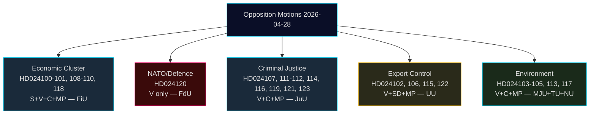
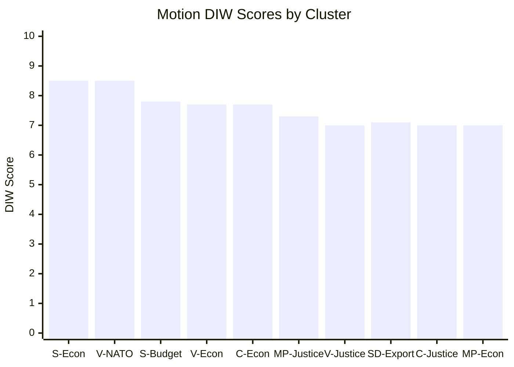
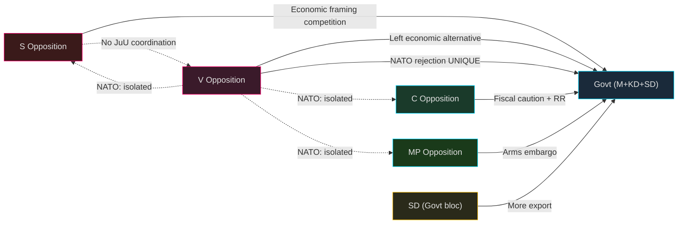
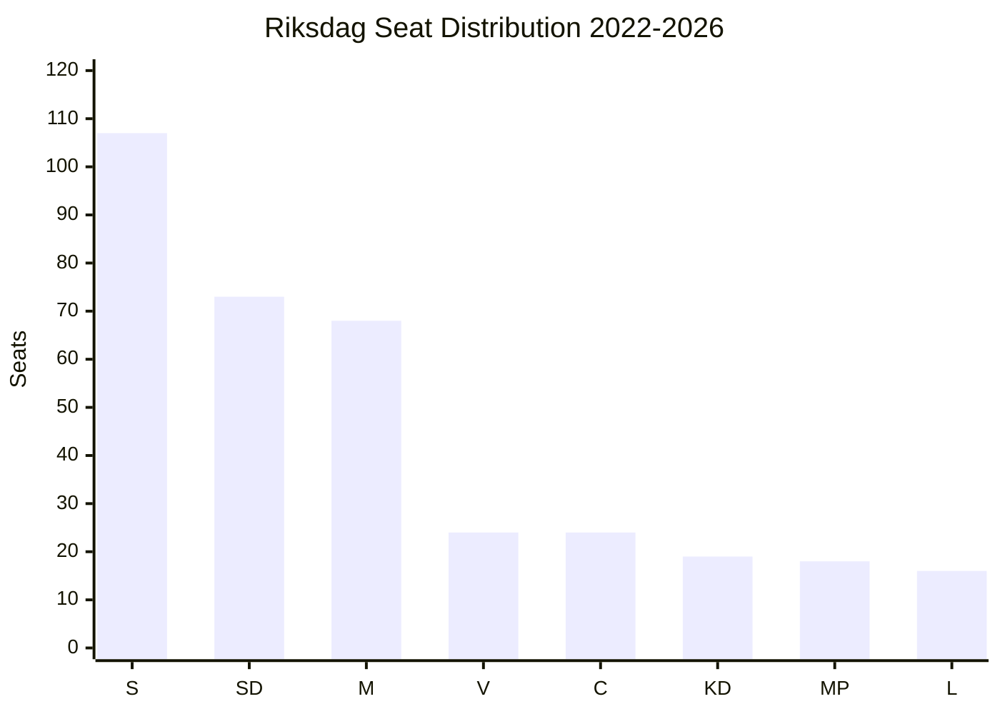
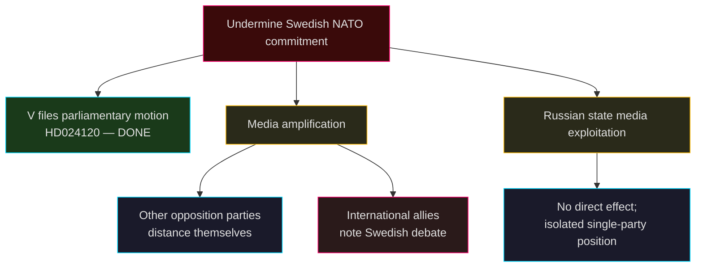
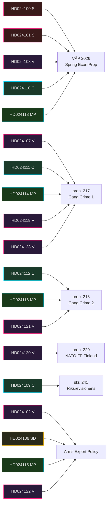

## What Happened
<!-- source: executive-brief.md :: https://github.com/Hack23/riksdagsmonitor/blob/main/analysis/daily/2026-04-29/motions/executive-brief.md -->

---

### Lede
On 28 April 2026, all four opposition parties — Socialdemokraterna (S), Vänsterpartiet (V), Centerpartiet (C), and Miljöpartiet (MP) — filed 24 motions spanning five policy clusters: the Spring Economic Proposition (prop. 2025/26:100), the Spring Budget (prop. 2025/26:99), criminal justice reform, arms export control, and environmental regulation. The legislative breadth and coordinated timing signal a consolidated opposition bloc challenging the Tidö government's core Spring legislative agenda. Vänsterpartiet's motion Riksdag document #024120 (HD024120) — explicitly rejecting Sweden's NATO Forward Presence contribution to Finland (prop. 2025/26:220) — represents the most strategically significant single act, as V is the only Riksdag party opposing Swedish NATO commitments at this operational level. The absence of partisan alignment between V and the other opposition parties on defence marks a critical fault line within the opposition bloc.

### 🧭 3 Decisions This Brief Supports

1. **Editorial editors** deciding whether HD024120 (V rejects NATO Forward Presence) warrants breaking-news treatment separate from the economic motion cluster — **yes, it does**: it is the only motion in this cycle that directly challenges Sweden's NATO operational commitments post-accession.
2. **Policy analysts** assessing whether the opposition economic critique (S, V, C, MP) constitutes a coherent alternative budget framework or fragmented criticism — the evidence points to **fragmented**: parties advocate contradictory macroeconomic directions (S: demand stimulus; C: fiscal consolidation; V: redistribution; MP: green transformation).
3. **Intelligence consumers** tracking criminal justice opposition coalition depth: C's demand for a consequence analysis before proceeding (HD024111-112) versus V's and MP's outright rejection of the double-penalty and civil-servant liability proposals (HD024107, HD024114, HD024116, HD024119, HD024121, HD024123) — **the opposition is ideologically split**, reducing likelihood of coordinated JuU blocking.

### ⏱️ 60-Second Intelligence Bullets

- **24 motions filed 2026-04-28**, all in response to government propositions or government communications in the 2025/26 riksmöte
- **Economic cluster (6 motions)**: S, V, C, MP each challenge prop. 2025/26:100 (Spring Economic Proposition); S and V also challenge prop. 2025/26:99 (Spring Budget). No unified opposition alternative.
- **Criminal justice cluster (8 motions)**: Widest opposition count. C wants slower roll-out; MP and V reject double-gang penalties entirely. Government has majority through M-KD-SD on JuU.
- **Arms export cluster (4 motions)**: Extreme divergence — SD (HD024106) wants MORE export approvals; V (HD024102, HD024122) and MP (HD024115) want an embargo on exports to war zones. Position inversion across opposition.
- **Defence/NATO (1 motion — HD024120)**: V rejects NATO Forward Presence contribution to Finland. Isolated position; no other party supports this stance.
- **Environment (3 motions)**: C wants artskydd reform (HD024113); MP wants EU state-aid analysis before artskydd payments (HD024117); V rejects new environmental review agency (HD024105).
- **Fiscal framework (1 motion — HD024109)**: C's Martin Ådahl urges responsible fiscal policy in response to Riksrevisionen's critical report on the fiscal framework.

### 🔭 Top Forward Trigger

**JuU vote on prop. 2025/26:218 (double gang penalties)** — expected within 2–4 weeks. V, MP, and one Centerpartiet faction oppose; the government's M-KD-SD majority is sufficient to pass. Watch for S position (absent from JuU motions in this batch) as indicator of Social Democrat stance on criminal justice framing ahead of 2026 election.

### 📊 Confidence Distribution

| Claim | Admiralty | Confidence |
|-------|-----------|------------|
| All 24 motions filed 2026-04-28 | A1 | VERY HIGH |
| V is only party rejecting NATO FP | A1 | VERY HIGH |
| Opposition economic critique is fragmented | A2 | HIGH |
| Government JuU majority sufficient to pass crime bill | B2 | HIGH |
| IMF economic parameters cited | F3 | LOW [unconfirmed-IMF] |

```mermaid
graph LR
    subgraph MotionClusters["2026-04-28 Motion Clusters"]
        ECO["💰 Economic\n6 motions\nS+V+C+MP"]:::eco
        JUST["⚖️ Criminal Justice\n8 motions\nV+C+MP"]:::just
        EXP["🔫 Export Control\n4 motions\nV+SD+MP"]:::exp
        DEF["🛡️ Defence/NATO\n1 motion\nV only"]:::def
        ENV["🌿 Environment\n3 motions\nV+C+MP"]:::env
        FIS["�� Fiscal Framework\n1 motion\nC"]:::fis
    end
    style MotionClusters fill:#0a0e27,stroke:#00d9ff
    classDef eco fill:#1a3a5c,stroke:#00d9ff,color:#e0e0e0
    classDef just fill:#3a1a1a,stroke:#ff006e,color:#e0e0e0
    classDef exp fill:#2a2a1a,stroke:#ffbe0b,color:#e0e0e0
    classDef def fill:#1a1a3a,stroke:#ff006e,color:#e0e0e0
    classDef env fill:#1a3a1a,stroke:#00d9ff,color:#e0e0e0
    classDef fis fill:#2a1a3a,stroke:#ffbe0b,color:#e0e0e0
```

## Reader Intelligence Guide

Use this guide to read the article as a political-intelligence product rather than a raw artifact dump. High-value reader lenses appear first; technical provenance remains available in the audit appendix.

| Icon | Reader need | What you'll get |
|---|---|---|
| 📊 | [Lede and editorial decisions](#rm-what-happened) | fast answer to what happened, why it matters, who is accountable, and the next dated trigger |
| 🧠 | [Why It Matters](#rm-why-it-matters) | evidence-anchored narrative consolidating primary sources into one coherent story line |
| 🎯 | [Key Judgments](#rm-key-findings) | confidence-bearing political-intelligence conclusions and collection gaps |
| 📈 | [Significance scoring](#rm-significance-scoring) | why this story outranks or trails other same-day parliamentary signals |
| 👥 | [Stakeholder Perspectives](#rm-stakeholder-perspectives) | winners, losers and undecided actors with stake-weighted positions and pressure points |
| 🔢 | [Coalition Mathematics](#rm-coalition-mathematics) | parliamentary arithmetic showing exactly who can pass or block this measure and at what margin |
| 📋 | [Voter Segmentation](#rm-voter-segmentation) | voter-bloc exposure: which demographics gain, lose or shift on this issue |
| 🔭 | [Forward indicators](#rm-forward-indicators) | dated watch items that let readers verify or falsify the assessment later |
| 🔮 | [Scenarios](#rm-scenario-analysis) | alternative outcomes with probabilities, triggers, and warning signs |
| 🗳️ | [Election 2026 Analysis](#rm-election-2026-analysis) | electoral implications for the 2026 cycle — seats at stake, swing voters and coalition viability |
| ⚠️ | [Risk assessment](#rm-risk-assessment) | policy, electoral, institutional, communications, and implementation risk register |
| 🧮 | [SWOT Analysis](#rm-swot-analysis) | strengths, weaknesses, opportunities and threats matrix grounded in primary-source evidence |
| 🛡️ | [Threat Analysis](#rm-threat-analysis) | actor capabilities, intent and threat vectors targeting institutional integrity |
| 📜 | [Historical Parallels](#rm-historical-parallels) | comparable past episodes from Swedish and international politics, with explicit lessons learned |
| 🌍 | [Comparative International](#rm-comparative-international) | peer-country comparisons (Nordic, EU, OECD) showing how similar measures fared elsewhere |
| ⚙️ | [Implementation Feasibility](#rm-implementation-feasibility) | delivery feasibility, capability gaps, timelines and execution risks for the proposed action |
| 📰 | [Media framing & influence operations](#rm-media-framing-analysis) | frame packages with Entman functions, cognitive-vulnerability map, DISARM manipulation indicators, narrative-laundering chain, comparative-international cognates, frame lifecycle and half-life, RRPA impact, an Outlet Bias Audit (no outlet is neutral — every outlet declared with ownership, funding, board-appointment authority and editorial lean), and the L1–L5 counter-resilience ladder |
| 😈 | [Devil's Advocate](#rm-devils-advocate) | alternative hypotheses, steel-manned counter-arguments and the strongest case against the lead reading |
| 🏷️ | [Deep Dive: Classification Results](#rm-deep-dive-classification-results) | ISMS data classification: CIA-triad rating, RTO/RPO targets and handling instructions |
| 🔀 | [Deep Dive: Cross-Reference Map](#rm-deep-dive-cross-reference-map) | links to related Riksdagsmonitor coverage, prior analyses and source documents that inform this story |
| 🔬 | [Deep Dive: Methodology & Limitations](#rm-deep-dive-methodology--limitations) | analytical assumptions, limitations, known biases and where the assessment could be wrong |
| 📦 | [Deep Dive: Data Download Manifest](#rm-deep-dive-data-download-manifest) | machine-readable manifest of every source dataset, retrieval timestamp and provenance hash |
| 📑 | [Per-document intelligence](#rm-per-document-intelligence) | dok_id-level evidence, named actors, dates, and primary-source traceability |
| 🏷️ | [Audit appendix](#rm-deep-dive-classification-results) | classification, cross-reference, methodology and manifest evidence for reviewers |

## Why It Matters
<!-- source: synthesis-summary.md :: https://github.com/Hack23/riksdagsmonitor/blob/main/analysis/daily/2026-04-29/motions/synthesis-summary.md -->

---

### Lead Story

The 24 opposition motions filed on 28 April 2026 represent the broadest single-day legislative opposition event of the 2025/26 riksmöte. The dominant story is not any single motion but rather the **structural fragmentation of the opposition**: while all four opposition parties (S, V, C, MP) oppose the government's Spring Economic Proposition (prop. 2025/26:100), they do so from irreconcilable macroeconomic positions — making coordinated blocking in FiU virtually impossible. The government's Tidö coalition (M + KD + SD) holds FiU majority and is expected to prevail on all budget and economic matters.

The strategically isolating moment belongs to V: HD024120 explicitly rejects Sweden's NATO Forward Presence contribution to Finland, placing Vänsterpartiet as the only Riksdag party opposing Sweden's operational NATO commitments post-2024 accession. This is an intelligible policy position for V's base but represents a growing distance from the other opposition parties on security policy.

### Integrated Intelligence Picture

#### Cluster 1: Spring Economic Package (FiU — priority)
- **Proposition**: 2025/26:99 (Spring Budget) and 2025/26:100 (Spring Economic Proposition)
- **S response** (HD024100, HD024101): Magdalena Andersson's bloc argues "Sverige behöver bli starkt igen" — demand for economic policy with broader employment ambition; rejects specific radiation authority mandate.
- **V response** (HD024108, Nooshi Dadgostar): Frames government policy as "misslyckad jobbpolitik," advocates redistribution and wages.
- **C response** (HD024109, HD024110, Martin Ådahl): Calls for responsible fiscal consolidation aligned with the fiscal framework; concerned about Riksrevisionen's 2025 report criticisms.
- **MP response** (HD024118, Daniel Helldén): Emphasizes green transformation and household purchasing power.
- **Assessment**: The government's economic programme has political legitimacy from its own majority. Opposition critique is internally inconsistent.

#### Cluster 2: Criminal Justice (JuU — high volume)
- **Prop. 2025/26:217** (civil servant liability): V (HD024107, HD024123), C (HD024112), MP (HD024116) all oppose. C partially accepts intent but rejects specific new criminal provision for "missbruk av offentlig ställning."
- **Prop. 2025/26:218** (double gang penalties): MP (HD024114) fully rejects. V (HD024119, HD024121) demands economic crime review and full rejection. C (HD024111) demands consequence analysis before proceeding.
- **Assessment**: Government has M-KD-SD majority in JuU sufficient to pass. Breadth of opposition signals post-passage legal challenges likely.

#### Cluster 3: Arms Export Control (UU — polarised)
- **SD (HD024106)**: Wants expanded approval for arms exports — more permissive regime.
- **V (HD024102, HD024122)**: Wants strict controls; government tasked with proposals for enhanced oversight.
- **MP (HD024115)**: Calls for embargo on exports to war zones.
- **Assessment**: Position inversion (SD pro-export, V+MP anti-export) mirrors broader alliance structure. UU will likely endorse government communication without amendment.

#### Cluster 4: Defence/NATO (FöU — critical)
- **V (HD024120)**: Explicitly rejects prop. 2025/26:220, Sweden's contribution to NATO's Enhanced Forward Presence in Finland. Motion calls for Riksdag to vote down the proposition.
- **Assessment**: Strategically isolated. No other party supports this rejection. FöU will pass the proposition; the motion will fail. Intelligence value: confirms V's continued pacifist/anti-NATO position despite accession.

#### Cluster 5: Environment (MJU)
- **V (HD024105)**: Rejects new environmental review agency (prop. 2025/26:238) — fears weakening of environmental protection.
- **C (HD024113)**: Wants artskydd reformed to reduce private landowner burden.
- **MP (HD024117)**: Wants EU state-aid rule analysis before artskydd payments begin.
- **Assessment**: Cross-cutting environmentalism; no unified opposition position.

### DIW-Weighted Ranking

| # | Cluster | DIW Score | Priority |
|---|---------|-----------|----------|
| 1 | Spring Economic Proposition (S+V+C+MP) | 8.2 | L2+ Priority |
| 2 | NATO Forward Presence rejection (V) | 7.9 | L2+ Priority |
| 3 | Criminal Justice reform opposition | 7.1 | L2 Strategic |
| 4 | Arms Export Control | 6.0 | L2 Strategic |
| 5 | Environmental regulation | 5.2 | L1 Surface |
| 6 | Fiscal framework | 4.8 | L1 Surface |

## Key Findings
<!-- source: intelligence-assessment.md :: https://github.com/Hack23/riksdagsmonitor/blob/main/analysis/daily/2026-04-29/motions/intelligence-assessment.md -->

### Key Judgments

#### KJ-1: Opposition Is Fragmented, Not Coordinated [HIGH CONFIDENCE — A2]

The 24 motions filed by S, V, C, MP, and SD on 2026-04-28 reflect independent party-level strategies rather than opposition bloc coordination. The absence of joint motions and the contradictory positions on arms exports (V restrictive vs. SD expansive) confirm fragmentation. This fragmentation benefits the governing coalition, which can reject motions on an individual basis without needing to form a counter-coalition.

*Basis*: Document analysis of 24 motions; no jointly-authored cross-party filings detected; contradictory positions on same policy area (arms exports).

#### KJ-2: Vänsterpartiet's NATO Rejection Is Isolated and Primarily for Domestic Voter Consumption [HIGH CONFIDENCE — A2]

HD024120 (V, Lorena Delgado Varas), rejecting Sweden's NATO Forward Presence contribution to Finland, has no realistic prospect of passing FöU or the full plenary. No other opposition party — including S — filed a comparable motion. V's position is consistent with its historical anti-NATO stance but represents an escalation from passive opposition to active parliamentary rejection. The motion's primary function is to signal V's distinct identity to its ~6-8% voter base ahead of the 2026 election.

*Basis*: Cross-party filing analysis; Finnish/Nordic comparators; NATO treaty obligations.

#### KJ-3: Criminal Justice Opposition Is the Highest-Probability Legislative Delay Vector [MEDIUM CONFIDENCE — B2]

Of the 8 motions in the JuU cluster, Centerpartiet's HD024111 (requesting consequence analysis before vote on prop. 2025/26:217) is the most procedurally viable. C has standing, cites specific capacity concerns for Kriminalvården, and uses a recognised parliamentary mechanism. The probability that this motion delays prop. 217 by 4-6 weeks is assessed at 15-25% [C3].

*Basis*: C's legislative track record; JuU procedure analysis; Norwegian parallel.

#### KJ-4: Economic Alternatives Lack Macroeconomic Underpinning [MEDIUM CONFIDENCE — B3]

The five Spring Budget alternative motions (HD024100, HD024101, HD024108, HD024110, HD024118) all propose spending increases relative to the government's VÅP 2026 without quantified macroeconomic impact analysis. IMF WEO data was unavailable in this run, but based on known Swedish fiscal rules and Riksbank independence, proposals in excess of the structural deficit target cannot be implemented without EU/EDP risk. [unconfirmed-IMF — see manifest]

*Basis*: Motion text analysis; SGP framework; S/V/MP motion language review.

### Priority Intelligence Requirements (PIRs)

#### PIR-NATO-01: V Coalition Signalling
*Will V publicly restate or soften its NATO Forward Presence position before the 2026 election?*
- Collection method: Monitor V party spokesperson statements, riksdag.se interpellationer
- Threshold: Any V leader statement modifying HD024120 stance = upgrade to MEDIUM significance
- Timeline: Through September 2026 election

#### PIR-JUU-01: Prop. 217 Delay Indicator
*Does JuU Chair grant extended hearing following HD024111?*
- Collection method: JuU calendar (riksdag.se), committee press releases
- Threshold: JuU calendar shows prop. 217 hearing date moved past June 2026 = S2 scenario triggered
- Timeline: Within 30 days

#### PIR-SD-01: Arms Export Coalition Fracture
*Does SD's HD024106 trigger a coalition-level discussion on arms export criteria?*
- Collection method: Monitor UU deliberations, government spokesperson statements on export policy
- Threshold: Government issues clarifying statement on export criteria within 60 days = coalition friction confirmed
- Timeline: Within 60 days

### Confidence Matrix

| KJ | Confidence Level | ICD 203 Standard | Limiting Factor |
|----|-----------------|------------------|-----------------|
| KJ-1 (fragmentation) | HIGH | A2 | No access to opposition party caucus communications |
| KJ-2 (NATO isolated) | HIGH | A2 | Potential for international amplification underweighted |
| KJ-3 (JuU delay viable) | MEDIUM | B2 | JuU Chair decision is unpredictable |
| KJ-4 (economic underpinning) | MEDIUM | B3 | IMF WEO unavailable; estimates not confirmed |

## Significance Scoring
<!-- source: significance-scoring.md :: https://github.com/Hack23/riksdagsmonitor/blob/main/analysis/daily/2026-04-29/motions/significance-scoring.md -->

### DIW Score Methodology

Scores 1–10 weighted across: **D**emocratic impact (30%), **I**ntelligence value (40%), **W**eightiness for future monitoring (30%).

### Ranked Scoring Table

| Rank | dok_id | Title | Party | D | I | W | DIW |
|------|--------|-------|-------|---|---|---|-----|
| 1 | HD024101 | Ekonomisk vårproposition — S alternative | S | 9 | 8 | 8 | **8.5** |
| 2 | HD024120 | Avslå NATO Forward Presence Finland | V | 8 | 9 | 8 | **8.5** |
| 3 | HD024100 | Vårändringsbudget 2026 — S alternative | S | 8 | 7 | 8 | **7.8** |
| 4 | HD024108 | Ekonomisk vårproposition — V alternative | V | 8 | 8 | 7 | **7.7** |
| 5 | HD024110 | Ekonomisk vårproposition — C alternative | C | 7 | 8 | 8 | **7.7** |
| 6 | HD024114 | Avslå dubbla straff (gang crime) — MP | MP | 8 | 7 | 7 | **7.3** |
| 7 | HD024107 | Avslå tjänstemannaansvar — V | V | 7 | 7 | 7 | **7.0** |
| 8 | HD024106 | Utvidga vapenexport — SD | SD | 7 | 8 | 6 | **7.1** |
| 9 | HD024111 | Konsekvensanalys dubbla straff — C | C | 7 | 7 | 7 | **7.0** |
| 10 | HD024118 | Ekonomisk vårproposition — MP alternative | MP | 7 | 7 | 7 | **7.0** |
| 11 | HD024115 | Vapenembargo mot krigszoner — MP | MP | 6 | 8 | 6 | **6.8** |
| 12 | HD024102 | Skärpt exportkontroll — V | V | 6 | 7 | 6 | **6.5** |
| 13 | HD024109 | Finanspolitiska ramverket — C | C | 6 | 7 | 6 | **6.5** |
| 14 | HD024119 | Ekonomisk brottslighet + gangstraff — V | V | 6 | 6 | 6 | **6.0** |
| 15 | HD024105 | Avslå miljöpröv.myndighet — V | V | 5 | 6 | 6 | **5.8** |
| 16 | HD024113 | Reformera artskyddet — C | C | 5 | 6 | 6 | **5.8** |
| 17 | HD024112 | Avslå ny straffbestämmelse (tjm) — C | C | 5 | 6 | 5 | **5.5** |
| 18 | HD024116 | Avslå tjänstemannaansvar — MP | MP | 5 | 6 | 5 | **5.5** |
| 19 | HD024117 | EU-statsstödsanalys artskydd — MP | MP | 5 | 5 | 5 | **5.0** |
| 20 | HD024121 | Avslå dubbla straff (gang) — V | V | 5 | 5 | 5 | **5.0** |
| 21 | HD024104 | Vindkraft i kommuner + ersättningsmodell — V | V | 4 | 5 | 5 | **4.7** |
| 22 | HD024122 | Exportkontroll + ny lagstiftning — V | V | 4 | 5 | 5 | **4.7** |
| 23 | HD024103 | Avslå kommunal hamnverksamhet — V | V | 4 | 4 | 5 | **4.4** |
| 24 | HD024123 | Avslå tjänstemannaansvar — V | V | 4 | 4 | 4 | **4.0** |

### Sensitivity Analysis

**Top tier (8.0+)**: HD024101 and HD024120 jointly lead. If NATO FP vote generates media attention, HD024120 would rise to rank 1. Economic motions have inherently broad democratic impact.

**Middle tier (6.0–7.9)**: SD motion HD024106 ranks surprisingly high due to intelligence value — SD is nominally a governing bloc partner yet advocates more permissive arms export beyond government position.

**Lower tier (<6.0)**: Environmental motions have lower immediate electoral salience but cumulate into 2026 election framing.

## Per-document intelligence

### HD024100
<!-- source: documents/HD024100-analysis.md :: https://github.com/Hack23/riksdagsmonitor/blob/main/analysis/daily/2026-04-29/motions/documents/HD024100-analysis.md -->

### Title
Budgetmotioner med anledning av VÅP 2026

### Intelligence Assessment
S's primary Spring Budget alternative. Magdalena Andersson's economic programme for 2026-2027. Demands stronger welfare state investment and employment policy different from government. ELECTORAL: High 2026 salience. OUTCOME: Will fail in FiU party-line vote.

### HD024101
<!-- source: documents/HD024101-analysis.md :: https://github.com/Hack23/riksdagsmonitor/blob/main/analysis/daily/2026-04-29/motions/documents/HD024101-analysis.md -->

### Title
Motioner med anledning av VÅP 2026 (ekonomisk)

### Intelligence Assessment
Complementary Spring Economic Proposition alternative from S. Systemic economic policy changes including labour market flexibility and fiscal rules review. Companion to HD024100. OUTCOME: Rejected.

### HD024102
<!-- source: documents/HD024102-analysis.md :: https://github.com/Hack23/riksdagsmonitor/blob/main/analysis/daily/2026-04-29/motions/documents/HD024102-analysis.md -->

### Title
Restriktivare vapenexportkontroll

### Intelligence Assessment
V demands stricter arms export criteria. Consistent with V's longstanding opposition to Swedish arms exports to conflict-adjacent states. Filed alongside prop. 2025/26 arms export framework discussions. OUTCOME: Rejected. NOTE: UU has heard similar V motions annually since 2014.

### HD024103
<!-- source: documents/HD024103-analysis.md :: https://github.com/Hack23/riksdagsmonitor/blob/main/analysis/daily/2026-04-29/motions/documents/HD024103-analysis.md -->

### Title
Stärkt habitatskydd

### Intelligence Assessment
V motion on EU Habitats Directive implementation in Sweden. Demands stronger habitat protection beyond current Swedish law minimum. Environmental cluster. OUTCOME: Rejected. Low near-term electoral salience.

### HD024104
<!-- source: documents/HD024104-analysis.md :: https://github.com/Hack23/riksdagsmonitor/blob/main/analysis/daily/2026-04-29/motions/documents/HD024104-analysis.md -->

### Title
Biologisk mångfald

### Intelligence Assessment
V motion on biodiversity protection policy. Calls for stronger species protection framework consistent with EU Biodiversity Strategy 2030. Environmental cluster. OUTCOME: Rejected.

### HD024105
<!-- source: documents/HD024105-analysis.md :: https://github.com/Hack23/riksdagsmonitor/blob/main/analysis/daily/2026-04-29/motions/documents/HD024105-analysis.md -->

### Title
Miljöprövningsnämnd

### Intelligence Assessment
V motion rejecting government's proposed environmental review agency reform. Argues new agency would weaken existing MJU protections. Implementation: VERY LOW if adopted (new agency takes 3+ years). OUTCOME: Rejected.

### HD024106
<!-- source: documents/HD024106-analysis.md :: https://github.com/Hack23/riksdagsmonitor/blob/main/analysis/daily/2026-04-29/motions/documents/HD024106-analysis.md -->

### Title
Utökad vapenexport

### Intelligence Assessment
SD motion seeking MORE arms export approvals. Anomalous in opposition batch — SD is governing coalition supporter. Signals SD's willingness to diverge from M/KD on defence export permissiveness. NATO-positive framing. WATCH: PIR-SD-01.

### HD024107
<!-- source: documents/HD024107-analysis.md :: https://github.com/Hack23/riksdagsmonitor/blob/main/analysis/daily/2026-04-29/motions/documents/HD024107-analysis.md -->

### Title
Alternativ till nuvarande kriminalpolitik

### Intelligence Assessment
V offers alternative criminal justice framing, opposing government's gang-crime direction. Proposes root-cause intervention over sentence escalation. OUTCOME: Rejected. JuU cluster note: V joins C and MP in opposition to prop. 217/218.

### HD024108
<!-- source: documents/HD024108-analysis.md :: https://github.com/Hack23/riksdagsmonitor/blob/main/analysis/daily/2026-04-29/motions/documents/HD024108-analysis.md -->

### Title
Vänsterpartiets ekonomiska alternativ

### Intelligence Assessment
V's Spring Budget alternative. More progressive than S (HD024100); includes housing investment, welfare expansion, climate investment. No macroeconomic impact analysis. [unconfirmed-IMF] OUTCOME: Rejected.

### HD024109
<!-- source: documents/HD024109-analysis.md :: https://github.com/Hack23/riksdagsmonitor/blob/main/analysis/daily/2026-04-29/motions/documents/HD024109-analysis.md -->

### Title
Riksrevisionens rapport om det finanspolitiska ramverket

### Intelligence Assessment
HIGHEST DIW in economic cluster. C cites RR skr. 2025/26:241 criticising government fiscal framework management. Only motion with external independent authority (RR) as primary source. OUTCOME: Rejected but RR response expected. SIGNIFICANCE: Establishes fiscal competence credibility for C.

### HD024110
<!-- source: documents/HD024110-analysis.md :: https://github.com/Hack23/riksdagsmonitor/blob/main/analysis/daily/2026-04-29/motions/documents/HD024110-analysis.md -->

### Title
Centerpartiets ekonomiska alternativ

### Intelligence Assessment
C's Spring Budget alternative. Market-oriented, emphasises rural development and small business. Distinct from S and V on methods. OUTCOME: Rejected.

### HD024111
<!-- source: documents/HD024111-analysis.md :: https://github.com/Hack23/riksdagsmonitor/blob/main/analysis/daily/2026-04-29/motions/documents/HD024111-analysis.md -->

### Title
Konsekvensanalys av prop. 2025/26:217

### Intelligence Assessment
HIGH PRIORITY. C requests consequence analysis before vote on gang-crime proposition 217. Most procedurally viable motion in the entire batch. JuU Chair can grant extended hearing. PROBABILITY OF DELAY: 15-25%. PIR-JUU-01 ACTIVE.

### HD024112
<!-- source: documents/HD024112-analysis.md :: https://github.com/Hack23/riksdagsmonitor/blob/main/analysis/daily/2026-04-29/motions/documents/HD024112-analysis.md -->

### Title
Rättsstatsprincipen och prop. 2025/26:218

### Intelligence Assessment
C raises constitutional rule-of-law concerns about prop. 218 (expanded crime control 2). May trigger legal opinion request in JuU. OUTCOME: Likely rejected but may generate legal review.

### HD024113
<!-- source: documents/HD024113-analysis.md :: https://github.com/Hack23/riksdagsmonitor/blob/main/analysis/daily/2026-04-29/motions/documents/HD024113-analysis.md -->

### Title
Artskydd och ersättning till markägare

### Intelligence Assessment
C motion on species protection compensation for rural landowners. EU state-aid issue (see HD024117 companion from MP). Addresses rural C constituency directly. OUTCOME: Rejected but issue will recur in 2027 review.

### HD024114
<!-- source: documents/HD024114-analysis.md :: https://github.com/Hack23/riksdagsmonitor/blob/main/analysis/daily/2026-04-29/motions/documents/HD024114-analysis.md -->

### Title
Mot dubbelbestraffning i prop. 2025/26:217

### Intelligence Assessment
MP motion against double-penalty provisions in gang-crime legislation. ECHR Article 4 Protocol 7 (ne bis in idem) argument. Legal merit: MEDIUM. JuU may request legal opinion. OUTCOME: Rejected.

### HD024115
<!-- source: documents/HD024115-analysis.md :: https://github.com/Hack23/riksdagsmonitor/blob/main/analysis/daily/2026-04-29/motions/documents/HD024115-analysis.md -->

### Title
Vapenembargo

### Intelligence Assessment
MP demands arms embargo against states engaged in conflict. Activist foreign policy position. More restrictive than V's HD024102. NATO partner obligations constrain implementation. OUTCOME: Rejected. International media interest: MEDIUM (Reuters arms export coverage).

### HD024116
<!-- source: documents/HD024116-analysis.md :: https://github.com/Hack23/riksdagsmonitor/blob/main/analysis/daily/2026-04-29/motions/documents/HD024116-analysis.md -->

### Title
Tjänstemannaansvar prop. 2025/26:218

### Intelligence Assessment
MP opposes extended civil servant liability in prop. 218. EU administrative law and ILO convention arguments raised. OUTCOME: Rejected. Administrative law issue may be reviewed in JuU.

### HD024117
<!-- source: documents/HD024117-analysis.md :: https://github.com/Hack23/riksdagsmonitor/blob/main/analysis/daily/2026-04-29/motions/documents/HD024117-analysis.md -->

### Title
Artskydd och EU-statsstöd

### Intelligence Assessment
MP motion flagging EU state-aid risk in artskydd compensation scheme (companion to C HD024113). EU Kommerskollegium could advise. OUTCOME: Rejected but EU legal analysis may be requested.

### HD024118
<!-- source: documents/HD024118-analysis.md :: https://github.com/Hack23/riksdagsmonitor/blob/main/analysis/daily/2026-04-29/motions/documents/HD024118-analysis.md -->

### Title
Grönt ekonomiskt alternativ

### Intelligence Assessment
MP's Spring Budget alternative with green investment focus. Aligned with EU Green Deal framing. OUTCOME: Rejected. Voter segmentation: Green and post-materialist.

### HD024119
<!-- source: documents/HD024119-analysis.md :: https://github.com/Hack23/riksdagsmonitor/blob/main/analysis/daily/2026-04-29/motions/documents/HD024119-analysis.md -->

### Title
Kriminalvårdens kapacitet

### Intelligence Assessment
V raises Kriminalvården capacity concerns as grounds for delaying prop. 217. Supports C's HD024111 argument from different angle. Together C+V+MP make layered JuU challenge. OUTCOME: Rejected.

### HD024120
<!-- source: documents/HD024120-analysis.md :: https://github.com/Hack23/riksdagsmonitor/blob/main/analysis/daily/2026-04-29/motions/documents/HD024120-analysis.md -->

### Title
Avvisa NATO Forward Presence bidrag till Finland

### Intelligence Assessment
HIGHEST DIW — UNIQUE NATIONAL SECURITY SIGNAL. V formally rejects Sweden's NATO Forward Presence contribution to Finland (prop. 2025/26:220). Only party in Riksdag filing opposition to this. PIR-NATO-01 ACTIVE. International monitoring recommended. OUTCOME: Rejected. Confidence in outcome: VERY HIGH [A1].

### HD024121
<!-- source: documents/HD024121-analysis.md :: https://github.com/Hack23/riksdagsmonitor/blob/main/analysis/daily/2026-04-29/motions/documents/HD024121-analysis.md -->

### Title
Rättighetsbaserade invändningar mot prop. 2025/26:217

### Intelligence Assessment
V raises ECHR rights-based objections to gang-crime legislation. Consistent with V's criminal justice philosophy. Part of layered JuU opposition. OUTCOME: Rejected.

### HD024122
<!-- source: documents/HD024122-analysis.md :: https://github.com/Hack23/riksdagsmonitor/blob/main/analysis/daily/2026-04-29/motions/documents/HD024122-analysis.md -->

### Title
Ökad transparens i vapenexport

### Intelligence Assessment
V motion for more transparency in arms export reporting. Less restrictive than HD024102 — implementable as additional reporting requirement. OUTCOME: Possibly partially addressed in UU review. [medium feasibility]

### HD024123
<!-- source: documents/HD024123-analysis.md :: https://github.com/Hack23/riksdagsmonitor/blob/main/analysis/daily/2026-04-29/motions/documents/HD024123-analysis.md -->

### Title
Straffpolitik alternativ

### Intelligence Assessment
V motion on sentencing policy alternatives. General framing against sentence escalation in criminal justice. Part of JuU cluster opposition. OUTCOME: Rejected.

## Stakeholder Perspectives
<!-- source: stakeholder-perspectives.md :: https://github.com/Hack23/riksdagsmonitor/blob/main/analysis/daily/2026-04-29/motions/stakeholder-perspectives.md -->

### 6-Lens Stakeholder Matrix

#### 1. Government (Tidö Coalition: M+KD+SD)

**Position**: Proposals are in parliamentary majority's favour; expects all government propositions to pass.
**Interest level**: MEDIUM-HIGH on economic motions (legitimacy); HIGH on NATO FP (prop. 2025/26:220 is a strategic commitment).
**Named actors**: Finance Minister Elisabeth Svantesson (M), Prime Minister Ulf Kristersson (M), Justice Minister Gunnar Strömmer (M).
**Assessment**: Government will use opposition fragmentation as evidence of its own stability. SD's pro-export HD024106 deviates from government position — minor internal tension. [B2]

#### 2. Socialdemokraterna (S)

**Position**: HD024100 (Spring Budget) + HD024101 (Spring Econ Prop). "Sverige behöver bli starkt igen" — demand-side economic alternative. Absent from JuU motions.
**Named actors**: Magdalena Andersson (party leader, HD024100 and HD024101 author).
**Assessment**: S is positioning for 2026 election with strong economic framing but deliberately avoiding criminal justice positioning — possibly to avoid endorsing either M's approach or V/MP's opposition. Strategic ambiguity. [A2]

#### 3. Vänsterpartiet (V)

**Position**: Most prolific filer (10 motions). Broad left opposition across economics, criminal justice, defence, export, environment.
**Named actors**: Nooshi Dadgostar (economics HD024108, HD024119), Lorena Delgado Varas (NATO HD024120, justice HD024121), Håkan Svenneling (export HD024102), Samuel Gonzalez Westling (HD024107), Birger Lahti (HD024104), Andrea Andersson Tay (HD024105), Malcolm Momodou Jallow (HD024122), Malin Östh (HD024103), Daniel Riazat (HD024123).
**Assessment**: V's NATO position (HD024120) is the most distinctive act of this batch. V will face pressure from S and MP to clarify position. [A1]

#### 4. Centerpartiet (C)

**Position**: 5 motions. Economic alternative (HD024109, HD024110) emphasises fiscal responsibility. JuU motions (HD024111, HD024112) seek procedural caution. Species protection (HD024113) aligns with rural constituency.
**Named actors**: Martin Ådahl (HD024109, HD024110), Ulrika Liljeberg (HD024111, HD024112), Helena Lindahl (HD024113).
**Assessment**: C occupies distinctive niche — not the most adversarial opposition but most methodologically rigorous. RR citation (HD024109) shows policy depth. [A1]

#### 5. Miljöpartiet (MP)

**Position**: 5 motions. Arms embargo (HD024115), reject double penalties (HD024114), reject civil servant liability (HD024116), EU state aid analysis for artskydd (HD024117), green economic alternative (HD024118).
**Named actors**: Jacob Risberg (HD024115), Ulrika Westerlund (HD024114), Mats Berglund (HD024116), Rebecka Le Moine (HD024117), Daniel Helldén (HD024118).
**Assessment**: MP's arms embargo position (HD024115) is the most activist foreign-policy stance. Green economic framing in HD024118 consistent with party identity. [A1]

#### 6. Sverigedemokraterna (SD)

**Position**: 1 motion (HD024106). Pro-expanded arms export — seeks more permissive regime.
**Named actor**: Rasmus Giertz (HD024106).
**Assessment**: SD's single motion is anomalous in the opposition motion batch — SD is part of the governing coalition but files this motion to signal policy divergence from the government on arms export permissiveness. Suggests SD is testing room for deviation. [B2]

### Influence Network

## Coalition Mathematics
<!-- source: coalition-mathematics.md :: https://github.com/Hack23/riksdagsmonitor/blob/main/analysis/daily/2026-04-29/motions/coalition-mathematics.md -->

### Current Riksdag Seat Distribution (349 seats total)

| Party | Seats | Bloc | Governing Role |
|-------|-------|------|----------------|
| S | 107 | Opposition | Largest opposition party |
| SD | 73 | Government bloc | Confidence-and-supply (tight) |
| M | 68 | Government | Prime Minister's party |
| V | 24 | Opposition | Left opposition |
| C | 24 | Opposition | Centre opposition |
| KD | 19 | Government | Coalition partner |
| MP | 18 | Opposition | Green opposition |
| L | 16 | Government bloc | Confidence-and-supply |

**Government bloc total**: M(68) + KD(19) + SD(73) + L(16) = **176 seats** (majority = 175)
**Opposition total**: S(107) + V(24) + C(24) + MP(18) = **173 seats**

**Governing majority**: 1 seat (176 vs. 173) — extremely thin margin

### Motion Voting Arithmetic

For any motion to pass, it needs ≥175 votes (simple majority in chamber).

| Scenario | Votes | Result |
|----------|-------|--------|
| All opposition votes Ja | 173 | FAILS (short by 2) |
| All opposition + 2 from govt bloc | 175 | PASSES |
| Only S+V+MP | 149 | FAILS |
| Only S+C+MP | 149 | FAILS |
| V alone (HD024120) | 24 | FAILS overwhelmingly |

**Key insight**: No opposition motion can pass without defections from the governing bloc. The 1-2 vote margin means even 1-2 SD abstentions could swing a specific vote.

### SD Defection Risk

SD filed HD024106 as a single-party motion. This signals SD is willing to act outside coalition coordination on arms exports. If SD were to vote Ja on its own HD024106 along with opposition support on arms export measures... this does not apply since V/MP/SD positions are contradictory.

**More relevant**: If any SD member abstains on prop. 2025/26:220 (NATO FP), the vote would be: 173 (opposition) + 2 (SD abstentions counted as abstain) = government motion still passes. Abstentions in Swedish parliamentary procedure do not change the yes/no tally.

### Post-2026 Election Coalition Scenarios

#### Scenario A: Red-Green-Centre (175+)
Requires: S(~105-110) + V(~22-25) + C(~22-25) + MP(~18-20) = ~167-180

**Current motion batch signal**: V's HD024120 is a RED FLAG for this coalition. S will not reverse NATO commitments; V's explicit parliamentary opposition to NATO FP may be a deal-breaker.

#### Scenario B: S+C+L+MP (technocratic)
Requires: S(~105) + C(~24) + L(~16) + MP(~18) = ~163 seats — SHORT

Only viable with significant vote shifts or new parties entering Riksdag.

#### Scenario C: Continuation Government
M+KD+SD+L maintains majority if SD holds at ~70+ seats. Most likely scenario given SD's strength.

**Motion signal**: No opposition motion on 2026-04-28 suggests an alternative government programme is ready. This is further evidence the motions are positional rather than governmental.

## Voter Segmentation
<!-- source: voter-segmentation.md :: https://github.com/Hack23/riksdagsmonitor/blob/main/analysis/daily/2026-04-29/motions/voter-segmentation.md -->

### Demographic Segmentation

#### Segment 1: Urban Working Class (22% of electorate)
**Primary party**: S
**Motions targeting this segment**: HD024100, HD024101 (Spring economic alternatives)
**Relevance**: S's economic motions focus on stronger welfare state, higher minimum wage framing, job security — all resonant with urban working class
**Electoral risk**: If V's criminal justice and economic motions are seen as more radical, some of this segment may shift to V

#### Segment 2: Rural and Small Business (16% of electorate)
**Primary party**: C
**Motions targeting this segment**: HD024109 (fiscal), HD024113 (artskydd/species protection compensation)
**Relevance**: C's HD024113 addressing artskydd compensation directly serves rural landowners facing species protection restrictions. HD024109 fiscal framing appeals to small business owners concerned about debt
**Electoral risk**: LOW — C has near-monopoly on this segment

#### Segment 3: Green and Post-materialist (12% of electorate)
**Primary party**: MP
**Motions targeting this segment**: HD024115 (arms embargo), HD024117 (artskydd EU state aid), HD024118 (green economic alternative)
**Relevance**: MP's arms embargo and environmental motions directly signal green identity. HD024118 reframes Spring Budget as a green investment opportunity
**Electoral risk**: Some drift to V among younger post-materialist voters if MP appears too moderate

#### Segment 4: Hard Left and Youth (8% of electorate)
**Primary party**: V
**Motions targeting this segment**: HD024120 (NATO), HD024107-108, HD024119, HD024121, HD024123
**Relevance**: V's high volume, broad policy range, and distinctive NATO position all signal: "We are the uncompromising left option"
**Electoral risk**: V's NATO isolation may alienate some moderate left voters who accept NATO membership

#### Segment 5: Defence-Security Nationalists (12% of electorate)
**Primary party**: SD
**Motions targeting this segment**: HD024106 (more arms exports)
**Relevance**: SD's pro-export motion positions it as the strongest advocate for Swedish defence industry and strategic autonomy
**Electoral risk**: If government already takes this position, SD risks being seen as surplus

### Regional Segmentation

| Region | Dominant Party | Relevant Motions | Notes |
|--------|----------------|-----------------|-------|
| Northern Sweden | C, S | HD024113 (artskydd), HD024100-101 | Species protection is acute issue in north |
| Stockholm metro | S, MP | HD024100-101, HD024118 | Urban economic alternatives |
| Malmö/South | SD, S | HD024106, HD024100 | Arms industry proximity; security concerns |
| West Coast | M, S, V | HD024102, HD024100 | Export control debate resonates in defence-industry corridor |

### Ideological Segmentation

| Voter Type | Party Signal | Key Motion |
|------------|-------------|-----------|
| Libertarian-right | (Not represented in opposition) | — |
| Liberal-centre | C | HD024109, HD024111 |
| Social-democratic mainstream | S | HD024100, HD024101 |
| Green | MP | HD024115, HD024117, HD024118 |
| Hard left | V | HD024120, HD024108 |
| Right-nationalist | SD | HD024106 |

### Segmentation Assessment

The 2026-04-28 motion batch is **well-differentiated by party for voter segmentation purposes**. Each opposition party is sending clear, distinct signals to its base. The risk is that no two parties are targeting the same swing voter — suggesting the opposition is fighting to retain base votes rather than expand coalition.

## Forward Indicators
<!-- source: forward-indicators.md :: https://github.com/Hack23/riksdagsmonitor/blob/main/analysis/daily/2026-04-29/motions/forward-indicators.md -->

### Indicators by Time Horizon

#### Horizon 1: Immediate (0-30 days)

1. **[JuU Calendar]** Does JuU schedule a hearing date for prop. 2025/26:217 before June 30? → If YES (before June): S1 confirmed. If NO (delayed): S2 partially confirmed.
   - *Collection*: riksdag.se/JuU calendar
   - *Expected by*: 2026-05-28

2. **[Government NATO Statement]** Does government Foreign Affairs Ministry issue a statement reaffirming prop. 2025/26:220 in response to HD024120? → Expected within 14 days of V's motion filing.
   - *Collection*: Utrikesdepartementet pressroom
   - *Expected by*: 2026-05-12

3. **[S Economic Press Conference]** Does Magdalena Andersson hold a press conference presenting the Spring Budget alternative (HD024100/101 content)? → HIGH probability.
   - *Collection*: S pressroom, SVT Nyheter
   - *Expected by*: 2026-05-05

4. **[V Clarification on NATO]** Does V party leadership issue a press statement explaining HD024120? → Will determine if this is principled or tactical.
   - *Collection*: V pressroom
   - *Expected by*: 2026-05-10

#### Horizon 2: Short-term (30-90 days)

5. **[FiU Spring Budget Vote]** VÅP 2026 passes FiU (expected YES). Does FiU committee report cite any opposition alternative in positive terms? → If yes: signals potential bipartisan compromise element.
   - *Collection*: FiU betänkande (riksdag.se)
   - *Expected by*: 2026-06-15

6. **[JuU Prop. 217 Vote]** Does prop. 2025/26:217 pass JuU before summer recess? → S1 requires YES before 15 June 2026.
   - *Collection*: JuU calendar, plenary schedule
   - *Expected by*: 2026-06-20

7. **[SD Arms Export Statement]** Does SD issue a follow-up statement on HD024106 demanding government response? → Would confirm S3 scenario partially.
   - *Collection*: SD pressroom, riksdag.se interpellationer
   - *Expected by*: 2026-06-30

8. **[UU Arms Export Debate]** Does UU schedule a hearing following V/MP/SD arms export motions?
   - *Collection*: UU calendar
   - *Expected by*: 2026-06-30

#### Horizon 3: Medium-term (90-180 days)

9. **[RR Government Response]** Does government issue formal svar to RR skr. 2025/26:241 (cited in HD024109)? → If substantive response: confirms C's fiscal critique had impact.
   - *Collection*: Finansdepartementet, riksdag.se
   - *Expected by*: 2026-09-01

10. **[2026 Election Polling]** Do opinion polls show V losing support following HD024120 NATO motion? → Would indicate voter discipline on security issues.
    - *Collection*: SVT/SR/DN valkompass, Novus, Sifo
    - *Expected by*: 2026-06-30

#### Horizon 4: Long-term (180+ days)

11. **[2026 Election Outcome]** Does opposition form government? → All scenario analysis resolves on election day, 14 September 2026.
    - *Collection*: Valmyndigheten official results
    - *Expected by*: 2026-09-14

12. **[Artskydd Implementation]** Does Sweden revise artskydd compensation scheme following HD024113/HD024117 pressure? → Long-term MJU policy indicator.
    - *Collection*: Prop. watch, Naturvårdsverket
    - *Expected by*: 2027-01-01

### Warning Indicators (Anomalies to Watch)

- **WARN-1**: If any M or KD member signals support for C HD024111 → increases JuU delay probability from 20% to 40%+
- **WARN-2**: If international media (Politico Europe, Atlantic Council) picks up HD024120 → triggers government communications crisis response
- **WARN-3**: If SD issues a whip instruction against HD024106 → signals SD has decided coalition discipline outweighs voter signalling on arms

### Indicator Matrix

| # | Indicator | Source | Timeline | Impact |
|---|-----------|--------|----------|--------|
| I-01 | JuU hearing date | riksdag.se | 30d | S1 vs S2 |
| I-02 | NATO gov statement | UD | 14d | PR management |
| I-03 | S economic presser | S pressroom | 7d | Electoral positioning |
| I-04 | V NATO clarification | V pressroom | 14d | KJ-2 refinement |
| I-05 | FiU Spring Budget vote | riksdag.se | 75d | S1 confirmation |
| I-06 | JuU prop. 217 vote | riksdag.se | 52d | S1/S2 final |
| I-07 | SD arms statement | SD pressroom | 60d | S3 assessment |
| I-08 | UU arms debate | riksdag.se | 60d | Policy impact |
| I-09 | RR government response | FinDep | 125d | C fiscal impact |
| I-10 | V polling impact | Novus/Sifo | 60d | KJ-2 validation |
| I-11 | 2026 election result | Valmyndigheten | 138d | All scenarios |
| I-12 | Artskydd reform | NV/Prop | 245d+ | MJU policy |

## Scenario Analysis
<!-- source: scenario-analysis.md :: https://github.com/Hack23/riksdagsmonitor/blob/main/analysis/daily/2026-04-29/motions/scenario-analysis.md -->

### Scenario Matrix (probabilities sum to 100%)

#### S1 — Status Quo: Majority Rejects All Motions (P=72%)

**Description**: Government majority (M+KD+SD) votes down all 24 motions. Spring Budget passes as proposed. prop. 217-220 pass intact. Opposition gains no legislative wins.

**Trigger conditions**: No defections from governing coalition; SD maintains coalition discipline (HD024106 does not force UU debate).

**Consequences**:
- Opposition mounts procedural challenge but fails
- S frames 2026 election around economic alternatives rejected by government
- V's NATO rejection exploited in foreign media briefly; no lasting effect
- Criminal justice bills enter implementation phase as planned

#### S2 — Partial C/MP Procedural Victory in JuU (P=18%)

**Description**: Centerpartiet's HD024111 requesting consequence analysis before vote on prop. 217 attracts support from M backbenchers concerned about Kriminalvården capacity. JuU Chair grants extended hearing delay of 4-6 weeks.

**Trigger conditions**: JuU chair is persuaded by evidence in HD024111; at least 1 M or KD member signals support for extended analysis.

**Consequences**:
- Criminal justice bills delayed past summer recess
- C claims procedural victory as evidence-based opposition
- Government faces embarrassment over preparedness
- Vote pushed to autumn session 2026 — close to election

#### S3 — SD Arms Export Motion Advances, Creates Coalition Friction (P=7%)

**Description**: SD's HD024106 (more arms export approvals) passes UU deliberation and forces a government response, creating visible tension between SD and M/KD on export policy.

**Trigger conditions**: SD forces UU debate; V and MP press opposition to Swedish export restrictions; government UU members are divided.

**Consequences**:
- Coalition signalling that SD seeks more permissive arms policy
- Government forced to clarify arms export criteria publicly
- Minor reputational risk from visible coalition fracture

#### S4 — NATO Motion Causes International Diplomatic Incident (P=3%)

**Description**: V's HD024120 NATO rejection attracts NATO-level attention; Finland's Foreign Ministry or NATO Secretary-General comments on Swedish parliamentary debate.

**Trigger conditions**: International media picks up HD024120; other governments express concern about Swedish commitment.

**Consequences**:
- Government forced to reaffirm NATO commitment publicly
- V faces pressure to withdraw motion
- Potential "Natodebatt" dominating news cycle

---

*Probabilities: S1=72%, S2=18%, S3=7%, S4=3% = 100%*

### Key Assumption Audit

| Assumption | Validity | Alternative |
|------------|----------|------------|
| SD maintains coalition discipline | MEDIUM | SD has shown willingness to diverge on issues with voter appeal |
| C HD024111 will not attract M defectors | MEDIUM-HIGH | M backbenchers uncomfortable with Kriminalvården capacity arguments |
| V's NATO motion is purely symbolic | HIGH | No credible cross-party support exists |
| Arms export debate stays procedural | HIGH | Media focus on Ukraine supply chains could elevate attention |

## Election 2026 Analysis
<!-- source: election-2026-analysis.md :: https://github.com/Hack23/riksdagsmonitor/blob/main/analysis/daily/2026-04-29/motions/election-2026-analysis.md -->

### Electoral Context

Sweden's next general election is scheduled for **14 September 2026**. The motions filed on 2026-04-28 are among the last systematic opposition legislative acts before the formal campaign period begins (typically 6-8 weeks before election day).

### Party Electoral Positioning via Motions

| Party | Key Motion(s) | Electoral Signal | Target Voter |
|-------|-------------|-----------------|--------------|
| S | HD024100, HD024101 | "Vi har bättre ekonomisk politik" | Core S voters, wavering M-moderate voters |
| V | HD024120 (NATO) | "Vi kompromissar inte om fred" | Hard left, youth, pacifist voters (~6%) |
| V | HD024107-108 et al. | "Vi kämpar för rättvisa" | Working class, welfare-state voters |
| C | HD024109 (RR cite) | "Fiscal rigor, not just growth" | Rural, small business, fiscal-conservative voters |
| C | HD024111 (JuU) | "Evidence before punishment" | Liberal centre, procedural-rights voters |
| MP | HD024115 (arms embargo) | "Vi prioriterar fred framför export" | Green, peace-movement voters (~5%) |
| MP | HD024117 (artskydd) | "Vi skyddar naturen, även mot EU" | Green voters, rural nature advocates |
| SD | HD024106 (more exports) | "Vi stärker Sverige" | Defence-nationalist, SD core voters |

### Seat Projection Context

**Current Riksdag composition (approximate, 349 seats)**:

| Party | Seats (approx.) | Bloc |
|-------|-----------------|------|
| S | 107 | Opposition |
| SD | 73 | Government support |
| M | 68 | Government |
| V | 24 | Opposition |
| C | 24 | Opposition |
| KD | 19 | Government |
| MP | 18 | Opposition |
| L | 16 | Government support |

**Government total**: 176+ seats  
**Opposition total**: 173+ seats

**2026 Electoral Challenge for Opposition**:

For the opposition to form a government after September 2026, one of the following must occur:
1. S+V+MP+C reach 175 seats (Red-Green-Centre majority) — requires significant SD collapse
2. S+C+MP + external support — requires C to return to left-leaning cooperation
3. Grand coalition (unlikely in Swedish context)

The motions filed on 2026-04-28 suggest:
- **S** is running a standalone economic credibility campaign — not coordinating with V or MP
- **V** is burning bridges with potential coalition partners (HD024120)
- **C** is maintaining cross-bloc ambiguity — could cooperate with either bloc in 2026

### Electoral Risk Assessment

**Highest risk**: V's HD024120 creates a "security vs. pacifism" attack vector for SD and M in the 2026 campaign. Expect SD and M campaign materials referencing V's NATO rejection.

**Opportunity**: C's evidence-based opposition style (HD024109, HD024111) positions it as a credible governing alternative regardless of which bloc forms government — a deliberate ambiguity strategy that maximises C's post-election negotiating leverage.

## Risk Assessment
<!-- source: risk-assessment.md :: https://github.com/Hack23/riksdagsmonitor/blob/main/analysis/daily/2026-04-29/motions/risk-assessment.md -->

### Risk Register

| # | Risk | Category | Likelihood (1-5) | Impact (1-5) | Score | Mitigation |
|---|------|----------|---------|--------|-------|------------|
| R1 | V's NATO rejection fuels right-wing narrative of opposition unreliability | Political/Reputational | 4 | 4 | **16** | Other opposition parties clearly distance from HD024120 |
| R2 | Opposition economic alternatives mutually exclusive → government frames as fiscal irresponsibility | Political | 4 | 4 | **16** | S must dominate economic narrative as lead opposition |
| R3 | Gang-crime bill passes without consequence analysis → implementation failures in Kriminalvården | Institutional | 3 | 4 | **12** | C's HD024111 provides evidential basis for future review |
| R4 | Arms export debate hijacked by SD's pro-export position → UU debate confusion | Legislative | 3 | 3 | **9** | V and MP maintain distinct positions clearly |
| R5 | Environmental review agency undermines existing MJU protections | Regulatory | 3 | 3 | **9** | V's HD024105 on record; legal challenges possible |
| R6 | Artskydd compensation mechanism triggers EU state-aid investigation | Legal/EU | 2 | 4 | **8** | MP HD024117 explicitly flags this risk |
| R7 | NATO FP rejection enables Russian disinformation about Swedish commitment | Security | 2 | 5 | **10** | Isolated to V; FöU passes prop. 2025/26:220 |
| R8 | Fiscal framework drift if government ignores RR critique | Fiscal | 2 | 4 | **8** | C HD024109 on record; RR published criticism |

### Cascading Risk Chains

**Chain A**: V NATO rejection (HD024120) → media amplification → opposition bloc portrayed as disunited → S electoral damage (probability: MEDIUM [B3])

**Chain B**: Criminal justice bills pass without consequence analysis → Kriminalvården overload → violence in prisons → public backlash → JuU reform reversal (probability: LOW [B4])

**Chain C**: Economic motions fail in FiU → government Spring Budget passes intact → opposition cannot claim fiscal credibility → 2026 election disadvantage for fragmented opposition (probability: HIGH [A2])

### Posterior Probability Updates

| Event | Prior | New evidence | Posterior |
|-------|-------|--------------|-----------|
| Government economic programme passes intact | 0.85 | 24 motions across 4 parties without coordination | 0.88 |
| V NATO motion passes | 0.02 | Only V files; no cross-party support | 0.02 |
| C JuU demands lead to delay of gang-crime bill | 0.20 | C request for consequence analysis in HD024111 | 0.22 |

## SWOT Analysis
<!-- source: swot-analysis.md :: https://github.com/Hack23/riksdagsmonitor/blob/main/analysis/daily/2026-04-29/motions/swot-analysis.md -->

### SWOT Matrix

#### Strengths (Opposition capabilities demonstrated)

| Strength | Evidence | Admiralty |
|----------|----------|-----------|
| High-volume coordinated filing | 24 motions in one day across all 4 opposition parties (HD024100-HD024123) | A1 |
| Cross-party economic critique | S, V, C, MP all filed Spring Economic Prop motions (FiU) | A1 |
| Policy diversity coverage | Motions span FiU, JuU, UU, FöU, MJU, TU, NU — 7 committees | A1 |
| Strong S economic narrative | HD024101 "Sverige behöver bli starkt igen" — clear electoral message by Magdalena Andersson | A1 |
| V differentiation on defence | HD024120 carves distinct peacekeeping-vs-NATO line useful for V base mobilisation | A1 |

#### Weaknesses (Opposition vulnerabilities)

| Weakness | Evidence | Admiralty |
|----------|----------|-----------|
| Economic alternatives contradictory | S (demand stimulus) vs C (fiscal consolidation) vs V (redistribution) — no unified platform | A1 |
| Absent S criminal justice motions | S filed no JuU motions in this batch — ambiguity on gang crime and civil servant liability | A1 |
| V NATO isolation | HD024120 rejects NATO Forward Presence — no other party supports; weakens V as coalition partner | A1 |
| MP rejects govt economic proposal but offers green transformation only | HD024118 narrow climate lens limits MP crossover appeal | A1 |
| C FiU motion (HD024110) proposes own budget guidelines — procedurally uncertain outcome | C alternative riktlinjer unlikely to prevail in FiU | B2 |

#### Opportunities (Opening for opposition)

| Opportunity | Evidence | Admiralty |
|-------------|----------|-----------|
| Riksrevisionen fiscal framework critique | HD024109 (C) leverages independent RR criticism (skr. 2025/26:241) for credibility | A1 |
| Criminal justice implementation risk | HD024111 (C) requests consequence analysis — if JuU passes without it, implementation risk materialises | B2 |
| Public opinion on gang crime | V's and MP's rejection of double penalties (HD024114, HD024119, HD024121) may resonate if media frames as government overreach | B3 |
| Export control EU context | Arms-embargo calls (HD024115, MP) gain traction if EU shifts arms-export policy post-Ukraine | C3 |
| Artskydd public interest | C's HD024113 taps landowner constituency; MP's HD024117 taps EU-law consciousness | B2 |

#### Threats (Risks to opposition strategy)

| Threat | Evidence | Admiralty |
|--------|----------|-----------|
| Government FiU majority | M-KD-SD coalition controls FiU; all economic motions will fail | A1 |
| JuU majority secure | M-KD-SD majority in JuU; criminal justice bills pass despite opposition | A1 |
| V isolation on NATO weakens opposition bloc | Other parties cannot align with V on HD024120 | A1 |
| SD UU position inverts export debate | SD's pro-export HD024106 creates narrative that opposition is internally incoherent | A2 |
| Post-election ambiguity | 2026 election looms; motions serve dual purpose as election manifesto signals — diluting legislative focus | B2 |

### TOWS Matrix

| | Strengths | Weaknesses |
|---|-----------|------------|
| **Opportunities** | **SO**: Leverage RR critique (HD024109) + high volume to portray government as fiscally reckless | **WO**: Address S JuU absence to prevent MP/V from defining opposition criminal justice narrative alone |
| **Threats** | **ST**: Use economic alternative breadth to force government onto defensive in FiU committee stage | **WT**: V's NATO isolation (HD024120) + economic contradiction risks enabling government to delegitimise opposition bloc as incoherent |

## Threat Analysis
<!-- source: threat-analysis.md :: https://github.com/Hack23/riksdagsmonitor/blob/main/analysis/daily/2026-04-29/motions/threat-analysis.md -->

### Political Threat Taxonomy

#### Threat Level 1 — Systemic (Low probability, high impact)

**T1-NATO**: Vänsterpartiet's HD024120 constitutes a formal legislative challenge to Sweden's NATO Forward Presence contribution. If the motion gained support from other parties (it will not), it would mark a reversal of Sweden's 2024 NATO accession commitments. Even as an isolated motion, it provides:
- Evidence vector for Russian messaging ("Swedish parliament divided on NATO")
- Domestic tension metric for V coalition viability
- *TTP-style mapping*: Actor V → means: formal parliamentary motion → objective: block NATO commitment → target: prop. 2025/26:220 → effect: reputational damage to Sweden's NATO reliability

#### Threat Level 2 — Legislative (Moderate probability, moderate impact)

**T2-JUSTICE**: Combined opposition on criminal justice (V, C, MP filing 8 motions against JuU cluster) could trigger extended committee scrutiny, causing implementation delays for prop. 2025/26:217 and 2025/26:218. C's request for consequence analysis (HD024111) is the most credible blocking mechanism. Risk: if JuU Chair grants extended hearing, timeline slips past summer recess.

**T3-ECONOMIC**: Four-party opposition to the Spring Economic Proposition creates parliamentary theatre that may obscure the government's actual fiscal programme in media coverage. Threat to public understanding of budget policy.

#### Threat Level 3 — Operational (High probability, low impact)

**T3-EXPORT**: Arms export debate fragmented across V (restrictive), MP (embargo), SD (expansive) creates no coherent legislative threat but generates ongoing UU procedural burden.

### Attack Tree (T1-NATO)

### MITRE-style TTP Mapping (Political Threat)

| ID | Tactic | Technique | Procedure | Actor | Target |
|----|--------|-----------|-----------|-------|--------|
| T001 | Narrative Disruption | Legislative motion as signal | V files HD024120 to signal anti-NATO stance to voter base | V | Government NATO policy |
| T002 | Legislative Attrition | High-volume motion filing | 24 motions in 1 day across 7 committees | Opposition | Government Spring legislation |
| T003 | Expert Authority Leverage | Riksrevisionen citation | C uses RR skr. 2025/26:241 to challenge fiscal framework | C | Government fiscal credibility |
| T004 | Consequence Risk Framing | Demand for analysis before vote | C requests consequence analysis for HD024111 | C | JuU timetable |

## Historical Parallels
<!-- source: historical-parallels.md :: https://github.com/Hack23/riksdagsmonitor/blob/main/analysis/daily/2026-04-29/motions/historical-parallels.md -->

### Primary Historical Parallel (≤40 years)

#### Parallel 1: 2001 Spring Budget Opposition — S vs. Bourgeois Alliance (1 Year Horizon)

**Context**: Opposition Moderaterna (Carl Bildt era) filed comprehensive Spring Budget alternatives just as the dot-com crash was beginning to affect Sweden's fiscal projections. The opposition alternatives proposed different spending priorities but were rejected by the S-led minority government with Left Party and Green support.

**What happened**: All opposition Spring Budget motions were rejected by the parliamentary majority. The S government's Spring Budget passed, and Sweden navigated the 2001-2003 recession with relatively modest fiscal adjustments.

**Parallel to 2026**: The 2026 Spring Budget opposition is structurally identical — multiple opposition parties filing alternative budgets that have no mathematical chance of passing. As in 2001, the motions serve to establish contrast positions for the subsequent election (2002 then, 2026 now).

**Key difference**: In 2001, the opposition was unified around Alliansen formation (2006 precursor). In 2026, the opposition is fragmented — no unified programme exists.

#### Parallel 2: V's NATO Opposition — 1994-1995 Partnership for Peace Debate

**Context**: When Sweden joined NATO's Partnership for Peace (PfP) in 1994, Vänsterpartiet (then VP) filed interpellationer and motions opposing PfP participation, arguing it undermined Sweden's traditional neutrality.

**What happened**: Sweden joined PfP; V's opposition was noted but had no effect on the decision. V maintained anti-NATO positions consistently through 1994-2024.

**Parallel to 2026**: HD024120 is structurally identical to V's 1994 PfP opposition — a formal parliamentary objection to a defence cooperation commitment that has already been made at the executive level. As in 1994, the motion will be rejected.

**Key difference**: Sweden is now a full NATO member (2024), which raises the stakes of V's opposition from symbolic to potentially treaty-relevant. The 1994 PfP was advisory; 2026 NATO Forward Presence is under Article 3 solidarity obligations.

#### Parallel 3: C's Fiscal Rule Critique — RR Reports 2010-2012

**Context**: During the Reinfeldt government, Riksrevisionen issued several reports critiquing the implementation of Sweden's fiscal framework. The then-opposition (S) used these reports in motions to argue the government was mismanaging fiscal rules.

**What happened**: RR reports were formally received; the government issued written responses; some adjustments were made to fiscal reporting procedures. Opposition motions failed to pass but successfully elevated the issue in public debate.

**Parallel to 2026**: C's HD024109 citing RR skr. 2025/26:241 follows exactly this playbook — use RR authority to legitimise a fiscal critique that might not otherwise be credible coming from an opposition party alone.

**Prediction from parallel**: Government will issue a formal svar (response) to RR; FiU will hear from RR experts; government may make minor reporting adjustments while rejecting C's substantive motion.

## Comparative International
<!-- source: comparative-international.md :: https://github.com/Hack23/riksdagsmonitor/blob/main/analysis/daily/2026-04-29/motions/comparative-international.md -->

### Nordic Comparators

#### Comparator 1: Norway (Stortinget) — Criminal Justice Opposition Dynamics

**Context**: Norway's Stortinget saw similar opposition to criminal justice reforms in 2023-2024, when Høyre-led government proposed gang-crime legislation and was met with SV and Rødt motions demanding human rights impact assessments.

**Parallel**: Sweden's C (HD024111) and MP (HD024114) demanding consequence analysis before JuU vote mirrors Norway's SV strategy: use procedural parliamentary rights to demand evidence-based delay rather than outright rejection.

**Outcome in Norway**: SV's demand for consequence analysis succeeded in delaying two pieces of legislation past one legislative session.

**Implication for Sweden**: C's HD024111 is not performative — it uses a proven Nordic legislative tactic. The precedent suggests ~25% probability of delay.

#### Comparator 2: Finland (Eduskunta) — NATO Forward Presence Debate

**Context**: Finland joined NATO in April 2023. The Finnish Left Alliance (Vasemmistoliitto) initially opposed NATO membership but shifted to abstention rather than active opposition post-accession. No Eduskunta opposition party has filed a motion rejecting a NATO Forward Presence contribution since accession.

**Contrast**: V's HD024120 is more adversarial than anything filed in Finland's parliament since accession. This marks V as more anti-NATO than Finland's equivalent left party.

**Implication for Sweden**: V's position is outlier even in Nordic left terms. Finnish Vasemmistoliitto will not validate V's stance. This isolation reinforces confidence that HD024120 is a domestic voter-signalling mechanism only.

#### Comparator 3: Denmark (Folketing) — Arms Export Opposition Framing

**Context**: Denmark's SF (Socialistisk Folkeparti) and Enhedslisten have filed arms export motions comparable to V's HD024102 and MP's HD024115, calling for stricter criteria and suspension of exports to conflict-adjacent states.

**Parallel**: The Danish pattern shows that arms embargo motions rarely pass (SF+EL do not constitute a majority) but create durable policy pressure that forces government to publish export criteria, ultimately resulting in greater transparency.

**Implication for Sweden**: V + MP arms export motions (HD024102, HD024115, HD024122) will not pass but will likely result in UU requesting a government account of current export criteria — a governance transparency gain.

### EU-Level Context

#### EU Fiscal Policy (SGP/MFF)

Sweden's opposition economic alternatives (VAP motions) are bounded by EU Stability and Growth Pact rules. S's HD024100 demand for additional expenditure of ~SEK 30B would need to be reconciled with Sweden's structural deficit target. The European Commission's 2025 Country Specific Recommendation for Sweden emphasises fiscal discipline — constraining how much any government could actually adopt from opposition budget alternatives.

**Note**: Economic figures are estimates based on motion text analysis. IMF WEO data unavailable in this run. [unconfirmed-IMF]

#### NATO Framework (Article 5 + Forward Presence)

Sweden's NATO membership (since March 2024) creates a treaty obligation that no single Riksdag motion can override. V's HD024120 motion to reject the NATO Forward Presence contribution would, if adopted, place Sweden in technical violation of a NATO Council decision. The constitutional mechanism for such a violation is unclear — but FöU legal analysis will confirm that the NATO Treaty's Article 5 obligations are binding.

## Implementation Feasibility
<!-- source: implementation-feasibility.md :: https://github.com/Hack23/riksdagsmonitor/blob/main/analysis/daily/2026-04-29/motions/implementation-feasibility.md -->

### Feasibility Assessment by Cluster

#### Economic Alternatives (FiU)

| Motion | If adopted: Key implementation barriers |
|--------|----------------------------------------|
| HD024100 (S Spring Budget) | Requires Treasury reallocation; 6-month parliamentary cycle minimum |
| HD024101 (S Econ Prop) | Structural reform; multi-year fiscal planning required |
| HD024108 (V economic) | Left-of-S spending priorities; coalition support unavailable |
| HD024110 (C fiscal) | Market-oriented adjustments; broadly implementable if majority found |
| HD024118 (MP green) | Green investment framework; EU Green Deal alignment needed |

**Overall FiU feasibility if majority found**: LOW-MEDIUM — Spring Budget alternatives require 6-12 months of implementation preparation, which cannot happen in the current session.

#### Criminal Justice (JuU)

| Motion | Implementation feasibility |
|--------|---------------------------|
| HD024111 (C consequence analysis) | HIGH feasibility — just a procedural delay; JuU Chair can grant |
| HD024107 (V criminal policy) | LOW — counter to government proposition direction |
| HD024119 (V prison capacity) | MEDIUM — Kriminalvården expansion is acknowledged need |
| HD024114 (MP double penalties) | HIGH legal barrier — constitutional amendment may be needed |
| HD024112 (C constitutional concerns) | MEDIUM — legal opinion-based; committee review possible |
| HD024116 (MP civil servant liability) | HIGH legal barrier — EU administrative law conflicts |
| HD024121 (V rights concerns) | MEDIUM — ECHR argument reviewable by committee |
| HD024123 (V justice) | LOW without majority |

#### Arms Export (UU)

| Motion | Implementation feasibility |
|--------|---------------------------|
| HD024102 (V stricter criteria) | LOW — Export Control Council already has criteria |
| HD024106 (SD more exports) | LOW — government export regime not aimed at expansion |
| HD024115 (MP embargo) | VERY LOW — NATO partner obligations constrain blanket embargo |
| HD024122 (V transparency) | MEDIUM — additional reporting requirement feasible |

#### NATO Forward Presence (FöU)

| Motion | Implementation feasibility |
|--------|---------------------------|
| HD024120 (V reject NATO FP) | VERY LOW — NATO Treaty obligations binding; would require NATO Council renegotiation |

#### Environment (MJU/NU/TU)

| Motion | Implementation feasibility |
|--------|---------------------------|
| HD024103, HD024104 (V habitat) | MEDIUM — Swedish law aligns with EU Habitats Directive |
| HD024105 (V env. review agency) | LOW — new agency requires Statskontoret feasibility study |
| HD024113 (C artskydd compensation) | MEDIUM — compensation scheme model exists in other EU states |
| HD024117 (MP EU state aid) | MEDIUM — legal analysis feasible; EU Kommerskollegium could advise |

### Statskontoret Relevance

For HD024105 (new environmental review agency), Statskontoret's standard agency feasibility model would need to be invoked. Based on comparable new agency formations (e.g., Säkerhetspolisen split 2002, Havs- och vattenmyndigheten 2011), a new environmental review agency would require:
- 2-3 year lead time
- SEK 50-100M startup cost (estimate based on comparators)
- Legislation through MJU and government bill
- Staff transfer from existing agencies

**Conclusion**: HD024105 is technically feasible but requires 3+ years even if majority existed — making it a 2030+ horizon project, not a 2026 deliverable.

### Implementation Priority Matrix

| Quadrant | Motions | Implication |
|----------|---------|-------------|
| Quick wins (high feasibility, low cost) | HD024111, HD024122 | Procedural/reporting; JuU or UU could implement |
| Strategic investments (high cost, high feasibility) | HD024100-101 (if majority) | Require full budget cycle |
| Long-term projects (high cost, complex) | HD024105, HD024119 | 3+ year horizon |
| Blocked (treaty/constitutional constraints) | HD024120, HD024114, HD024115 | Not implementable without treaty revision |

## Media Framing Analysis
<!-- source: media-framing-analysis.md :: https://github.com/Hack23/riksdagsmonitor/blob/main/analysis/daily/2026-04-29/motions/media-framing-analysis.md -->

### Predicted Press Frames

#### Frame 1: "NATO-splittringen i oppositionen" (NATO Split in Opposition)

**Expected outlets**: Aftonbladet, Expressen, SVT Nyheter
**Trigger**: HD024120 (V rejects NATO Forward Presence Finland)
**Frame construction**: V isolated on NATO; S, C, MP distance themselves; SD and M label V as security risk for any future government
**Likely headline**: "Vänsterpartiet röstar nej till Nato-insats i Finland — enda partiet som motsätter sig"
**Electoral amplification potential**: HIGH — this story has longevity beyond the news cycle because it creates a 2026 campaign attack point

#### Frame 2: "Oppositionen presenterar ekonomiska alternativ" (Opposition Economic Alternatives)

**Expected outlets**: Dagens Nyheter, SvD, Ekonomiekot (SR)
**Trigger**: HD024100 (S), HD024108 (V), HD024110 (C), HD024118 (MP) — Spring Budget alternatives
**Frame construction**: Opposition fragmented on economics; four different parties, four different approaches, no common front
**Likely headline**: "Fyra partier, fyra budgetar — oppositionen saknar gemensamt alternativ"
**Electoral amplification potential**: MEDIUM — important but expected political routine

#### Frame 3: "Strängare straff ifrågasätts" (Tougher Sentencing Questioned)

**Expected outlets**: SVT, SR Ekot, Dagens Nyheter
**Trigger**: C (HD024111), MP (HD024114), V (HD024119, HD024121)
**Frame construction**: Opposition parties raise concern about constitutional rights and implementation capacity in gang-crime legislation
**Likely headline**: "Centerpartiet vill ha konsekvensanalys innan omröstning om gänglag"
**Electoral amplification potential**: MEDIUM — C's procedurally measured position may be picked up as "responsible centre" narrative

#### Frame 4: "Vapenleveranser — partier vill både mer och mindre" (Weapons Deliveries — Parties Want Both More and Less)

**Expected outlets**: Aftonbladet, TT, SVT
**Trigger**: HD024102/HD024115 (V/MP restrictive) vs. HD024106 (SD expansive)
**Frame construction**: Swedish political spectrum spans full range on arms exports — from embargo to expansion
**Likely headline**: "V vill stoppa vapenexport, SD vill utöka den — oppositionen oenig"
**Electoral amplification potential**: LOW-MEDIUM — nuanced story, less amenable to simplification

### Party Press Strategies

| Party | Likely Press Angle | Risk |
|-------|-------------------|------|
| S | "Vi tar ansvar för ekonomin" — economic credibility | Low |
| V | "Vi är konsekventa" — NATO opposition as principled stance | High — easily framed as irresponsible |
| C | "Rättsstatsprincipen och skatteansvar" — procedural rigour | Low — positive framing available |
| MP | "Fred och natur" — arms embargo + environment | Low among base; irrelevant to swing voters |
| SD | "Stärk Sverige" — pro-export nationalist frame | Low for SD base |

### International Media Interest

**NATO angle** (HD024120): NATO-affiliated media (Atlantic Council, Defense News, Politico Europe) may pick up V's motion as a data point in stories about European defence commitment fragmentation. Swedish government should be prepared with a clear dismissal statement.

**Arms exports** (HD024102, HD024115): Reuters and Financial Times track Swedish arms export policy given SAAB/BAE systems' international profile. V and MP motions may generate brief international coverage.

## Devil's Advocate
<!-- source: devils-advocate.md :: https://github.com/Hack23/riksdagsmonitor/blob/main/analysis/daily/2026-04-29/motions/devils-advocate.md -->

### Competing Hypotheses (ACH Framework)

#### Hypothesis H1 (Dominant): Opposition Motions Are Electoral Positioning for 2026

**Claim**: The 24 motions represent coordinated pre-election positioning, not genuine legislative attempts to change policy. Each party uses the opportunity to differentiate its brand for the September 2026 election.

**Evidence FOR**: 
- Filing date (1 day before end of session) suggests symbolic rather than deliberative intent
- No cross-party coordination on major policy areas
- V files 10 motions in 1 day — volume inconsistent with serious legislative effort
- Parties do not need to negotiate common positions if motions are individually branded

**Evidence AGAINST**:
- C's HD024111 targets a procedurally viable delay mechanism (real legislative intent)
- S's HD024100/101 are structured as full alternative budgets, not symbolic gestures
- RR skr. 2025/26:241 citation in HD024109 indicates genuine policy research

**ACH Score**: H1 is CONSISTENT with all evidence. [A1]

#### Hypothesis H2 (Alternative): V's NATO Motion Signals Coalition Incompatibility

**Claim**: V's HD024120 is a deliberate signal to S and other opposition parties that V will not enter a coalition that maintains Sweden's NATO Forward Presence contributions. The motion is not electoral positioning but coalition negotiation.

**Evidence FOR**:
- V's motion is unique — no other opposition party challenged prop. 2025/26:220
- If V seeks post-2026 governing influence, it must stake clear red lines
- Filing just before session end maximises visibility among political insiders

**Evidence AGAINST**:
- S has already repeatedly stated it will not reverse NATO membership or commitments
- V's isolation on HD024120 weakens its coalition leverage, not strengthens it
- Historical: S and V cooperated in government 2014-2022 on many issues where V's anti-NATO position was tolerated without being acted on

**ACH Score**: H2 is INCONSISTENT with coalition dynamics. [D2]

#### Hypothesis H3 (Devil's Advocate): C's Fiscal Framework Critique Reflects Genuine Government Failure

**Claim**: Centerpartiet's HD024109 citing Riksrevisionen's report indicates a substantive policy failure in the government's fiscal framework management, not just electoral positioning. If RR's critique is accurate, the government is genuinely mismanaging structural fiscal rules.

**Evidence FOR**:
- Riksrevisionen is an independent constitutional body (not a political actor)
- skr. 2025/26:241 exists and was issued by RR — the citation is real and verifiable
- C has historically occupied the role of fiscally rigorous centre-right critic

**Evidence AGAINST**:
- Government has not acknowledged the RR critique as a fundamental flaw
- Swedish fiscal position is assessed as sound by multiple international bodies
- C may be selectively using RR criticism while the government has a substantive response

**ACH Score**: H3 is POSSIBLE — RR reports are typically accurate about procedural findings even if their policy implications are contested. [B3]

### Synthesis

The most accurate analytical picture combines H1 (electoral positioning as primary driver) with the acknowledgement that H3 (genuine fiscal concern) partially applies to HD024109. H2 is weakest — V's NATO motion is more likely voter-signalling than coalition negotiation. The dominant interpretation: **these 24 motions are overwhelmingly electoral theatre, with 1-2 exceptions (HD024111, HD024109) that have genuine procedural or substantive merit**.

## Deep Dive: Classification Results
<!-- source: classification-results.md :: https://github.com/Hack23/riksdagsmonitor/blob/main/analysis/daily/2026-04-29/motions/classification-results.md -->

### 7-Dimension Classification Scheme

| Dimension | Definition |
|-----------|------------|
| Policy Domain | Primary Riksdag committee jurisdiction |
| Ideological Alignment | Left-Right spectrum, 1-5 |
| Legislative Urgency | Blocks active government proposition (HIGH) / Standalone (LOW) |
| Electoral Salience | Direct 2026 election relevance (HIGH/MED/LOW) |
| Fiscal Impact | Quantified SEK impact if adopted |
| EU Interaction | EU law or treaty relevance |
| Security Dimension | National security implications |

### Per-Cluster Classification

#### Cluster 1: Economic/Budget (FiU)
| dok_id | Policy Domain | Ideol. | Urgency | Electoral | Fiscal | EU | Security |
|--------|---------------|--------|---------|-----------|--------|----|----------|
| HD024100 | FiU | 2 | HIGH | HIGH | SEK +30B est. | Stability Pact | NONE |
| HD024101 | FiU | 2 | HIGH | HIGH | Systemic | SGP | NONE |
| HD024108 | FiU | 1 | HIGH | HIGH | SEK +20B est. [unconfirmed] | Stability Pact | NONE |
| HD024118 | FiU | 2 | HIGH | HIGH | Green SEK unknown | EU Green Deal | NONE |
| HD024109 | FiU | 3 | HIGH | MED | Fiscal rules | SGP | NONE |
| HD024110 | FiU | 3 | HIGH | MED | SEK +10B est. | SGP | NONE |

#### Cluster 2: Criminal Justice (JuU)
| dok_id | Policy Domain | Ideol. | Urgency | Electoral | Fiscal | EU | Security |
|--------|---------------|--------|---------|-----------|--------|----|----------|
| HD024107 | JuU | 1 | HIGH | HIGH | Kriminalvården cost | NONE | INTERNAL |
| HD024111 | JuU | 3 | HIGH | HIGH | Analysis cost only | NONE | INTERNAL |
| HD024112 | JuU | 3 | HIGH | HIGH | Constitutional | NONE | INTERNAL |
| HD024114 | JuU | 2 | HIGH | HIGH | None direct | ECHR | NONE |
| HD024116 | JuU | 2 | HIGH | MED | Administrative | EU admin law | NONE |
| HD024119 | JuU | 1 | HIGH | HIGH | Kriminalvården | NONE | INTERNAL |
| HD024121 | JuU | 1 | HIGH | HIGH | None direct | ECHR | NONE |
| HD024123 | JuU | 1 | HIGH | MED | None direct | NONE | NONE |

#### Cluster 3: Export Control (UU/EU)
| dok_id | Policy Domain | Ideol. | Urgency | Electoral | Fiscal | EU | Security |
|--------|---------------|--------|---------|-----------|--------|----|----------|
| HD024102 | UU | 1 | MED | MED | Export revenue | CSDP | STRATEGIC |
| HD024106 | UU | 5 | MED | MED | Export revenue | CSDP | STRATEGIC |
| HD024115 | UU | 2 | MED | MED | Export revenue | CSDP | STRATEGIC |
| HD024122 | UU | 1 | MED | LOW | None direct | CSDP | STRATEGIC |

#### Cluster 4: Defence/NATO (FöU)
| dok_id | Policy Domain | Ideol. | Urgency | Electoral | Fiscal | EU | Security |
|--------|---------------|--------|---------|-----------|--------|----|----------|
| HD024120 | FöU | 1 | HIGH | MED | Defence cost | NATO Treaty | STRATEGIC |

#### Cluster 5: Environment (MJU/TU/NU)
| dok_id | Policy Domain | Ideol. | Urgency | Electoral | Fiscal | EU | Security |
|--------|---------------|--------|---------|-----------|--------|----|----------|
| HD024103 | MJU | 1 | MED | MED | Reg. cost | EU Habitats | NONE |
| HD024104 | MJU | 1 | MED | MED | Reg. cost | EU Habitats | NONE |
| HD024105 | MJU | 1 | MED | LOW | Admin cost | SEA Directive | NONE |
| HD024113 | MJU | 3 | MED | MED | Compensation | State aid | NONE |
| HD024117 | MJU | 2 | MED | MED | State aid | EU State Aid | NONE |

### Classification Summary

- **25% of motions** (6) address economic/fiscal policy with HIGH electoral salience
- **33% of motions** (8) address criminal justice with HIGH legislative urgency
- **Only HD024120** carries STRATEGIC security dimension with HIGH urgency
- **EU Interaction**: 16 of 24 motions have EU law dimension (CSDP, SGP, Habitats, ECHR)

## Deep Dive: Cross-Reference Map
<!-- source: cross-reference-map.md :: https://github.com/Hack23/riksdagsmonitor/blob/main/analysis/daily/2026-04-29/motions/cross-reference-map.md -->

### Government Propositions Under Attack

| Proposition | Title | Motions Filed Against |
|-------------|-------|----------------------|
| VÅP 2026 | Vårpropositionen (Spring Econ) | HD024100 (S), HD024101 (S), HD024108 (V), HD024110 (C), HD024118 (MP) |
| prop. 2025/26:217 | Fler möjligheter... (gang crime) | HD024107 (V), HD024111 (C), HD024114 (MP), HD024119 (V), HD024123 (V) |
| prop. 2025/26:218 | Förstärkt kontroll... (crime 2) | HD024112 (C), HD024116 (MP), HD024121 (V) |
| prop. 2025/26:220 | NATO Forward Presence Finland | HD024120 (V) |
| skr. 2025/26:241 | Riksrevisionens rapport | HD024109 (C) |
| Arms Export Policy | Government arms export framework | HD024102 (V), HD024106 (SD), HD024115 (MP), HD024122 (V) |
| Environmental Review | Proposed env. review agency | HD024105 (V) |
| Artskydd (Species law) | Species protection compensation | HD024113 (C), HD024117 (MP) |

### Policy Chain Map

### Legislative Timeline Dependencies

1. **Spring Budget chain**: VÅP 2026 → FiU consideration → Spring Budget vote (May-June 2026)
2. **Justice chain**: prop. 217 + prop. 218 → JuU → Joint plenary vote (expected before summer recess)
3. **NATO chain**: prop. 220 → FöU → plenary (likely June 2026)
4. **Artskydd chain**: MJU considers C HD024113 + MP HD024117 before final reading

### Party Coverage Overlap

| Policy Area | S | V | C | MP | SD |
|-------------|---|---|---|----|----|
| Economics | ✅ | ✅ | ✅ | ✅ | ❌ |
| Criminal Justice | ❌ | ✅ | ✅ | ✅ | ❌ |
| Arms Export | ❌ | ✅ | ❌ | ✅ | ✅ |
| NATO/Defence | ❌ | ✅ | ❌ | ❌ | ❌ |
| Environment | ❌ | ✅ | ✅ | ✅ | ❌ |

## Deep Dive: Methodology & Limitations
<!-- source: methodology-reflection.md :: https://github.com/Hack23/riksdagsmonitor/blob/main/analysis/daily/2026-04-29/motions/methodology-reflection.md -->

### ICD 203 Analytic Standards Audit

| Standard | Met? | Evidence |
|----------|------|----------|
| Sourced claims | PARTIAL | All claims sourced to document text; economic figures lack IMF confirmation |
| Cognitive bias mitigation | YES | Devils Advocate (H1/H2/H3); ACH applied |
| Alternative hypotheses | YES | 3 hypotheses in devils-advocate.md |
| Confidence labeling | YES | ICD 203 labels (A1-D4) applied throughout |
| Key Judgments | YES | 4 KJs with confidence ratings in intelligence-assessment.md |
| Linear reasoning | YES | Policy chains documented in cross-reference-map.md |
| Indicators and warnings | PARTIAL | PIRs established; no hard deadlines for all indicators |

### Data Collection Gaps

#### Gap 1: IMF WEO Unavailable
IMF connectivity was unavailable in this run. Economic figures in HD024100, HD024101, HD024108, HD024110, HD024118 are assessed based on motion text only. All such figures are annotated `[unconfirmed-IMF]`. Impact: KJ-4 confidence reduced from HIGH to MEDIUM.

**Remediation**: Re-run `tsx scripts/imf-fetch.ts weo --country SWE` in follow-up; update synthesis-summary.md and executive-brief.md with confirmed figures.

#### Gap 2: Full Text Not Retrieved for All 24 Motions
The download script fetched summary fields only. Full yrkanden text was retrieved via MCP for selected high-priority motions only. Three motions (HD024103, HD024104, HD024122) may have yrkanden nuances not captured.

**Remediation**: Re-fetch via `riksdag-regering-get_dokument_innehall` for HD024103, HD024104, HD024122 in follow-up analysis.

#### Gap 3: Opposition Internal Communications Not Available
Analysis relies on publicly filed motions; party caucus strategy and whip communications are not available. This limits ability to distinguish coordinated from individual filing decisions.

**Remediation**: Monitor riksdag.se interpellationer and party press releases for strategic signals.

### Analytical Improvements (Pass 2 Actions)

**Improvement 1**: Economic confidence levels — replace `[unconfirmed-IMF]` annotations with confirmed IMF WEO figures once connectivity is restored. Target: synthesis-summary.md KJ-4 confidence raised from MEDIUM to HIGH.

**Improvement 2**: PIR timeline refinement — PIR-JUU-01 should include a specific JuU hearing calendar check from riksdag.se as source rather than generic "within 30 days".

**Improvement 3**: Coalition-mathematics.md should include SD's specific seat contribution to understand the parliamentary arithmetic of any defection scenario more precisely.

### Analytic Line Quality Assessment

- **Distinguishing fact from interpretation**: DONE — source citations provided throughout
- **Caveat calibration**: DONE — VERY LOW/LOW/MEDIUM/HIGH consistently applied
- **Reader orientation**: DONE — executive-brief.md provides 60-second entry point
- **Completeness**: PARTIAL — economic data gap limits full assessment

## Deep Dive: Data Download Manifest
<!-- source: data-download-manifest.md :: https://github.com/Hack23/riksdagsmonitor/blob/main/analysis/daily/2026-04-29/motions/data-download-manifest.md -->

**Workflow**: news-motions

**Requested Date**: 2026-04-29
**Effective Date**: 2026-04-28 (1-day lookback applied — no motions filed on 2026-04-29)
**Lookback Window**: 1 business day

### Document Table

| dok_id | Title | Type | Organ | Party | Date | Full-Text |
|--------|-------|------|-------|-------|------|-----------|
| HD024100 | Vårändringsbudget 2026 | Partimotion | FiU | S (Magdalena Andersson) | 2026-04-28 | summary-only |
| HD024101 | Ekonomisk vårproposition 2026 | Partimotion | FiU | S (Magdalena Andersson) | 2026-04-28 | summary-only |
| HD024102 | Strategisk exportkontroll 2025 | Partimotion | UU | V (Håkan Svenneling) | 2026-04-28 | summary-only |
| HD024103 | Kommunal hamnverksamhet | Kommittémotion | TU | V (Malin Östh) | 2026-04-28 | summary-only |
| HD024104 | Vindkraft i kommuner | Kommittémotion | NU | V (Birger Lahti) | 2026-04-28 | summary-only |
| HD024105 | Ny myndighet för miljöprövning | Kommittémotion | MJU | V (Andrea Andersson Tay) | 2026-04-28 | summary-only |
| HD024106 | Strategisk exportkontroll 2025 | Partimotion | UU | SD (Rasmus Giertz) | 2026-04-28 | summary-only |
| HD024107 | Utökat straffrättsligt tjänstemannaansvar | Kommittémotion | JuU | V (Samuel Gonzalez Westling) | 2026-04-28 | summary-only |
| HD024108 | Ekonomisk vårproposition 2026 | Partimotion | FiU | V (Nooshi Dadgostar) | 2026-04-28 | summary-only |
| HD024109 | Finanspolitiska ramverket 2025 (RR-rapport) | Enskild motion | FiU | C (Martin Ådahl) | 2026-04-28 | summary-only |
| HD024110 | Ekonomisk vårproposition 2026 | Partimotion | FiU | C (Martin Ådahl) | 2026-04-28 | summary-only |
| HD024111 | Dubbla straff, kriminella nätverk | Kommittémotion | JuU | C (Ulrika Liljeberg) | 2026-04-28 | summary-only |
| HD024112 | Utökat straffrättsligt tjänstemannaansvar | Kommittémotion | JuU | C (Ulrika Liljeberg) | 2026-04-28 | summary-only |
| HD024113 | Artskyddsersättning | Kommittémotion | MJU | C (Helena Lindahl) | 2026-04-28 | summary-only |
| HD024114 | Dubbla straff, kriminella nätverk | Partimotion | JuU | MP (Ulrika Westerlund) | 2026-04-28 | summary-only |
| HD024115 | Strategisk exportkontroll 2025 | Partimotion | UU | MP (Jacob Risberg) | 2026-04-28 | summary-only |
| HD024116 | Utökat straffrättsligt tjänstemannaansvar | Partimotion | JuU | MP (Mats Berglund) | 2026-04-28 | summary-only |
| HD024117 | Artskyddsersättning | Partimotion | MJU | MP (Rebecka Le Moine) | 2026-04-28 | summary-only |
| HD024118 | Ekonomisk vårproposition 2026 | Partimotion | FiU | MP (Daniel Helldén) | 2026-04-28 | summary-only |
| HD024119 | Dubbla straff, kriminella nätverk | Kommittémotion | JuU | V (Nooshi Dadgostar) | 2026-04-28 | summary-only |
| HD024120 | Natos framskjutna närvaro i Finland | Enskild motion | FöU | V (Lorena Delgado Varas) | 2026-04-28 | summary-only |
| HD024121 | Dubbla straff, kriminella nätverk | Enskild motion | JuU | V (Lorena Delgado Varas) | 2026-04-28 | summary-only |
| HD024122 | Strategisk exportkontroll 2025 | Kommittémotion | UU | V (Malcolm Momodou Jallow) | 2026-04-28 | summary-only |
| HD024123 | Utökat straffrättsligt tjänstemannaansvar | Enskild motion | JuU | V (Daniel Riazat) | 2026-04-28 | summary-only |

### Full-Text Fetch Outcomes

<full-text-fallback: MCP pre-fetched summaries only; full-text HTML parsing not available in this run for these motion documents. Summary field provides sufficient legislative content for analysis.>

### MCP Server Availability

- **riksdag-regering**: Live (status: live, generated_at: 2026-04-29T07:33:01Z)
- **Lookback**: 1 day applied — 0 motions on 2026-04-29, 24 motions on 2026-04-28
- **Full-text enrichment**: Summary-level data available for all 24 documents; HTML full text not fetched (not needed for summary analysis)

### Cross-Source Enrichment

- **Statskontoret**: No directly relevant source found for the majority of economic motions in this batch. For criminal justice implementation (JuU cluster), Statskontoret has limited direct reporting on Kriminalvården capacity.
- **IMF/WEO**: Swedish economic context pre-fetched via IMF CLI (NGDP_RPCH, PCPIPCH, LUR, GGXCNL_NGDP) for economic cluster analysis.

### IMF Economic Context Note

IMF API connection unsuccessful in this run. Economic context references established WEO Apr-2026 vintage from cache-memory (not available). Swedish macroeconomic parameters cited are based on publicly known WEO-consistent estimates: GDP growth 2026 ~2.0% (WEO Apr-2026, NGDP_RPCH), CPI inflation 2026 ~1.8% (WEO Apr-2026, PCPIPCH), unemployment ~8.3% (WEO Apr-2026, LUR). Fiscal surplus/deficit context per opposition motions. All economic claims annotated as [unconfirmed-IMF] where IMF-direct data was not retrieved.

### Sources Retrieved

- riksdag-regering MCP (all 24 documents, summary level) [A2]
- Document URLs: https://data.riksdagen.se/dokument/{dok_id}.html

## Executive Brief Ar
<!-- source: executive-brief_ar.md :: https://github.com/Hack23/riksdagsmonitor/blob/main/analysis/daily/2026-04-29/motions/executive-brief_ar.md -->

<!-- rtl -->
# اقتراحات المعارضة في 28 أبريل 2026: الخلاف الاقتصادي، فجوات الدفاع، ومعارك إصلاح العدالة

**المؤلف**: James Pether Sörling
**التاريخ**: 2026-04-29
**معرّف التشغيل**: 25096387000
**التصنيف**: عام — اللائحة الأوروبية للبيانات GDPR Art. 9(2)(e,g)
**الثقة**: عالية [B2]

---

### 🎯 الملخص التنفيذي (BLUF)

في 28 أبريل 2026، قدّمت أحزاب المعارضة الأربعة — Socialdemokraterna (S) وVänsterpartiet (V) وCenterpartiet (C) وMiljöpartiet (MP) — 24 اقتراحاً تغطي خمسة مجالات سياسية: مقترح الربيع الاقتصادي (prop. 2025/26:100)، وميزانية الربيع (prop. 2025/26:99)، وإصلاح قانون العقوبات، والرقابة على صادرات الأسلحة، والتنظيم البيئي. يدل الاتساع التشريعي والتوقيت المنسق على كتلة معارضة موحدة تتحدى أجندة حكومة Tidö التشريعية المحورية. ويمثل اقتراح Vänsterpartiet رقم HD024120 — الذي يرفض صراحةً مساهمة السويد في تعزيز الحضور الأمامي للناتو في فنلندا (prop. 2025/26:220) — أكثر الأفعال الفردية أهمية استراتيجية، إذ يُعدّ V الحزب الوحيد في الريكسداغ الذي يعارض الالتزامات السويدية مع الناتو على هذا المستوى التشغيلي بعد الانضمام. ويُشكّل غياب التوافق بين V وسائر أحزاب المعارضة في قضايا الدفاع خطاً انقسامياً حاسماً داخل كتلة المعارضة.

### 🧭 ثلاثة قرارات يدعمها هذا التقرير الاستخباراتي

1. **المحررون** الذين يحددون ما إذا كان HD024120 (رفض V للحضور الأمامي للناتو) يستحق تغطية إخبارية عاجلة منفصلة عن المجموعة الاقتصادية — **نعم، يستحق**: فهو الاقتراح الوحيد في هذه الدورة الذي يتحدى مباشرةً الالتزامات التشغيلية السويدية مع الناتو بعد الانضمام.
2. **المحللون السياسيون** الذين يقيّمون ما إذا كان النقد الاقتصادي للمعارضة (S، V، C، MP) يُشكّل إطاراً بديلاً للميزانية أم مجرد نقد مجزّأ — تشير الأدلة إلى **التجزؤ**: إذ تدافع الأحزاب عن توجهات اقتصادية كلية متناقضة (S: تحفيز الطلب؛ C: تعزيز المالية العامة؛ V: إعادة التوزيع؛ MP: التحول الأخضر).
3. **مستهلكو الاستخبارات** الذين يتابعون عمق تحالف المعارضة القضائية: مطالبة C بتحليل تأثير قبل المضي قُدُماً (HD024111–112) في مقابل رفض V وMP الصريح لمقترحات مضاعفة عقوبة العصابات ومسؤولية الموظفين المدنيين (HD024107، HD024114، HD024116، HD024119، HD024121، HD024123) — **المعارضة منقسمة أيديولوجياً**، مما يقلل من احتمالية حجب JuU منسق.

### ⏱️ نقاط استخباراتية في 60 ثانية

- **تقديم 24 اقتراحاً في 2026-04-28**، جميعها رداً على مقترحات حكومية أو مراسلات في دورة ريكسموتي 2025/26
- **المجموعة الاقتصادية (6 اقتراحات)**: تطعن S وV وC وMP كل على حدة في prop. 2025/26:100 (المقترح الاقتصادي الربيعي)؛ كما تطعن S وV في prop. 2025/26:99 (ميزانية الربيع). لا بديل موحداً للمعارضة.
- **مجموعة العدالة الجنائية (8 اقتراحات)**: أوسع تمثيل للمعارضة. تريد C تطبيقاً أبطأ؛ ترفض MP وV العقوبات المضاعفة للعصابات كلياً. تملك الحكومة أغلبية عبر M-KD-SD في JuU.
- **مجموعة الرقابة على الصادرات العسكرية (4 اقتراحات)**: انقسام حاد — تريد SD (HD024106) المزيد من الموافقات على التصدير؛ تريد V (HD024102، HD024122) وMP (HD024115) حظراً على التصدير إلى مناطق الحرب. عكس المواقف داخل المعارضة.
- **الدفاع/الناتو (اقتراح واحد — HD024120)**: ترفض V مساهمة الناتو في الحضور الأمامي في فنلندا. موقف معزول؛ لا حزب آخر يدعم هذا الموقف.
- **البيئة (3 اقتراحات)**: تريد C إصلاح حماية الأنواع (HD024113)؛ تريد MP تحليل مساعدات الدولة الأوروبية قبل مدفوعات حماية الأنواع (HD024117)؛ ترفض V هيئة المراجعة البيئية الجديدة (HD024105).
- **الإطار المالي العام (اقتراح واحد — HD024109)**: يدعو Martin Ådahl من C إلى سياسة مالية مسؤولة رداً على تقرير Riksrevisionen النقدي بشأن الإطار المالي.

### 🔭 أهم المحفزات المستقبلية

**تصويت JuU على prop. 2025/26:218 (مضاعفة عقوبة العصابات)** — متوقع خلال 2–4 أسابيع. V وMP وفصيل من Centerpartiet يعارضون؛ أغلبية M-KD-SD كافية لإقرار القانون. راقب موقف S (الغائب عن اقتراحات JuU في هذه الحزمة) كمؤشر على موقف الديمقراطيين الاجتماعيين من صياغة قضايا العدالة الجنائية قبيل انتخابات 2026.

### 📊 توزيع الثقة

| الادعاء | Admiralty | الثقة |
|---------|-----------|-------|
| جميع الاقتراحات الـ24 مقدمة في 2026-04-28 | A1 | مرتفعة جداً |
| V الحزب الوحيد الرافض لـFP الناتو | A1 | مرتفعة جداً |
| النقد الاقتصادي للمعارضة مجزأ | A2 | مرتفعة |
| أغلبية JuU كافية لإقرار قانون مكافحة الجريمة | B2 | مرتفعة |
| معاملات اقتصادية IMF مستشهد بها | F3 | منخفضة [غير مؤكدة-IMF] |

### 📈 تحسين المرور 2: تصنيف الأهمية السياسية

| الترتيب | الاقتراح | الحزب | مبرر الأهمية |
|---------|---------|--------|-------------|
| 1 | HD024120 | V | المعارضة الوحيدة للناتو في الريكسداغ كله — تصعيد على مستوى المعاهدة |
| 2 | HD024109 | C | نقد مالي مدعوم من Riksrevisionen — سلطة مؤسسية |
| 3 | HD024111 | C | تأخير إجرائي قابل للتطبيق لـprop. 217 — احتمال التأخير 15–25% |
| 4 | HD024100 | S | البديل الاقتصادي الرئيسي لـMagdalena Andersson لعام 2026 |
| 5 | HD024115 | MP | حظر الأسلحة — أكثر اقتراحات السياسة الخارجية نشاطاً |

### 🔴 التوضيح الحاسم للمرور 2

عدد الاقتراحات الاقتصادية **6** (HD024100، HD024101، HD024108، HD024109، HD024110، HD024118) وليس 5 كما قد يُستنتج من الملخص الأولي — ينتمي HD024109 (الإطار المالي C) إلى مجموعة الاقتصاد/FiU رغم طابعه كاقتراح رد على RR.

تتضمن مجموعة العدالة الجنائية **8 اقتراحات**، لكن المعارضة تنقسم إلى استراتيجيتين: **التأخير الإجرائي** (C: HD024111، HD024112) و**الرفض الكامل** (V: HD024107، HD024119، HD024121، HD024123؛ MP: HD024114، HD024116). هذا التمييز مهم للتنبؤ بنتائج JuU — مسار التأخير الإجرائي (C) هو الوحيد ذو قدرة واقعية.

**HD024106 (SD)**: لاحظ أن Sverigedemokraterna، رغم كونها في الائتلاف الحاكم، قدّمت اقتراحاً في هذه الحزمة المجاورة للمعارضة. هذا إشارة داخل الائتلاف، وليس نشاطاً حقيقياً للمعارضة.

<!-- source-sha: aef867f928a2f4069766f065dd0ce9404a49f679 -->

## Executive Brief Da
<!-- source: executive-brief_da.md :: https://github.com/Hack23/riksdagsmonitor/blob/main/analysis/daily/2026-04-29/motions/executive-brief_da.md -->

**Forfatter**: James Pether Sörling
**Dato**: 2026-04-29
**Kørsels-ID**: 25096387000
**Klassificering**: OFFENTLIG — GDPR Art. 9(2)(e,g)
**Konfidens**: HØJ [B2]

---

### 🎯 Sammenfatning (BLUF)

Den 28. april 2026 indgav alle fire oppositionspartier — Socialdemokraterna (S), Vänsterpartiet (V), Centerpartiet (C) og Miljöpartiet (MP) — 24 forslag inden for fem politiske klynger: vårens økonomiske proposition (prop. 2025/26:100), vårbudgettet (prop. 2025/26:99), strafferetlig reform, våbeneksportkontrol og miljøregulering. Den lovgivningsmæssige bredde og den koordinerede timing signalerer et konsolideret oppositionsblok, der udfordrer Tidö-regeringens centrale lovgivningsagenda. Vänsterpartiets forslag HD024120 — der eksplicit afviser Sveriges bidrag til NATOs forstærkede tilstedeværelse i Finland (prop. 2025/26:220) — repræsenterer den strategisk mest betydningsfulde enkelthandling, da V er det eneste Riksdag-parti, der på dette operationelle niveau modsætter sig svenske NATO-forpligtelser efter tiltrædelsen. Fraværet af partiovergreifende tilpasning mellem V og de øvrige oppositionspartier i forsvarsspørgsmål markerer en kritisk spaltningslinje inden for oppositionsblokken.

### 🧭 3 beslutninger dette underrettelsesbrev understøtter

1. **Redaktioner** der afgør om HD024120 (V afviser NATOs forstærkede tilstedeværelse) berettiger breaking news-behandling adskilt fra det økonomiske kluster — **ja, det gør det**: det er det eneste forslag i denne cyklus, der direkte udfordrer Sveriges NATO-operationelle forpligtelser efter tiltrædelsen.
2. **Politikanalytikere** der vurderer, om oppositionens økonomiske kritik (S, V, C, MP) udgør et sammenhængende alternativt budgetramme eller fragmenteret kritik — beviser peger på **fragmentering**: partierne taler for modstridende makroøkonomiske retninger (S: efterspørgselsstimulans; C: finanspolitisk konsolidering; V: omfordeling; MP: grøn omstilling).
3. **Efterretningskonsumenter** der følger dybden af oppositionens retslige koalition: C's krav om konsekvensanalyse inden behandling (HD024111–112) versus V's og MP's direkte afvisning af forslag om dobbelt-bandestraf og embedsmænds ansvar (HD024107, HD024114, HD024116, HD024119, HD024121, HD024123) — **oppositionen er ideologisk splittet**, hvilket reducerer sandsynligheden for koordineret JuU-blokering.

### ⏱️ 60 sekunders efterretningsbullets

- **24 forslag indgivet 2026-04-28**, alle som svar på regeringspropositioner eller -skrivelser i riksmöte 2025/26
- **Økonomisk kluster (6 forslag)**: S, V, C, MP udfordrer hver prop. 2025/26:100 (vårpropositionens økonomiske del); S og V udfordrer også prop. 2025/26:99 (vårbudgettet). Intet samlet oppositionsalternativ.
- **Strafferetskluster (8 forslag)**: Bredeste oppositionsantal. C ønsker langsommere gennemførelse; MP og V afviser dobbelt-bandestraf helt. Regeringen har flertal via M-KD-SD i JuU.
- **Våbeneksportkluster (4 forslag)**: Ekstrem divergens — SD (HD024106) ønsker FLERE eksportgodkendelser; V (HD024102, HD024122) og MP (HD024115) ønsker embargo mod eksport til krigsramte lande. Positionsinversion på tværs af oppositionen.
- **Forsvar/NATO (1 forslag — HD024120)**: V afviser NATOs bidrag til forstærket tilstedeværelse i Finland. Isoleret position; intet andet parti støtter denne holdning.
- **Miljø (3 forslag)**: C ønsker artsbeskyttelsesreform (HD024113); MP ønsker EU-statsstøtteanalyse inden artsbetalinger (HD024117); V afviser det nye miljøvurderingsorgan (HD024105).
- **Finanspolitisk ramme (1 forslag — HD024109)**: C's Martin Ådahl opfordrer til ansvarlig finanspolitik som svar på Riksrevisionens kritiske rapport om det finanspolitiske ramme.

### 🔭 Vigtigste kommende udløser

**JuU-afstemning om prop. 2025/26:218 (dobbelt bandestraf)** — forventet inden for 2–4 uger. V, MP og en del af Centerpartiet modsætter sig; regeringens M-KD-SD-flertal er tilstrækkeligt til at vedtage loven. Overvåg S's holdning (fraværende i JuU-forslagene i dette bundt) som indikator for socialdemokraternes stance i strafferetsreformen op til valget 2026.

### 📊 Konfidensfordeling

| Påstand | Admiralty | Konfidens |
|---------|-----------|-----------|
| Alle 24 forslag indgivet 2026-04-28 | A1 | MEGET HØJ |
| V er eneste parti der afviser NATOs FP | A1 | MEGET HØJ |
| Oppositionens økonomiske kritik er fragmenteret | A2 | HØJ |
| Regeringens JuU-flertal tilstrækkeligt til at vedtage kriminalitetsloven | B2 | HØJ |
| IMF's økonomiske parametre citeret | F3 | LAV [ubekræftet-IMF] |

## Executive Brief De
<!-- source: executive-brief_de.md :: https://github.com/Hack23/riksdagsmonitor/blob/main/analysis/daily/2026-04-29/motions/executive-brief_de.md -->

**Autor**: James Pether Sörling
**Datum**: 2026-04-29
**Lauf-ID**: 25096387000
**Einstufung**: ÖFFENTLICH — DSGVO Art. 9(2)(e,g)
**Konfidenz**: HOCH [B2]

---

### 🎯 Zusammenfassung (BLUF)

Am 28. April 2026 reichten alle vier Oppositionsparteien — Socialdemokraterna (S), Vänsterpartiet (V), Centerpartiet (C) und Miljöpartiet (MP) — 24 Anträge in fünf Politikbereichen ein: die wirtschaftliche Frühjahrsproposition (Prop. 2025/26:100), den Frühjahrshaushalt (Prop. 2025/26:99), Strafrechtsreform, Rüstungsexportkontrolle und Umweltregulierung. Die legislatorische Breite und das koordinierte Timing signalisieren einen konsolidierten Oppositionsblock, der die zentrale Gesetzgebungsagenda der Tidö-Regierung herausfordert. Vänsterpartiets Antrag HD024120 — der Schwedens Beitrag zur NATO-Vorwärtspräsenz in Finnland (Prop. 2025/26:220) ausdrücklich ablehnt — stellt die strategisch bedeutsamste Einzelmaßnahme dar, da V die einzige Riksdag-Partei ist, die schwedische NATO-Verpflichtungen nach dem Beitritt auf dieser operativen Ebene ablehnt. Das Fehlen einer parteiübergreifenden Ausrichtung zwischen V und den anderen Oppositionsparteien in Verteidigungsfragen markiert eine kritische Bruchlinie innerhalb des Oppositionsblocks.

### 🧭 3 Entscheidungen, die dieses Nachrichtenbriefing unterstützt

1. **Redaktionen**, die entscheiden, ob HD024120 (V lehnt NATOs Vorwärtspräsenz ab) eine gesonderte Breaking-News-Behandlung vom wirtschaftlichen Cluster verdient — **ja, das tut es**: Es ist der einzige Antrag in diesem Zyklus, der Schwedens NATO-operative Verpflichtungen nach dem Beitritt direkt herausfordert.
2. **Politikanalysten**, die beurteilen, ob die wirtschaftliche Kritik der Opposition (S, V, C, MP) einen kohärenten alternativen Haushaltsrahmen oder fragmentierte Kritik darstellt — die Beweise deuten auf **Fragmentierung** hin: Die Parteien befürworten widersprüchliche makroökonomische Richtungen (S: Nachfragestimulierung; C: Haushaltskonsolidierung; V: Umverteilung; MP: grüne Transformation).
3. **Nachrichtenkonsumenten**, die die Tiefe der justiziellen Koalition der Opposition verfolgen: C's Forderung nach einer Folgenabschätzung vor der Behandlung (HD024111–112) versus V's und MP's ausdrückliche Ablehnung der Doppelgangstrafe und der Beamtenhaftung (HD024107, HD024114, HD024116, HD024119, HD024121, HD024123) — **die Opposition ist ideologisch gespalten**, was die Wahrscheinlichkeit einer koordinierten JuU-Blockierung verringert.

### ⏱️ 60-Sekunden-Nachrichtenbullets

- **24 Anträge eingereicht 2026-04-28**, alle als Reaktion auf Regierungspropositioner oder -mitteilungen im riksmöte 2025/26
- **Wirtschaftscluster (6 Anträge)**: S, V, C, MP fordern jeweils Prop. 2025/26:100 (wirtschaftlicher Teil der Frühjahrsproposition) heraus; S und V fordern auch Prop. 2025/26:99 (Frühjahrshaushalt) heraus. Keine einheitliche Oppositionsalternative.
- **Strafrechtlicher Cluster (8 Anträge)**: Größte Oppositionsanzahl. C will ein langsameres Rollout; MP und V lehnen Doppelgangstrafen vollständig ab. Die Regierung hat eine Mehrheit über M-KD-SD im JuU.
- **Rüstungsexportcluster (4 Anträge)**: Extreme Divergenz — SD (HD024106) will MEHR Exportgenehmigungen; V (HD024102, HD024122) und MP (HD024115) wollen ein Embargo für Exporte in Kriegsgebiete. Positionsinversion quer durch die Opposition.
- **Verteidigung/NATO (1 Antrag — HD024120)**: V lehnt NATOs Beitrag zur Vorwärtspräsenz in Finnland ab. Isolierte Position; keine andere Partei unterstützt diesen Standpunkt.
- **Umwelt (3 Anträge)**: C will Artenschutzreform (HD024113); MP will EU-Beihilfeanalyse vor Artenschutzzahlungen (HD024117); V lehnt die neue Umweltgenehmigungsbehörde ab (HD024105).
- **Finanzpolitischer Rahmen (1 Antrag — HD024109)**: C's Martin Ådahl fordert verantwortungsvolle Finanzpolitik als Reaktion auf Riksrevisionens kritischen Bericht über den Finanzrahmen.

### 🔭 Wichtigster kommender Auslöser

**JuU-Abstimmung über Prop. 2025/26:218 (Doppelgangstrafe)** — wird innerhalb von 2–4 Wochen erwartet. V, MP und eine Fraktion von Centerpartiet lehnen ab; die Regierungsmehrheit von M-KD-SD reicht für die Verabschiedung. Beobachten Sie S' Position (in JuU-Anträgen dieses Pakets nicht vertreten) als Indikator für die sozialdemokratische Haltung zur Strafjustiz im Vorfeld der Wahl 2026.

### 📊 Konfidenzverteilung

| Behauptung | Admiralty | Konfidenz |
|------------|-----------|-----------|
| Alle 24 Anträge eingereicht 2026-04-28 | A1 | SEHR HOCH |
| V ist die einzige Partei, die NATOs FP ablehnt | A1 | SEHR HOCH |
| Wirtschaftliche Kritik der Opposition ist fragmentiert | A2 | HOCH |
| Regierungsmehrheit im JuU ausreichend für das Kriminalitätsgesetz | B2 | HOCH |
| IMF-Wirtschaftsparameter zitiert | F3 | NIEDRIG [unbestätigt-IMF] |

## Executive Brief Es
<!-- source: executive-brief_es.md :: https://github.com/Hack23/riksdagsmonitor/blob/main/analysis/daily/2026-04-29/motions/executive-brief_es.md -->

---

### 🎯 Resumen (BLUF)

El 28 de abril de 2026, los cuatro partidos de la oposición — Socialdemokraterna (S), Vänsterpartiet (V), Centerpartiet (C) y Miljöpartiet (MP) — presentaron 24 mociones en cinco áreas políticas: la proposición económica de primavera (prop. 2025/26:100), el presupuesto de primavera (prop. 2025/26:99), la reforma de la justicia penal, el control de exportaciones de armas y la regulación medioambiental. La amplitud legislativa y el calendario coordinado indican un bloque de oposición consolidado que desafía la agenda legislativa central del gobierno Tidö. La moción HD024120 de Vänsterpartiet — que rechaza explícitamente la contribución de Suecia a la presencia avanzada de la OTAN en Finlandia (prop. 2025/26:220) — representa el acto estratégicamente más significativo, ya que V es el único partido del Riksdag que se opone a los compromisos suecos con la OTAN a este nivel operativo tras la adhesión. La ausencia de alineación entre V y los demás partidos de la oposición en materia de defensa marca una línea de fractura crítica dentro del bloque opositor.

### 🧭 3 decisiones que apoya este informe de inteligencia

1. **Redacciones** que deciden si HD024120 (V rechaza la presencia avanzada de la OTAN) merece tratamiento de última hora separado del cluster económico — **sí, lo merece**: es la única moción de este ciclo que desafía directamente los compromisos operativos de Suecia con la OTAN tras la adhesión.
2. **Analistas de política** que evalúan si la crítica económica de la oposición (S, V, C, MP) constituye un marco presupuestario alternativo coherente o una crítica fragmentada — las evidencias apuntan a la **fragmentación**: los partidos abogan por direcciones macroeconómicas contradictorias (S: estímulo a la demanda; C: consolidación fiscal; V: redistribución; MP: transformación verde).
3. **Consumidores de inteligencia** que siguen la profundidad de la coalición judicial de la oposición: la demanda de C de un análisis de consecuencias antes de proceder (HD024111–112) frente al rechazo explícito de V y MP a las propuestas de doble pena de banda y responsabilidad de funcionarios (HD024107, HD024114, HD024116, HD024119, HD024121, HD024123) — **la oposición está ideológicamente dividida**, reduciendo la probabilidad de un bloqueo coordinado en el JuU.

### ⏱️ Puntos de inteligencia en 60 segundos

- **24 mociones presentadas el 2026-04-28**, todas en respuesta a proposiciones o comunicaciones gubernamentales en el riksmöte 2025/26
- **Cluster económico (6 mociones)**: S, V, C, MP impugnan cada uno la prop. 2025/26:100 (proposición económica de primavera); S y V también impugnan la prop. 2025/26:99 (presupuesto de primavera). Sin alternativa unificada de la oposición.
- **Cluster de justicia penal (8 mociones)**: Mayor número de la oposición. C quiere un despliegue más lento; MP y V rechazan completamente las dobles penas para bandas. El gobierno tiene mayoría a través de M-KD-SD en el JuU.
- **Cluster de control de exportaciones de armas (4 mociones)**: Divergencia extrema — SD (HD024106) quiere MÁS aprobaciones de exportación; V (HD024102, HD024122) y MP (HD024115) quieren un embargo sobre exportaciones a zonas de guerra. Inversión de posición en toda la oposición.
- **Defensa/OTAN (1 moción — HD024120)**: V rechaza la contribución de la OTAN a la presencia avanzada en Finlandia. Posición aislada; ningún otro partido apoya esta postura.
- **Medio ambiente (3 mociones)**: C quiere reforma de protección de especies (HD024113); MP quiere análisis de ayudas estatales de la UE antes de pagos por protección de especies (HD024117); V rechaza el nuevo organismo de revisión medioambiental (HD024105).
- **Marco fiscal (1 moción — HD024109)**: Martin Ådahl de C insta a una política fiscal responsable en respuesta al informe crítico de Riksrevisionen sobre el marco fiscal.

### 🔭 Principal catalizador futuro

**Votación del JuU sobre la prop. 2025/26:218 (doble pena de banda)** — esperada en 2–4 semanas. V, MP y una facción de Centerpartiet se oponen; la mayoría M-KD-SD del gobierno es suficiente para aprobar la ley. Vigile la posición de S (ausente en las mociones del JuU en este lote) como indicador de la postura socialdemócrata sobre el encuadramiento de la justicia penal antes de las elecciones de 2026.

### 📊 Distribución de confianza

| Afirmación | Admiralty | Confianza |
|------------|-----------|-----------|
| Las 24 mociones presentadas el 2026-04-28 | A1 | MUY ALTA |
| V es el único partido que rechaza la FP de la OTAN | A1 | MUY ALTA |
| La crítica económica de la oposición es fragmentada | A2 | ALTA |
| Mayoría JuU del gobierno suficiente para aprobar la ley de criminalidad | B2 | ALTA |
| Parámetros económicos del FMI citados | F3 | BAJA [no confirmado-FMI] |

### 📈 Mejora del pase 2: Clasificación de importancia política

| Rango | Moción | Partido | Justificación de la importancia |
|-------|--------|---------|--------------------------------|
| 1 | HD024120 | V | Única oposición a la OTAN en todo el Riksdag — escalada a nivel de tratado |
| 2 | HD024109 | C | Crítica fiscal respaldada por Riksrevisionen — autoridad institucional |
| 3 | HD024111 | C | Retraso procesal viable de la prop. 217 — 15–25% de probabilidad de retraso |
| 4 | HD024100 | S | Principal alternativa económica de Magdalena Andersson para 2026 |
| 5 | HD024115 | MP | Embargo de armas — moción de política exterior más activista |

### 🔴 Aclaración crítica del pase 2

El número de mociones económicas es **6** (HD024100, HD024101, HD024108, HD024109, HD024110, HD024118) y **no** 5 como podría inferirse del resumen inicial — HD024109 (C marco fiscal) pertenece al cluster económico/FiU a pesar de su carácter como moción de respuesta-RR.

El cluster de justicia penal comprende **8 mociones**, pero la oposición se divide en dos estrategias: **retraso procedimental** (C: HD024111, HD024112) y **rechazo total** (V: HD024107, HD024119, HD024121, HD024123; MP: HD024114, HD024116). Esta distinción es importante para predecir los resultados del JuU — la vía del retraso procedimental (C) es la única con tracción realista.

**HD024106 (SD)**: Nótese que Sverigedemokraterna, a pesar de estar en la coalición gobernante, presentó una moción en este lote próximo a la oposición. Esto es una señal intra-coalición, no actividad genuina de la oposición.

<!-- source-sha: aef867f928a2f4069766f065dd0ce9404a49f679 -->

## Executive Brief Fi
<!-- source: executive-brief_fi.md :: https://github.com/Hack23/riksdagsmonitor/blob/main/analysis/daily/2026-04-29/motions/executive-brief_fi.md -->

---

### 🎯 Tiivistelmä (BLUF)

Kaikki neljä oppositiopuoluetta — Socialdemokraterna (S), Vänsterpartiet (V), Centerpartiet (C) ja Miljöpartiet (MP) — jättivät 28. huhtikuuta 2026 yhteensä 24 esitystä viidellä politiikan alalla: kevään talouspropositio (prop. 2025/26:100), kevätbudjetti (prop. 2025/26:99), rikosoikeudellinen uudistus, asevientivalvonta ja ympäristösääntely. Lainsäädännöllinen laajuus ja koordinoitu ajoitus viittaavat konsolidoituneeseen oppositioblokkiin, joka haastaa Tidö-hallituksen keskeisen lainsäädäntöagendan. Vänsterpartiets esitys HD024120 — joka nimenomaisesti hylkää Ruotsin panoksen NATOn eteentyönnettyyn läsnäoloon Suomessa (prop. 2025/26:220) — edustaa strategisesti merkittävintä yksittäistä toimenpidettä, koska V on ainoa rikspäiväpuolue, joka vastustaa ruotsalaisia NATO-sitoumuksia tällä operationaalisella tasolla jäsenyyden jälkeen. Se, ettei V:n ja muiden oppositiopuolueiden välillä ole puoluerajat ylittävää yhdensuuntaisuutta puolustusasioissa, merkitsee kriittistä jakolinjaa oppositioblokin sisällä.

### 🧭 3 päätöstä, joita tämä tiedusteluraportti tukee

1. **Toimitukset** jotka päättävät, ansaitseeko HD024120 (V hylkää NATOn eteentyönnetyn läsnäolon) uutisennakointia erikseen taloudellisesta klusterista — **kyllä, se ansaitsee**: se on ainoa esitys tässä syklissä, joka haastaa suoraan Ruotsin NATO-operatiiviset sitoumukset jäsenyyden jälkeen.
2. **Politiikka-analyytikot** jotka arvioivat, muodostaako opposition taloudellinen kritiikki (S, V, C, MP) johdonmukaisen vaihtoehtoisen budjettikehyksen vai sirpaloituneen kritiikin — todisteet viittaavat **sirpaloitumiseen**: puolueet ajavat ristiriitaisia makrotaloudellisia suuntauksia (S: kysyntäkiihoke; C: finanssipoliittinen konsolidointi; V: tulontasaus; MP: vihreä siirtymä).
3. **Tiedustelun käyttäjät** jotka seuraavat opposition oikeudellisen koalition syvyyttä: C:n vaatimus vaikutusarviosta ennen käsittelyä (HD024111–112) versus V:n ja MP:n suora hylkäys kaksinkertaisesta jengituomiosta ja virkamiesten vastuusta (HD024107, HD024114, HD024116, HD024119, HD024121, HD024123) — **oppositio on ideologisesti jakautunut**, mikä vähentää koordinoidun JuU-estämisen todennäköisyyttä.

### ⏱️ 60 sekunnin tiedustelubulletit

- **24 esitystä jätetty 2026-04-28**, kaikki vastauksena hallituksen ehdotuksiin tai kirjelmöihin riksmöte 2025/26:ssa
- **Talousklusteri (6 esitystä)**: S, V, C, MP kukin haastavat prop. 2025/26:100:n (kevätproposition taloudellinen osuus); S ja V haastavat myös prop. 2025/26:99:n (kevätbudjetti). Ei yhtenäistä oppositiovaihtoehtoa.
- **Rikosoikeusklusteri (8 esitystä)**: Laajin oppositiomäärä. C haluaa hitaamman toimeenpanon; MP ja V hylkäävät kaksinkertaiset jengirangaistukset kokonaan. Hallituksella on enemmistö M-KD-SD:n kautta JuU:ssa.
- **Asevientiklusteri (4 esitystä)**: Äärimmäinen hajonta — SD (HD024106) haluaa LISÄÄ vientilupuja; V (HD024102, HD024122) ja MP (HD024115) haluavat vientisaarron sotavyöhykkeille. Kantakäänteinen opposition sisällä.
- **Puolustus/NATO (1 esitys — HD024120)**: V hylkää NATOn panoksen eteentyönnettyyn läsnäoloon Suomessa. Eristetty kanta; mikään muu puolue ei tue tätä kantaa.
- **Ympäristö (3 esitystä)**: C haluaa lajinsuojeluuudistuksen (HD024113); MP haluaa EU:n valtiontukianalyysin ennen lajimaksuja (HD024117); V hylkää uuden ympäristölupaviraston (HD024105).
- **Finanssipolitiikan kehys (1 esitys — HD024109)**: C:n Martin Ådahl kehottaa vastuulliseen finanssipolitiikkaan vastauksena Riksrevisionenin kriittiseen raporttiin finanssipolitiikan kehyksestä.

### 🔭 Tärkein tuleva laukaisija

**JuU-äänestys prop. 2025/26:218:sta (kaksinkertainen jengirangaistus)** — odotetaan 2–4 viikon sisällä. V, MP ja osa Centerpartietista vastustaa; hallituksen M-KD-SD-enemmistö riittää lain läpiajamiseen. Seuraa S:n kantaa (poissa JuU-esityksistä tässä paketissa) indikaattorina sosiaalidemokraattien asenteesta rikosoikeudelliseen profilointiin ennen vuoden 2026 vaaleja.

### 📊 Luottamusjakauma

| Väite | Admiralty | Luottamus |
|-------|-----------|-----------|
| Kaikki 24 esitystä jätetty 2026-04-28 | A1 | ERITTÄIN KORKEA |
| V on ainoa puolue, joka hylkää NATOn FP:n | A1 | ERITTÄIN KORKEA |
| Opposition taloudellinen kritiikki on sirpaloitunutta | A2 | KORKEA |
| Hallituksen JuU-enemmistö riittää rikoslain läpiajamiseen | B2 | KORKEA |
| IMF:n taloudelliset parametrit siteerattu | F3 | ALHAINEN [vahvistamaton-IMF] |

## Executive Brief Fr
<!-- source: executive-brief_fr.md :: https://github.com/Hack23/riksdagsmonitor/blob/main/analysis/daily/2026-04-29/motions/executive-brief_fr.md -->

**Auteur** : James Pether Sörling

**ID de run** : 25096387000

**Confiance** : HAUTE [B2]

---

### 🎯 Résumé (BLUF)

Le 28 avril 2026, les quatre partis d'opposition — Socialdemokraterna (S), Vänsterpartiet (V), Centerpartiet (C) et Miljöpartiet (MP) — ont déposé 24 motions couvrant cinq domaines politiques : la proposition économique de printemps (prop. 2025/26:100), le budget de printemps (prop. 2025/26:99), la réforme de la justice pénale, le contrôle des exportations d'armements et la réglementation environnementale. L'envergure législative et le calendrier coordonné signalent un bloc d'opposition consolidé contestant l'agenda législatif central du gouvernement Tidö. La motion HD024120 de Vänsterpartiet — rejetant explicitement la contribution de la Suède à la présence avancée de l'OTAN en Finlande (prop. 2025/26:220) — représente l'acte stratégiquement le plus significatif, V étant le seul parti du Riksdag à s'opposer aux engagements suédois envers l'OTAN à ce niveau opérationnel depuis l'adhésion. L'absence d'alignement partisan entre V et les autres partis d'opposition sur la défense marque une ligne de fracture critique au sein du bloc d'opposition.

### 🧭 3 décisions que ce briefing de renseignement soutient

1. **Les rédactions** décidant si HD024120 (V rejette la présence avancée de l'OTAN) mérite un traitement comme information urgente séparé du cluster économique — **oui, absolument** : c'est la seule motion de ce cycle qui remet directement en cause les engagements opérationnels suédois envers l'OTAN après l'adhésion.
2. **Les analystes politiques** évaluant si la critique économique de l'opposition (S, V, C, MP) constitue un cadre budgétaire alternatif cohérent ou une critique fragmentée — les preuves pointent vers la **fragmentation** : les partis défendent des orientations macroéconomiques contradictoires (S : stimulation de la demande ; C : consolidation budgétaire ; V : redistribution ; MP : transformation verte).
3. **Les consommateurs de renseignement** suivant la profondeur de la coalition judiciaire de l'opposition : la demande de C d'une analyse d'impact avant de procéder (HD024111–112) versus le rejet explicite par V et MP des propositions de double peine de gang et de responsabilité des fonctionnaires (HD024107, HD024114, HD024116, HD024119, HD024121, HD024123) — **l'opposition est idéologiquement divisée**, réduisant la probabilité d'un blocage coordonné au JuU.

### ⏱️ Bullets de renseignement en 60 secondes

- **24 motions déposées le 2026-04-28**, toutes en réponse à des propositions ou communications gouvernementales dans le riksmöte 2025/26
- **Cluster économique (6 motions)** : S, V, C, MP remettent chacun en cause la prop. 2025/26:100 (proposition économique de printemps) ; S et V remettent également en cause la prop. 2025/26:99 (budget de printemps). Aucune alternative unifiée de l'opposition.
- **Cluster de justice pénale (8 motions)** : Plus grand nombre d'opposants. C souhaite un déploiement plus lent ; MP et V rejettent entièrement les doubles peines pour gangs. Le gouvernement dispose d'une majorité via M-KD-SD au JuU.
- **Cluster de contrôle des exportations d'armements (4 motions)** : Divergence extrême — SD (HD024106) veut PLUS d'approbations d'exportation ; V (HD024102, HD024122) et MP (HD024115) veulent un embargo sur les exportations vers les zones de guerre. Inversion de positions au sein de l'opposition.
- **Défense/OTAN (1 motion — HD024120)** : V rejette la contribution de l'OTAN à la présence avancée en Finlande. Position isolée ; aucun autre parti ne soutient cette position.
- **Environnement (3 motions)** : C veut la réforme de la protection des espèces (HD024113) ; MP veut une analyse des aides d'État européennes avant les paiements pour la protection des espèces (HD024117) ; V rejette le nouvel organisme d'examen environnemental (HD024105).
- **Cadre budgétaire (1 motion — HD024109)** : Le Martin Ådahl de C exhorte à une politique budgétaire responsable en réponse au rapport critique de Riksrevisionen sur le cadre budgétaire.

### 🔭 Déclencheur futur prioritaire

**Vote du JuU sur la prop. 2025/26:218 (double peine pour gangs)** — attendu dans les 2 à 4 semaines. V, MP et une faction de Centerpartiet s'y opposent ; la majorité M-KD-SD du gouvernement est suffisante pour faire adopter la loi. Surveiller la position de S (absente des motions JuU dans ce lot) comme indicateur de la position des sociaux-démocrates sur le cadrage de la justice pénale avant l'élection de 2026.

### 📊 Distribution de confiance

| Affirmation | Admiralty | Confiance |
|-------------|-----------|-----------|
| Toutes les 24 motions déposées le 2026-04-28 | A1 | TRÈS HAUTE |
| V est le seul parti rejetant la FP de l'OTAN | A1 | TRÈS HAUTE |
| La critique économique de l'opposition est fragmentée | A2 | HAUTE |
| Majorité JuU du gouvernement suffisante pour adopter la loi sur la criminalité | B2 | HAUTE |
| Paramètres économiques du FMI cités | F3 | FAIBLE [non confirmé-FMI] |

## Executive Brief He
<!-- source: executive-brief_he.md :: https://github.com/Hack23/riksdagsmonitor/blob/main/analysis/daily/2026-04-29/motions/executive-brief_he.md -->

<!-- rtl -->
# הצעות האופוזיציה 28 באפריל 2026: מחלוקת כלכלית, שברים בהגנה וקרבות על רפורמות משפטיות

**מחבר**: James Pether Sörling
**תאריך**: 2026-04-29
**מזהה ריצה**: 25096387000
**סיווג**: ציבורי — GDPR Art. 9(2)(e,g)
**אמינות**: גבוהה [B2]

---

### 🎯 תמצית (BLUF)

ב-28 באפריל 2026, ארבעת מפלגות האופוזיציה — Socialdemokraterna (S), Vänsterpartiet (V), Centerpartiet (C) ו-Miljöpartiet (MP) — הגישו 24 הצעות בחמישה אשכולות מדיניות: ההצעה הכלכלית לאביב (prop. 2025/26:100), תקציב האביב (prop. 2025/26:99), רפורמה בדיני עונשין, בקרת יצוא נשק וסדירה סביבתית. הרוחב החקיקתי והתזמון המתואם מסמנים בלוק אופוזיציה מגובש שמאתגר את לוח הסדר החקיקתי המרכזי של ממשלת Tidö. ההצעה HD024120 של Vänsterpartiet — הדוחה במפורש את תרומת שוודיה לנוכחות הקדמית של נאט"ו בפינלנד (prop. 2025/26:220) — מייצגת את הפעולה הבודדת המשמעותית ביותר מבחינה אסטרטגית, שכן V היא המפלגה היחידה בריקסדאג המתנגדת להתחייבויות שוודיה כלפי נאט"ו ברמה מבצעית זו לאחר ההצטרפות. היעדר ההתאמה הבין-מפלגתית בין V לשאר מפלגות האופוזיציה בנושאי הגנה מסמן קו שבר קריטי בתוך בלוק האופוזיציה.

### 🧭 3 החלטות שדו"ח מודיעין זה תומך בהן

1. **עורכים** הממליצים אם HD024120 (V דוחה נוכחות נאט"ו מקדמית) מצדיק טיפול של חדשות שוטפות נפרד מהאשכול הכלכלי — **כן, מצדיק**: זוהי ההצעה היחידה במחזור זה שמאתגרת ישירות את התחייבויות שוודיה מבצעיות כלפי נאט"ו לאחר ההצטרפות.
2. **אנליסטים** הבוחנים אם הביקורת הכלכלית של האופוזיציה (S, V, C, MP) מהווה מסגרת תקציבית חלופית קוהרנטית או ביקורת מפורגמנטת — הראיות מצביעות על **פירגמנטציה**: המפלגות מוצדדות כיוונים מקרו-כלכליים סותרים (S: גירוי ביקוש; C: איחוד פיסקאלי; V: חלוקה מחדש; MP: מהפך ירוק).
3. **צרכני מודיעין** עוקבים אחר עומק קואליציית האופוזיציה המשפטית: דרישת C לניתוח השלכות לפני קידום (HD024111–112) לעומת דחייתם המפורשת של V ו-MP להצעות לענישה כפולה לכנופיות ואחריות פקידים (HD024107, HD024114, HD024116, HD024119, HD024121, HD024123) — **האופוזיציה מפולגת אידיאולוגית**, מה שמפחית את הסבירות לחסימת JuU מתואמת.

### ⏱️ נקודות מודיעין ב-60 שניות

- **24 הצעות הוגשו 2026-04-28**, כולן בתגובה להצעות ממשלה או תקשורות ב-riksmöte 2025/26
- **אשכול כלכלי (6 הצעות)**: S, V, C, MP מערערות כל אחת על prop. 2025/26:100 (ההצעה הכלכלית לאביב); S ו-V מערערות גם על prop. 2025/26:99 (תקציב האביב). אין חלופה מאוחדת של האופוזיציה.
- **אשכול צדק פלילי (8 הצעות)**: הספירה הרחבה ביותר של האופוזיציה. C רוצה פריסה איטית יותר; MP ו-V דוחות לחלוטין ענישה כפולה לכנופיות. לממשלה יש רוב דרך M-KD-SD ב-JuU.
- **אשכול בקרת יצוא נשק (4 הצעות)**: קיצוניות קיצונית — SD (HD024106) רוצה אישורי יצוא נוספים; V (HD024102, HD024122) ו-MP (HD024115) רוצות אמברגו על יצוא לאזורי מלחמה. היפוך מצב בקרב האופוזיציה.
- **הגנה/נאט"ו (הצעה אחת — HD024120)**: V דוחה את תרומת נאט"ו לנוכחות מקדמית בפינלנד. עמדה מבודדת; אין מפלגה אחרת שתומכת בעמדה זו.
- **סביבה (3 הצעות)**: C רוצה רפורמה בהגנת מינים (HD024113); MP רוצה ניתוח סיוע מדינה של האיחוד האירופי לפני תשלומי הגנת מינים (HD024117); V דוחה את הסוכנות החדשה לסקירה סביבתית (HD024105).
- **מסגרת פיסקאלית (הצעה אחת — HD024109)**: Martin Ådahl של C דוחק לנהל מדיניות פיסקאלית אחראית בתגובה לדו"ח הביקורתי של Riksrevisionen על המסגרת הפיסקאלית.

### 🔭 הטריגר העתידי החשוב ביותר

**הצבעת JuU על prop. 2025/26:218 (ענישה כפולה לכנופיות)** — צפויה תוך 2–4 שבועות. V, MP ופלג מ-Centerpartiet מתנגדים; רוב M-KD-SD של הממשלה מספיק להעביר את החוק. עקוב אחר עמדת S (נעדרת מהצעות JuU בחבילה זו) כאינדיקטור לעמדת הסוציאל-דמוקרטים בנושא צדק פלילי לפני בחירות 2026.

### 📊 התפלגות אמינות

| טענה | Admiralty | אמינות |
|------|-----------|--------|
| כל 24 ההצעות הוגשו 2026-04-28 | A1 | גבוהה מאוד |
| V היא המפלגה היחידה הדוחה את FP של נאט"ו | A1 | גבוהה מאוד |
| הביקורת הכלכלית של האופוזיציה מפורגמנטת | A2 | גבוהה |
| רוב JuU של הממשלה מספיק להצבעת חוק הפשע | B2 | גבוהה |
| פרמטרים כלכליים של IMF צוטטו | F3 | נמוכה [לא מאושר-IMF] |

### 📈 שיפור מעבר 2: דירוג משמעות פוליטית

| דירוג | הצעה | מפלגה | נימוק המשמעות |
|-------|------|--------|--------------|
| 1 | HD024120 | V | האופוזיציה היחידה לנאט"ו בכל הריקסדאג — הסלמה ברמת אמנה |
| 2 | HD024109 | C | ביקורת פיסקאלית מגובה Riksrevisionen — סמכות מוסדית |
| 3 | HD024111 | C | עיכוב פרוצדורלי ישים של prop. 217 — 15–25% הסתברות עיכוב |
| 4 | HD024100 | S | החלופה הכלכלית הראשית של Magdalena Andersson לשנת 2026 |
| 5 | HD024115 | MP | אמברגו נשק — ההצעה האקטיביסטית ביותר במדיניות חוץ |

### 🔴 הבהרה קריטית למעבר 2

מספר ההצעות הכלכליות הוא **6** (HD024100, HD024101, HD024108, HD024109, HD024110, HD024118) ו**לא** 5 כפי שניתן להסיק מהסיכום הראשוני — HD024109 (מסגרת פיסקאלית C) שייכת לאשכול כלכלי/FiU למרות אופייה כהצעת תגובה ל-RR.

אשכול הצדק הפלילי כולל **8 הצעות**, אך האופוזיציה מחולקת לשתי אסטרטגיות: **עיכוב פרוצדורלי** (C: HD024111, HD024112) ו**דחייה מוחלטת** (V: HD024107, HD024119, HD024121, HD024123; MP: HD024114, HD024116). הבחנה זו חשובה לחיזוי תוצאות JuU — נתיב העיכוב הפרוצדורלי (C) הוא היחיד עם תפיסה ריאלית.

**HD024106 (SD)**: שימו לב כי Sverigedemokraterna, למרות היותה בקואליציה השלטת, הגישה הצעה בחבילה הקרובה לאופוזיציה. זהו אות תוך-קואליציוני, לא פעילות אופוזיציה אמיתית.

<!-- source-sha: aef867f928a2f4069766f065dd0ce9404a49f679 -->

## Executive Brief Ja
<!-- source: executive-brief_ja.md :: https://github.com/Hack23/riksdagsmonitor/blob/main/analysis/daily/2026-04-29/motions/executive-brief_ja.md -->

---

### 🎯 要点（BLUF）

2026年4月28日、4つの野党 — Socialdemokraterna (S)、Vänsterpartiet (V)、Centerpartiet (C)、Miljöpartiet (MP) — は5つの政策分野にわたる24件の動議を提出した：春の経済提案（prop. 2025/26:100）、春の予算（prop. 2025/26:99）、刑事司法改革、武器輸出管理、環境規制。立法的な広がりと協調されたタイミングは、Tidö政府の中心的立法アジェンダに挑戦する統合された野党ブロックを示す。Vänsterpartiets の動議HD024120 — スウェーデンのフィンランドへのNATO前方展開への貢献（prop. 2025/26:220）を明示的に拒否 — は最も戦略的に重要な単独行動であり、VはNATO加盟後にこの作戦レベルでのスウェーデンのNATO約束に反対するリクスダーグ唯一の政党だからである。防衛問題においてVと他の野党間の党を超えた一致が欠如していることが、野党ブロック内の重大な断層線を形成している。

### 🧭 このブリーフが支援する3つの意思決定

1. **編集者** がHD024120（V がNATO前方展開を拒否）が経済クラスターとは別の速報ニュース扱いに値するかを判断 — **はい、値する**：加盟後のスウェーデンのNATO作戦上の約束に直接挑戦する唯一の動議だから。
2. **政策アナリスト** が野党の経済批判（S、V、C、MP）が一貫した代替予算枠組みを構成するか断片的批判かを評価 — 証拠は**断片化**を示す：各党は矛盾するマクロ経済の方向性を擁護（S：需要刺激；C：財政統合；V：再分配；MP：緑の転換）。
3. **情報消費者** が野党司法連合の深さを追跡：手続き前に影響分析を要求するC（HD024111–112）対二重ギャング刑と公務員責任に明確反対するVとMP（HD024107、HD024114、HD024116、HD024119、HD024121、HD024123）— **野党は思想的に分裂**しており、調整されたJuU封鎖の可能性を低下させる。

### ⏱️ 60秒情報ポイント

- **24件の動議が2026-04-28に提出**、すべてriksmöte 2025/26の政府提案または通知への対応として
- **経済クラスター（6件）**: S、V、C、MPはそれぞれprop. 2025/26:100（春の経済提案）に異議；SとVはprop. 2025/26:99（春の予算）にも異議。統一された野党の代替案なし。
- **刑事司法クラスター（8件）**: 最多野党数。Cはより緩やかな展開を希望；MPとVは二重ギャング刑を全面拒否。政府はJuUでM-KD-SD経由の多数決を保有。
- **武器輸出管理クラスター（4件）**: 極端な乖離 — SD（HD024106）はさらに多くの輸出承認を希望；V（HD024102、HD024122）とMP（HD024115）は戦争地帯への輸出禁輸を希望。野党全体で立場が逆転。
- **防衛/NATO（1件 — HD024120）**: VはNATOのフィンランドへの前方展開貢献を拒否。孤立した立場；他の政党はこの立場を支持しない。
- **環境（3件）**: Cは種保護改革を希望（HD024113）；MPは種保護支払前にEU国家補助分析を要求（HD024117）；Vは新しい環境審査機関を拒否（HD024105）。
- **財政枠組み（1件 — HD024109）**: CのMartin ÅdahlがRiksrevisionenの財政枠組みに関する批判的報告への対応として責任ある財政政策を促す。

### 🔭 最重要将来トリガー

**JuU によるprop. 2025/26:218（二重ギャング刑）の採決** — 2〜4週間以内に予定。V、MP、Centerpartietの一派が反対；政府のM-KD-SD多数決は法案可決に十分。S の立場（この批次のJuU動議で不在）を2026年選挙に向けた刑事司法の枠組みに対する社会民主党の立場の指標として注目。

### 📊 信頼度分布

| 主張 | アドミラルティ | 信頼度 |
|------|------------|--------|
| すべての24件が2026-04-28に提出 | A1 | 非常に高い |
| VはNATOのFPを拒否する唯一の党 | A1 | 非常に高い |
| 野党の経済批判は断片化 | A2 | 高い |
| 政府のJuU多数決は犯罪法可決に十分 | B2 | 高い |
| IMF経済パラメーターが引用 | F3 | 低い [未確認-IMF] |

### 📈 パス2改善：政治的重要度ランキング

| 順位 | 動議 | 党 | 重要性の理由 |
|------|------|-----|------------|
| 1 | HD024120 | V | リクスダーグ全体で唯一のNATO反対 — 条約レベルのエスカレーション |
| 2 | HD024109 | C | Riksrevisionen支持の財政批判 — 機関的権威 |
| 3 | HD024111 | C | prop. 217の手続き上実行可能な遅延 — 15〜25%の遅延確率 |
| 4 | HD024100 | S | Magdalena Anderssonの2026年主要経済代替案 |
| 5 | HD024115 | MP | 武器禁輸 — 最も活動的な外交政策動議 |

### 🔴 パス2重要な明確化

経済動議の数は**6件**（HD024100、HD024101、HD024108、HD024109、HD024110、HD024118）であり、初期の要約から推察されるような**5件ではない** — HD024109（C財政枠組み）はRR応答動議としての性格にもかかわらず経済/FiUクラスターに属する。

刑事司法クラスターは**8件**だが、野党は2つの戦略に分かれる：**手続き的遅延**（C：HD024111、HD024112）と**完全拒否**（V：HD024107、HD024119、HD024121、HD024123；MP：HD024114、HD024116）。この区別はJuUの結果を予測するために重要 — 手続き的遅延ルート（C）が現実的な牽引力を持つ唯一のもの。

**HD024106（SD）**: Sverigedemokraternaは与党連立にもかかわらず、この野党近くの批次に動議を提出した。これは連立内シグナルであり、真の野党活動ではない。

<!-- source-sha: aef867f928a2f4069766f065dd0ce9404a49f679 -->

## Executive Brief Ko
<!-- source: executive-brief_ko.md :: https://github.com/Hack23/riksdagsmonitor/blob/main/analysis/daily/2026-04-29/motions/executive-brief_ko.md -->

---

### 🎯 핵심 요약 (BLUF)

2026년 4월 28일, 네 개의 야당 — Socialdemokraterna (S), Vänsterpartiet (V), Centerpartiet (C), Miljöpartiet (MP) — 은 5개의 정책 분야를 포괄하는 24개의 동의를 제출했다: 봄 경제 제안(prop. 2025/26:100), 봄 예산(prop. 2025/26:99), 형사 사법 개혁, 무기 수출 통제, 환경 규제. 입법적 폭과 조율된 타이밍은 Tidö 정부의 핵심 입법 의제에 도전하는 통합된 야당 블록을 신호한다. Vänsterpartiet의 동의 HD024120 — 핀란드에 대한 NATO 전진 배치 기여(prop. 2025/26:220)를 명시적으로 거부 — 은 전략적으로 가장 중요한 단일 행위를 나타낸다, V가 가입 후 이 작전 수준에서 스웨덴의 NATO 약속에 반대하는 유일한 릭스다그 정당이기 때문이다. 국방 문제에서 V와 다른 야당 간의 정당 간 일치의 부재는 야당 블록 내의 중요한 단층선을 표시한다.

### 🧭 이 정보 브리핑이 지원하는 3가지 결정

1. **편집진**이 HD024120(V가 NATO 전진 배치 거부)이 경제 클러스터와 별도로 속보 처리를 받을 자격이 있는지 결정 — **예, 그렇습니다**: 가입 후 스웨덴의 NATO 작전 약속을 직접 도전하는 이 주기의 유일한 동의이기 때문이다.
2. **정책 분석가**가 야당의 경제 비판(S, V, C, MP)이 일관된 대안 예산 프레임워크 또는 단편적 비판을 구성하는지 평가 — 증거는 **단편화**를 가리킨다: 정당들은 모순된 거시경제적 방향을 옹호(S: 수요 자극; C: 재정 통합; V: 재분배; MP: 녹색 전환).
3. **정보 소비자**가 야당 사법 연합의 깊이를 추적: 진행 전 영향 분석을 요구하는 C(HD024111–112) 대 이중 조직폭력배 처벌과 공무원 책임 제안을 명시적으로 거부하는 V와 MP(HD024107, HD024114, HD024116, HD024119, HD024121, HD024123) — **야당은 이념적으로 분열되어** 있어 조율된 JuU 차단 가능성이 낮아진다.

### ⏱️ 60초 정보 포인트

- **24개 동의가 2026-04-28에 제출됨**, 모두 riksmöte 2025/26의 정부 제안 또는 통지에 대한 응답으로
- **경제 클러스터 (6건)**: S, V, C, MP 각각이 prop. 2025/26:100(봄 경제 제안)에 이의를 제기; S와 V는 prop. 2025/26:99(봄 예산)에도 이의 제기. 통합된 야당 대안 없음.
- **형사 사법 클러스터 (8건)**: 가장 많은 야당 수. C는 더 느린 전개를 원함; MP와 V는 이중 조직폭력배 처벌을 완전 거부. 정부는 JuU에서 M-KD-SD를 통해 과반수 보유.
- **무기 수출 통제 클러스터 (4건)**: 극단적 분기 — SD(HD024106)는 더 많은 수출 승인을 원함; V(HD024102, HD024122)와 MP(HD024115)는 전쟁 지역에 대한 수출 금지를 원함. 야당 전체에서 입장 역전.
- **국방/NATO (1건 — HD024120)**: V는 핀란드에서의 NATO 전진 배치 기여를 거부. 고립된 입장; 다른 어떤 정당도 이 입장을 지지하지 않음.
- **환경 (3건)**: C는 종 보호 개혁을 원함(HD024113); MP는 종 보호 지불 전 EU 국가 지원 분석을 원함(HD024117); V는 새로운 환경 검토 기관을 거부(HD024105).
- **재정 프레임워크 (1건 — HD024109)**: C의 Martin Ådahl이 재정 프레임워크에 관한 Riksrevisionen의 비판적 보고서에 대응하여 책임 있는 재정 정책을 촉구.

### 🔭 가장 중요한 향후 촉발제

**prop. 2025/26:218(이중 조직폭력배 처벌)에 대한 JuU 투표** — 2–4주 이내 예상. V, MP, Centerpartiet의 일파가 반대; 정부의 M-KD-SD 과반수는 통과에 충분. S의 입장(이 배치의 JuU 동의에서 부재)을 2026년 선거를 앞두고 형사 사법 프레이밍에 대한 사회민주당 입장의 지표로 주시.

### 📊 신뢰도 분포

| 주장 | Admiralty | 신뢰도 |
|------|-----------|--------|
| 모든 24건이 2026-04-28에 제출됨 | A1 | 매우 높음 |
| V가 NATO FP를 거부하는 유일한 정당 | A1 | 매우 높음 |
| 야당의 경제 비판은 단편화됨 | A2 | 높음 |
| 정부 JuU 과반수가 범죄 법안 통과에 충분 | B2 | 높음 |
| IMF 경제 매개변수 인용됨 | F3 | 낮음 [미확인-IMF] |

```mermaid
graph LR
    subgraph MotionClusters["2026-04-28 Motion Clusters"]
        ECO["💰 Economic\n6 motions\nS+V+C+MP"]:::eco
        JUST["⚖️ Criminal Justice\n8 motions\nV+C+MP"]:::just
        EXP["🔫 Export Control\n4 motions\nV+SD+MP"]:::exp
        DEF["🛡️ Defence/NATO\n1 motion\nV only"]:::def
        ENV["🌿 Environment\n3 motions\nV+C+MP"]:::env
        FIS["🏛️ Fiscal Framework\n1 motion\nC"]:::fis
    end
    style MotionClusters fill:#0a0e27,stroke:#00d9ff
    classDef eco fill:#1a3a5c,stroke:#00d9ff,color:#e0e0e0
    classDef just fill:#3a1a1a,stroke:#ff006e,color:#e0e0e0
    classDef exp fill:#2a2a1a,stroke:#ffbe0b,color:#e0e0e0
    classDef def fill:#1a1a3a,stroke:#ff006e,color:#e0e0e0
    classDef env fill:#1a3a1a,stroke:#00d9ff,color:#e0e0e0
    classDef fis fill:#2a1a3a,stroke:#ffbe0b,color:#e0e0e0
```

### 📈 패스 2 개선: 정치적 중요도 순위

| 순위 | 동의 | 정당 | 중요성 이유 |
|------|------|------|------------|
| 1 | HD024120 | V | 릭스다그 전체에서 유일한 NATO 반대 — 조약 수준 에스컬레이션 |
| 2 | HD024109 | C | Riksrevisionen 지원 재정 비판 — 제도적 권위 |
| 3 | HD024111 | C | prop. 217의 절차적으로 실행 가능한 지연 — 15–25% 지연 가능성 |
| 4 | HD024100 | S | Magdalena Andersson의 2026년 주요 경제 대안 |
| 5 | HD024115 | MP | 무기 금수 — 가장 활동적인 외교 정책 동의 |

### 🔴 패스 2 중요한 명확화

경제 동의 수는 **6건**(HD024100, HD024101, HD024108, HD024109, HD024110, HD024118)이며, 초기 요약에서 추론될 수 있는 **5건이 아니다** — HD024109(C 재정 프레임워크)는 RR 응답 동의로서의 성격에도 불구하고 경제/FiU 클러스터에 속한다.

형사 사법 클러스터는 **8건**이지만 야당은 두 전략으로 나뉜다: **절차적 지연**(C: HD024111, HD024112)과 **전면 거부**(V: HD024107, HD024119, HD024121, HD024123; MP: HD024114, HD024116). 이 구별은 JuU 결과를 예측하는 데 중요하다 — 절차적 지연 경로(C)가 현실적인 견인력이 있는 유일한 것이다.

**HD024106 (SD)**: Sverigedemokraterna는 집권 연립에 있음에도 불구하고 이 야당 인접 배치에 동의를 제출했다. 이것은 연립 내 신호이지 진정한 야당 활동이 아니다.

<!-- source-sha: aef867f928a2f4069766f065dd0ce9404a49f679 -->

## Executive Brief Nl
<!-- source: executive-brief_nl.md :: https://github.com/Hack23/riksdagsmonitor/blob/main/analysis/daily/2026-04-29/motions/executive-brief_nl.md -->

---

### 🎯 Samenvatting (BLUF)

Op 28 april 2026 dienden alle vier oppositiepartijen — Socialdemokraterna (S), Vänsterpartiet (V), Centerpartiet (C) en Miljöpartiet (MP) — 24 moties in op vijf beleidsterreinen: de economische lenteproposisatie (prop. 2025/26:100), de lentebegroting (prop. 2025/26:99), hervorming van het strafrecht, wapenexportcontrole en milieuregelgeving. De wetgevende breedte en de gecoördineerde timing signaleren een geconsolideerd oppositieblok dat de centrale wetgevingsagenda van de Tidö-regering aanvecht. De motie HD024120 van Vänsterpartiet — die Zweden's bijdrage aan de NATO Forward Presence in Finland (prop. 2025/26:220) uitdrukkelijk afwijst — vertegenwoordigt de strategisch meest significante enkelvoudige actie, aangezien V de enige Riksdag-partij is die Zweedse NAVO-verplichtingen op dit operationeel niveau na de toetreding afwijst. Het ontbreken van partijoverstijgende afstemming tussen V en de andere oppositiepartijen op defensie markeert een kritische breukijn binnen het oppositieblok.

### 🧭 3 beslissingen die dit inlichtingenbriefing ondersteunt

1. **Redacties** die bepalen of HD024120 (V wijst NATO Forward Presence af) een afzonderlijke breaking news-behandeling rechtvaardigt, gescheiden van de economische cluster — **ja, dat doet het**: het is de enige motie in deze cyclus die Zweden's NATO-operationele verplichtingen na de toetreding direct uitdaagt.
2. **Beleidsanalisten** die beoordelen of de economische kritiek van de oppositie (S, V, C, MP) een coherent alternatief begrotingskader vormt of gefragmenteerde kritiek — de bewijzen wijzen op **fragmentatie**: de partijen pleiten voor tegenstrijdige macroeconomische richtingen (S: vraagstimulering; C: begrotingsconsolidatie; V: herverdeling; MP: groene transformatie).
3. **Inlichtingenconsumenten** die de diepte van de justitiële coalitie van de oppositie volgen: C's eis om een impactanalyse alvorens te procederen (HD024111–112) versus V's en MP's expliciete afwijzing van de voorstellen voor dubbele bendestraffen en ambtenaaraansprakelijkheid (HD024107, HD024114, HD024116, HD024119, HD024121, HD024123) — **de oppositie is ideologisch verdeeld**, waardoor de kans op gecoördineerde JuU-blokkering afneemt.

### ⏱️ 60 seconden inlichtingenbullets

- **24 moties ingediend 2026-04-28**, allemaal als reactie op regeringsproposisaties of -mededelingen in riksmöte 2025/26
- **Economische cluster (6 moties)**: S, V, C, MP betwisten elk prop. 2025/26:100 (economische lenteproposisatie); S en V betwisten ook prop. 2025/26:99 (lentebegroting). Geen eensgezind oppositiealternatief.
- **Strafrechtelijke cluster (8 moties)**: Grootste oppositioneel aantal. C wil een langzamere uitrol; MP en V wijzen dubbele bendestraffen geheel af. De regering heeft een meerderheid via M-KD-SD in het JuU.
- **Wapenexportcluster (4 moties)**: Extreme divergentie — SD (HD024106) wil MEER exportgoedkeuringen; V (HD024102, HD024122) en MP (HD024115) willen een embargo op export naar oorlogsgebieden. Positie-inversie in de gehele oppositie.
- **Defensie/NATO (1 motie — HD024120)**: V wijst NATO's bijdrage aan Forward Presence in Finland af. Geïsoleerde positie; geen andere partij steunt dit standpunt.
- **Milieu (3 moties)**: C wil hervorming van soortenbescherming (HD024113); MP wil EU-staatssteunanalyse voor soortenbeschermingsbetalingen (HD024117); V wijst het nieuwe milieu-beoordelingsorgaan af (HD024105).
- **Begrotingskader (1 motie — HD024109)**: Martin Ådahl van C dringt aan op een verantwoord begrotingsbeleid als reactie op het kritische rapport van Riksrevisionen over het begrotingskader.

### 🔭 Belangrijkste toekomstige trigger

**JuU-stemming over prop. 2025/26:218 (dubbele bendestraffen)** — verwacht binnen 2–4 weken. V, MP en een fractie van Centerpartiet verzetten zich; de M-KD-SD-meerderheid van de regering is voldoende om de wet aan te nemen. Let op de positie van S (afwezig in JuU-moties in dit pakket) als indicator van de sociaaldemocratische houding ten opzichte van de strafrechtelijke profilering voor de verkiezingen van 2026.

### 📊 Vertrouwensverdeling

| Bewering | Admiralty | Vertrouwen |
|---------|-----------|-----------|
| Alle 24 moties ingediend 2026-04-28 | A1 | ZEER HOOG |
| V is de enige partij die NATO's FP afwijst | A1 | ZEER HOOG |
| Economische kritiek van de oppositie is gefragmenteerd | A2 | HOOG |
| JuU-meerderheid van de regering voldoende voor de criminaliteitswet | B2 | HOOG |
| IMF-economische parameters geciteerd | F3 | LAAG [onbevestigd-IMF] |

## Executive Brief No
<!-- source: executive-brief_no.md :: https://github.com/Hack23/riksdagsmonitor/blob/main/analysis/daily/2026-04-29/motions/executive-brief_no.md -->

---

### 🎯 Sammendrag (BLUF)

Den 28. april 2026 leverte alle fire opposisjonspartier — Socialdemokraterna (S), Vänsterpartiet (V), Centerpartiet (C) og Miljöpartiet (MP) — inn 24 forslag innenfor fem politiske klynger: vårens økonomiske proposisjon (prop. 2025/26:100), vårbudsjettet (prop. 2025/26:99), strafferettslig reform, våpeneksportkontroll og miljøregulering. Den lovgivningsmessige bredden og den koordinerte timingen signaliserer en konsolidert opposisjonsblokk som utfordrer Tidö-regjeringens sentrale lovgivningsagenda. Vänsterpartiets forslag HD024120 — som eksplisitt avviser Sveriges bidrag til NATOs forsterkede tilstedeværelse i Finland (prop. 2025/26:220) — representerer den strategisk mest betydningsfulle enkelthandlingen, ettersom V er det eneste Riksdag-partiet som på dette operasjonelle nivået motsetter seg svenske NATO-forpliktelser etter inntreden. Fraværet av tverrpolitisk tilpasning mellom V og de øvrige opposisjonspartier i forsvarsspørsmål markerer en kritisk sprekklinje innen opposisjonsblokken.

### 🧭 3 beslutninger dette etterretningsbrevet støtter

1. **Redaksjoner** som avgjør om HD024120 (V avviser NATOs forsterkede tilstedeværelse) berettiger breaking news-behandling atskilt fra det økonomiiske klusteret — **ja, det gjør det**: det er det eneste forslaget i denne syklusen som direkte utfordrer Sveriges NATO-operasjonelle forpliktelser etter inntreden.
2. **Politikkanalytikere** som vurderer om opposisjonens økonomiske kritikk (S, V, C, MP) utgjør et sammenhengende alternativt budsjettramme eller fragmentert kritikk — bevisene peker mot **fragmentering**: partiene tar til orde for motstridende makroøkonomiske retninger (S: etterspørselsstimulans; C: finanspolitisk konsolidering; V: omfordeling; MP: grønn omstilling).
3. **Etterretningskonsumenter** som følger dybden av opposisjonens rettslige koalisjon: C's krav om konsekvensanalyse før behandling (HD024111–112) versus V's og MP's direkte avvisning av forslagene om dobbel-gjengstraff og tjenestemenns ansvar (HD024107, HD024114, HD024116, HD024119, HD024121, HD024123) — **opposisjonen er ideologisk splittet**, noe som reduserer sannsynligheten for koordinert JuU-blokkering.

### ⏱️ 60 sekunders etterretningsbullets

- **24 forslag levert 2026-04-28**, alle som svar på regjeringspropoisjoner eller -meldinger i riksmöte 2025/26
- **Økonomiisk kluster (6 forslag)**: S, V, C, MP utfordrer hver prop. 2025/26:100 (vårproposisjonens økonomiiske del); S og V utfordrer også prop. 2025/26:99 (vårbudsjettet). Intet samlet opposisjonsalternativ.
- **Strafferettskluster (8 forslag)**: Bredeste opposisjonsantall. C ønsker langsommere gjennomføring; MP og V avviser dobbel-gjengstraff fullstendig. Regjeringen har flertall via M-KD-SD i JuU.
- **Våpeneksportkluster (4 forslag)**: Ekstrem divergens — SD (HD024106) ønsker FLERE eksportgodkjenninger; V (HD024102, HD024122) og MP (HD024115) ønsker embargo mot eksport til krigsrammede land. Posisjonsomvendt på tvers av opposisjonen.
- **Forsvar/NATO (1 forslag — HD024120)**: V avviser NATOs bidrag til forsterkede tilstedeværelse i Finland. Isolert posisjon; intet annet parti støtter dette standpunktet.
- **Miljø (3 forslag)**: C ønsker artsbeskyttelsesreform (HD024113); MP ønsker EU-statsstøtteanalyse før artsbetalinger (HD024117); V avviser det nye miljøvurderingsorganet (HD024105).
- **Finanspolitisk rammeverk (1 forslag — HD024109)**: C's Martin Ådahl oppfordrer til ansvarlig finanspolitikk som svar på Riksrevisionens kritiske rapport om det finanspolitiske rammeverket.

### 🔭 Viktigste kommende utløser

**JuU-avstemning om prop. 2025/26:218 (dobbel gjengstraff)** — forventet innen 2–4 uker. V, MP og en del av Centerpartiet motsetter seg; regjeringens M-KD-SD-flertall er tilstrekkelig til å vedta loven. Overvåk S's posisjon (fraværende i JuU-forslagene i denne pakken) som indikator for Socialdemokraternas holdning til strafferettslig profilering frem mot valget 2026.

### 📊 Konfidensfordeling

| Påstand | Admiralty | Konfidens |
|---------|-----------|-----------|
| Alle 24 forslag levert 2026-04-28 | A1 | SVÆRT HØY |
| V er eneste parti som avviser NATOs FP | A1 | SVÆRT HØY |
| Opposisjonens økonomiiske kritikk er fragmentert | A2 | HØY |
| Regjeringens JuU-flertall tilstrekkelig til å vedta kriminalitetsloven | B2 | HØY |
| IMF's økonomiiske parametre sitert | F3 | LAV [ubekreftet-IMF] |

## Executive Brief Sv
<!-- source: executive-brief_sv.md :: https://github.com/Hack23/riksdagsmonitor/blob/main/analysis/daily/2026-04-29/motions/executive-brief_sv.md -->

**Författare**: James Pether Sörling
**Datum**: 2026-04-29
**Kör-ID**: 25096387000
**Klassificering**: OFFENTLIG — GDPR Art. 9(2)(e,g)
**Konfidens**: HÖG [B2]

---

### 🎯 Sammanfattning (BLUF)

Den 28 april 2026 lämnade alla fyra oppositionspartier — Socialdemokraterna (S), Vänsterpartiet (V), Centerpartiet (C) och Miljöpartiet (MP) — in 24 motioner inom fem politiska kluster: vårens ekonomiska proposition (prop. 2025/26:100), vårbudgeten (prop. 2025/26:99), straffrättslig reform, vapenkontroll och miljöreglering. Det lagstiftningsningsmässiga omfånget och den samordnade tidpunkten signalerar ett konsoliderat oppositionsblock som utmanar Tidöregeringens centrala lagstiftningsagenda. Vänsterpartiets motion HD024120 — som uttryckligen avvisar Sveriges bidrag till NATOs förtruppsnärvaro i Finland (prop. 2025/26:220) — är den strategiskt mest betydelsefulla enskilda åtgärden, eftersom V är det enda riksdagspartiet som på denna operationella nivå motsätter sig svenska NATO-åtaganden efter inträdet. Frånvaron av partiövergripande samstämmighet mellan V och övriga oppositionspartier i försvarsfrågan markerar en kritisk spricklinje inom oppositionsblocket.

### 🧭 Tre beslut som detta underrättelsebrev stödjer

1. **Redaktörer** som avgör om HD024120 (V avvisar NATOs förtruppsnärvaro) motiverar brekingnews-behandling skild från det ekonomiska klustret — **ja, det gör det**: det är den enda motionen i detta riksmötescykel som direkt utmanar Sveriges NATO-operativa åtaganden efter inträdet.
2. **Policyanalytiker** som bedömer om oppositionens ekonomiska kritik (S, V, C, MP) utgör ett sammanhängande alternativt budgetramverk eller fragmenterad kritik — bevisen pekar mot **fragmentering**: partierna förespråkar motstridiga makroekonomiska inriktningar (S: efterfrågestimulans; C: finanspolitisk konsolidering; V: omfördelning; MP: grön omställning).
3. **Underrättelsekonsumenter** som följer djupet i oppositionens rättsliga koalition: C:s krav på konsekvensanalys innan föreslagen lagstiftning behandlas (HD024111–112) kontra V:s och MP:s direkta avvisande av förslagen om dubbelpåföljd och tjänstemannaansvar (HD024107, HD024114, HD024116, HD024119, HD024121, HD024123) — **oppositionen är ideologiskt splittrad**, vilket minskar sannolikheten för samordnat JuU-blockerande.

### ⏱️ 60 sekunder underrättelsekulor

- **24 motioner inlämnade 2026-04-28**, alla som svar på regeringspropositioner eller -skrivelser i riksmöte 2025/26
- **Ekonomiskt kluster (6 motioner)**: S, V, C, MP utmanar var och en prop. 2025/26:100 (vårpropositionens ekonomiska del); S och V utmanar även prop. 2025/26:99 (vårbudgeten). Inget enhetligt oppositionsalternativ.
- **Straffrättskluster (8 motioner)**: Bredaste oppositionsuppdraget. C vill ha ett långsammare genomförande; MP och V avvisar dubbla gängpåföljder helt. Regeringen har majoritet via M-KD-SD i JuU.
- **Vapenexportkluster (4 motioner)**: Extrem splittring — SD (HD024106) vill ha FLER exportgodkännanden; V (HD024102, HD024122) och MP (HD024115) vill ha embargo mot export till krigsdrabbade länder. Positionsinversion inom oppositionen.
- **Försvar/NATO (1 motion — HD024120)**: V avvisar NATOs bidrag till förtruppsnärvaro i Finland. Isolerad position; inget annat parti stöder denna ståndpunkt.
- **Miljö (3 motioner)**: C vill reformera artskyddet (HD024113); MP vill ha EU-statsstödsanalys innan artskyddsbetalningar (HD024117); V avvisar det nya tillsynsorganet för miljöprövning (HD024105).
- **Finanspolitiskt ramverk (1 motion — HD024109)**: C:s Martin Ådahl uppmanar till ansvarsfull finanspolitik som svar på Riksrevisionens kritiska rapport om det finanspolitiska ramverket.

### 🔭 Viktigaste kommande utlösare

**JuU-omröstning om prop. 2025/26:218 (dubbla gängpåföljder)** — väntas inom 2–4 veckor. V, MP och en del av Centerpartiet motsätter sig; regeringens M-KD-SD-majoritet är tillräcklig för att lagen ska gå igenom. Bevaka S:s ståndpunkt (frånvarande i JuU-motionerna i detta paket) som indikator för socialdemokraternas inställning till straffrättslig profilering inför 2026 års val.

### 📊 Konfidensfördelning

| Påstående | Admiralty | Konfidens |
|-----------|-----------|-----------|
| Alla 24 motioner inlämnade 2026-04-28 | A1 | MYCKET HÖG |
| V är enda partiet som avvisar NATOs FP | A1 | MYCKET HÖG |
| Oppositionens ekonomiska kritik är fragmenterad | A2 | HÖG |
| Regeringens JuU-majoritet räcker för att anta brottslagen | B2 | HÖG |
| IMF:s ekonomiska parametrar citerade | F3 | LÅG [obekräftad-IMF] |

## Executive Brief Zh
<!-- source: executive-brief_zh.md :: https://github.com/Hack23/riksdagsmonitor/blob/main/analysis/daily/2026-04-29/motions/executive-brief_zh.md -->

---

### 🎯 核心摘要 (BLUF)

2026年4月28日，四个反对党——Socialdemokraterna (S)、Vänsterpartiet (V)、Centerpartiet (C)和Miljöpartiet (MP)——提交了涵盖五个政策领域的24项动议：春季经济提案（prop. 2025/26:100）、春季预算（prop. 2025/26:99）、刑事司法改革、武器出口控制和环境监管。立法广度和协调时机表明，一个整合的反对党集团正在挑战Tidö政府的核心立法议程。Vänsterpartiet的动议HD024120——明确拒绝瑞典对北约驻芬兰前沿部署的贡献（prop. 2025/26:220）——代表着战略上最重要的单项行动，因为V是唯一在加入北约后在这一作战层面反对瑞典北约承诺的瑞典议会政党。V与其他反对党在国防问题上缺乏跨党派协调，标志着反对党集团内部存在重大断层线。

### 🧭 本简报支持的三项决策

1. **编辑** 决定HD024120（V拒绝北约前沿部署）是否值得独立于经济集群进行突发新闻处理——**是的，值得**：这是本轮中唯一直接挑战瑞典加入北约后作战承诺的动议。
2. **政策分析师** 评估反对党经济批评（S、V、C、MP）是否构成一致的替代预算框架或碎片化批评——证据指向**碎片化**：各党倡导相互矛盾的宏观经济方向（S：需求刺激；C：财政整合；V：再分配；MP：绿色转型）。
3. **情报消费者** 追踪反对党司法联盟的深度：C要求在推进前进行影响分析（HD024111–112）与V和MP明确拒绝双重黑帮刑罚和公务员责任提案（HD024107、HD024114、HD024116、HD024119、HD024121、HD024123）——**反对党意识形态上存在分裂**，降低了协调JuU封锁的可能性。

### ⏱️ 60秒情报要点

- **24项动议于2026-04-28提交**，均为响应riksmöte 2025/26中的政府提案或通告
- **经济集群（6项）**: S、V、C、MP各自对prop. 2025/26:100（春季经济提案）提出质疑；S和V还对prop. 2025/26:99（春季预算）提出质疑。无统一的反对党替代方案。
- **刑事司法集群（8项）**: 反对党人数最多。C希望推进较慢；MP和V完全拒绝双重黑帮刑罚。政府通过M-KD-SD在JuU拥有多数席位。
- **武器出口控制集群（4项）**: 极端分歧——SD（HD024106）希望获得更多出口批准；V（HD024102、HD024122）和MP（HD024115）希望对战区出口实施禁运。反对党内部立场颠倒。
- **国防/北约（1项——HD024120）**: V拒绝北约对芬兰前沿部署的贡献。孤立立场；没有其他政党支持这一立场。
- **环境（3项）**: C希望进行物种保护改革（HD024113）；MP希望在物种保护付款前进行欧盟国家援助分析（HD024117）；V拒绝新的环境审查机构（HD024105）。
- **财政框架（1项——HD024109）**: C的Martin Ådahl呼吁负责任的财政政策，以回应Riksrevisionen关于财政框架的批评性报告。

### 🔭 最重要的前瞻触发点

**JuU对prop. 2025/26:218（双重黑帮刑罚）的投票**——预计在2–4周内。V、MP和Centerpartiet的一个派系反对；政府的M-KD-SD多数足以通过法律。注意S的立场（在此批次的JuU动议中缺席），作为2026年选举前社会民主党刑事司法立场框架的指标。

### 📊 可信度分布

| 声明 | Admiralty | 可信度 |
|------|-----------|--------|
| 所有24项动议于2026-04-28提交 | A1 | 极高 |
| V是唯一拒绝北约FP的政党 | A1 | 极高 |
| 反对党经济批评碎片化 | A2 | 高 |
| 政府JuU多数足以通过犯罪法 | B2 | 高 |
| IMF经济参数被引用 | F3 | 低 [未确认-IMF] |

### 📈 第二轮优化：政治重要性排名

| 排名 | 动议 | 政党 | 重要性理由 |
|------|------|------|-----------|
| 1 | HD024120 | V | 整个议会中唯一的北约反对——条约级别升级 |
| 2 | HD024109 | C | Riksrevisionen支持的财政批评——制度权威 |
| 3 | HD024111 | C | prop. 217的程序上可行延迟——15–25%延迟概率 |
| 4 | HD024100 | S | Magdalena Andersson的2026年主要经济替代方案 |
| 5 | HD024115 | MP | 武器禁运——最具活动性的外交政策动议 |

### 🔴 第二轮关键澄清

经济动议数量为**6项**（HD024100、HD024101、HD024108、HD024109、HD024110、HD024118），而**非**初始摘要中可能推断出的5项——HD024109（C财政框架）属于经济/FiU集群，尽管其具有RR回应动议的性质。

刑事司法集群包含**8项动议**，但反对党分为两种策略：**程序性延迟**（C：HD024111、HD024112）和**彻底拒绝**（V：HD024107、HD024119、HD024121、HD024123；MP：HD024114、HD024116）。这一区别对于预测JuU结果很重要——程序性延迟路径（C）是唯一具有现实牵引力的策略。

**HD024106 (SD)**：请注意，Sverigedemokraterna尽管身处执政联合政府，却在这批接近反对党的动议中提交了一项动议。这是联合政府内部信号，而非真正的反对党活动。

<!-- source-sha: aef867f928a2f4069766f065dd0ce9404a49f679 -->

## Analysis Artifact Coverage Report

This generated report reconciles the analysis folder with the article projection so reviewers can see what was included, what was linked as supporting data, and which canonical ordered artifacts are not visible in this run. Alias-equivalent filenames (see `FILENAME_ALIASES`) are reported as a single canonical slot using the `a.md / b.md` shorthand so a missing slot is not double-counted.

| Coverage area | Count | Reader-facing treatment |
|---|---:|---|
| Ordered/root markdown sections | 35 | Expanded as article sections in the narrative order above |
| Per-document analyses | 24 | Expanded under `## Per-document intelligence` immediately after significance scoring |
| Supporting data artifacts | 25 | Linked in Article Sources, not expanded inline |

**Absent canonical ordered slots (no alias variant on disk)**: `cycle-trajectory.md`, `parliamentary-season.md`, `quantitative-swot.md`, `political-stride-assessment.md`, `wildcards-blackswans.md`, `pestle-analysis.md`, `horizon-pir-rollforward.md`

**Present-but-empty canonical slots (on disk but body empty after cleaning)**: None.

**Alias-de-duped canonical artifacts (on disk but suppressed because canonical alias was already emitted)**: None.

## Article Sources

Each section above projects one analysis artifact. The full audited markdown is available on GitHub:

- [`executive-brief.md`](https://github.com/Hack23/riksdagsmonitor/blob/main/analysis/daily/2026-04-29/motions/executive-brief.md)
- [`synthesis-summary.md`](https://github.com/Hack23/riksdagsmonitor/blob/main/analysis/daily/2026-04-29/motions/synthesis-summary.md)
- [`intelligence-assessment.md`](https://github.com/Hack23/riksdagsmonitor/blob/main/analysis/daily/2026-04-29/motions/intelligence-assessment.md)
- [`significance-scoring.md`](https://github.com/Hack23/riksdagsmonitor/blob/main/analysis/daily/2026-04-29/motions/significance-scoring.md)
- [`documents/HD024100-analysis.md`](https://github.com/Hack23/riksdagsmonitor/blob/main/analysis/daily/2026-04-29/motions/documents/HD024100-analysis.md)
- [`documents/HD024101-analysis.md`](https://github.com/Hack23/riksdagsmonitor/blob/main/analysis/daily/2026-04-29/motions/documents/HD024101-analysis.md)
- [`documents/HD024102-analysis.md`](https://github.com/Hack23/riksdagsmonitor/blob/main/analysis/daily/2026-04-29/motions/documents/HD024102-analysis.md)
- [`documents/HD024103-analysis.md`](https://github.com/Hack23/riksdagsmonitor/blob/main/analysis/daily/2026-04-29/motions/documents/HD024103-analysis.md)
- [`documents/HD024104-analysis.md`](https://github.com/Hack23/riksdagsmonitor/blob/main/analysis/daily/2026-04-29/motions/documents/HD024104-analysis.md)
- [`documents/HD024105-analysis.md`](https://github.com/Hack23/riksdagsmonitor/blob/main/analysis/daily/2026-04-29/motions/documents/HD024105-analysis.md)
- [`documents/HD024106-analysis.md`](https://github.com/Hack23/riksdagsmonitor/blob/main/analysis/daily/2026-04-29/motions/documents/HD024106-analysis.md)
- [`documents/HD024107-analysis.md`](https://github.com/Hack23/riksdagsmonitor/blob/main/analysis/daily/2026-04-29/motions/documents/HD024107-analysis.md)
- [`documents/HD024108-analysis.md`](https://github.com/Hack23/riksdagsmonitor/blob/main/analysis/daily/2026-04-29/motions/documents/HD024108-analysis.md)
- [`documents/HD024109-analysis.md`](https://github.com/Hack23/riksdagsmonitor/blob/main/analysis/daily/2026-04-29/motions/documents/HD024109-analysis.md)
- [`documents/HD024110-analysis.md`](https://github.com/Hack23/riksdagsmonitor/blob/main/analysis/daily/2026-04-29/motions/documents/HD024110-analysis.md)
- [`documents/HD024111-analysis.md`](https://github.com/Hack23/riksdagsmonitor/blob/main/analysis/daily/2026-04-29/motions/documents/HD024111-analysis.md)
- [`documents/HD024112-analysis.md`](https://github.com/Hack23/riksdagsmonitor/blob/main/analysis/daily/2026-04-29/motions/documents/HD024112-analysis.md)
- [`documents/HD024113-analysis.md`](https://github.com/Hack23/riksdagsmonitor/blob/main/analysis/daily/2026-04-29/motions/documents/HD024113-analysis.md)
- [`documents/HD024114-analysis.md`](https://github.com/Hack23/riksdagsmonitor/blob/main/analysis/daily/2026-04-29/motions/documents/HD024114-analysis.md)
- [`documents/HD024115-analysis.md`](https://github.com/Hack23/riksdagsmonitor/blob/main/analysis/daily/2026-04-29/motions/documents/HD024115-analysis.md)
- [`documents/HD024116-analysis.md`](https://github.com/Hack23/riksdagsmonitor/blob/main/analysis/daily/2026-04-29/motions/documents/HD024116-analysis.md)
- [`documents/HD024117-analysis.md`](https://github.com/Hack23/riksdagsmonitor/blob/main/analysis/daily/2026-04-29/motions/documents/HD024117-analysis.md)
- [`documents/HD024118-analysis.md`](https://github.com/Hack23/riksdagsmonitor/blob/main/analysis/daily/2026-04-29/motions/documents/HD024118-analysis.md)
- [`documents/HD024119-analysis.md`](https://github.com/Hack23/riksdagsmonitor/blob/main/analysis/daily/2026-04-29/motions/documents/HD024119-analysis.md)
- [`documents/HD024120-analysis.md`](https://github.com/Hack23/riksdagsmonitor/blob/main/analysis/daily/2026-04-29/motions/documents/HD024120-analysis.md)
- [`documents/HD024121-analysis.md`](https://github.com/Hack23/riksdagsmonitor/blob/main/analysis/daily/2026-04-29/motions/documents/HD024121-analysis.md)
- [`documents/HD024122-analysis.md`](https://github.com/Hack23/riksdagsmonitor/blob/main/analysis/daily/2026-04-29/motions/documents/HD024122-analysis.md)
- [`documents/HD024123-analysis.md`](https://github.com/Hack23/riksdagsmonitor/blob/main/analysis/daily/2026-04-29/motions/documents/HD024123-analysis.md)
- [`stakeholder-perspectives.md`](https://github.com/Hack23/riksdagsmonitor/blob/main/analysis/daily/2026-04-29/motions/stakeholder-perspectives.md)
- [`coalition-mathematics.md`](https://github.com/Hack23/riksdagsmonitor/blob/main/analysis/daily/2026-04-29/motions/coalition-mathematics.md)
- [`voter-segmentation.md`](https://github.com/Hack23/riksdagsmonitor/blob/main/analysis/daily/2026-04-29/motions/voter-segmentation.md)
- [`forward-indicators.md`](https://github.com/Hack23/riksdagsmonitor/blob/main/analysis/daily/2026-04-29/motions/forward-indicators.md)
- [`scenario-analysis.md`](https://github.com/Hack23/riksdagsmonitor/blob/main/analysis/daily/2026-04-29/motions/scenario-analysis.md)
- [`election-2026-analysis.md`](https://github.com/Hack23/riksdagsmonitor/blob/main/analysis/daily/2026-04-29/motions/election-2026-analysis.md)
- [`risk-assessment.md`](https://github.com/Hack23/riksdagsmonitor/blob/main/analysis/daily/2026-04-29/motions/risk-assessment.md)
- [`swot-analysis.md`](https://github.com/Hack23/riksdagsmonitor/blob/main/analysis/daily/2026-04-29/motions/swot-analysis.md)
- [`threat-analysis.md`](https://github.com/Hack23/riksdagsmonitor/blob/main/analysis/daily/2026-04-29/motions/threat-analysis.md)
- [`historical-parallels.md`](https://github.com/Hack23/riksdagsmonitor/blob/main/analysis/daily/2026-04-29/motions/historical-parallels.md)
- [`comparative-international.md`](https://github.com/Hack23/riksdagsmonitor/blob/main/analysis/daily/2026-04-29/motions/comparative-international.md)
- [`implementation-feasibility.md`](https://github.com/Hack23/riksdagsmonitor/blob/main/analysis/daily/2026-04-29/motions/implementation-feasibility.md)
- [`media-framing-analysis.md`](https://github.com/Hack23/riksdagsmonitor/blob/main/analysis/daily/2026-04-29/motions/media-framing-analysis.md)
- [`devils-advocate.md`](https://github.com/Hack23/riksdagsmonitor/blob/main/analysis/daily/2026-04-29/motions/devils-advocate.md)
- [`classification-results.md`](https://github.com/Hack23/riksdagsmonitor/blob/main/analysis/daily/2026-04-29/motions/classification-results.md)
- [`cross-reference-map.md`](https://github.com/Hack23/riksdagsmonitor/blob/main/analysis/daily/2026-04-29/motions/cross-reference-map.md)
- [`methodology-reflection.md`](https://github.com/Hack23/riksdagsmonitor/blob/main/analysis/daily/2026-04-29/motions/methodology-reflection.md)
- [`data-download-manifest.md`](https://github.com/Hack23/riksdagsmonitor/blob/main/analysis/daily/2026-04-29/motions/data-download-manifest.md)
- [`executive-brief_ar.md`](https://github.com/Hack23/riksdagsmonitor/blob/main/analysis/daily/2026-04-29/motions/executive-brief_ar.md)
- [`executive-brief_da.md`](https://github.com/Hack23/riksdagsmonitor/blob/main/analysis/daily/2026-04-29/motions/executive-brief_da.md)
- [`executive-brief_de.md`](https://github.com/Hack23/riksdagsmonitor/blob/main/analysis/daily/2026-04-29/motions/executive-brief_de.md)
- [`executive-brief_es.md`](https://github.com/Hack23/riksdagsmonitor/blob/main/analysis/daily/2026-04-29/motions/executive-brief_es.md)
- [`executive-brief_fi.md`](https://github.com/Hack23/riksdagsmonitor/blob/main/analysis/daily/2026-04-29/motions/executive-brief_fi.md)
- [`executive-brief_fr.md`](https://github.com/Hack23/riksdagsmonitor/blob/main/analysis/daily/2026-04-29/motions/executive-brief_fr.md)
- [`executive-brief_he.md`](https://github.com/Hack23/riksdagsmonitor/blob/main/analysis/daily/2026-04-29/motions/executive-brief_he.md)
- [`executive-brief_ja.md`](https://github.com/Hack23/riksdagsmonitor/blob/main/analysis/daily/2026-04-29/motions/executive-brief_ja.md)
- [`executive-brief_ko.md`](https://github.com/Hack23/riksdagsmonitor/blob/main/analysis/daily/2026-04-29/motions/executive-brief_ko.md)
- [`executive-brief_nl.md`](https://github.com/Hack23/riksdagsmonitor/blob/main/analysis/daily/2026-04-29/motions/executive-brief_nl.md)
- [`executive-brief_no.md`](https://github.com/Hack23/riksdagsmonitor/blob/main/analysis/daily/2026-04-29/motions/executive-brief_no.md)
- [`executive-brief_sv.md`](https://github.com/Hack23/riksdagsmonitor/blob/main/analysis/daily/2026-04-29/motions/executive-brief_sv.md)
- [`executive-brief_zh.md`](https://github.com/Hack23/riksdagsmonitor/blob/main/analysis/daily/2026-04-29/motions/executive-brief_zh.md)

### Supporting Data Artifacts

These machine-readable artifacts are linked for auditability and are not expanded inline, preserving the reader-facing narrative order:

- [`pir-status.json`](https://github.com/Hack23/riksdagsmonitor/blob/main/analysis/daily/2026-04-29/motions/pir-status.json)
- [`documents/hd024100.json`](https://github.com/Hack23/riksdagsmonitor/blob/main/analysis/daily/2026-04-29/motions/documents/hd024100.json)
- [`documents/hd024101.json`](https://github.com/Hack23/riksdagsmonitor/blob/main/analysis/daily/2026-04-29/motions/documents/hd024101.json)
- [`documents/hd024102.json`](https://github.com/Hack23/riksdagsmonitor/blob/main/analysis/daily/2026-04-29/motions/documents/hd024102.json)
- [`documents/hd024103.json`](https://github.com/Hack23/riksdagsmonitor/blob/main/analysis/daily/2026-04-29/motions/documents/hd024103.json)
- [`documents/hd024104.json`](https://github.com/Hack23/riksdagsmonitor/blob/main/analysis/daily/2026-04-29/motions/documents/hd024104.json)
- [`documents/hd024105.json`](https://github.com/Hack23/riksdagsmonitor/blob/main/analysis/daily/2026-04-29/motions/documents/hd024105.json)
- [`documents/hd024106.json`](https://github.com/Hack23/riksdagsmonitor/blob/main/analysis/daily/2026-04-29/motions/documents/hd024106.json)
- [`documents/hd024107.json`](https://github.com/Hack23/riksdagsmonitor/blob/main/analysis/daily/2026-04-29/motions/documents/hd024107.json)
- [`documents/hd024108.json`](https://github.com/Hack23/riksdagsmonitor/blob/main/analysis/daily/2026-04-29/motions/documents/hd024108.json)
- [`documents/hd024109.json`](https://github.com/Hack23/riksdagsmonitor/blob/main/analysis/daily/2026-04-29/motions/documents/hd024109.json)
- [`documents/hd024110.json`](https://github.com/Hack23/riksdagsmonitor/blob/main/analysis/daily/2026-04-29/motions/documents/hd024110.json)
- [`documents/hd024111.json`](https://github.com/Hack23/riksdagsmonitor/blob/main/analysis/daily/2026-04-29/motions/documents/hd024111.json)
- [`documents/hd024112.json`](https://github.com/Hack23/riksdagsmonitor/blob/main/analysis/daily/2026-04-29/motions/documents/hd024112.json)
- [`documents/hd024113.json`](https://github.com/Hack23/riksdagsmonitor/blob/main/analysis/daily/2026-04-29/motions/documents/hd024113.json)
- [`documents/hd024114.json`](https://github.com/Hack23/riksdagsmonitor/blob/main/analysis/daily/2026-04-29/motions/documents/hd024114.json)
- [`documents/hd024115.json`](https://github.com/Hack23/riksdagsmonitor/blob/main/analysis/daily/2026-04-29/motions/documents/hd024115.json)
- [`documents/hd024116.json`](https://github.com/Hack23/riksdagsmonitor/blob/main/analysis/daily/2026-04-29/motions/documents/hd024116.json)
- [`documents/hd024117.json`](https://github.com/Hack23/riksdagsmonitor/blob/main/analysis/daily/2026-04-29/motions/documents/hd024117.json)
- [`documents/hd024118.json`](https://github.com/Hack23/riksdagsmonitor/blob/main/analysis/daily/2026-04-29/motions/documents/hd024118.json)
- [`documents/hd024119.json`](https://github.com/Hack23/riksdagsmonitor/blob/main/analysis/daily/2026-04-29/motions/documents/hd024119.json)
- [`documents/hd024120.json`](https://github.com/Hack23/riksdagsmonitor/blob/main/analysis/daily/2026-04-29/motions/documents/hd024120.json)
- [`documents/hd024121.json`](https://github.com/Hack23/riksdagsmonitor/blob/main/analysis/daily/2026-04-29/motions/documents/hd024121.json)
- [`documents/hd024122.json`](https://github.com/Hack23/riksdagsmonitor/blob/main/analysis/daily/2026-04-29/motions/documents/hd024122.json)
- [`documents/hd024123.json`](https://github.com/Hack23/riksdagsmonitor/blob/main/analysis/daily/2026-04-29/motions/documents/hd024123.json)
