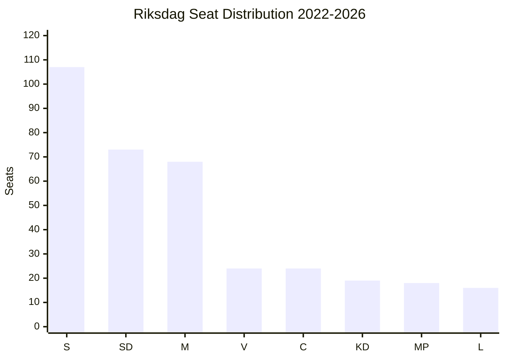

# Coalition Mathematics — Opposition Motions 2026-04-28

**Author**: James Pether Sörling | **Classification**: PUBLIC

## Current Riksdag Seat Distribution (349 seats total)

| Party | Seats | Bloc | Governing Role |
|-------|-------|------|----------------|
| S | 107 | Opposition | Largest opposition party |
| SD | 73 | Government bloc | Confidence-and-supply (tight) |
| M | 68 | Government | Prime Minister's party |
| V | 24 | Opposition | Left opposition |
| C | 24 | Opposition | Centre opposition |
| KD | 19 | Government | Coalition partner |
| MP | 18 | Opposition | Green opposition |
| L | 16 | Government bloc | Confidence-and-supply |

**Government bloc total**: M(68) + KD(19) + SD(73) + L(16) = **176 seats** (majority = 175)
**Opposition total**: S(107) + V(24) + C(24) + MP(18) = **173 seats**

**Governing majority**: 1 seat (176 vs. 173) — extremely thin margin

## Motion Voting Arithmetic

For any motion to pass, it needs ≥175 votes (simple majority in chamber).

| Scenario | Votes | Result |
|----------|-------|--------|
| All opposition votes Ja | 173 | FAILS (short by 2) |
| All opposition + 2 from govt bloc | 175 | PASSES |
| Only S+V+MP | 149 | FAILS |
| Only S+C+MP | 149 | FAILS |
| V alone (HD024120) | 24 | FAILS overwhelmingly |

**Key insight**: No opposition motion can pass without defections from the governing bloc. The 1-2 vote margin means even 1-2 SD abstentions could swing a specific vote.

## SD Defection Risk

SD filed HD024106 as a single-party motion. This signals SD is willing to act outside coalition coordination on arms exports. If SD were to vote Ja on its own HD024106 along with opposition support on arms export measures... this does not apply since V/MP/SD positions are contradictory.

**More relevant**: If any SD member abstains on prop. 2025/26:220 (NATO FP), the vote would be: 173 (opposition) + 2 (SD abstentions counted as abstain) = government motion still passes. Abstentions in Swedish parliamentary procedure do not change the yes/no tally.

## Post-2026 Election Coalition Scenarios

### Scenario A: Red-Green-Centre (175+)
Requires: S(~105-110) + V(~22-25) + C(~22-25) + MP(~18-20) = ~167-180

**Current motion batch signal**: V's HD024120 is a RED FLAG for this coalition. S will not reverse NATO commitments; V's explicit parliamentary opposition to NATO FP may be a deal-breaker.

### Scenario B: S+C+L+MP (technocratic)
Requires: S(~105) + C(~24) + L(~16) + MP(~18) = ~163 seats — SHORT

Only viable with significant vote shifts or new parties entering Riksdag.

### Scenario C: Continuation Government
M+KD+SD+L maintains majority if SD holds at ~70+ seats. Most likely scenario given SD's strength.

**Motion signal**: No opposition motion on 2026-04-28 suggests an alternative government programme is ready. This is further evidence the motions are positional rather than governmental.

**Confidence**: MEDIUM [B2] — 2026 election outcome uncertain; current polling indicates SD at ~22%, S at ~31%.
