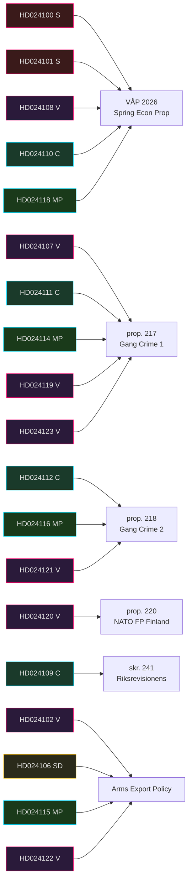

# Cross-Reference Map — Opposition Motions 2026-04-28

**Author**: James Pether Sörling | **Classification**: PUBLIC

## Government Propositions Under Attack

| Proposition | Title | Motions Filed Against |
|-------------|-------|----------------------|
| VÅP 2026 | Vårpropositionen (Spring Econ) | HD024100 (S), HD024101 (S), HD024108 (V), HD024110 (C), HD024118 (MP) |
| prop. 2025/26:217 | Fler möjligheter... (gang crime) | HD024107 (V), HD024111 (C), HD024114 (MP), HD024119 (V), HD024123 (V) |
| prop. 2025/26:218 | Förstärkt kontroll... (crime 2) | HD024112 (C), HD024116 (MP), HD024121 (V) |
| prop. 2025/26:220 | NATO Forward Presence Finland | HD024120 (V) |
| skr. 2025/26:241 | Riksrevisionens rapport | HD024109 (C) |
| Arms Export Policy | Government arms export framework | HD024102 (V), HD024106 (SD), HD024115 (MP), HD024122 (V) |
| Environmental Review | Proposed env. review agency | HD024105 (V) |
| Artskydd (Species law) | Species protection compensation | HD024113 (C), HD024117 (MP) |

## Policy Chain Map

## Legislative Timeline Dependencies

1. **Spring Budget chain**: VÅP 2026 → FiU consideration → Spring Budget vote (May-June 2026)
2. **Justice chain**: prop. 217 + prop. 218 → JuU → Joint plenary vote (expected before summer recess)
3. **NATO chain**: prop. 220 → FöU → plenary (likely June 2026)
4. **Artskydd chain**: MJU considers C HD024113 + MP HD024117 before final reading

## Party Coverage Overlap

| Policy Area | S | V | C | MP | SD |
|-------------|---|---|---|----|----|
| Economics | ✅ | ✅ | ✅ | ✅ | ❌ |
| Criminal Justice | ❌ | ✅ | ✅ | ✅ | ❌ |
| Arms Export | ❌ | ✅ | ❌ | ✅ | ✅ |
| NATO/Defence | ❌ | ✅ | ❌ | ❌ | ❌ |
| Environment | ❌ | ✅ | ✅ | ✅ | ❌ |
