# Opposition Motions 28 April 2026: Economic Contestation, Defence Fault Lines, and Justice Reform Battles

**Author**: James Pether Sörling
**Date**: 2026-04-29
**Run ID**: 25096387000
**Classification**: PUBLIC — GDPR Art. 9(2)(e,g)
**Confidence**: HIGH [B2]

---

## 🎯 BLUF

On 28 April 2026, all four opposition parties — Socialdemokraterna (S), Vänsterpartiet (V), Centerpartiet (C), and Miljöpartiet (MP) — filed 24 motions spanning five policy clusters: the Spring Economic Proposition (prop. 2025/26:100), the Spring Budget (prop. 2025/26:99), criminal justice reform, arms export control, and environmental regulation. The legislative breadth and coordinated timing signal a consolidated opposition bloc challenging the Tidö government's core Spring legislative agenda. Vänsterpartiet's motion HD024120 — explicitly rejecting Sweden's NATO Forward Presence contribution to Finland (prop. 2025/26:220) — represents the most strategically significant single act, as V is the only Riksdag party opposing Swedish NATO commitments at this operational level. The absence of partisan alignment between V and the other opposition parties on defence marks a critical fault line within the opposition bloc.

## 🧭 3 Decisions This Brief Supports

1. **Editorial editors** deciding whether HD024120 (V rejects NATO Forward Presence) warrants breaking-news treatment separate from the economic motion cluster — **yes, it does**: it is the only motion in this cycle that directly challenges Sweden's NATO operational commitments post-accession.
2. **Policy analysts** assessing whether the opposition economic critique (S, V, C, MP) constitutes a coherent alternative budget framework or fragmented criticism — the evidence points to **fragmented**: parties advocate contradictory macroeconomic directions (S: demand stimulus; C: fiscal consolidation; V: redistribution; MP: green transformation).
3. **Intelligence consumers** tracking criminal justice opposition coalition depth: C's demand for a consequence analysis before proceeding (HD024111-112) versus V's and MP's outright rejection of the double-penalty and civil-servant liability proposals (HD024107, HD024114, HD024116, HD024119, HD024121, HD024123) — **the opposition is ideologically split**, reducing likelihood of coordinated JuU blocking.

## ⏱️ 60-Second Intelligence Bullets

- **24 motions filed 2026-04-28**, all in response to government propositions or government communications in the 2025/26 riksmöte
- **Economic cluster (6 motions)**: S, V, C, MP each challenge prop. 2025/26:100 (Spring Economic Proposition); S and V also challenge prop. 2025/26:99 (Spring Budget). No unified opposition alternative.
- **Criminal justice cluster (8 motions)**: Widest opposition count. C wants slower roll-out; MP and V reject double-gang penalties entirely. Government has majority through M-KD-SD on JuU.
- **Arms export cluster (4 motions)**: Extreme divergence — SD (HD024106) wants MORE export approvals; V (HD024102, HD024122) and MP (HD024115) want an embargo on exports to war zones. Position inversion across opposition.
- **Defence/NATO (1 motion — HD024120)**: V rejects NATO Forward Presence contribution to Finland. Isolated position; no other party supports this stance.
- **Environment (3 motions)**: C wants artskydd reform (HD024113); MP wants EU state-aid analysis before artskydd payments (HD024117); V rejects new environmental review agency (HD024105).
- **Fiscal framework (1 motion — HD024109)**: C's Martin Ådahl urges responsible fiscal policy in response to Riksrevisionen's critical report on the fiscal framework.

## 🔭 Top Forward Trigger

**JuU vote on prop. 2025/26:218 (double gang penalties)** — expected within 2–4 weeks. V, MP, and one Centerpartiet faction oppose; the government's M-KD-SD majority is sufficient to pass. Watch for S position (absent from JuU motions in this batch) as indicator of Social Democrat stance on criminal justice framing ahead of 2026 election.

## 📊 Confidence Distribution

| Claim | Admiralty | Confidence |
|-------|-----------|------------|
| All 24 motions filed 2026-04-28 | A1 | VERY HIGH |
| V is only party rejecting NATO FP | A1 | VERY HIGH |
| Opposition economic critique is fragmented | A2 | HIGH |
| Government JuU majority sufficient to pass crime bill | B2 | HIGH |
| IMF economic parameters cited | F3 | LOW [unconfirmed-IMF] |

```mermaid
graph LR
    subgraph MotionClusters["2026-04-28 Motion Clusters"]
        ECO["💰 Economic\n6 motions\nS+V+C+MP"]:::eco
        JUST["⚖️ Criminal Justice\n8 motions\nV+C+MP"]:::just
        EXP["🔫 Export Control\n4 motions\nV+SD+MP"]:::exp
        DEF["🛡️ Defence/NATO\n1 motion\nV only"]:::def
        ENV["🌿 Environment\n3 motions\nV+C+MP"]:::env
        FIS["�� Fiscal Framework\n1 motion\nC"]:::fis
    end
    style MotionClusters fill:#0a0e27,stroke:#00d9ff
    classDef eco fill:#1a3a5c,stroke:#00d9ff,color:#e0e0e0
    classDef just fill:#3a1a1a,stroke:#ff006e,color:#e0e0e0
    classDef exp fill:#2a2a1a,stroke:#ffbe0b,color:#e0e0e0
    classDef def fill:#1a1a3a,stroke:#ff006e,color:#e0e0e0
    classDef env fill:#1a3a1a,stroke:#00d9ff,color:#e0e0e0
    classDef fis fill:#2a1a3a,stroke:#ffbe0b,color:#e0e0e0
```

## 📈 Pass 2 Enhancement: Policy Significance Ranking

| Rank | Motion | Party | Significance Rationale |
|------|--------|-------|----------------------|
| 1 | HD024120 | V | Only NATO opposition in all Riksdag — treaty-level escalation |
| 2 | HD024109 | C | Riksrevisionen-backed fiscal critique — institutional authority |
| 3 | HD024111 | C | Procedurally viable delay of prop. 217 — 15-25% delay probability |
| 4 | HD024100 | S | Magdalena Andersson's primary 2026 economic alternative |
| 5 | HD024115 | MP | Arms embargo — most activist foreign policy motion |

## 🔴 Pass 2 Critical Clarification

The economic motion count is **6** (HD024100, HD024101, HD024108, HD024109, HD024110, HD024118) and **not** 5 as might be inferred from initial summary — HD024109 (C fiscal framework) belongs in the economic/FiU cluster despite its distinct character as an RR-response motion.

The criminal justice cluster is **8 motions** but the opposition split into two strategies: **procedural delay** (C: HD024111, HD024112) and **outright rejection** (V: HD024107, HD024119, HD024121, HD024123; MP: HD024114, HD024116). This distinction matters for predicting JuU outcomes — the procedural delay path (C) is the only one with realistic traction.

**HD024106 (SD)**: Note that Sverigedemokraterna, despite being in the governing coalition, filed a motion in this opposition-adjacent batch. This is an intra-coalition signal, not genuine opposition activity.
