<!-- rtl -->
# اقتراحات المعارضة في 28 أبريل 2026: الخلاف الاقتصادي، فجوات الدفاع، ومعارك إصلاح العدالة

**المؤلف**: James Pether Sörling
**التاريخ**: 2026-04-29
**معرّف التشغيل**: 25096387000
**التصنيف**: عام — اللائحة الأوروبية للبيانات GDPR Art. 9(2)(e,g)
**الثقة**: عالية [B2]

---

## 🎯 الملخص التنفيذي (BLUF)

في 28 أبريل 2026، قدّمت أحزاب المعارضة الأربعة — Socialdemokraterna (S) وVänsterpartiet (V) وCenterpartiet (C) وMiljöpartiet (MP) — 24 اقتراحاً تغطي خمسة مجالات سياسية: مقترح الربيع الاقتصادي (prop. 2025/26:100)، وميزانية الربيع (prop. 2025/26:99)، وإصلاح قانون العقوبات، والرقابة على صادرات الأسلحة، والتنظيم البيئي. يدل الاتساع التشريعي والتوقيت المنسق على كتلة معارضة موحدة تتحدى أجندة حكومة Tidö التشريعية المحورية. ويمثل اقتراح Vänsterpartiet رقم HD024120 — الذي يرفض صراحةً مساهمة السويد في تعزيز الحضور الأمامي للناتو في فنلندا (prop. 2025/26:220) — أكثر الأفعال الفردية أهمية استراتيجية، إذ يُعدّ V الحزب الوحيد في الريكسداغ الذي يعارض الالتزامات السويدية مع الناتو على هذا المستوى التشغيلي بعد الانضمام. ويُشكّل غياب التوافق بين V وسائر أحزاب المعارضة في قضايا الدفاع خطاً انقسامياً حاسماً داخل كتلة المعارضة.

## 🧭 ثلاثة قرارات يدعمها هذا التقرير الاستخباراتي

1. **المحررون** الذين يحددون ما إذا كان HD024120 (رفض V للحضور الأمامي للناتو) يستحق تغطية إخبارية عاجلة منفصلة عن المجموعة الاقتصادية — **نعم، يستحق**: فهو الاقتراح الوحيد في هذه الدورة الذي يتحدى مباشرةً الالتزامات التشغيلية السويدية مع الناتو بعد الانضمام.
2. **المحللون السياسيون** الذين يقيّمون ما إذا كان النقد الاقتصادي للمعارضة (S، V، C، MP) يُشكّل إطاراً بديلاً للميزانية أم مجرد نقد مجزّأ — تشير الأدلة إلى **التجزؤ**: إذ تدافع الأحزاب عن توجهات اقتصادية كلية متناقضة (S: تحفيز الطلب؛ C: تعزيز المالية العامة؛ V: إعادة التوزيع؛ MP: التحول الأخضر).
3. **مستهلكو الاستخبارات** الذين يتابعون عمق تحالف المعارضة القضائية: مطالبة C بتحليل تأثير قبل المضي قُدُماً (HD024111–112) في مقابل رفض V وMP الصريح لمقترحات مضاعفة عقوبة العصابات ومسؤولية الموظفين المدنيين (HD024107، HD024114، HD024116، HD024119، HD024121، HD024123) — **المعارضة منقسمة أيديولوجياً**، مما يقلل من احتمالية حجب JuU منسق.

## ⏱️ نقاط استخباراتية في 60 ثانية

- **تقديم 24 اقتراحاً في 2026-04-28**، جميعها رداً على مقترحات حكومية أو مراسلات في دورة ريكسموتي 2025/26
- **المجموعة الاقتصادية (6 اقتراحات)**: تطعن S وV وC وMP كل على حدة في prop. 2025/26:100 (المقترح الاقتصادي الربيعي)؛ كما تطعن S وV في prop. 2025/26:99 (ميزانية الربيع). لا بديل موحداً للمعارضة.
- **مجموعة العدالة الجنائية (8 اقتراحات)**: أوسع تمثيل للمعارضة. تريد C تطبيقاً أبطأ؛ ترفض MP وV العقوبات المضاعفة للعصابات كلياً. تملك الحكومة أغلبية عبر M-KD-SD في JuU.
- **مجموعة الرقابة على الصادرات العسكرية (4 اقتراحات)**: انقسام حاد — تريد SD (HD024106) المزيد من الموافقات على التصدير؛ تريد V (HD024102، HD024122) وMP (HD024115) حظراً على التصدير إلى مناطق الحرب. عكس المواقف داخل المعارضة.
- **الدفاع/الناتو (اقتراح واحد — HD024120)**: ترفض V مساهمة الناتو في الحضور الأمامي في فنلندا. موقف معزول؛ لا حزب آخر يدعم هذا الموقف.
- **البيئة (3 اقتراحات)**: تريد C إصلاح حماية الأنواع (HD024113)؛ تريد MP تحليل مساعدات الدولة الأوروبية قبل مدفوعات حماية الأنواع (HD024117)؛ ترفض V هيئة المراجعة البيئية الجديدة (HD024105).
- **الإطار المالي العام (اقتراح واحد — HD024109)**: يدعو Martin Ådahl من C إلى سياسة مالية مسؤولة رداً على تقرير Riksrevisionen النقدي بشأن الإطار المالي.

## 🔭 أهم المحفزات المستقبلية

**تصويت JuU على prop. 2025/26:218 (مضاعفة عقوبة العصابات)** — متوقع خلال 2–4 أسابيع. V وMP وفصيل من Centerpartiet يعارضون؛ أغلبية M-KD-SD كافية لإقرار القانون. راقب موقف S (الغائب عن اقتراحات JuU في هذه الحزمة) كمؤشر على موقف الديمقراطيين الاجتماعيين من صياغة قضايا العدالة الجنائية قبيل انتخابات 2026.

## 📊 توزيع الثقة

| الادعاء | Admiralty | الثقة |
|---------|-----------|-------|
| جميع الاقتراحات الـ24 مقدمة في 2026-04-28 | A1 | مرتفعة جداً |
| V الحزب الوحيد الرافض لـFP الناتو | A1 | مرتفعة جداً |
| النقد الاقتصادي للمعارضة مجزأ | A2 | مرتفعة |
| أغلبية JuU كافية لإقرار قانون مكافحة الجريمة | B2 | مرتفعة |
| معاملات اقتصادية IMF مستشهد بها | F3 | منخفضة [غير مؤكدة-IMF] |

```mermaid
graph LR
    subgraph MotionClusters["2026-04-28 Motion Clusters"]
        ECO["💰 Economic\n6 motions\nS+V+C+MP"]:::eco
        JUST["⚖️ Criminal Justice\n8 motions\nV+C+MP"]:::just
        EXP["🔫 Export Control\n4 motions\nV+SD+MP"]:::exp
        DEF["🛡️ Defence/NATO\n1 motion\nV only"]:::def
        ENV["🌿 Environment\n3 motions\nV+C+MP"]:::env
        FIS["🏛️ Fiscal Framework\n1 motion\nC"]:::fis
    end
    style MotionClusters fill:#0a0e27,stroke:#00d9ff
    classDef eco fill:#1a3a5c,stroke:#00d9ff,color:#e0e0e0
    classDef just fill:#3a1a1a,stroke:#ff006e,color:#e0e0e0
    classDef exp fill:#2a2a1a,stroke:#ffbe0b,color:#e0e0e0
    classDef def fill:#1a1a3a,stroke:#ff006e,color:#e0e0e0
    classDef env fill:#1a3a1a,stroke:#00d9ff,color:#e0e0e0
    classDef fis fill:#2a1a3a,stroke:#ffbe0b,color:#e0e0e0
```

## 📈 تحسين المرور 2: تصنيف الأهمية السياسية

| الترتيب | الاقتراح | الحزب | مبرر الأهمية |
|---------|---------|--------|-------------|
| 1 | HD024120 | V | المعارضة الوحيدة للناتو في الريكسداغ كله — تصعيد على مستوى المعاهدة |
| 2 | HD024109 | C | نقد مالي مدعوم من Riksrevisionen — سلطة مؤسسية |
| 3 | HD024111 | C | تأخير إجرائي قابل للتطبيق لـprop. 217 — احتمال التأخير 15–25% |
| 4 | HD024100 | S | البديل الاقتصادي الرئيسي لـMagdalena Andersson لعام 2026 |
| 5 | HD024115 | MP | حظر الأسلحة — أكثر اقتراحات السياسة الخارجية نشاطاً |

## 🔴 التوضيح الحاسم للمرور 2

عدد الاقتراحات الاقتصادية **6** (HD024100، HD024101، HD024108، HD024109، HD024110، HD024118) وليس 5 كما قد يُستنتج من الملخص الأولي — ينتمي HD024109 (الإطار المالي C) إلى مجموعة الاقتصاد/FiU رغم طابعه كاقتراح رد على RR.

تتضمن مجموعة العدالة الجنائية **8 اقتراحات**، لكن المعارضة تنقسم إلى استراتيجيتين: **التأخير الإجرائي** (C: HD024111، HD024112) و**الرفض الكامل** (V: HD024107، HD024119، HD024121، HD024123؛ MP: HD024114، HD024116). هذا التمييز مهم للتنبؤ بنتائج JuU — مسار التأخير الإجرائي (C) هو الوحيد ذو قدرة واقعية.

**HD024106 (SD)**: لاحظ أن Sverigedemokraterna، رغم كونها في الائتلاف الحاكم، قدّمت اقتراحاً في هذه الحزمة المجاورة للمعارضة. هذا إشارة داخل الائتلاف، وليس نشاطاً حقيقياً للمعارضة.

<!-- source-sha: aef867f928a2f4069766f065dd0ce9404a49f679 -->
