# Oppositionsforslag 28. april 2026: Økonomisk strid, forsvarsbrydninger og retsvæsensreformkampe

**Forfatter**: James Pether Sörling
**Dato**: 2026-04-29
**Kørsels-ID**: 25096387000
**Klassificering**: OFFENTLIG — GDPR Art. 9(2)(e,g)
**Konfidens**: HØJ [B2]

---

## 🎯 Sammenfatning (BLUF)

Den 28. april 2026 indgav alle fire oppositionspartier — Socialdemokraterna (S), Vänsterpartiet (V), Centerpartiet (C) og Miljöpartiet (MP) — 24 forslag inden for fem politiske klynger: vårens økonomiske proposition (prop. 2025/26:100), vårbudgettet (prop. 2025/26:99), strafferetlig reform, våbeneksportkontrol og miljøregulering. Den lovgivningsmæssige bredde og den koordinerede timing signalerer et konsolideret oppositionsblok, der udfordrer Tidö-regeringens centrale lovgivningsagenda. Vänsterpartiets forslag HD024120 — der eksplicit afviser Sveriges bidrag til NATOs forstærkede tilstedeværelse i Finland (prop. 2025/26:220) — repræsenterer den strategisk mest betydningsfulde enkelthandling, da V er det eneste Riksdag-parti, der på dette operationelle niveau modsætter sig svenske NATO-forpligtelser efter tiltrædelsen. Fraværet af partiovergreifende tilpasning mellem V og de øvrige oppositionspartier i forsvarsspørgsmål markerer en kritisk spaltningslinje inden for oppositionsblokken.

## 🧭 3 beslutninger dette underrettelsesbrev understøtter

1. **Redaktioner** der afgør om HD024120 (V afviser NATOs forstærkede tilstedeværelse) berettiger breaking news-behandling adskilt fra det økonomiske kluster — **ja, det gør det**: det er det eneste forslag i denne cyklus, der direkte udfordrer Sveriges NATO-operationelle forpligtelser efter tiltrædelsen.
2. **Politikanalytikere** der vurderer, om oppositionens økonomiske kritik (S, V, C, MP) udgør et sammenhængende alternativt budgetramme eller fragmenteret kritik — beviser peger på **fragmentering**: partierne taler for modstridende makroøkonomiske retninger (S: efterspørgselsstimulans; C: finanspolitisk konsolidering; V: omfordeling; MP: grøn omstilling).
3. **Efterretningskonsumenter** der følger dybden af oppositionens retslige koalition: C's krav om konsekvensanalyse inden behandling (HD024111–112) versus V's og MP's direkte afvisning af forslag om dobbelt-bandestraf og embedsmænds ansvar (HD024107, HD024114, HD024116, HD024119, HD024121, HD024123) — **oppositionen er ideologisk splittet**, hvilket reducerer sandsynligheden for koordineret JuU-blokering.

## ⏱️ 60 sekunders efterretningsbullets

- **24 forslag indgivet 2026-04-28**, alle som svar på regeringspropositioner eller -skrivelser i riksmöte 2025/26
- **Økonomisk kluster (6 forslag)**: S, V, C, MP udfordrer hver prop. 2025/26:100 (vårpropositionens økonomiske del); S og V udfordrer også prop. 2025/26:99 (vårbudgettet). Intet samlet oppositionsalternativ.
- **Strafferetskluster (8 forslag)**: Bredeste oppositionsantal. C ønsker langsommere gennemførelse; MP og V afviser dobbelt-bandestraf helt. Regeringen har flertal via M-KD-SD i JuU.
- **Våbeneksportkluster (4 forslag)**: Ekstrem divergens — SD (HD024106) ønsker FLERE eksportgodkendelser; V (HD024102, HD024122) og MP (HD024115) ønsker embargo mod eksport til krigsramte lande. Positionsinversion på tværs af oppositionen.
- **Forsvar/NATO (1 forslag — HD024120)**: V afviser NATOs bidrag til forstærket tilstedeværelse i Finland. Isoleret position; intet andet parti støtter denne holdning.
- **Miljø (3 forslag)**: C ønsker artsbeskyttelsesreform (HD024113); MP ønsker EU-statsstøtteanalyse inden artsbetalinger (HD024117); V afviser det nye miljøvurderingsorgan (HD024105).
- **Finanspolitisk ramme (1 forslag — HD024109)**: C's Martin Ådahl opfordrer til ansvarlig finanspolitik som svar på Riksrevisionens kritiske rapport om det finanspolitiske ramme.

## 🔭 Vigtigste kommende udløser

**JuU-afstemning om prop. 2025/26:218 (dobbelt bandestraf)** — forventet inden for 2–4 uger. V, MP og en del af Centerpartiet modsætter sig; regeringens M-KD-SD-flertal er tilstrækkeligt til at vedtage loven. Overvåg S's holdning (fraværende i JuU-forslagene i dette bundt) som indikator for socialdemokraternes stance i strafferetsreformen op til valget 2026.

## 📊 Konfidensfordeling

| Påstand | Admiralty | Konfidens |
|---------|-----------|-----------|
| Alle 24 forslag indgivet 2026-04-28 | A1 | MEGET HØJ |
| V er eneste parti der afviser NATOs FP | A1 | MEGET HØJ |
| Oppositionens økonomiske kritik er fragmenteret | A2 | HØJ |
| Regeringens JuU-flertal tilstrækkeligt til at vedtage kriminalitetsloven | B2 | HØJ |
| IMF's økonomiske parametre citeret | F3 | LAV [ubekræftet-IMF] |

```mermaid
graph LR
    subgraph MotionClusters["2026-04-28 Motion Clusters"]
        ECO["💰 Economic\n6 motions\nS+V+C+MP"]:::eco
        JUST["⚖️ Criminal Justice\n8 motions\nV+C+MP"]:::just
        EXP["🔫 Export Control\n4 motions\nV+SD+MP"]:::exp
        DEF["🛡️ Defence/NATO\n1 motion\nV only"]:::def
        ENV["🌿 Environment\n3 motions\nV+C+MP"]:::env
        FIS["🏛️ Fiscal Framework\n1 motion\nC"]:::fis
    end
    style MotionClusters fill:#0a0e27,stroke:#00d9ff
    classDef eco fill:#1a3a5c,stroke:#00d9ff,color:#e0e0e0
    classDef just fill:#3a1a1a,stroke:#ff006e,color:#e0e0e0
    classDef exp fill:#2a2a1a,stroke:#ffbe0b,color:#e0e0e0
    classDef def fill:#1a1a3a,stroke:#ff006e,color:#e0e0e0
    classDef env fill:#1a3a1a,stroke:#00d9ff,color:#e0e0e0
    classDef fis fill:#2a1a3a,stroke:#ffbe0b,color:#e0e0e0
```

## 📈 Pass 2-forbedring: Politisk signifikansgrupperingssranking

| Rang | Motion | Parti | Signifikansbegrundelse |
|------|--------|-------|----------------------|
| 1 | HD024120 | V | Eneste NATO-opposition i hele Riksdag — traktatniveau-eskalering |
| 2 | HD024109 | C | Riksrevisionen-støttet finanspolitisk kritik — institutionel autoritet |
| 3 | HD024111 | C | Processuelt gennemførlig forsinkelse af prop. 217 — 15–25% forsinkelsessandsynlighed |
| 4 | HD024100 | S | Magdalena Anderssons primære 2026-økonomiske alternativ |
| 5 | HD024115 | MP | Våbenembargo — den mest aktivistiske udenrigspolitiske motion |

## 🔴 Pass 2 Kritisk afklaring

Det ekonomiske motionsantal er **6** (HD024100, HD024101, HD024108, HD024109, HD024110, HD024118) og **ikke** 5 som kan udledes af den indledende sammenfatning — HD024109 (C finanspolitisk ramme) hører til det økonomi/FiU-kluster på trods af dets karakter som RR-responsmotion.

Strafferetsklustret udgøres af **8 motioner**, men oppositionen er delt i to strategier: **processuell forsinkelse** (C: HD024111, HD024112) og **direkte afvisning** (V: HD024107, HD024119, HD024121, HD024123; MP: HD024114, HD024116). Denne skelnen er vigtig for at forudsige JuU-resultater — den processuell forsinkelsessti (C) er den eneste med realistisk gennemslagskraft.

**HD024106 (SD)**: Bemærk at Sverigedemokraterna, på trods af at være i regeringskoalitionen, indgav en motion i dette oppositionsnære bundt. Dette er et intra-koalitionssignal, ikke genuint oppositionsaktivitet.

<!-- source-sha: aef867f928a2f4069766f065dd0ce9404a49f679 -->
