# Oppositionsanträge 28. April 2026: Wirtschaftlicher Streit, Verteidigungsbruchlinien und Kämpfe um Justizreformen

**Autor**: James Pether Sörling
**Datum**: 2026-04-29
**Lauf-ID**: 25096387000
**Einstufung**: ÖFFENTLICH — DSGVO Art. 9(2)(e,g)
**Konfidenz**: HOCH [B2]

---

## 🎯 Zusammenfassung (BLUF)

Am 28. April 2026 reichten alle vier Oppositionsparteien — Socialdemokraterna (S), Vänsterpartiet (V), Centerpartiet (C) und Miljöpartiet (MP) — 24 Anträge in fünf Politikbereichen ein: die wirtschaftliche Frühjahrsproposition (Prop. 2025/26:100), den Frühjahrshaushalt (Prop. 2025/26:99), Strafrechtsreform, Rüstungsexportkontrolle und Umweltregulierung. Die legislatorische Breite und das koordinierte Timing signalisieren einen konsolidierten Oppositionsblock, der die zentrale Gesetzgebungsagenda der Tidö-Regierung herausfordert. Vänsterpartiets Antrag HD024120 — der Schwedens Beitrag zur NATO-Vorwärtspräsenz in Finnland (Prop. 2025/26:220) ausdrücklich ablehnt — stellt die strategisch bedeutsamste Einzelmaßnahme dar, da V die einzige Riksdag-Partei ist, die schwedische NATO-Verpflichtungen nach dem Beitritt auf dieser operativen Ebene ablehnt. Das Fehlen einer parteiübergreifenden Ausrichtung zwischen V und den anderen Oppositionsparteien in Verteidigungsfragen markiert eine kritische Bruchlinie innerhalb des Oppositionsblocks.

## 🧭 3 Entscheidungen, die dieses Nachrichtenbriefing unterstützt

1. **Redaktionen**, die entscheiden, ob HD024120 (V lehnt NATOs Vorwärtspräsenz ab) eine gesonderte Breaking-News-Behandlung vom wirtschaftlichen Cluster verdient — **ja, das tut es**: Es ist der einzige Antrag in diesem Zyklus, der Schwedens NATO-operative Verpflichtungen nach dem Beitritt direkt herausfordert.
2. **Politikanalysten**, die beurteilen, ob die wirtschaftliche Kritik der Opposition (S, V, C, MP) einen kohärenten alternativen Haushaltsrahmen oder fragmentierte Kritik darstellt — die Beweise deuten auf **Fragmentierung** hin: Die Parteien befürworten widersprüchliche makroökonomische Richtungen (S: Nachfragestimulierung; C: Haushaltskonsolidierung; V: Umverteilung; MP: grüne Transformation).
3. **Nachrichtenkonsumenten**, die die Tiefe der justiziellen Koalition der Opposition verfolgen: C's Forderung nach einer Folgenabschätzung vor der Behandlung (HD024111–112) versus V's und MP's ausdrückliche Ablehnung der Doppelgangstrafe und der Beamtenhaftung (HD024107, HD024114, HD024116, HD024119, HD024121, HD024123) — **die Opposition ist ideologisch gespalten**, was die Wahrscheinlichkeit einer koordinierten JuU-Blockierung verringert.

## ⏱️ 60-Sekunden-Nachrichtenbullets

- **24 Anträge eingereicht 2026-04-28**, alle als Reaktion auf Regierungspropositioner oder -mitteilungen im riksmöte 2025/26
- **Wirtschaftscluster (6 Anträge)**: S, V, C, MP fordern jeweils Prop. 2025/26:100 (wirtschaftlicher Teil der Frühjahrsproposition) heraus; S und V fordern auch Prop. 2025/26:99 (Frühjahrshaushalt) heraus. Keine einheitliche Oppositionsalternative.
- **Strafrechtlicher Cluster (8 Anträge)**: Größte Oppositionsanzahl. C will ein langsameres Rollout; MP und V lehnen Doppelgangstrafen vollständig ab. Die Regierung hat eine Mehrheit über M-KD-SD im JuU.
- **Rüstungsexportcluster (4 Anträge)**: Extreme Divergenz — SD (HD024106) will MEHR Exportgenehmigungen; V (HD024102, HD024122) und MP (HD024115) wollen ein Embargo für Exporte in Kriegsgebiete. Positionsinversion quer durch die Opposition.
- **Verteidigung/NATO (1 Antrag — HD024120)**: V lehnt NATOs Beitrag zur Vorwärtspräsenz in Finnland ab. Isolierte Position; keine andere Partei unterstützt diesen Standpunkt.
- **Umwelt (3 Anträge)**: C will Artenschutzreform (HD024113); MP will EU-Beihilfeanalyse vor Artenschutzzahlungen (HD024117); V lehnt die neue Umweltgenehmigungsbehörde ab (HD024105).
- **Finanzpolitischer Rahmen (1 Antrag — HD024109)**: C's Martin Ådahl fordert verantwortungsvolle Finanzpolitik als Reaktion auf Riksrevisionens kritischen Bericht über den Finanzrahmen.

## 🔭 Wichtigster kommender Auslöser

**JuU-Abstimmung über Prop. 2025/26:218 (Doppelgangstrafe)** — wird innerhalb von 2–4 Wochen erwartet. V, MP und eine Fraktion von Centerpartiet lehnen ab; die Regierungsmehrheit von M-KD-SD reicht für die Verabschiedung. Beobachten Sie S' Position (in JuU-Anträgen dieses Pakets nicht vertreten) als Indikator für die sozialdemokratische Haltung zur Strafjustiz im Vorfeld der Wahl 2026.

## 📊 Konfidenzverteilung

| Behauptung | Admiralty | Konfidenz |
|------------|-----------|-----------|
| Alle 24 Anträge eingereicht 2026-04-28 | A1 | SEHR HOCH |
| V ist die einzige Partei, die NATOs FP ablehnt | A1 | SEHR HOCH |
| Wirtschaftliche Kritik der Opposition ist fragmentiert | A2 | HOCH |
| Regierungsmehrheit im JuU ausreichend für das Kriminalitätsgesetz | B2 | HOCH |
| IMF-Wirtschaftsparameter zitiert | F3 | NIEDRIG [unbestätigt-IMF] |

```mermaid
graph LR
    subgraph MotionClusters["2026-04-28 Motion Clusters"]
        ECO["💰 Economic\n6 motions\nS+V+C+MP"]:::eco
        JUST["⚖️ Criminal Justice\n8 motions\nV+C+MP"]:::just
        EXP["🔫 Export Control\n4 motions\nV+SD+MP"]:::exp
        DEF["🛡️ Defence/NATO\n1 motion\nV only"]:::def
        ENV["🌿 Environment\n3 motions\nV+C+MP"]:::env
        FIS["🏛️ Fiscal Framework\n1 motion\nC"]:::fis
    end
    style MotionClusters fill:#0a0e27,stroke:#00d9ff
    classDef eco fill:#1a3a5c,stroke:#00d9ff,color:#e0e0e0
    classDef just fill:#3a1a1a,stroke:#ff006e,color:#e0e0e0
    classDef exp fill:#2a2a1a,stroke:#ffbe0b,color:#e0e0e0
    classDef def fill:#1a1a3a,stroke:#ff006e,color:#e0e0e0
    classDef env fill:#1a3a1a,stroke:#00d9ff,color:#e0e0e0
    classDef fis fill:#2a1a3a,stroke:#ffbe0b,color:#e0e0e0
```

## 📈 Pass 2-Verbesserung: Politische Signifikanzeinstufung

| Rang | Antrag | Partei | Begründung der Signifikanz |
|------|--------|--------|---------------------------|
| 1 | HD024120 | V | Einzige NATO-Opposition im gesamten Riksdag — Eskalation auf Vertragsebene |
| 2 | HD024109 | C | Riksrevisionens-gestützte finanzpolitische Kritik — institutionelle Autorität |
| 3 | HD024111 | C | Verfahrenstechnisch durchführbare Verzögerung von Prop. 217 — 15–25% Verzögerungswahrscheinlichkeit |
| 4 | HD024100 | S | Magdalena Anderssons primäre wirtschaftliche Alternative für 2026 |
| 5 | HD024115 | MP | Waffenembargo — aktivistischster außenpolitischer Antrag |

## 🔴 Pass 2 Kritische Klarstellung

Die Anzahl der Wirtschaftsanträge beträgt **6** (HD024100, HD024101, HD024108, HD024109, HD024110, HD024118) und **nicht** 5, wie aus der anfänglichen Zusammenfassung geschlossen werden könnte — HD024109 (C Finanzrahmen) gehört trotz seiner RR-Antwortcharakter zum Wirtschafts-/FiU-Cluster.

Der Strafrechtliche Cluster umfasst **8 Anträge**, aber die Opposition ist in zwei Strategien aufgeteilt: **verfahrenstechnische Verzögerung** (C: HD024111, HD024112) und **vollständige Ablehnung** (V: HD024107, HD024119, HD024121, HD024123; MP: HD024114, HD024116). Diese Unterscheidung ist wichtig für die Vorhersage von JuU-Ergebnissen — der verfahrenstechnische Verzögerungsweg (C) ist der einzige mit realistischen Erfolgsaussichten.

**HD024106 (SD)**: Beachten Sie, dass Sverigedemokraterna, obwohl in der Regierungskoalition, in diesem oppositionsnahen Paket einen Antrag eingereicht hat. Dies ist ein Intra-Koalitionssignal, keine echte Oppositionsaktivität.

<!-- source-sha: aef867f928a2f4069766f065dd0ce9404a49f679 -->
