# Mociones de la oposición 28 de abril de 2026: Disputa económica, líneas de fractura en defensa y batallas por reformas judiciales

**Autor**: James Pether Sörling
**Fecha**: 2026-04-29
**ID de ejecución**: 25096387000
**Clasificación**: PÚBLICO — RGPD Art. 9(2)(e,g)
**Confianza**: ALTA [B2]

---

## 🎯 Resumen (BLUF)

El 28 de abril de 2026, los cuatro partidos de la oposición — Socialdemokraterna (S), Vänsterpartiet (V), Centerpartiet (C) y Miljöpartiet (MP) — presentaron 24 mociones en cinco áreas políticas: la proposición económica de primavera (prop. 2025/26:100), el presupuesto de primavera (prop. 2025/26:99), la reforma de la justicia penal, el control de exportaciones de armas y la regulación medioambiental. La amplitud legislativa y el calendario coordinado indican un bloque de oposición consolidado que desafía la agenda legislativa central del gobierno Tidö. La moción HD024120 de Vänsterpartiet — que rechaza explícitamente la contribución de Suecia a la presencia avanzada de la OTAN en Finlandia (prop. 2025/26:220) — representa el acto estratégicamente más significativo, ya que V es el único partido del Riksdag que se opone a los compromisos suecos con la OTAN a este nivel operativo tras la adhesión. La ausencia de alineación entre V y los demás partidos de la oposición en materia de defensa marca una línea de fractura crítica dentro del bloque opositor.

## 🧭 3 decisiones que apoya este informe de inteligencia

1. **Redacciones** que deciden si HD024120 (V rechaza la presencia avanzada de la OTAN) merece tratamiento de última hora separado del cluster económico — **sí, lo merece**: es la única moción de este ciclo que desafía directamente los compromisos operativos de Suecia con la OTAN tras la adhesión.
2. **Analistas de política** que evalúan si la crítica económica de la oposición (S, V, C, MP) constituye un marco presupuestario alternativo coherente o una crítica fragmentada — las evidencias apuntan a la **fragmentación**: los partidos abogan por direcciones macroeconómicas contradictorias (S: estímulo a la demanda; C: consolidación fiscal; V: redistribución; MP: transformación verde).
3. **Consumidores de inteligencia** que siguen la profundidad de la coalición judicial de la oposición: la demanda de C de un análisis de consecuencias antes de proceder (HD024111–112) frente al rechazo explícito de V y MP a las propuestas de doble pena de banda y responsabilidad de funcionarios (HD024107, HD024114, HD024116, HD024119, HD024121, HD024123) — **la oposición está ideológicamente dividida**, reduciendo la probabilidad de un bloqueo coordinado en el JuU.

## ⏱️ Puntos de inteligencia en 60 segundos

- **24 mociones presentadas el 2026-04-28**, todas en respuesta a proposiciones o comunicaciones gubernamentales en el riksmöte 2025/26
- **Cluster económico (6 mociones)**: S, V, C, MP impugnan cada uno la prop. 2025/26:100 (proposición económica de primavera); S y V también impugnan la prop. 2025/26:99 (presupuesto de primavera). Sin alternativa unificada de la oposición.
- **Cluster de justicia penal (8 mociones)**: Mayor número de la oposición. C quiere un despliegue más lento; MP y V rechazan completamente las dobles penas para bandas. El gobierno tiene mayoría a través de M-KD-SD en el JuU.
- **Cluster de control de exportaciones de armas (4 mociones)**: Divergencia extrema — SD (HD024106) quiere MÁS aprobaciones de exportación; V (HD024102, HD024122) y MP (HD024115) quieren un embargo sobre exportaciones a zonas de guerra. Inversión de posición en toda la oposición.
- **Defensa/OTAN (1 moción — HD024120)**: V rechaza la contribución de la OTAN a la presencia avanzada en Finlandia. Posición aislada; ningún otro partido apoya esta postura.
- **Medio ambiente (3 mociones)**: C quiere reforma de protección de especies (HD024113); MP quiere análisis de ayudas estatales de la UE antes de pagos por protección de especies (HD024117); V rechaza el nuevo organismo de revisión medioambiental (HD024105).
- **Marco fiscal (1 moción — HD024109)**: Martin Ådahl de C insta a una política fiscal responsable en respuesta al informe crítico de Riksrevisionen sobre el marco fiscal.

## 🔭 Principal catalizador futuro

**Votación del JuU sobre la prop. 2025/26:218 (doble pena de banda)** — esperada en 2–4 semanas. V, MP y una facción de Centerpartiet se oponen; la mayoría M-KD-SD del gobierno es suficiente para aprobar la ley. Vigile la posición de S (ausente en las mociones del JuU en este lote) como indicador de la postura socialdemócrata sobre el encuadramiento de la justicia penal antes de las elecciones de 2026.

## 📊 Distribución de confianza

| Afirmación | Admiralty | Confianza |
|------------|-----------|-----------|
| Las 24 mociones presentadas el 2026-04-28 | A1 | MUY ALTA |
| V es el único partido que rechaza la FP de la OTAN | A1 | MUY ALTA |
| La crítica económica de la oposición es fragmentada | A2 | ALTA |
| Mayoría JuU del gobierno suficiente para aprobar la ley de criminalidad | B2 | ALTA |
| Parámetros económicos del FMI citados | F3 | BAJA [no confirmado-FMI] |

```mermaid
graph LR
    subgraph MotionClusters["2026-04-28 Motion Clusters"]
        ECO["💰 Economic\n6 motions\nS+V+C+MP"]:::eco
        JUST["⚖️ Criminal Justice\n8 motions\nV+C+MP"]:::just
        EXP["🔫 Export Control\n4 motions\nV+SD+MP"]:::exp
        DEF["🛡️ Defence/NATO\n1 motion\nV only"]:::def
        ENV["🌿 Environment\n3 motions\nV+C+MP"]:::env
        FIS["🏛️ Fiscal Framework\n1 motion\nC"]:::fis
    end
    style MotionClusters fill:#0a0e27,stroke:#00d9ff
    classDef eco fill:#1a3a5c,stroke:#00d9ff,color:#e0e0e0
    classDef just fill:#3a1a1a,stroke:#ff006e,color:#e0e0e0
    classDef exp fill:#2a2a1a,stroke:#ffbe0b,color:#e0e0e0
    classDef def fill:#1a1a3a,stroke:#ff006e,color:#e0e0e0
    classDef env fill:#1a3a1a,stroke:#00d9ff,color:#e0e0e0
    classDef fis fill:#2a1a3a,stroke:#ffbe0b,color:#e0e0e0
```

## 📈 Mejora del pase 2: Clasificación de importancia política

| Rango | Moción | Partido | Justificación de la importancia |
|-------|--------|---------|--------------------------------|
| 1 | HD024120 | V | Única oposición a la OTAN en todo el Riksdag — escalada a nivel de tratado |
| 2 | HD024109 | C | Crítica fiscal respaldada por Riksrevisionen — autoridad institucional |
| 3 | HD024111 | C | Retraso procesal viable de la prop. 217 — 15–25% de probabilidad de retraso |
| 4 | HD024100 | S | Principal alternativa económica de Magdalena Andersson para 2026 |
| 5 | HD024115 | MP | Embargo de armas — moción de política exterior más activista |

## 🔴 Aclaración crítica del pase 2

El número de mociones económicas es **6** (HD024100, HD024101, HD024108, HD024109, HD024110, HD024118) y **no** 5 como podría inferirse del resumen inicial — HD024109 (C marco fiscal) pertenece al cluster económico/FiU a pesar de su carácter como moción de respuesta-RR.

El cluster de justicia penal comprende **8 mociones**, pero la oposición se divide en dos estrategias: **retraso procedimental** (C: HD024111, HD024112) y **rechazo total** (V: HD024107, HD024119, HD024121, HD024123; MP: HD024114, HD024116). Esta distinción es importante para predecir los resultados del JuU — la vía del retraso procedimental (C) es la única con tracción realista.

**HD024106 (SD)**: Nótese que Sverigedemokraterna, a pesar de estar en la coalición gobernante, presentó una moción en este lote próximo a la oposición. Esto es una señal intra-coalición, no actividad genuina de la oposición.

<!-- source-sha: aef867f928a2f4069766f065dd0ce9404a49f679 -->
