# Oppositioesitykset 28. huhtikuuta 2026: Taloudellinen kiista, puolustuksen ristiriitoja ja oikeudistouudistusten taistelu

**Tekijä**: James Pether Sörling
**Päivämäärä**: 2026-04-29
**Ajo-ID**: 25096387000
**Luokitus**: JULKINEN — GDPR Art. 9(2)(e,g)
**Luottamus**: KORKEA [B2]

---

## 🎯 Tiivistelmä (BLUF)

Kaikki neljä oppositiopuoluetta — Socialdemokraterna (S), Vänsterpartiet (V), Centerpartiet (C) ja Miljöpartiet (MP) — jättivät 28. huhtikuuta 2026 yhteensä 24 esitystä viidellä politiikan alalla: kevään talouspropositio (prop. 2025/26:100), kevätbudjetti (prop. 2025/26:99), rikosoikeudellinen uudistus, asevientivalvonta ja ympäristösääntely. Lainsäädännöllinen laajuus ja koordinoitu ajoitus viittaavat konsolidoituneeseen oppositioblokkiin, joka haastaa Tidö-hallituksen keskeisen lainsäädäntöagendan. Vänsterpartiets esitys HD024120 — joka nimenomaisesti hylkää Ruotsin panoksen NATOn eteentyönnettyyn läsnäoloon Suomessa (prop. 2025/26:220) — edustaa strategisesti merkittävintä yksittäistä toimenpidettä, koska V on ainoa rikspäiväpuolue, joka vastustaa ruotsalaisia NATO-sitoumuksia tällä operationaalisella tasolla jäsenyyden jälkeen. Se, ettei V:n ja muiden oppositiopuolueiden välillä ole puoluerajat ylittävää yhdensuuntaisuutta puolustusasioissa, merkitsee kriittistä jakolinjaa oppositioblokin sisällä.

## 🧭 3 päätöstä, joita tämä tiedusteluraportti tukee

1. **Toimitukset** jotka päättävät, ansaitseeko HD024120 (V hylkää NATOn eteentyönnetyn läsnäolon) uutisennakointia erikseen taloudellisesta klusterista — **kyllä, se ansaitsee**: se on ainoa esitys tässä syklissä, joka haastaa suoraan Ruotsin NATO-operatiiviset sitoumukset jäsenyyden jälkeen.
2. **Politiikka-analyytikot** jotka arvioivat, muodostaako opposition taloudellinen kritiikki (S, V, C, MP) johdonmukaisen vaihtoehtoisen budjettikehyksen vai sirpaloituneen kritiikin — todisteet viittaavat **sirpaloitumiseen**: puolueet ajavat ristiriitaisia makrotaloudellisia suuntauksia (S: kysyntäkiihoke; C: finanssipoliittinen konsolidointi; V: tulontasaus; MP: vihreä siirtymä).
3. **Tiedustelun käyttäjät** jotka seuraavat opposition oikeudellisen koalition syvyyttä: C:n vaatimus vaikutusarviosta ennen käsittelyä (HD024111–112) versus V:n ja MP:n suora hylkäys kaksinkertaisesta jengituomiosta ja virkamiesten vastuusta (HD024107, HD024114, HD024116, HD024119, HD024121, HD024123) — **oppositio on ideologisesti jakautunut**, mikä vähentää koordinoidun JuU-estämisen todennäköisyyttä.

## ⏱️ 60 sekunnin tiedustelubulletit

- **24 esitystä jätetty 2026-04-28**, kaikki vastauksena hallituksen ehdotuksiin tai kirjelmöihin riksmöte 2025/26:ssa
- **Talousklusteri (6 esitystä)**: S, V, C, MP kukin haastavat prop. 2025/26:100:n (kevätproposition taloudellinen osuus); S ja V haastavat myös prop. 2025/26:99:n (kevätbudjetti). Ei yhtenäistä oppositiovaihtoehtoa.
- **Rikosoikeusklusteri (8 esitystä)**: Laajin oppositiomäärä. C haluaa hitaamman toimeenpanon; MP ja V hylkäävät kaksinkertaiset jengirangaistukset kokonaan. Hallituksella on enemmistö M-KD-SD:n kautta JuU:ssa.
- **Asevientiklusteri (4 esitystä)**: Äärimmäinen hajonta — SD (HD024106) haluaa LISÄÄ vientilupuja; V (HD024102, HD024122) ja MP (HD024115) haluavat vientisaarron sotavyöhykkeille. Kantakäänteinen opposition sisällä.
- **Puolustus/NATO (1 esitys — HD024120)**: V hylkää NATOn panoksen eteentyönnettyyn läsnäoloon Suomessa. Eristetty kanta; mikään muu puolue ei tue tätä kantaa.
- **Ympäristö (3 esitystä)**: C haluaa lajinsuojeluuudistuksen (HD024113); MP haluaa EU:n valtiontukianalyysin ennen lajimaksuja (HD024117); V hylkää uuden ympäristölupaviraston (HD024105).
- **Finanssipolitiikan kehys (1 esitys — HD024109)**: C:n Martin Ådahl kehottaa vastuulliseen finanssipolitiikkaan vastauksena Riksrevisionenin kriittiseen raporttiin finanssipolitiikan kehyksestä.

## 🔭 Tärkein tuleva laukaisija

**JuU-äänestys prop. 2025/26:218:sta (kaksinkertainen jengirangaistus)** — odotetaan 2–4 viikon sisällä. V, MP ja osa Centerpartietista vastustaa; hallituksen M-KD-SD-enemmistö riittää lain läpiajamiseen. Seuraa S:n kantaa (poissa JuU-esityksistä tässä paketissa) indikaattorina sosiaalidemokraattien asenteesta rikosoikeudelliseen profilointiin ennen vuoden 2026 vaaleja.

## 📊 Luottamusjakauma

| Väite | Admiralty | Luottamus |
|-------|-----------|-----------|
| Kaikki 24 esitystä jätetty 2026-04-28 | A1 | ERITTÄIN KORKEA |
| V on ainoa puolue, joka hylkää NATOn FP:n | A1 | ERITTÄIN KORKEA |
| Opposition taloudellinen kritiikki on sirpaloitunutta | A2 | KORKEA |
| Hallituksen JuU-enemmistö riittää rikoslain läpiajamiseen | B2 | KORKEA |
| IMF:n taloudelliset parametrit siteerattu | F3 | ALHAINEN [vahvistamaton-IMF] |

```mermaid
graph LR
    subgraph MotionClusters["2026-04-28 Motion Clusters"]
        ECO["💰 Economic\n6 motions\nS+V+C+MP"]:::eco
        JUST["⚖️ Criminal Justice\n8 motions\nV+C+MP"]:::just
        EXP["🔫 Export Control\n4 motions\nV+SD+MP"]:::exp
        DEF["🛡️ Defence/NATO\n1 motion\nV only"]:::def
        ENV["🌿 Environment\n3 motions\nV+C+MP"]:::env
        FIS["🏛️ Fiscal Framework\n1 motion\nC"]:::fis
    end
    style MotionClusters fill:#0a0e27,stroke:#00d9ff
    classDef eco fill:#1a3a5c,stroke:#00d9ff,color:#e0e0e0
    classDef just fill:#3a1a1a,stroke:#ff006e,color:#e0e0e0
    classDef exp fill:#2a2a1a,stroke:#ffbe0b,color:#e0e0e0
    classDef def fill:#1a1a3a,stroke:#ff006e,color:#e0e0e0
    classDef env fill:#1a3a1a,stroke:#00d9ff,color:#e0e0e0
    classDef fis fill:#2a1a3a,stroke:#ffbe0b,color:#e0e0e0
```

## 📈 Pass 2 -parannus: Poliittinen merkitysluokitus

| Sijoitus | Esitys | Puolue | Merkitysperustelu |
|----------|--------|--------|-------------------|
| 1 | HD024120 | V | Ainoa NATO-oppositio koko Riksdagissa — sopimustason eskalointi |
| 2 | HD024109 | C | Riksrevisionenin tukema finanssipolitiikkakritiikki — institutionaalinen auktoriteetti |
| 3 | HD024111 | C | Proseduurillisesti toteuttamiskelpoinen prop. 217:n viivästyttäminen — 15–25% viivästymistodennäköisyys |
| 4 | HD024100 | S | Magdalena Anderssonin ensisijainen taloudellinen vaihtoehto vuodelle 2026 |
| 5 | HD024115 | MP | Asevientisaarto — aktivistinen ulkopolitiikkaesitys |

## 🔴 Pass 2 Kriittinen selvennnys

Taloudellisten esitysten määrä on **6** (HD024100, HD024101, HD024108, HD024109, HD024110, HD024118) eikä **5** kuten alkuperäisestä yhteenvedosta voi päätellä — HD024109 (C finanssipolitiikan kehys) kuuluu talous/FiU-klusteriin luonteestaan RR-vastausesityksenä huolimatta.

Rikosoikeusklusteri koostuu **8 esityksestä**, mutta oppositio jakautuu kahteen strategiaan: **proseduurillinen viivästyttäminen** (C: HD024111, HD024112) ja **suora hylkääminen** (V: HD024107, HD024119, HD024121, HD024123; MP: HD024114, HD024116). Tämä erottelu on tärkeä JuU-tulosten ennustamisessa — proseduurillinen viivästyttämisreitti (C) on ainoa, jolla on realistisia mahdollisuuksia.

**HD024106 (SD)**: Huomaa, että Sverigedemokraterna, vaikka kuuluukin hallituskoalitioon, jätti esityksen tässä oppositiokeskeisessä paketissa. Tämä on intra-koalitiosignaali, ei aito oppositiotoiminta.

<!-- source-sha: aef867f928a2f4069766f065dd0ce9404a49f679 -->
