# Motions d'opposition du 28 avril 2026 : Contestation économique, fractures dans la défense et batailles sur les réformes judiciaires

**Auteur** : James Pether Sörling
**Date** : 2026-04-29
**ID de run** : 25096387000
**Classification** : PUBLIC — RGPD Art. 9(2)(e,g)
**Confiance** : HAUTE [B2]

---

## 🎯 Résumé (BLUF)

Le 28 avril 2026, les quatre partis d'opposition — Socialdemokraterna (S), Vänsterpartiet (V), Centerpartiet (C) et Miljöpartiet (MP) — ont déposé 24 motions couvrant cinq domaines politiques : la proposition économique de printemps (prop. 2025/26:100), le budget de printemps (prop. 2025/26:99), la réforme de la justice pénale, le contrôle des exportations d'armements et la réglementation environnementale. L'envergure législative et le calendrier coordonné signalent un bloc d'opposition consolidé contestant l'agenda législatif central du gouvernement Tidö. La motion HD024120 de Vänsterpartiet — rejetant explicitement la contribution de la Suède à la présence avancée de l'OTAN en Finlande (prop. 2025/26:220) — représente l'acte stratégiquement le plus significatif, V étant le seul parti du Riksdag à s'opposer aux engagements suédois envers l'OTAN à ce niveau opérationnel depuis l'adhésion. L'absence d'alignement partisan entre V et les autres partis d'opposition sur la défense marque une ligne de fracture critique au sein du bloc d'opposition.

## 🧭 3 décisions que ce briefing de renseignement soutient

1. **Les rédactions** décidant si HD024120 (V rejette la présence avancée de l'OTAN) mérite un traitement comme information urgente séparé du cluster économique — **oui, absolument** : c'est la seule motion de ce cycle qui remet directement en cause les engagements opérationnels suédois envers l'OTAN après l'adhésion.
2. **Les analystes politiques** évaluant si la critique économique de l'opposition (S, V, C, MP) constitue un cadre budgétaire alternatif cohérent ou une critique fragmentée — les preuves pointent vers la **fragmentation** : les partis défendent des orientations macroéconomiques contradictoires (S : stimulation de la demande ; C : consolidation budgétaire ; V : redistribution ; MP : transformation verte).
3. **Les consommateurs de renseignement** suivant la profondeur de la coalition judiciaire de l'opposition : la demande de C d'une analyse d'impact avant de procéder (HD024111–112) versus le rejet explicite par V et MP des propositions de double peine de gang et de responsabilité des fonctionnaires (HD024107, HD024114, HD024116, HD024119, HD024121, HD024123) — **l'opposition est idéologiquement divisée**, réduisant la probabilité d'un blocage coordonné au JuU.

## ⏱️ Bullets de renseignement en 60 secondes

- **24 motions déposées le 2026-04-28**, toutes en réponse à des propositions ou communications gouvernementales dans le riksmöte 2025/26
- **Cluster économique (6 motions)** : S, V, C, MP remettent chacun en cause la prop. 2025/26:100 (proposition économique de printemps) ; S et V remettent également en cause la prop. 2025/26:99 (budget de printemps). Aucune alternative unifiée de l'opposition.
- **Cluster de justice pénale (8 motions)** : Plus grand nombre d'opposants. C souhaite un déploiement plus lent ; MP et V rejettent entièrement les doubles peines pour gangs. Le gouvernement dispose d'une majorité via M-KD-SD au JuU.
- **Cluster de contrôle des exportations d'armements (4 motions)** : Divergence extrême — SD (HD024106) veut PLUS d'approbations d'exportation ; V (HD024102, HD024122) et MP (HD024115) veulent un embargo sur les exportations vers les zones de guerre. Inversion de positions au sein de l'opposition.
- **Défense/OTAN (1 motion — HD024120)** : V rejette la contribution de l'OTAN à la présence avancée en Finlande. Position isolée ; aucun autre parti ne soutient cette position.
- **Environnement (3 motions)** : C veut la réforme de la protection des espèces (HD024113) ; MP veut une analyse des aides d'État européennes avant les paiements pour la protection des espèces (HD024117) ; V rejette le nouvel organisme d'examen environnemental (HD024105).
- **Cadre budgétaire (1 motion — HD024109)** : Le Martin Ådahl de C exhorte à une politique budgétaire responsable en réponse au rapport critique de Riksrevisionen sur le cadre budgétaire.

## 🔭 Déclencheur futur prioritaire

**Vote du JuU sur la prop. 2025/26:218 (double peine pour gangs)** — attendu dans les 2 à 4 semaines. V, MP et une faction de Centerpartiet s'y opposent ; la majorité M-KD-SD du gouvernement est suffisante pour faire adopter la loi. Surveiller la position de S (absente des motions JuU dans ce lot) comme indicateur de la position des sociaux-démocrates sur le cadrage de la justice pénale avant l'élection de 2026.

## 📊 Distribution de confiance

| Affirmation | Admiralty | Confiance |
|-------------|-----------|-----------|
| Toutes les 24 motions déposées le 2026-04-28 | A1 | TRÈS HAUTE |
| V est le seul parti rejetant la FP de l'OTAN | A1 | TRÈS HAUTE |
| La critique économique de l'opposition est fragmentée | A2 | HAUTE |
| Majorité JuU du gouvernement suffisante pour adopter la loi sur la criminalité | B2 | HAUTE |
| Paramètres économiques du FMI cités | F3 | FAIBLE [non confirmé-FMI] |

```mermaid
graph LR
    subgraph MotionClusters["2026-04-28 Motion Clusters"]
        ECO["💰 Economic\n6 motions\nS+V+C+MP"]:::eco
        JUST["⚖️ Criminal Justice\n8 motions\nV+C+MP"]:::just
        EXP["🔫 Export Control\n4 motions\nV+SD+MP"]:::exp
        DEF["🛡️ Defence/NATO\n1 motion\nV only"]:::def
        ENV["🌿 Environment\n3 motions\nV+C+MP"]:::env
        FIS["🏛️ Fiscal Framework\n1 motion\nC"]:::fis
    end
    style MotionClusters fill:#0a0e27,stroke:#00d9ff
    classDef eco fill:#1a3a5c,stroke:#00d9ff,color:#e0e0e0
    classDef just fill:#3a1a1a,stroke:#ff006e,color:#e0e0e0
    classDef exp fill:#2a2a1a,stroke:#ffbe0b,color:#e0e0e0
    classDef def fill:#1a1a3a,stroke:#ff006e,color:#e0e0e0
    classDef env fill:#1a3a1a,stroke:#00d9ff,color:#e0e0e0
    classDef fis fill:#2a1a3a,stroke:#ffbe0b,color:#e0e0e0
```

## 📈 Amélioration Pass 2 : Classement de l'importance politique

| Rang | Motion | Parti | Justification de l'importance |
|------|--------|-------|-------------------------------|
| 1 | HD024120 | V | Seule opposition OTAN dans tout le Riksdag — escalade au niveau traité |
| 2 | HD024109 | C | Critique budgétaire soutenue par Riksrevisionen — autorité institutionnelle |
| 3 | HD024111 | C | Retard procéduralement viable de la prop. 217 — 15–25% de probabilité de retard |
| 4 | HD024100 | S | Alternative économique principale de Magdalena Andersson pour 2026 |
| 5 | HD024115 | MP | Embargo sur les armes — motion de politique étrangère la plus militante |

## 🔴 Clarification critique du Pass 2

Le nombre de motions économiques est de **6** (HD024100, HD024101, HD024108, HD024109, HD024110, HD024118) et **non** de 5 comme pourrait le laisser entendre le résumé initial — HD024109 (C cadre budgétaire) appartient au cluster économique/FiU malgré son caractère de motion de réponse-RR.

Le cluster de justice pénale comprend **8 motions**, mais l'opposition se divise en deux stratégies : **retard procédural** (C : HD024111, HD024112) et **rejet total** (V : HD024107, HD024119, HD024121, HD024123 ; MP : HD024114, HD024116). Cette distinction est importante pour prédire les résultats du JuU — la voie du retard procédural (C) est la seule avec une traction réaliste.

**HD024106 (SD)** : Notons que Sverigedemokraterna, bien que faisant partie de la coalition gouvernementale, a déposé une motion dans ce lot de motions proches de l'opposition. Il s'agit d'un signal intra-coalition, non d'une véritable activité d'opposition.

<!-- source-sha: aef867f928a2f4069766f065dd0ce9404a49f679 -->
