<!-- rtl -->
# הצעות האופוזיציה 28 באפריל 2026: מחלוקת כלכלית, שברים בהגנה וקרבות על רפורמות משפטיות

**מחבר**: James Pether Sörling
**תאריך**: 2026-04-29
**מזהה ריצה**: 25096387000
**סיווג**: ציבורי — GDPR Art. 9(2)(e,g)
**אמינות**: גבוהה [B2]

---

## 🎯 תמצית (BLUF)

ב-28 באפריל 2026, ארבעת מפלגות האופוזיציה — Socialdemokraterna (S), Vänsterpartiet (V), Centerpartiet (C) ו-Miljöpartiet (MP) — הגישו 24 הצעות בחמישה אשכולות מדיניות: ההצעה הכלכלית לאביב (prop. 2025/26:100), תקציב האביב (prop. 2025/26:99), רפורמה בדיני עונשין, בקרת יצוא נשק וסדירה סביבתית. הרוחב החקיקתי והתזמון המתואם מסמנים בלוק אופוזיציה מגובש שמאתגר את לוח הסדר החקיקתי המרכזי של ממשלת Tidö. ההצעה HD024120 של Vänsterpartiet — הדוחה במפורש את תרומת שוודיה לנוכחות הקדמית של נאט"ו בפינלנד (prop. 2025/26:220) — מייצגת את הפעולה הבודדת המשמעותית ביותר מבחינה אסטרטגית, שכן V היא המפלגה היחידה בריקסדאג המתנגדת להתחייבויות שוודיה כלפי נאט"ו ברמה מבצעית זו לאחר ההצטרפות. היעדר ההתאמה הבין-מפלגתית בין V לשאר מפלגות האופוזיציה בנושאי הגנה מסמן קו שבר קריטי בתוך בלוק האופוזיציה.

## 🧭 3 החלטות שדו"ח מודיעין זה תומך בהן

1. **עורכים** הממליצים אם HD024120 (V דוחה נוכחות נאט"ו מקדמית) מצדיק טיפול של חדשות שוטפות נפרד מהאשכול הכלכלי — **כן, מצדיק**: זוהי ההצעה היחידה במחזור זה שמאתגרת ישירות את התחייבויות שוודיה מבצעיות כלפי נאט"ו לאחר ההצטרפות.
2. **אנליסטים** הבוחנים אם הביקורת הכלכלית של האופוזיציה (S, V, C, MP) מהווה מסגרת תקציבית חלופית קוהרנטית או ביקורת מפורגמנטת — הראיות מצביעות על **פירגמנטציה**: המפלגות מוצדדות כיוונים מקרו-כלכליים סותרים (S: גירוי ביקוש; C: איחוד פיסקאלי; V: חלוקה מחדש; MP: מהפך ירוק).
3. **צרכני מודיעין** עוקבים אחר עומק קואליציית האופוזיציה המשפטית: דרישת C לניתוח השלכות לפני קידום (HD024111–112) לעומת דחייתם המפורשת של V ו-MP להצעות לענישה כפולה לכנופיות ואחריות פקידים (HD024107, HD024114, HD024116, HD024119, HD024121, HD024123) — **האופוזיציה מפולגת אידיאולוגית**, מה שמפחית את הסבירות לחסימת JuU מתואמת.

## ⏱️ נקודות מודיעין ב-60 שניות

- **24 הצעות הוגשו 2026-04-28**, כולן בתגובה להצעות ממשלה או תקשורות ב-riksmöte 2025/26
- **אשכול כלכלי (6 הצעות)**: S, V, C, MP מערערות כל אחת על prop. 2025/26:100 (ההצעה הכלכלית לאביב); S ו-V מערערות גם על prop. 2025/26:99 (תקציב האביב). אין חלופה מאוחדת של האופוזיציה.
- **אשכול צדק פלילי (8 הצעות)**: הספירה הרחבה ביותר של האופוזיציה. C רוצה פריסה איטית יותר; MP ו-V דוחות לחלוטין ענישה כפולה לכנופיות. לממשלה יש רוב דרך M-KD-SD ב-JuU.
- **אשכול בקרת יצוא נשק (4 הצעות)**: קיצוניות קיצונית — SD (HD024106) רוצה אישורי יצוא נוספים; V (HD024102, HD024122) ו-MP (HD024115) רוצות אמברגו על יצוא לאזורי מלחמה. היפוך מצב בקרב האופוזיציה.
- **הגנה/נאט"ו (הצעה אחת — HD024120)**: V דוחה את תרומת נאט"ו לנוכחות מקדמית בפינלנד. עמדה מבודדת; אין מפלגה אחרת שתומכת בעמדה זו.
- **סביבה (3 הצעות)**: C רוצה רפורמה בהגנת מינים (HD024113); MP רוצה ניתוח סיוע מדינה של האיחוד האירופי לפני תשלומי הגנת מינים (HD024117); V דוחה את הסוכנות החדשה לסקירה סביבתית (HD024105).
- **מסגרת פיסקאלית (הצעה אחת — HD024109)**: Martin Ådahl של C דוחק לנהל מדיניות פיסקאלית אחראית בתגובה לדו"ח הביקורתי של Riksrevisionen על המסגרת הפיסקאלית.

## 🔭 הטריגר העתידי החשוב ביותר

**הצבעת JuU על prop. 2025/26:218 (ענישה כפולה לכנופיות)** — צפויה תוך 2–4 שבועות. V, MP ופלג מ-Centerpartiet מתנגדים; רוב M-KD-SD של הממשלה מספיק להעביר את החוק. עקוב אחר עמדת S (נעדרת מהצעות JuU בחבילה זו) כאינדיקטור לעמדת הסוציאל-דמוקרטים בנושא צדק פלילי לפני בחירות 2026.

## 📊 התפלגות אמינות

| טענה | Admiralty | אמינות |
|------|-----------|--------|
| כל 24 ההצעות הוגשו 2026-04-28 | A1 | גבוהה מאוד |
| V היא המפלגה היחידה הדוחה את FP של נאט"ו | A1 | גבוהה מאוד |
| הביקורת הכלכלית של האופוזיציה מפורגמנטת | A2 | גבוהה |
| רוב JuU של הממשלה מספיק להצבעת חוק הפשע | B2 | גבוהה |
| פרמטרים כלכליים של IMF צוטטו | F3 | נמוכה [לא מאושר-IMF] |

```mermaid
graph LR
    subgraph MotionClusters["2026-04-28 Motion Clusters"]
        ECO["💰 Economic\n6 motions\nS+V+C+MP"]:::eco
        JUST["⚖️ Criminal Justice\n8 motions\nV+C+MP"]:::just
        EXP["🔫 Export Control\n4 motions\nV+SD+MP"]:::exp
        DEF["🛡️ Defence/NATO\n1 motion\nV only"]:::def
        ENV["🌿 Environment\n3 motions\nV+C+MP"]:::env
        FIS["🏛️ Fiscal Framework\n1 motion\nC"]:::fis
    end
    style MotionClusters fill:#0a0e27,stroke:#00d9ff
    classDef eco fill:#1a3a5c,stroke:#00d9ff,color:#e0e0e0
    classDef just fill:#3a1a1a,stroke:#ff006e,color:#e0e0e0
    classDef exp fill:#2a2a1a,stroke:#ffbe0b,color:#e0e0e0
    classDef def fill:#1a1a3a,stroke:#ff006e,color:#e0e0e0
    classDef env fill:#1a3a1a,stroke:#00d9ff,color:#e0e0e0
    classDef fis fill:#2a1a3a,stroke:#ffbe0b,color:#e0e0e0
```

## 📈 שיפור מעבר 2: דירוג משמעות פוליטית

| דירוג | הצעה | מפלגה | נימוק המשמעות |
|-------|------|--------|--------------|
| 1 | HD024120 | V | האופוזיציה היחידה לנאט"ו בכל הריקסדאג — הסלמה ברמת אמנה |
| 2 | HD024109 | C | ביקורת פיסקאלית מגובה Riksrevisionen — סמכות מוסדית |
| 3 | HD024111 | C | עיכוב פרוצדורלי ישים של prop. 217 — 15–25% הסתברות עיכוב |
| 4 | HD024100 | S | החלופה הכלכלית הראשית של Magdalena Andersson לשנת 2026 |
| 5 | HD024115 | MP | אמברגו נשק — ההצעה האקטיביסטית ביותר במדיניות חוץ |

## 🔴 הבהרה קריטית למעבר 2

מספר ההצעות הכלכליות הוא **6** (HD024100, HD024101, HD024108, HD024109, HD024110, HD024118) ו**לא** 5 כפי שניתן להסיק מהסיכום הראשוני — HD024109 (מסגרת פיסקאלית C) שייכת לאשכול כלכלי/FiU למרות אופייה כהצעת תגובה ל-RR.

אשכול הצדק הפלילי כולל **8 הצעות**, אך האופוזיציה מחולקת לשתי אסטרטגיות: **עיכוב פרוצדורלי** (C: HD024111, HD024112) ו**דחייה מוחלטת** (V: HD024107, HD024119, HD024121, HD024123; MP: HD024114, HD024116). הבחנה זו חשובה לחיזוי תוצאות JuU — נתיב העיכוב הפרוצדורלי (C) הוא היחיד עם תפיסה ריאלית.

**HD024106 (SD)**: שימו לב כי Sverigedemokraterna, למרות היותה בקואליציה השלטת, הגישה הצעה בחבילה הקרובה לאופוזיציה. זהו אות תוך-קואליציוני, לא פעילות אופוזיציה אמיתית.

<!-- source-sha: aef867f928a2f4069766f065dd0ce9404a49f679 -->
