# 野党動議 2026年4月28日：経済的競争、防衛の断層線、司法改革をめぐる戦い

**著者**: James Pether Sörling
**日付**: 2026-04-29
**実行ID**: 25096387000
**分類**: 公開 — GDPR Art. 9(2)(e,g)
**信頼度**: 高 [B2]

---

## 🎯 要点（BLUF）

2026年4月28日、4つの野党 — Socialdemokraterna (S)、Vänsterpartiet (V)、Centerpartiet (C)、Miljöpartiet (MP) — は5つの政策分野にわたる24件の動議を提出した：春の経済提案（prop. 2025/26:100）、春の予算（prop. 2025/26:99）、刑事司法改革、武器輸出管理、環境規制。立法的な広がりと協調されたタイミングは、Tidö政府の中心的立法アジェンダに挑戦する統合された野党ブロックを示す。Vänsterpartiets の動議HD024120 — スウェーデンのフィンランドへのNATO前方展開への貢献（prop. 2025/26:220）を明示的に拒否 — は最も戦略的に重要な単独行動であり、VはNATO加盟後にこの作戦レベルでのスウェーデンのNATO約束に反対するリクスダーグ唯一の政党だからである。防衛問題においてVと他の野党間の党を超えた一致が欠如していることが、野党ブロック内の重大な断層線を形成している。

## 🧭 このブリーフが支援する3つの意思決定

1. **編集者** がHD024120（V がNATO前方展開を拒否）が経済クラスターとは別の速報ニュース扱いに値するかを判断 — **はい、値する**：加盟後のスウェーデンのNATO作戦上の約束に直接挑戦する唯一の動議だから。
2. **政策アナリスト** が野党の経済批判（S、V、C、MP）が一貫した代替予算枠組みを構成するか断片的批判かを評価 — 証拠は**断片化**を示す：各党は矛盾するマクロ経済の方向性を擁護（S：需要刺激；C：財政統合；V：再分配；MP：緑の転換）。
3. **情報消費者** が野党司法連合の深さを追跡：手続き前に影響分析を要求するC（HD024111–112）対二重ギャング刑と公務員責任に明確反対するVとMP（HD024107、HD024114、HD024116、HD024119、HD024121、HD024123）— **野党は思想的に分裂**しており、調整されたJuU封鎖の可能性を低下させる。

## ⏱️ 60秒情報ポイント

- **24件の動議が2026-04-28に提出**、すべてriksmöte 2025/26の政府提案または通知への対応として
- **経済クラスター（6件）**: S、V、C、MPはそれぞれprop. 2025/26:100（春の経済提案）に異議；SとVはprop. 2025/26:99（春の予算）にも異議。統一された野党の代替案なし。
- **刑事司法クラスター（8件）**: 最多野党数。Cはより緩やかな展開を希望；MPとVは二重ギャング刑を全面拒否。政府はJuUでM-KD-SD経由の多数決を保有。
- **武器輸出管理クラスター（4件）**: 極端な乖離 — SD（HD024106）はさらに多くの輸出承認を希望；V（HD024102、HD024122）とMP（HD024115）は戦争地帯への輸出禁輸を希望。野党全体で立場が逆転。
- **防衛/NATO（1件 — HD024120）**: VはNATOのフィンランドへの前方展開貢献を拒否。孤立した立場；他の政党はこの立場を支持しない。
- **環境（3件）**: Cは種保護改革を希望（HD024113）；MPは種保護支払前にEU国家補助分析を要求（HD024117）；Vは新しい環境審査機関を拒否（HD024105）。
- **財政枠組み（1件 — HD024109）**: CのMartin ÅdahlがRiksrevisionenの財政枠組みに関する批判的報告への対応として責任ある財政政策を促す。

## 🔭 最重要将来トリガー

**JuU によるprop. 2025/26:218（二重ギャング刑）の採決** — 2〜4週間以内に予定。V、MP、Centerpartietの一派が反対；政府のM-KD-SD多数決は法案可決に十分。S の立場（この批次のJuU動議で不在）を2026年選挙に向けた刑事司法の枠組みに対する社会民主党の立場の指標として注目。

## 📊 信頼度分布

| 主張 | アドミラルティ | 信頼度 |
|------|------------|--------|
| すべての24件が2026-04-28に提出 | A1 | 非常に高い |
| VはNATOのFPを拒否する唯一の党 | A1 | 非常に高い |
| 野党の経済批判は断片化 | A2 | 高い |
| 政府のJuU多数決は犯罪法可決に十分 | B2 | 高い |
| IMF経済パラメーターが引用 | F3 | 低い [未確認-IMF] |

```mermaid
graph LR
    subgraph MotionClusters["2026-04-28 Motion Clusters"]
        ECO["💰 Economic\n6 motions\nS+V+C+MP"]:::eco
        JUST["⚖️ Criminal Justice\n8 motions\nV+C+MP"]:::just
        EXP["🔫 Export Control\n4 motions\nV+SD+MP"]:::exp
        DEF["🛡️ Defence/NATO\n1 motion\nV only"]:::def
        ENV["🌿 Environment\n3 motions\nV+C+MP"]:::env
        FIS["🏛️ Fiscal Framework\n1 motion\nC"]:::fis
    end
    style MotionClusters fill:#0a0e27,stroke:#00d9ff
    classDef eco fill:#1a3a5c,stroke:#00d9ff,color:#e0e0e0
    classDef just fill:#3a1a1a,stroke:#ff006e,color:#e0e0e0
    classDef exp fill:#2a2a1a,stroke:#ffbe0b,color:#e0e0e0
    classDef def fill:#1a1a3a,stroke:#ff006e,color:#e0e0e0
    classDef env fill:#1a3a1a,stroke:#00d9ff,color:#e0e0e0
    classDef fis fill:#2a1a3a,stroke:#ffbe0b,color:#e0e0e0
```

## 📈 パス2改善：政治的重要度ランキング

| 順位 | 動議 | 党 | 重要性の理由 |
|------|------|-----|------------|
| 1 | HD024120 | V | リクスダーグ全体で唯一のNATO反対 — 条約レベルのエスカレーション |
| 2 | HD024109 | C | Riksrevisionen支持の財政批判 — 機関的権威 |
| 3 | HD024111 | C | prop. 217の手続き上実行可能な遅延 — 15〜25%の遅延確率 |
| 4 | HD024100 | S | Magdalena Anderssonの2026年主要経済代替案 |
| 5 | HD024115 | MP | 武器禁輸 — 最も活動的な外交政策動議 |

## 🔴 パス2重要な明確化

経済動議の数は**6件**（HD024100、HD024101、HD024108、HD024109、HD024110、HD024118）であり、初期の要約から推察されるような**5件ではない** — HD024109（C財政枠組み）はRR応答動議としての性格にもかかわらず経済/FiUクラスターに属する。

刑事司法クラスターは**8件**だが、野党は2つの戦略に分かれる：**手続き的遅延**（C：HD024111、HD024112）と**完全拒否**（V：HD024107、HD024119、HD024121、HD024123；MP：HD024114、HD024116）。この区別はJuUの結果を予測するために重要 — 手続き的遅延ルート（C）が現実的な牽引力を持つ唯一のもの。

**HD024106（SD）**: Sverigedemokraternaは与党連立にもかかわらず、この野党近くの批次に動議を提出した。これは連立内シグナルであり、真の野党活動ではない。

<!-- source-sha: aef867f928a2f4069766f065dd0ce9404a49f679 -->
