# 야당 동의 2026년 4월 28일: 경제적 다툼, 국방 단층선, 사법 개혁 전투

**저자**: James Pether Sörling
**날짜**: 2026-04-29
**실행 ID**: 25096387000
**분류**: 공개 — GDPR Art. 9(2)(e,g)
**신뢰도**: 높음 [B2]

---

## 🎯 핵심 요약 (BLUF)

2026년 4월 28일, 네 개의 야당 — Socialdemokraterna (S), Vänsterpartiet (V), Centerpartiet (C), Miljöpartiet (MP) — 은 5개의 정책 분야를 포괄하는 24개의 동의를 제출했다: 봄 경제 제안(prop. 2025/26:100), 봄 예산(prop. 2025/26:99), 형사 사법 개혁, 무기 수출 통제, 환경 규제. 입법적 폭과 조율된 타이밍은 Tidö 정부의 핵심 입법 의제에 도전하는 통합된 야당 블록을 신호한다. Vänsterpartiet의 동의 HD024120 — 핀란드에 대한 NATO 전진 배치 기여(prop. 2025/26:220)를 명시적으로 거부 — 은 전략적으로 가장 중요한 단일 행위를 나타낸다, V가 가입 후 이 작전 수준에서 스웨덴의 NATO 약속에 반대하는 유일한 릭스다그 정당이기 때문이다. 국방 문제에서 V와 다른 야당 간의 정당 간 일치의 부재는 야당 블록 내의 중요한 단층선을 표시한다.

## 🧭 이 정보 브리핑이 지원하는 3가지 결정

1. **편집진**이 HD024120(V가 NATO 전진 배치 거부)이 경제 클러스터와 별도로 속보 처리를 받을 자격이 있는지 결정 — **예, 그렇습니다**: 가입 후 스웨덴의 NATO 작전 약속을 직접 도전하는 이 주기의 유일한 동의이기 때문이다.
2. **정책 분석가**가 야당의 경제 비판(S, V, C, MP)이 일관된 대안 예산 프레임워크 또는 단편적 비판을 구성하는지 평가 — 증거는 **단편화**를 가리킨다: 정당들은 모순된 거시경제적 방향을 옹호(S: 수요 자극; C: 재정 통합; V: 재분배; MP: 녹색 전환).
3. **정보 소비자**가 야당 사법 연합의 깊이를 추적: 진행 전 영향 분석을 요구하는 C(HD024111–112) 대 이중 조직폭력배 처벌과 공무원 책임 제안을 명시적으로 거부하는 V와 MP(HD024107, HD024114, HD024116, HD024119, HD024121, HD024123) — **야당은 이념적으로 분열되어** 있어 조율된 JuU 차단 가능성이 낮아진다.

## ⏱️ 60초 정보 포인트

- **24개 동의가 2026-04-28에 제출됨**, 모두 riksmöte 2025/26의 정부 제안 또는 통지에 대한 응답으로
- **경제 클러스터 (6건)**: S, V, C, MP 각각이 prop. 2025/26:100(봄 경제 제안)에 이의를 제기; S와 V는 prop. 2025/26:99(봄 예산)에도 이의 제기. 통합된 야당 대안 없음.
- **형사 사법 클러스터 (8건)**: 가장 많은 야당 수. C는 더 느린 전개를 원함; MP와 V는 이중 조직폭력배 처벌을 완전 거부. 정부는 JuU에서 M-KD-SD를 통해 과반수 보유.
- **무기 수출 통제 클러스터 (4건)**: 극단적 분기 — SD(HD024106)는 더 많은 수출 승인을 원함; V(HD024102, HD024122)와 MP(HD024115)는 전쟁 지역에 대한 수출 금지를 원함. 야당 전체에서 입장 역전.
- **국방/NATO (1건 — HD024120)**: V는 핀란드에서의 NATO 전진 배치 기여를 거부. 고립된 입장; 다른 어떤 정당도 이 입장을 지지하지 않음.
- **환경 (3건)**: C는 종 보호 개혁을 원함(HD024113); MP는 종 보호 지불 전 EU 국가 지원 분석을 원함(HD024117); V는 새로운 환경 검토 기관을 거부(HD024105).
- **재정 프레임워크 (1건 — HD024109)**: C의 Martin Ådahl이 재정 프레임워크에 관한 Riksrevisionen의 비판적 보고서에 대응하여 책임 있는 재정 정책을 촉구.

## 🔭 가장 중요한 향후 촉발제

**prop. 2025/26:218(이중 조직폭력배 처벌)에 대한 JuU 투표** — 2–4주 이내 예상. V, MP, Centerpartiet의 일파가 반대; 정부의 M-KD-SD 과반수는 통과에 충분. S의 입장(이 배치의 JuU 동의에서 부재)을 2026년 선거를 앞두고 형사 사법 프레이밍에 대한 사회민주당 입장의 지표로 주시.

## 📊 신뢰도 분포

| 주장 | Admiralty | 신뢰도 |
|------|-----------|--------|
| 모든 24건이 2026-04-28에 제출됨 | A1 | 매우 높음 |
| V가 NATO FP를 거부하는 유일한 정당 | A1 | 매우 높음 |
| 야당의 경제 비판은 단편화됨 | A2 | 높음 |
| 정부 JuU 과반수가 범죄 법안 통과에 충분 | B2 | 높음 |
| IMF 경제 매개변수 인용됨 | F3 | 낮음 [미확인-IMF] |

```mermaid
graph LR
    subgraph MotionClusters["2026-04-28 Motion Clusters"]
        ECO["💰 Economic\n6 motions\nS+V+C+MP"]:::eco
        JUST["⚖️ Criminal Justice\n8 motions\nV+C+MP"]:::just
        EXP["🔫 Export Control\n4 motions\nV+SD+MP"]:::exp
        DEF["🛡️ Defence/NATO\n1 motion\nV only"]:::def
        ENV["🌿 Environment\n3 motions\nV+C+MP"]:::env
        FIS["🏛️ Fiscal Framework\n1 motion\nC"]:::fis
    end
    style MotionClusters fill:#0a0e27,stroke:#00d9ff
    classDef eco fill:#1a3a5c,stroke:#00d9ff,color:#e0e0e0
    classDef just fill:#3a1a1a,stroke:#ff006e,color:#e0e0e0
    classDef exp fill:#2a2a1a,stroke:#ffbe0b,color:#e0e0e0
    classDef def fill:#1a1a3a,stroke:#ff006e,color:#e0e0e0
    classDef env fill:#1a3a1a,stroke:#00d9ff,color:#e0e0e0
    classDef fis fill:#2a1a3a,stroke:#ffbe0b,color:#e0e0e0
```

## 📈 패스 2 개선: 정치적 중요도 순위

| 순위 | 동의 | 정당 | 중요성 이유 |
|------|------|------|------------|
| 1 | HD024120 | V | 릭스다그 전체에서 유일한 NATO 반대 — 조약 수준 에스컬레이션 |
| 2 | HD024109 | C | Riksrevisionen 지원 재정 비판 — 제도적 권위 |
| 3 | HD024111 | C | prop. 217의 절차적으로 실행 가능한 지연 — 15–25% 지연 가능성 |
| 4 | HD024100 | S | Magdalena Andersson의 2026년 주요 경제 대안 |
| 5 | HD024115 | MP | 무기 금수 — 가장 활동적인 외교 정책 동의 |

## 🔴 패스 2 중요한 명확화

경제 동의 수는 **6건**(HD024100, HD024101, HD024108, HD024109, HD024110, HD024118)이며, 초기 요약에서 추론될 수 있는 **5건이 아니다** — HD024109(C 재정 프레임워크)는 RR 응답 동의로서의 성격에도 불구하고 경제/FiU 클러스터에 속한다.

형사 사법 클러스터는 **8건**이지만 야당은 두 전략으로 나뉜다: **절차적 지연**(C: HD024111, HD024112)과 **전면 거부**(V: HD024107, HD024119, HD024121, HD024123; MP: HD024114, HD024116). 이 구별은 JuU 결과를 예측하는 데 중요하다 — 절차적 지연 경로(C)가 현실적인 견인력이 있는 유일한 것이다.

**HD024106 (SD)**: Sverigedemokraterna는 집권 연립에 있음에도 불구하고 이 야당 인접 배치에 동의를 제출했다. 이것은 연립 내 신호이지 진정한 야당 활동이 아니다.

<!-- source-sha: aef867f928a2f4069766f065dd0ce9404a49f679 -->
