# Oppositiemoties 28 april 2026: Economische betwisting, breuken in defensie en strijd om justitiehervormingen

**Auteur**: James Pether Sörling
**Datum**: 2026-04-29
**Run-ID**: 25096387000
**Classificatie**: OPENBAAR — AVG Art. 9(2)(e,g)
**Vertrouwen**: HOOG [B2]

---

## 🎯 Samenvatting (BLUF)

Op 28 april 2026 dienden alle vier oppositiepartijen — Socialdemokraterna (S), Vänsterpartiet (V), Centerpartiet (C) en Miljöpartiet (MP) — 24 moties in op vijf beleidsterreinen: de economische lenteproposisatie (prop. 2025/26:100), de lentebegroting (prop. 2025/26:99), hervorming van het strafrecht, wapenexportcontrole en milieuregelgeving. De wetgevende breedte en de gecoördineerde timing signaleren een geconsolideerd oppositieblok dat de centrale wetgevingsagenda van de Tidö-regering aanvecht. De motie HD024120 van Vänsterpartiet — die Zweden's bijdrage aan de NATO Forward Presence in Finland (prop. 2025/26:220) uitdrukkelijk afwijst — vertegenwoordigt de strategisch meest significante enkelvoudige actie, aangezien V de enige Riksdag-partij is die Zweedse NAVO-verplichtingen op dit operationeel niveau na de toetreding afwijst. Het ontbreken van partijoverstijgende afstemming tussen V en de andere oppositiepartijen op defensie markeert een kritische breukijn binnen het oppositieblok.

## 🧭 3 beslissingen die dit inlichtingenbriefing ondersteunt

1. **Redacties** die bepalen of HD024120 (V wijst NATO Forward Presence af) een afzonderlijke breaking news-behandeling rechtvaardigt, gescheiden van de economische cluster — **ja, dat doet het**: het is de enige motie in deze cyclus die Zweden's NATO-operationele verplichtingen na de toetreding direct uitdaagt.
2. **Beleidsanalisten** die beoordelen of de economische kritiek van de oppositie (S, V, C, MP) een coherent alternatief begrotingskader vormt of gefragmenteerde kritiek — de bewijzen wijzen op **fragmentatie**: de partijen pleiten voor tegenstrijdige macroeconomische richtingen (S: vraagstimulering; C: begrotingsconsolidatie; V: herverdeling; MP: groene transformatie).
3. **Inlichtingenconsumenten** die de diepte van de justitiële coalitie van de oppositie volgen: C's eis om een impactanalyse alvorens te procederen (HD024111–112) versus V's en MP's expliciete afwijzing van de voorstellen voor dubbele bendestraffen en ambtenaaraansprakelijkheid (HD024107, HD024114, HD024116, HD024119, HD024121, HD024123) — **de oppositie is ideologisch verdeeld**, waardoor de kans op gecoördineerde JuU-blokkering afneemt.

## ⏱️ 60 seconden inlichtingenbullets

- **24 moties ingediend 2026-04-28**, allemaal als reactie op regeringsproposisaties of -mededelingen in riksmöte 2025/26
- **Economische cluster (6 moties)**: S, V, C, MP betwisten elk prop. 2025/26:100 (economische lenteproposisatie); S en V betwisten ook prop. 2025/26:99 (lentebegroting). Geen eensgezind oppositiealternatief.
- **Strafrechtelijke cluster (8 moties)**: Grootste oppositioneel aantal. C wil een langzamere uitrol; MP en V wijzen dubbele bendestraffen geheel af. De regering heeft een meerderheid via M-KD-SD in het JuU.
- **Wapenexportcluster (4 moties)**: Extreme divergentie — SD (HD024106) wil MEER exportgoedkeuringen; V (HD024102, HD024122) en MP (HD024115) willen een embargo op export naar oorlogsgebieden. Positie-inversie in de gehele oppositie.
- **Defensie/NATO (1 motie — HD024120)**: V wijst NATO's bijdrage aan Forward Presence in Finland af. Geïsoleerde positie; geen andere partij steunt dit standpunt.
- **Milieu (3 moties)**: C wil hervorming van soortenbescherming (HD024113); MP wil EU-staatssteunanalyse voor soortenbeschermingsbetalingen (HD024117); V wijst het nieuwe milieu-beoordelingsorgaan af (HD024105).
- **Begrotingskader (1 motie — HD024109)**: Martin Ådahl van C dringt aan op een verantwoord begrotingsbeleid als reactie op het kritische rapport van Riksrevisionen over het begrotingskader.

## 🔭 Belangrijkste toekomstige trigger

**JuU-stemming over prop. 2025/26:218 (dubbele bendestraffen)** — verwacht binnen 2–4 weken. V, MP en een fractie van Centerpartiet verzetten zich; de M-KD-SD-meerderheid van de regering is voldoende om de wet aan te nemen. Let op de positie van S (afwezig in JuU-moties in dit pakket) als indicator van de sociaaldemocratische houding ten opzichte van de strafrechtelijke profilering voor de verkiezingen van 2026.

## 📊 Vertrouwensverdeling

| Bewering | Admiralty | Vertrouwen |
|---------|-----------|-----------|
| Alle 24 moties ingediend 2026-04-28 | A1 | ZEER HOOG |
| V is de enige partij die NATO's FP afwijst | A1 | ZEER HOOG |
| Economische kritiek van de oppositie is gefragmenteerd | A2 | HOOG |
| JuU-meerderheid van de regering voldoende voor de criminaliteitswet | B2 | HOOG |
| IMF-economische parameters geciteerd | F3 | LAAG [onbevestigd-IMF] |

```mermaid
graph LR
    subgraph MotionClusters["2026-04-28 Motion Clusters"]
        ECO["💰 Economic\n6 motions\nS+V+C+MP"]:::eco
        JUST["⚖️ Criminal Justice\n8 motions\nV+C+MP"]:::just
        EXP["🔫 Export Control\n4 motions\nV+SD+MP"]:::exp
        DEF["🛡️ Defence/NATO\n1 motion\nV only"]:::def
        ENV["🌿 Environment\n3 motions\nV+C+MP"]:::env
        FIS["🏛️ Fiscal Framework\n1 motion\nC"]:::fis
    end
    style MotionClusters fill:#0a0e27,stroke:#00d9ff
    classDef eco fill:#1a3a5c,stroke:#00d9ff,color:#e0e0e0
    classDef just fill:#3a1a1a,stroke:#ff006e,color:#e0e0e0
    classDef exp fill:#2a2a1a,stroke:#ffbe0b,color:#e0e0e0
    classDef def fill:#1a1a3a,stroke:#ff006e,color:#e0e0e0
    classDef env fill:#1a3a1a,stroke:#00d9ff,color:#e0e0e0
    classDef fis fill:#2a1a3a,stroke:#ffbe0b,color:#e0e0e0
```

## 📈 Pass 2-verbetering: Politieke significantieranking

| Rang | Motie | Partij | Rechtvaardiging van de significantie |
|------|-------|--------|--------------------------------------|
| 1 | HD024120 | V | Enige NATO-oppositie in het gehele Riksdag — escalatie op verdragsniveau |
| 2 | HD024109 | C | Door Riksrevisionen gesteunde begrotingskritiek — institutioneel gezag |
| 3 | HD024111 | C | Procedureel haalbare vertraging van prop. 217 — 15–25% vertragingswaarschijnlijkheid |
| 4 | HD024100 | S | Magdalena Anderssons primaire economisch alternatief voor 2026 |
| 5 | HD024115 | MP | Wapenembargo — meest activistische buitenlandse beleidsmotie |

## 🔴 Kritische verduidelijking Pass 2

Het aantal economische moties is **6** (HD024100, HD024101, HD024108, HD024109, HD024110, HD024118) en **niet** 5 zoals uit het initiële overzicht kan worden afgeleid — HD024109 (C begrotingskader) behoort tot de economische/FiU-cluster ondanks zijn karakter als RR-reactiemotie.

De strafrechtelijke cluster omvat **8 moties**, maar de oppositie is verdeeld in twee strategieën: **procedurele vertraging** (C: HD024111, HD024112) en **algehele afwijzing** (V: HD024107, HD024119, HD024121, HD024123; MP: HD024114, HD024116). Dit onderscheid is belangrijk voor het voorspellen van JuU-uitkomsten — de procedurele vertragingsroute (C) is de enige met realistische kansen.

**HD024106 (SD)**: Let op dat Sverigedemokraterna, hoewel in de regeringscoalitie, een motie heeft ingediend in dit aan de oppositie grenzende pakket. Dit is een intra-coalitiesignaal, geen echte oppositieactiviteit.

<!-- source-sha: aef867f928a2f4069766f065dd0ce9404a49f679 -->
