# Opposisjonsforslag 28. april 2026: Økonomisk strid, forsvarsbrudd og kamp om rettsreformer

**Forfatter**: James Pether Sörling
**Dato**: 2026-04-29
**Kjøre-ID**: 25096387000
**Klassifisering**: OFFENTLIG — GDPR Art. 9(2)(e,g)
**Konfidens**: HØY [B2]

---

## 🎯 Sammendrag (BLUF)

Den 28. april 2026 leverte alle fire opposisjonspartier — Socialdemokraterna (S), Vänsterpartiet (V), Centerpartiet (C) og Miljöpartiet (MP) — inn 24 forslag innenfor fem politiske klynger: vårens økonomiske proposisjon (prop. 2025/26:100), vårbudsjettet (prop. 2025/26:99), strafferettslig reform, våpeneksportkontroll og miljøregulering. Den lovgivningsmessige bredden og den koordinerte timingen signaliserer en konsolidert opposisjonsblokk som utfordrer Tidö-regjeringens sentrale lovgivningsagenda. Vänsterpartiets forslag HD024120 — som eksplisitt avviser Sveriges bidrag til NATOs forsterkede tilstedeværelse i Finland (prop. 2025/26:220) — representerer den strategisk mest betydningsfulle enkelthandlingen, ettersom V er det eneste Riksdag-partiet som på dette operasjonelle nivået motsetter seg svenske NATO-forpliktelser etter inntreden. Fraværet av tverrpolitisk tilpasning mellom V og de øvrige opposisjonspartier i forsvarsspørsmål markerer en kritisk sprekklinje innen opposisjonsblokken.

## 🧭 3 beslutninger dette etterretningsbrevet støtter

1. **Redaksjoner** som avgjør om HD024120 (V avviser NATOs forsterkede tilstedeværelse) berettiger breaking news-behandling atskilt fra det økonomiiske klusteret — **ja, det gjør det**: det er det eneste forslaget i denne syklusen som direkte utfordrer Sveriges NATO-operasjonelle forpliktelser etter inntreden.
2. **Politikkanalytikere** som vurderer om opposisjonens økonomiske kritikk (S, V, C, MP) utgjør et sammenhengende alternativt budsjettramme eller fragmentert kritikk — bevisene peker mot **fragmentering**: partiene tar til orde for motstridende makroøkonomiske retninger (S: etterspørselsstimulans; C: finanspolitisk konsolidering; V: omfordeling; MP: grønn omstilling).
3. **Etterretningskonsumenter** som følger dybden av opposisjonens rettslige koalisjon: C's krav om konsekvensanalyse før behandling (HD024111–112) versus V's og MP's direkte avvisning av forslagene om dobbel-gjengstraff og tjenestemenns ansvar (HD024107, HD024114, HD024116, HD024119, HD024121, HD024123) — **opposisjonen er ideologisk splittet**, noe som reduserer sannsynligheten for koordinert JuU-blokkering.

## ⏱️ 60 sekunders etterretningsbullets

- **24 forslag levert 2026-04-28**, alle som svar på regjeringspropoisjoner eller -meldinger i riksmöte 2025/26
- **Økonomiisk kluster (6 forslag)**: S, V, C, MP utfordrer hver prop. 2025/26:100 (vårproposisjonens økonomiiske del); S og V utfordrer også prop. 2025/26:99 (vårbudsjettet). Intet samlet opposisjonsalternativ.
- **Strafferettskluster (8 forslag)**: Bredeste opposisjonsantall. C ønsker langsommere gjennomføring; MP og V avviser dobbel-gjengstraff fullstendig. Regjeringen har flertall via M-KD-SD i JuU.
- **Våpeneksportkluster (4 forslag)**: Ekstrem divergens — SD (HD024106) ønsker FLERE eksportgodkjenninger; V (HD024102, HD024122) og MP (HD024115) ønsker embargo mot eksport til krigsrammede land. Posisjonsomvendt på tvers av opposisjonen.
- **Forsvar/NATO (1 forslag — HD024120)**: V avviser NATOs bidrag til forsterkede tilstedeværelse i Finland. Isolert posisjon; intet annet parti støtter dette standpunktet.
- **Miljø (3 forslag)**: C ønsker artsbeskyttelsesreform (HD024113); MP ønsker EU-statsstøtteanalyse før artsbetalinger (HD024117); V avviser det nye miljøvurderingsorganet (HD024105).
- **Finanspolitisk rammeverk (1 forslag — HD024109)**: C's Martin Ådahl oppfordrer til ansvarlig finanspolitikk som svar på Riksrevisionens kritiske rapport om det finanspolitiske rammeverket.

## 🔭 Viktigste kommende utløser

**JuU-avstemning om prop. 2025/26:218 (dobbel gjengstraff)** — forventet innen 2–4 uker. V, MP og en del av Centerpartiet motsetter seg; regjeringens M-KD-SD-flertall er tilstrekkelig til å vedta loven. Overvåk S's posisjon (fraværende i JuU-forslagene i denne pakken) som indikator for Socialdemokraternas holdning til strafferettslig profilering frem mot valget 2026.

## 📊 Konfidensfordeling

| Påstand | Admiralty | Konfidens |
|---------|-----------|-----------|
| Alle 24 forslag levert 2026-04-28 | A1 | SVÆRT HØY |
| V er eneste parti som avviser NATOs FP | A1 | SVÆRT HØY |
| Opposisjonens økonomiiske kritikk er fragmentert | A2 | HØY |
| Regjeringens JuU-flertall tilstrekkelig til å vedta kriminalitetsloven | B2 | HØY |
| IMF's økonomiiske parametre sitert | F3 | LAV [ubekreftet-IMF] |

```mermaid
graph LR
    subgraph MotionClusters["2026-04-28 Motion Clusters"]
        ECO["💰 Economic\n6 motions\nS+V+C+MP"]:::eco
        JUST["⚖️ Criminal Justice\n8 motions\nV+C+MP"]:::just
        EXP["🔫 Export Control\n4 motions\nV+SD+MP"]:::exp
        DEF["🛡️ Defence/NATO\n1 motion\nV only"]:::def
        ENV["🌿 Environment\n3 motions\nV+C+MP"]:::env
        FIS["🏛️ Fiscal Framework\n1 motion\nC"]:::fis
    end
    style MotionClusters fill:#0a0e27,stroke:#00d9ff
    classDef eco fill:#1a3a5c,stroke:#00d9ff,color:#e0e0e0
    classDef just fill:#3a1a1a,stroke:#ff006e,color:#e0e0e0
    classDef exp fill:#2a2a1a,stroke:#ffbe0b,color:#e0e0e0
    classDef def fill:#1a1a3a,stroke:#ff006e,color:#e0e0e0
    classDef env fill:#1a3a1a,stroke:#00d9ff,color:#e0e0e0
    classDef fis fill:#2a1a3a,stroke:#ffbe0b,color:#e0e0e0
```

## 📈 Pass 2-forbedring: Politisk signifikanranking

| Rang | Forslag | Parti | Signifikansbegrunnelse |
|------|---------|-------|----------------------|
| 1 | HD024120 | V | Eneste NATO-opposisjon i hele Riksdag — eskalering på traktsnivå |
| 2 | HD024109 | C | Riksrevisionen-støttet finanspolitisk kritikk — institusjonell autoritet |
| 3 | HD024111 | C | Prosessuelt gjennomførbar forsinkelse av prop. 217 — 15–25% forsinkelsessannsynlighet |
| 4 | HD024100 | S | Magdalena Anderssons primære 2026-økonomiiske alternativ |
| 5 | HD024115 | MP | Våpenembargo — den mest aktivistiske utenrikspolitiske motionen |

## 🔴 Pass 2 Kritisk avklaring

Det økonomiiske forslaget er **6** (HD024100, HD024101, HD024108, HD024109, HD024110, HD024118) og **ikke** 5 som kan utledes fra det innledende sammendraget — HD024109 (C finanspolitisk rammeverk) tilhører økonomi/FiU-klusteret til tross for sin karakter som RR-responsforslag.

Strafferettsklusteret består av **8 forslag**, men opposisjonen er delt i to strategier: **prosessuell forsinkelse** (C: HD024111, HD024112) og **direkte avvisning** (V: HD024107, HD024119, HD024121, HD024123; MP: HD024114, HD024116). Denne distinksjonen er viktig for å forutsi JuU-utfall — den prosessuell forsinkelsesveien (C) er den eneste med realistiske utsikter.

**HD024106 (SD)**: Merk at Sverigedemokraterna, til tross for å være i regjeringskoalisjonen, leverte inn et forslag i denne opposisjonsnære pakken. Dette er et intra-koalisjonssignal, ikke genuint opposisjonsaktivitet.

<!-- source-sha: aef867f928a2f4069766f065dd0ce9404a49f679 -->
