# Oppositionsmotion 28 april 2026: Ekonomisk dispyt, försvarsskiljelinjer och kampen om rättsreformer

**Författare**: James Pether Sörling
**Datum**: 2026-04-29
**Kör-ID**: 25096387000
**Klassificering**: OFFENTLIG — GDPR Art. 9(2)(e,g)
**Konfidens**: HÖG [B2]

---

## 🎯 Sammanfattning (BLUF)

Den 28 april 2026 lämnade alla fyra oppositionspartier — Socialdemokraterna (S), Vänsterpartiet (V), Centerpartiet (C) och Miljöpartiet (MP) — in 24 motioner inom fem politiska kluster: vårens ekonomiska proposition (prop. 2025/26:100), vårbudgeten (prop. 2025/26:99), straffrättslig reform, vapenkontroll och miljöreglering. Det lagstiftningsningsmässiga omfånget och den samordnade tidpunkten signalerar ett konsoliderat oppositionsblock som utmanar Tidöregeringens centrala lagstiftningsagenda. Vänsterpartiets motion HD024120 — som uttryckligen avvisar Sveriges bidrag till NATOs förtruppsnärvaro i Finland (prop. 2025/26:220) — är den strategiskt mest betydelsefulla enskilda åtgärden, eftersom V är det enda riksdagspartiet som på denna operationella nivå motsätter sig svenska NATO-åtaganden efter inträdet. Frånvaron av partiövergripande samstämmighet mellan V och övriga oppositionspartier i försvarsfrågan markerar en kritisk spricklinje inom oppositionsblocket.

## 🧭 Tre beslut som detta underrättelsebrev stödjer

1. **Redaktörer** som avgör om HD024120 (V avvisar NATOs förtruppsnärvaro) motiverar brekingnews-behandling skild från det ekonomiska klustret — **ja, det gör det**: det är den enda motionen i detta riksmötescykel som direkt utmanar Sveriges NATO-operativa åtaganden efter inträdet.
2. **Policyanalytiker** som bedömer om oppositionens ekonomiska kritik (S, V, C, MP) utgör ett sammanhängande alternativt budgetramverk eller fragmenterad kritik — bevisen pekar mot **fragmentering**: partierna förespråkar motstridiga makroekonomiska inriktningar (S: efterfrågestimulans; C: finanspolitisk konsolidering; V: omfördelning; MP: grön omställning).
3. **Underrättelsekonsumenter** som följer djupet i oppositionens rättsliga koalition: C:s krav på konsekvensanalys innan föreslagen lagstiftning behandlas (HD024111–112) kontra V:s och MP:s direkta avvisande av förslagen om dubbelpåföljd och tjänstemannaansvar (HD024107, HD024114, HD024116, HD024119, HD024121, HD024123) — **oppositionen är ideologiskt splittrad**, vilket minskar sannolikheten för samordnat JuU-blockerande.

## ⏱️ 60 sekunder underrättelsekulor

- **24 motioner inlämnade 2026-04-28**, alla som svar på regeringspropositioner eller -skrivelser i riksmöte 2025/26
- **Ekonomiskt kluster (6 motioner)**: S, V, C, MP utmanar var och en prop. 2025/26:100 (vårpropositionens ekonomiska del); S och V utmanar även prop. 2025/26:99 (vårbudgeten). Inget enhetligt oppositionsalternativ.
- **Straffrättskluster (8 motioner)**: Bredaste oppositionsuppdraget. C vill ha ett långsammare genomförande; MP och V avvisar dubbla gängpåföljder helt. Regeringen har majoritet via M-KD-SD i JuU.
- **Vapenexportkluster (4 motioner)**: Extrem splittring — SD (HD024106) vill ha FLER exportgodkännanden; V (HD024102, HD024122) och MP (HD024115) vill ha embargo mot export till krigsdrabbade länder. Positionsinversion inom oppositionen.
- **Försvar/NATO (1 motion — HD024120)**: V avvisar NATOs bidrag till förtruppsnärvaro i Finland. Isolerad position; inget annat parti stöder denna ståndpunkt.
- **Miljö (3 motioner)**: C vill reformera artskyddet (HD024113); MP vill ha EU-statsstödsanalys innan artskyddsbetalningar (HD024117); V avvisar det nya tillsynsorganet för miljöprövning (HD024105).
- **Finanspolitiskt ramverk (1 motion — HD024109)**: C:s Martin Ådahl uppmanar till ansvarsfull finanspolitik som svar på Riksrevisionens kritiska rapport om det finanspolitiska ramverket.

## 🔭 Viktigaste kommande utlösare

**JuU-omröstning om prop. 2025/26:218 (dubbla gängpåföljder)** — väntas inom 2–4 veckor. V, MP och en del av Centerpartiet motsätter sig; regeringens M-KD-SD-majoritet är tillräcklig för att lagen ska gå igenom. Bevaka S:s ståndpunkt (frånvarande i JuU-motionerna i detta paket) som indikator för socialdemokraternas inställning till straffrättslig profilering inför 2026 års val.

## 📊 Konfidensfördelning

| Påstående | Admiralty | Konfidens |
|-----------|-----------|-----------|
| Alla 24 motioner inlämnade 2026-04-28 | A1 | MYCKET HÖG |
| V är enda partiet som avvisar NATOs FP | A1 | MYCKET HÖG |
| Oppositionens ekonomiska kritik är fragmenterad | A2 | HÖG |
| Regeringens JuU-majoritet räcker för att anta brottslagen | B2 | HÖG |
| IMF:s ekonomiska parametrar citerade | F3 | LÅG [obekräftad-IMF] |

```mermaid
graph LR
    subgraph MotionClusters["2026-04-28 Motion Clusters"]
        ECO["💰 Economic\n6 motions\nS+V+C+MP"]:::eco
        JUST["⚖️ Criminal Justice\n8 motions\nV+C+MP"]:::just
        EXP["🔫 Export Control\n4 motions\nV+SD+MP"]:::exp
        DEF["🛡️ Defence/NATO\n1 motion\nV only"]:::def
        ENV["🌿 Environment\n3 motions\nV+C+MP"]:::env
        FIS["🏛️ Fiscal Framework\n1 motion\nC"]:::fis
    end
    style MotionClusters fill:#0a0e27,stroke:#00d9ff
    classDef eco fill:#1a3a5c,stroke:#00d9ff,color:#e0e0e0
    classDef just fill:#3a1a1a,stroke:#ff006e,color:#e0e0e0
    classDef exp fill:#2a2a1a,stroke:#ffbe0b,color:#e0e0e0
    classDef def fill:#1a1a3a,stroke:#ff006e,color:#e0e0e0
    classDef env fill:#1a3a1a,stroke:#00d9ff,color:#e0e0e0
    classDef fis fill:#2a1a3a,stroke:#ffbe0b,color:#e0e0e0
```

## 📈 Pass 2-förbättring: Politisk signifikansrankning

| Rank | Motion | Parti | Signifikansskäl |
|------|--------|-------|----------------|
| 1 | HD024120 | V | Enda NATO-oppositionen i hela Riksdag — eskalering på fördragsnivå |
| 2 | HD024109 | C | Riksrevisionsstödd finanspolitisk kritik — institutionell auktoritet |
| 3 | HD024111 | C | Processuellt genomförbar fördröjning av prop. 217 — 15–25% fördröjningssannolikhet |
| 4 | HD024100 | S | Magdalena Anderssons primära ekonomiska alternativ 2026 |
| 5 | HD024115 | MP | Vapenembargo — den mest aktivistiska utrikespolitiska motionen |

## 🔴 Pass 2 Kritisk förtydligande

Motionsantalet i det ekonomiska klustret är **6** (HD024100, HD024101, HD024108, HD024109, HD024110, HD024118) och **inte** 5 som kan slutledas av den initiala sammanfattningen — HD024109 (C finanspolitiskt ramverk) hör till det ekonomiska/FiU-klustret trots sin karaktär av RR-responsmotion.

Straffrättsklustret utgörs av **8 motioner** men oppositionen delas i två strategier: **processuell fördröjning** (C: HD024111, HD024112) och **direktförkastande** (V: HD024107, HD024119, HD024121, HD024123; MP: HD024114, HD024116). Denna distinktion är viktig för att förutse JuU-utfall — den processuella fördröjningsvägen (C) är den enda med realistiska möjligheter.

**HD024106 (SD)**: Sverigedemokraterna lämnade trots att de ingår i regeringskoalitionen in en motion i detta oppositionsnära paket. Detta är en intrakoalitionssignal, inte genuin oppositionsaktivitet.

<!-- source-sha: aef867f928a2f4069766f065dd0ce9404a49f679 -->
