# 反对党动议 2026年4月28日：经济争议、国防断层线与司法改革博弈

**作者**: James Pether Sörling
**日期**: 2026-04-29
**运行ID**: 25096387000
**分类**: 公开 — GDPR Art. 9(2)(e,g)
**可信度**: 高 [B2]

---

## 🎯 核心摘要 (BLUF)

2026年4月28日，四个反对党——Socialdemokraterna (S)、Vänsterpartiet (V)、Centerpartiet (C)和Miljöpartiet (MP)——提交了涵盖五个政策领域的24项动议：春季经济提案（prop. 2025/26:100）、春季预算（prop. 2025/26:99）、刑事司法改革、武器出口控制和环境监管。立法广度和协调时机表明，一个整合的反对党集团正在挑战Tidö政府的核心立法议程。Vänsterpartiet的动议HD024120——明确拒绝瑞典对北约驻芬兰前沿部署的贡献（prop. 2025/26:220）——代表着战略上最重要的单项行动，因为V是唯一在加入北约后在这一作战层面反对瑞典北约承诺的瑞典议会政党。V与其他反对党在国防问题上缺乏跨党派协调，标志着反对党集团内部存在重大断层线。

## 🧭 本简报支持的三项决策

1. **编辑** 决定HD024120（V拒绝北约前沿部署）是否值得独立于经济集群进行突发新闻处理——**是的，值得**：这是本轮中唯一直接挑战瑞典加入北约后作战承诺的动议。
2. **政策分析师** 评估反对党经济批评（S、V、C、MP）是否构成一致的替代预算框架或碎片化批评——证据指向**碎片化**：各党倡导相互矛盾的宏观经济方向（S：需求刺激；C：财政整合；V：再分配；MP：绿色转型）。
3. **情报消费者** 追踪反对党司法联盟的深度：C要求在推进前进行影响分析（HD024111–112）与V和MP明确拒绝双重黑帮刑罚和公务员责任提案（HD024107、HD024114、HD024116、HD024119、HD024121、HD024123）——**反对党意识形态上存在分裂**，降低了协调JuU封锁的可能性。

## ⏱️ 60秒情报要点

- **24项动议于2026-04-28提交**，均为响应riksmöte 2025/26中的政府提案或通告
- **经济集群（6项）**: S、V、C、MP各自对prop. 2025/26:100（春季经济提案）提出质疑；S和V还对prop. 2025/26:99（春季预算）提出质疑。无统一的反对党替代方案。
- **刑事司法集群（8项）**: 反对党人数最多。C希望推进较慢；MP和V完全拒绝双重黑帮刑罚。政府通过M-KD-SD在JuU拥有多数席位。
- **武器出口控制集群（4项）**: 极端分歧——SD（HD024106）希望获得更多出口批准；V（HD024102、HD024122）和MP（HD024115）希望对战区出口实施禁运。反对党内部立场颠倒。
- **国防/北约（1项——HD024120）**: V拒绝北约对芬兰前沿部署的贡献。孤立立场；没有其他政党支持这一立场。
- **环境（3项）**: C希望进行物种保护改革（HD024113）；MP希望在物种保护付款前进行欧盟国家援助分析（HD024117）；V拒绝新的环境审查机构（HD024105）。
- **财政框架（1项——HD024109）**: C的Martin Ådahl呼吁负责任的财政政策，以回应Riksrevisionen关于财政框架的批评性报告。

## 🔭 最重要的前瞻触发点

**JuU对prop. 2025/26:218（双重黑帮刑罚）的投票**——预计在2–4周内。V、MP和Centerpartiet的一个派系反对；政府的M-KD-SD多数足以通过法律。注意S的立场（在此批次的JuU动议中缺席），作为2026年选举前社会民主党刑事司法立场框架的指标。

## 📊 可信度分布

| 声明 | Admiralty | 可信度 |
|------|-----------|--------|
| 所有24项动议于2026-04-28提交 | A1 | 极高 |
| V是唯一拒绝北约FP的政党 | A1 | 极高 |
| 反对党经济批评碎片化 | A2 | 高 |
| 政府JuU多数足以通过犯罪法 | B2 | 高 |
| IMF经济参数被引用 | F3 | 低 [未确认-IMF] |

```mermaid
graph LR
    subgraph MotionClusters["2026-04-28 Motion Clusters"]
        ECO["💰 Economic\n6 motions\nS+V+C+MP"]:::eco
        JUST["⚖️ Criminal Justice\n8 motions\nV+C+MP"]:::just
        EXP["🔫 Export Control\n4 motions\nV+SD+MP"]:::exp
        DEF["🛡️ Defence/NATO\n1 motion\nV only"]:::def
        ENV["🌿 Environment\n3 motions\nV+C+MP"]:::env
        FIS["🏛️ Fiscal Framework\n1 motion\nC"]:::fis
    end
    style MotionClusters fill:#0a0e27,stroke:#00d9ff
    classDef eco fill:#1a3a5c,stroke:#00d9ff,color:#e0e0e0
    classDef just fill:#3a1a1a,stroke:#ff006e,color:#e0e0e0
    classDef exp fill:#2a2a1a,stroke:#ffbe0b,color:#e0e0e0
    classDef def fill:#1a1a3a,stroke:#ff006e,color:#e0e0e0
    classDef env fill:#1a3a1a,stroke:#00d9ff,color:#e0e0e0
    classDef fis fill:#2a1a3a,stroke:#ffbe0b,color:#e0e0e0
```

## 📈 第二轮优化：政治重要性排名

| 排名 | 动议 | 政党 | 重要性理由 |
|------|------|------|-----------|
| 1 | HD024120 | V | 整个议会中唯一的北约反对——条约级别升级 |
| 2 | HD024109 | C | Riksrevisionen支持的财政批评——制度权威 |
| 3 | HD024111 | C | prop. 217的程序上可行延迟——15–25%延迟概率 |
| 4 | HD024100 | S | Magdalena Andersson的2026年主要经济替代方案 |
| 5 | HD024115 | MP | 武器禁运——最具活动性的外交政策动议 |

## 🔴 第二轮关键澄清

经济动议数量为**6项**（HD024100、HD024101、HD024108、HD024109、HD024110、HD024118），而**非**初始摘要中可能推断出的5项——HD024109（C财政框架）属于经济/FiU集群，尽管其具有RR回应动议的性质。

刑事司法集群包含**8项动议**，但反对党分为两种策略：**程序性延迟**（C：HD024111、HD024112）和**彻底拒绝**（V：HD024107、HD024119、HD024121、HD024123；MP：HD024114、HD024116）。这一区别对于预测JuU结果很重要——程序性延迟路径（C）是唯一具有现实牵引力的策略。

**HD024106 (SD)**：请注意，Sverigedemokraterna尽管身处执政联合政府，却在这批接近反对党的动议中提交了一项动议。这是联合政府内部信号，而非真正的反对党活动。

<!-- source-sha: aef867f928a2f4069766f065dd0ce9404a49f679 -->
