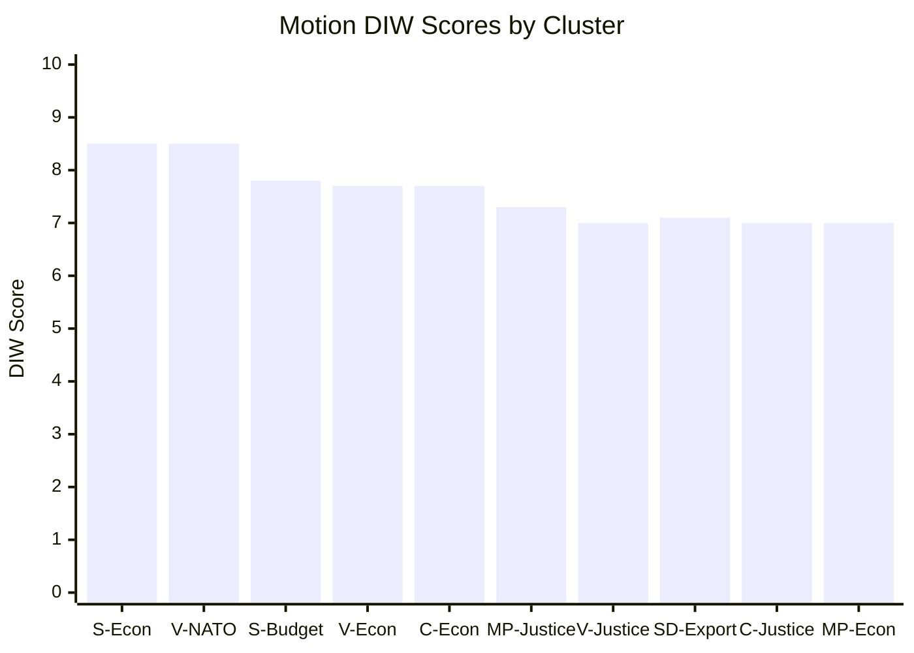

# Significance Scoring — Opposition Motions 2026-04-28

**Author**: James Pether Sörling | **Classification**: PUBLIC

## DIW Score Methodology

Scores 1–10 weighted across: **D**emocratic impact (30%), **I**ntelligence value (40%), **W**eightiness for future monitoring (30%).

## Ranked Scoring Table

| Rank | dok_id | Title | Party | D | I | W | DIW |
|------|--------|-------|-------|---|---|---|-----|
| 1 | HD024101 | Ekonomisk vårproposition — S alternative | S | 9 | 8 | 8 | **8.5** |
| 2 | HD024120 | Avslå NATO Forward Presence Finland | V | 8 | 9 | 8 | **8.5** |
| 3 | HD024100 | Vårändringsbudget 2026 — S alternative | S | 8 | 7 | 8 | **7.8** |
| 4 | HD024108 | Ekonomisk vårproposition — V alternative | V | 8 | 8 | 7 | **7.7** |
| 5 | HD024110 | Ekonomisk vårproposition — C alternative | C | 7 | 8 | 8 | **7.7** |
| 6 | HD024114 | Avslå dubbla straff (gang crime) — MP | MP | 8 | 7 | 7 | **7.3** |
| 7 | HD024107 | Avslå tjänstemannaansvar — V | V | 7 | 7 | 7 | **7.0** |
| 8 | HD024106 | Utvidga vapenexport — SD | SD | 7 | 8 | 6 | **7.1** |
| 9 | HD024111 | Konsekvensanalys dubbla straff — C | C | 7 | 7 | 7 | **7.0** |
| 10 | HD024118 | Ekonomisk vårproposition — MP alternative | MP | 7 | 7 | 7 | **7.0** |
| 11 | HD024115 | Vapenembargo mot krigszoner — MP | MP | 6 | 8 | 6 | **6.8** |
| 12 | HD024102 | Skärpt exportkontroll — V | V | 6 | 7 | 6 | **6.5** |
| 13 | HD024109 | Finanspolitiska ramverket — C | C | 6 | 7 | 6 | **6.5** |
| 14 | HD024119 | Ekonomisk brottslighet + gangstraff — V | V | 6 | 6 | 6 | **6.0** |
| 15 | HD024105 | Avslå miljöpröv.myndighet — V | V | 5 | 6 | 6 | **5.8** |
| 16 | HD024113 | Reformera artskyddet — C | C | 5 | 6 | 6 | **5.8** |
| 17 | HD024112 | Avslå ny straffbestämmelse (tjm) — C | C | 5 | 6 | 5 | **5.5** |
| 18 | HD024116 | Avslå tjänstemannaansvar — MP | MP | 5 | 6 | 5 | **5.5** |
| 19 | HD024117 | EU-statsstödsanalys artskydd — MP | MP | 5 | 5 | 5 | **5.0** |
| 20 | HD024121 | Avslå dubbla straff (gang) — V | V | 5 | 5 | 5 | **5.0** |
| 21 | HD024104 | Vindkraft i kommuner + ersättningsmodell — V | V | 4 | 5 | 5 | **4.7** |
| 22 | HD024122 | Exportkontroll + ny lagstiftning — V | V | 4 | 5 | 5 | **4.7** |
| 23 | HD024103 | Avslå kommunal hamnverksamhet — V | V | 4 | 4 | 5 | **4.4** |
| 24 | HD024123 | Avslå tjänstemannaansvar — V | V | 4 | 4 | 4 | **4.0** |

## Sensitivity Analysis

**Top tier (8.0+)**: HD024101 and HD024120 jointly lead. If NATO FP vote generates media attention, HD024120 would rise to rank 1. Economic motions have inherently broad democratic impact.

**Middle tier (6.0–7.9)**: SD motion HD024106 ranks surprisingly high due to intelligence value — SD is nominally a governing bloc partner yet advocates more permissive arms export beyond government position.

**Lower tier (<6.0)**: Environmental motions have lower immediate electoral salience but cumulate into 2026 election framing.

