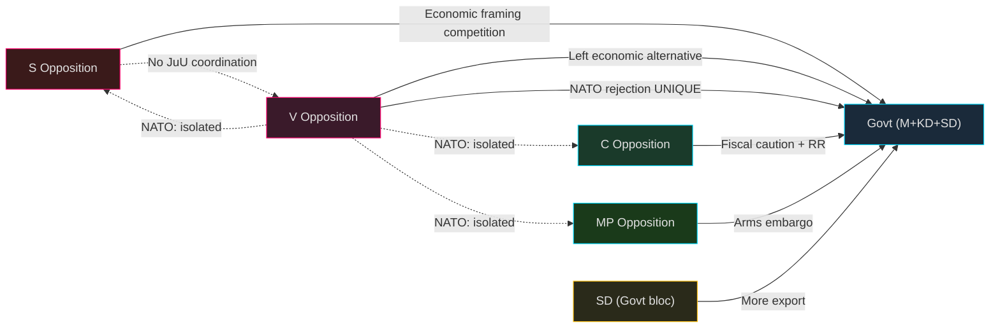

# Stakeholder Perspectives — Opposition Motions 2026-04-28

**Author**: James Pether Sörling | **Classification**: PUBLIC

## 6-Lens Stakeholder Matrix

### 1. Government (Tidö Coalition: M+KD+SD)

**Position**: Proposals are in parliamentary majority's favour; expects all government propositions to pass.
**Interest level**: MEDIUM-HIGH on economic motions (legitimacy); HIGH on NATO FP (prop. 2025/26:220 is a strategic commitment).
**Named actors**: Finance Minister Elisabeth Svantesson (M), Prime Minister Ulf Kristersson (M), Justice Minister Gunnar Strömmer (M).
**Assessment**: Government will use opposition fragmentation as evidence of its own stability. SD's pro-export HD024106 deviates from government position — minor internal tension. [B2]

### 2. Socialdemokraterna (S)

**Position**: HD024100 (Spring Budget) + HD024101 (Spring Econ Prop). "Sverige behöver bli starkt igen" — demand-side economic alternative. Absent from JuU motions.
**Named actors**: Magdalena Andersson (party leader, HD024100 and HD024101 author).
**Assessment**: S is positioning for 2026 election with strong economic framing but deliberately avoiding criminal justice positioning — possibly to avoid endorsing either M's approach or V/MP's opposition. Strategic ambiguity. [A2]

### 3. Vänsterpartiet (V)

**Position**: Most prolific filer (10 motions). Broad left opposition across economics, criminal justice, defence, export, environment.
**Named actors**: Nooshi Dadgostar (economics HD024108, HD024119), Lorena Delgado Varas (NATO HD024120, justice HD024121), Håkan Svenneling (export HD024102), Samuel Gonzalez Westling (HD024107), Birger Lahti (HD024104), Andrea Andersson Tay (HD024105), Malcolm Momodou Jallow (HD024122), Malin Östh (HD024103), Daniel Riazat (HD024123).
**Assessment**: V's NATO position (HD024120) is the most distinctive act of this batch. V will face pressure from S and MP to clarify position. [A1]

### 4. Centerpartiet (C)

**Position**: 5 motions. Economic alternative (HD024109, HD024110) emphasises fiscal responsibility. JuU motions (HD024111, HD024112) seek procedural caution. Species protection (HD024113) aligns with rural constituency.
**Named actors**: Martin Ådahl (HD024109, HD024110), Ulrika Liljeberg (HD024111, HD024112), Helena Lindahl (HD024113).
**Assessment**: C occupies distinctive niche — not the most adversarial opposition but most methodologically rigorous. RR citation (HD024109) shows policy depth. [A1]

### 5. Miljöpartiet (MP)

**Position**: 5 motions. Arms embargo (HD024115), reject double penalties (HD024114), reject civil servant liability (HD024116), EU state aid analysis for artskydd (HD024117), green economic alternative (HD024118).
**Named actors**: Jacob Risberg (HD024115), Ulrika Westerlund (HD024114), Mats Berglund (HD024116), Rebecka Le Moine (HD024117), Daniel Helldén (HD024118).
**Assessment**: MP's arms embargo position (HD024115) is the most activist foreign-policy stance. Green economic framing in HD024118 consistent with party identity. [A1]

### 6. Sverigedemokraterna (SD)

**Position**: 1 motion (HD024106). Pro-expanded arms export — seeks more permissive regime.
**Named actor**: Rasmus Giertz (HD024106).
**Assessment**: SD's single motion is anomalous in the opposition motion batch — SD is part of the governing coalition but files this motion to signal policy divergence from the government on arms export permissiveness. Suggests SD is testing room for deviation. [B2]

## Influence Network

