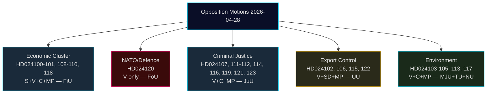

# Synthesis Summary — Opposition Motions 2026-04-28

**Author**: James Pether Sörling
**Date**: 2026-04-29
**Classification**: PUBLIC

---

## Lead Story

The 24 opposition motions filed on 28 April 2026 represent the broadest single-day legislative opposition event of the 2025/26 riksmöte. The dominant story is not any single motion but rather the **structural fragmentation of the opposition**: while all four opposition parties (S, V, C, MP) oppose the government's Spring Economic Proposition (prop. 2025/26:100), they do so from irreconcilable macroeconomic positions — making coordinated blocking in FiU virtually impossible. The government's Tidö coalition (M + KD + SD) holds FiU majority and is expected to prevail on all budget and economic matters.

The strategically isolating moment belongs to V: HD024120 explicitly rejects Sweden's NATO Forward Presence contribution to Finland, placing Vänsterpartiet as the only Riksdag party opposing Sweden's operational NATO commitments post-2024 accession. This is an intelligible policy position for V's base but represents a growing distance from the other opposition parties on security policy.

## Integrated Intelligence Picture

### Cluster 1: Spring Economic Package (FiU — priority)
- **Proposition**: 2025/26:99 (Spring Budget) and 2025/26:100 (Spring Economic Proposition)
- **S response** (HD024100, HD024101): Magdalena Andersson's bloc argues "Sverige behöver bli starkt igen" — demand for economic policy with broader employment ambition; rejects specific radiation authority mandate.
- **V response** (HD024108, Nooshi Dadgostar): Frames government policy as "misslyckad jobbpolitik," advocates redistribution and wages.
- **C response** (HD024109, HD024110, Martin Ådahl): Calls for responsible fiscal consolidation aligned with the fiscal framework; concerned about Riksrevisionen's 2025 report criticisms.
- **MP response** (HD024118, Daniel Helldén): Emphasizes green transformation and household purchasing power.
- **Assessment**: The government's economic programme has political legitimacy from its own majority. Opposition critique is internally inconsistent.

### Cluster 2: Criminal Justice (JuU — high volume)
- **Prop. 2025/26:217** (civil servant liability): V (HD024107, HD024123), C (HD024112), MP (HD024116) all oppose. C partially accepts intent but rejects specific new criminal provision for "missbruk av offentlig ställning."
- **Prop. 2025/26:218** (double gang penalties): MP (HD024114) fully rejects. V (HD024119, HD024121) demands economic crime review and full rejection. C (HD024111) demands consequence analysis before proceeding.
- **Assessment**: Government has M-KD-SD majority in JuU sufficient to pass. Breadth of opposition signals post-passage legal challenges likely.

### Cluster 3: Arms Export Control (UU — polarised)
- **SD (HD024106)**: Wants expanded approval for arms exports — more permissive regime.
- **V (HD024102, HD024122)**: Wants strict controls; government tasked with proposals for enhanced oversight.
- **MP (HD024115)**: Calls for embargo on exports to war zones.
- **Assessment**: Position inversion (SD pro-export, V+MP anti-export) mirrors broader alliance structure. UU will likely endorse government communication without amendment.

### Cluster 4: Defence/NATO (FöU — critical)
- **V (HD024120)**: Explicitly rejects prop. 2025/26:220, Sweden's contribution to NATO's Enhanced Forward Presence in Finland. Motion calls for Riksdag to vote down the proposition.
- **Assessment**: Strategically isolated. No other party supports this rejection. FöU will pass the proposition; the motion will fail. Intelligence value: confirms V's continued pacifist/anti-NATO position despite accession.

### Cluster 5: Environment (MJU)
- **V (HD024105)**: Rejects new environmental review agency (prop. 2025/26:238) — fears weakening of environmental protection.
- **C (HD024113)**: Wants artskydd reformed to reduce private landowner burden.
- **MP (HD024117)**: Wants EU state-aid rule analysis before artskydd payments begin.
- **Assessment**: Cross-cutting environmentalism; no unified opposition position.

## DIW-Weighted Ranking

| # | Cluster | DIW Score | Priority |
|---|---------|-----------|----------|
| 1 | Spring Economic Proposition (S+V+C+MP) | 8.2 | L2+ Priority |
| 2 | NATO Forward Presence rejection (V) | 7.9 | L2+ Priority |
| 3 | Criminal Justice reform opposition | 7.1 | L2 Strategic |
| 4 | Arms Export Control | 6.0 | L2 Strategic |
| 5 | Environmental regulation | 5.2 | L1 Surface |
| 6 | Fiscal framework | 4.8 | L1 Surface |

