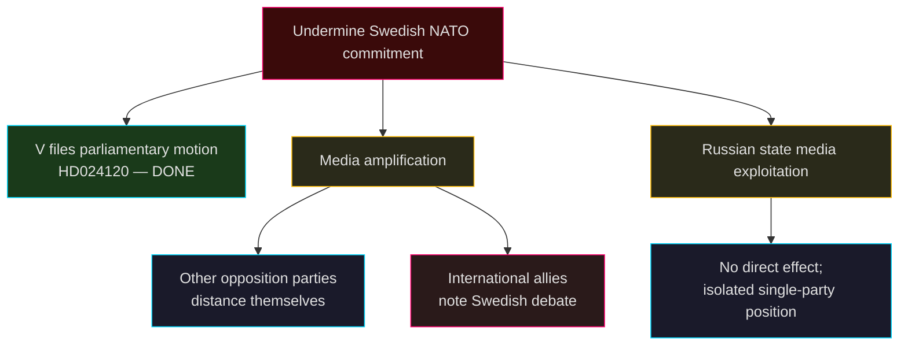

# Threat Analysis — Opposition Motions 2026-04-28

**Author**: James Pether Sörling | **Classification**: PUBLIC

## Political Threat Taxonomy

### Threat Level 1 — Systemic (Low probability, high impact)

**T1-NATO**: Vänsterpartiet's HD024120 constitutes a formal legislative challenge to Sweden's NATO Forward Presence contribution. If the motion gained support from other parties (it will not), it would mark a reversal of Sweden's 2024 NATO accession commitments. Even as an isolated motion, it provides:
- Evidence vector for Russian messaging ("Swedish parliament divided on NATO")
- Domestic tension metric for V coalition viability
- *TTP-style mapping*: Actor V → means: formal parliamentary motion → objective: block NATO commitment → target: prop. 2025/26:220 → effect: reputational damage to Sweden's NATO reliability

### Threat Level 2 — Legislative (Moderate probability, moderate impact)

**T2-JUSTICE**: Combined opposition on criminal justice (V, C, MP filing 8 motions against JuU cluster) could trigger extended committee scrutiny, causing implementation delays for prop. 2025/26:217 and 2025/26:218. C's request for consequence analysis (HD024111) is the most credible blocking mechanism. Risk: if JuU Chair grants extended hearing, timeline slips past summer recess.

**T3-ECONOMIC**: Four-party opposition to the Spring Economic Proposition creates parliamentary theatre that may obscure the government's actual fiscal programme in media coverage. Threat to public understanding of budget policy.

### Threat Level 3 — Operational (High probability, low impact)

**T3-EXPORT**: Arms export debate fragmented across V (restrictive), MP (embargo), SD (expansive) creates no coherent legislative threat but generates ongoing UU procedural burden.

## Attack Tree (T1-NATO)

## MITRE-style TTP Mapping (Political Threat)

| ID | Tactic | Technique | Procedure | Actor | Target |
|----|--------|-----------|-----------|-------|--------|
| T001 | Narrative Disruption | Legislative motion as signal | V files HD024120 to signal anti-NATO stance to voter base | V | Government NATO policy |
| T002 | Legislative Attrition | High-volume motion filing | 24 motions in 1 day across 7 committees | Opposition | Government Spring legislation |
| T003 | Expert Authority Leverage | Riksrevisionen citation | C uses RR skr. 2025/26:241 to challenge fiscal framework | C | Government fiscal credibility |
| T004 | Consequence Risk Framing | Demand for analysis before vote | C requests consequence analysis for HD024111 | C | JuU timetable |
