# Classification Results — Propositioner 2026-04-28

**Author**: James Pether Sörling · **Date**: 2026-04-29

## 7-Dimension Classification

### HD03259 — Nationell transportinfrastrukturplan 2026–2037 [Skr. 2025/26:259]

| Dimension | Classification | Rationale |
|-----------|---------------|-----------|
| Policy domain | Infrastructure / Transport / Climate | Vägar, järnvägar, sjöfart, klimatanpassning [HD03259] |
| Legislative stage | Government communication (Skrivelse) | Kräver riksdagens godkännande; inte proposition med lagstiftning [HD03259] |
| Political salience | HIGH | 875 Mdr kr; valkrets-känslig; partistrategisk [HD03259] |
| Urgency | HIGH | Upphandlingskalendern kräver godkännande vår 2026 [HD03259] |
| GDPR sensitivity | LOW | Inga personuppgifter; infrastrukturdata PUBLIC [HD03259] |
| Retention | 12-year plan horizon; reviewed annually | [HD03259] |
| Access | PUBLIC | Offentlighetsprincipen; data.riksdagen.se [HD03259] |

**Priority tier**: T1 — Omedelbar parlamentarisk uppföljning krävs

### HD03247 — Receptfria läkemedel med krav på rådgivning [Prop. 2025/26:247]

| Dimension | Classification | Rationale |
|-----------|---------------|-----------|
| Policy domain | Health / Pharmaceuticals / Consumer protection | OTC-läkemedel, farmaceutisk rådgivning [HD03247] |
| Legislative stage | Proposition (lagstiftning) | Ändring i läkemedelslagen [HD03247] |
| Political salience | MEDIUM | EU-direktiv; bred parlamentarisk enighet [HD03247] |
| Urgency | MEDIUM | EU-implementeringsdeadline styr [HD03247] |
| GDPR sensitivity | LOW | Anonymiserade farmakologidata [HD03247] |
| Retention | Continuous (läkemedelslag) | |
| Access | PUBLIC | [HD03247] |

**Priority tier**: T2 — Standard utskottsbehandling

### HD03257 — Kommunala lantmäterimyndigheters IT-krav [Prop. 2025/26:257]

| Dimension | Classification | Rationale |
|-----------|---------------|-----------|
| Policy domain | Digital governance / Land administration | IT-system, fastighetssektorn [HD03257] |
| Legislative stage | Proposition (lagstiftning) | Ändring i fastighetsbildningslagen [HD03257] |
| Political salience | LOW | Teknisk-administrativ reglering [HD03257] |
| Urgency | LOW | Kommunala anpassningstider |
| GDPR sensitivity | LOW | Systemkrav, inga personuppgifter i propositionen [HD03257] |
| Retention | Ongoing (kommunal lagstiftning) | |
| Access | PUBLIC | [HD03257] |

**Priority tier**: T3 — Rutinbehandling

```mermaid
%%{init: {"theme": "base", "themeVariables": {"primaryColor": "#0a0e27","primaryTextColor": "#e0e0e0","primaryBorderColor": "#00d9ff","lineColor": "#00d9ff","sectionBkgColor": "#1a1e3d","altSectionBkgColor": "#0a0e27"}}}%%
flowchart LR
    HD03259 -->|T1| Omedelbar
    HD03247 -->|T2| Standard
    HD03257 -->|T3| Rutin
    style HD03259 fill:#ff006e,color:#fff
    style HD03247 fill:#ffbe0b,color:#0a0e27
    style HD03257 fill:#00d9ff,color:#0a0e27
    style Omedelbar fill:#1a1e3d,stroke:#ff006e
    style Standard fill:#1a1e3d,stroke:#ffbe0b
    style Rutin fill:#1a1e3d,stroke:#00d9ff
```

