# Coalition Mathematics — Propositioner 2026-04-28

**Author**: James Pether Sörling · **Date**: 2026-04-29 · **Confidence**: MEDIUM-HIGH

## Riksdagsläget 2025/26 (nuvarande mandat)

Riksdagen: 349 mandat. Majoritetsgräns: 175 mandat.

| Parti | Mandat | Koalition | Anmärkning |
|-------|--------|-----------|------------|
| Moderaterna (M) | 68 | Tidökoalition | Statsministerns parti |
| Sverigedemokraterna (SD) | 73 | Tidökoalition | Externt stödparti |
| Kristdemokraterna (KD) | 19 | Tidökoalition | |
| Liberalerna (L) | 16 | Tidökoalition | |
| **Tidö-total** | **176** | | **+1 över majoritet** |
| Socialdemokraterna (S) | 107 | Opposition | |
| Vänsterpartiet (V) | 24 | Opposition | |
| Miljöpartiet (MP) | 18 | Opposition | |
| Centerpartiet (C) | 24 | Opposition | |
| **Opposition-total** | **173** | | |

## Röstningsanalys per Proposition

### HD03259 — Transportinfrastrukturplan

**Tidökoalitionen: JA** (förväntat, 176 mandat)

| Parti | Ja | Nej | Avstår | Mandat | Notering |
|-------|-----|-----|--------|--------|----------|
| M | 68 | 0 | 0 | 68 | Statsministerns prop |
| SD | 73 | 0 | 0 | 73 | Kräver järnvägstillägg |
| KD | 19 | 0 | 0 | 19 | |
| L | 16 | 0 | 0 | 16 | |
| S | 0 | 107 | 0 | 107 | Egna alternativförslag |
| V | 0 | 24 | 0 | 24 | Mer järnväg, ej kompromiss |
| MP | 0 | 18 | 0 | 18 | Klimatinvändningar |
| C | 0 | 0 | 24 | 24 | Glesbygd-positivt, men partistrategi |
| **Totalt** | **176** | **149** | **24** | **349** | **Antas med 176 röster** |

**Krav för att antas**: Minst 175 Ja-röster (enkel majoritet)
**Utfall**: Antas ✅ — förutsatt att Tidöavtalet håller

### HD03247 — OTC-läkemedelsrådgivning

**EU-direktiv implementering: bred enighet förväntad**

| Parti | Ja | Nej | Mandat |
|-------|-----|-----|--------|
| M | 68 | 0 | 68 |
| SD | 73 | 0 | 73 |
| KD | 19 | 0 | 19 |
| L | 16 | 0 | 16 |
| S | 107 | 0 | 107 |
| V | 0 | 24 | 24 |
| MP | 18 | 0 | 18 |
| C | 24 | 0 | 24 |
| **Totalt** | **325** | **24** | **349** |

**Utfall**: Antas med stor marginal ✅

### HD03257 — Kommunal lantmäteri IT

**Teknisk prop: bred enighet**

| Parti | Ja | Nej | Mandat |
|-------|-----|-----|--------|
| Alla utom V | 325 | 0 | 325 |
| V | 0 | 24 | 24 |
| **Totalt** | **325** | **24** | **349** |

**Utfall**: Antas ✅

## Stresstest: Vad händer om 5 SD-ledamöter röstar emot HD03259?

176 − 5 = 171 Ja < 175 majoritet → **Antas ej**

Risken för SD-defection är låg (<5 %) baserat på partipiskan men ingår i scenario-analysis.md som Scenario 3.

```mermaid
%%{init: {"theme": "base", "themeVariables": {"primaryColor": "#0a0e27","primaryTextColor": "#e0e0e0","primaryBorderColor": "#00d9ff","lineColor": "#ff006e","sectionBkgColor": "#1a1e3d","altSectionBkgColor": "#0a0e27"}}}%%
xychart-beta
    title "Mandatfördelning per röst (HD03259)"
    x-axis ["M", "SD", "KD", "L", "S", "V", "MP", "C"]
    y-axis "Mandat" 0 --> 120
    bar [68, 73, 19, 16, 0, 0, 0, 0]
    bar [0, 0, 0, 0, 107, 24, 18, 0]
    bar [0, 0, 0, 0, 0, 0, 0, 24]
```

