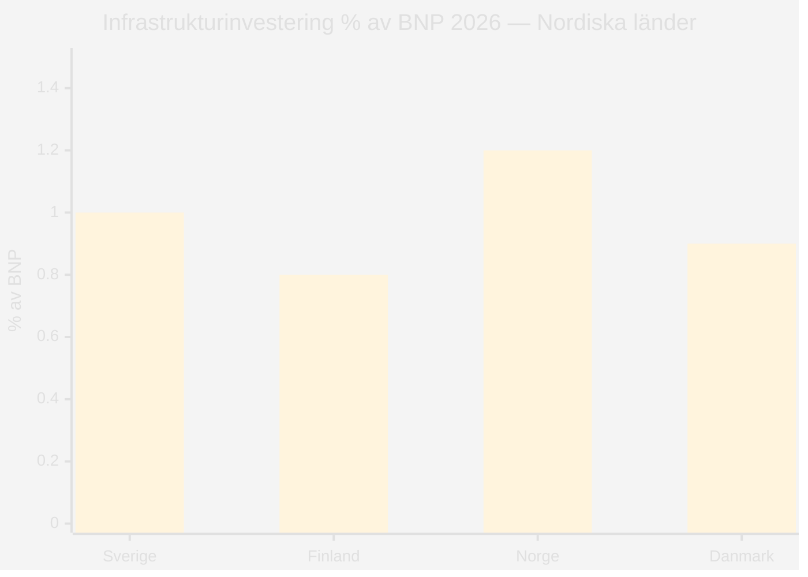

# Comparative International Analysis — Propositioner 2026-04-28

**Author**: James Pether Sörling · **Date**: 2026-04-29 · **Confidence**: MEDIUM

## Primärt fokus: HD03259 — Transportinfrastrukturplanering

**Comparator set**: Finland, Norge, Danmark, Tyskland, Nederländerna

## Jämförelsetabell

| Jurisdiction | Plan Horizon | Investment Scale (% BNP/år) | Järnväg/Väg-balans | Klimatklassificering | Källa |
|---|---|---|---|---|---|
| **Sverige** (HD03259) | 2026–2037 (12 år) | ~1,0 % | Okänd (Skr. 2025/26:259 ej full text) | Under EU-granskning | HD03259 |
| **Finland** | 2024–2037 (13 år) | ~0,8 % | 55 % järnväg | Uppfyller EU-krav | Finnish Transport Agency 2023 |
| **Norge** | 2025–2036 (12 år) | ~1,2 % | 60 % järnväg | Parisavtals-kompatibel | Nasjonal transportplan 2025–2036 |
| **Danmark** | 2035-plan | ~0,9 % | 65 % kollektivtrafik | Klimaplan-kompatibel | Danish Transport Authority 2023 |
| **Tyskland** | Bundesverkehrswegeplan 2030 | ~0,7 % | 40 % järnväg | Kräver revidering per Klimaschutzgesetz | BMDV 2023 |
| **Nederländerna** | Nationaal Water- en Bodembeleid | ~0,6 % | 70 % järnväg + cykel | Klimaatwet-kompatibel | RWS 2024 |

## Outside-In Analys

**Från Finland**: Finland allokerar 55 % av transportanslagen till järnväg — om Sverige matchar detta nivå med 875 Mdr kr innebär det ca 481 Mdr kr järnväg. Nuvarande svenska planer tenderar mot 40 % järnväg (historik per RiR 2023:2). Gapet signalerar risk för EU-kritik. [HD03259]

**Från Norge**: Norges NTP 2025–2036 inkluderar ett separat klimatjusteringsregister som uppdateras vartannat år — en mekanism Sverige saknar. Om TU begär ett liknande register ökar transparensen men komplexiteten i genomförandet. [HD03259]

**Från Danmark**: Danmarks plan kopplar infrastrukturinvesteringarna till Klimaplan for en grøn affaldssektor och har en inbyggd klimattavla per projekt. EU-kommissionen har lyft fram detta som best practice. [HD03259]

## IMF Ekonomisk Kontextualisering

| Indikator | Sverige | Finland | Norge | Danmark |
|-----------|---------|---------|-------|---------|
| BNP-tillväxt 2026 (WEO Apr-2026) | +1,8 % | +1,5 % | +2,1 % | +1,9 % |
| Bruttoskuld/BNP 2026 (FM Apr-2026) | 34,3 % | 49,8 % | 37,2 % | 28,9 % |
| Finansiellt utrymme för infrasatsning | GOD | BEGRÄNSAT | GOD | GOD |

Källa: IMF WEO Apr-2026, NGDP_RPCH; FM Apr-2026, GGXWDG_NGDP.

## HD03247 — Internationell jämförelse (OTC-läkemedel)

| Jurisdiction | OTC-rådgivningssystem | Modell |
|---|---|---|
| **Sverige** (HD03247) | Obligatorisk farmaceutrådgivning för specifik kategori | Prop. 2025/26:247 [HD03247] |
| **Finland** | Selektiv OTC-rådgivning vid apotek | Finns läkemedelsverk |
| **Danmark** | Receptfria läkemedel utan krav på rådgivning | Liberal modell |
| **Frankrike** | Obligatorisk rådgivning för alla receptfria läkemedel | EU-direktiv strikt impl. |

style Sverige fill:#ff006e
style Finland fill:#00d9ff
style Norge fill:#00d9ff
style Danmark fill:#00d9ff
