# Cross-Reference Map — Propositioner 2026-04-28

**Author**: James Pether Sörling · **Date**: 2026-04-29

## Policy Clusters

### Kluster 1: Nationell transportinfrastruktur

- **Primärdokument**: HD03259 (Skr. 2025/26:259) — Nationell plan 2026–2037
- **Relaterade riksdagsdokument**: TU:s pågående beredning; riksdagsmotion om järnvägssatsningar (se data.riksdagen.se för motioner 2025/26)
- **Budgetanknytning**: Prop. 2025/26:1 (statsbudgeten 2026 — infrastrukturanslag)
- **EU-rättslig anknytning**: TEN-T Regulation (EU) 2021/1153; Fit for 55; EU Climate Law

### Kluster 2: Läkemedelssäkerhet och apotekstillstånd

- **Primärdokument**: HD03247 (Prop. 2025/26:247) — OTC-läkemedel rådgivning
- **Relaterade riksdagsdokument**: Prop. 2015/16:89 (apotekstillståndslagstiftning — föregångare)
- **EU-rättslig anknytning**: EU-direktiv om receptfria läkemedel (direktiv implementeras via propositionen)
- **Myndighetskoppling**: Läkemedelsverket, Socialstyrelsen

### Kluster 3: Digital kommunal förvaltning

- **Primärdokument**: HD03257 (Prop. 2025/26:257) — Lantmäteri IT-krav
- **Relaterade riksdagsdokument**: Fastighetsbildningslagen; Lantmäteriets digitaliserings-strategi
- **Myndighetskoppling**: Lantmäteriet (centralt), ~40 kommunala lantmäterimyndigheter
- **EU-rättslig anknytning**: INSPIRE-direktivet (geodata interoperabilitet)

## Legislative Chains

```mermaid
%%{init: {"theme": "base", "themeVariables": {"primaryColor": "#0a0e27","primaryTextColor": "#e0e0e0","primaryBorderColor": "#00d9ff","lineColor": "#00d9ff","sectionBkgColor": "#1a1e3d","altSectionBkgColor": "#0a0e27"}}}%%
flowchart LR
    EU_TEN_T[EU TEN-T 2021/1153] --> HD03259
    EU_Fit55[EU Fit for 55] --> HD03259
    EU_Pharma[EU OTC-direktiv] --> HD03247
    EU_INSPIRE[EU INSPIRE-direktiv] --> HD03257
    HD03259 --> TU_betankande[TU Betänkande 2026]
    HD03247 --> SoU_betankande[SoU Betänkande 2026]
    HD03257 --> CU_betankande[CU Betänkande 2026]
    style HD03259 fill:#ff006e,color:#fff
    style HD03247 fill:#ffbe0b,color:#0a0e27
    style HD03257 fill:#00d9ff,color:#0a0e27
    style EU_TEN_T fill:#1a1e3d,stroke:#00d9ff
    style EU_Fit55 fill:#1a1e3d,stroke:#00d9ff
    style EU_Pharma fill:#1a1e3d,stroke:#ffbe0b
    style EU_INSPIRE fill:#1a1e3d,stroke:#00d9ff
```

## Coordinated Activity Patterns

- **Infrastruktur + lantmäteri**: Fastighetssektorn gynnas dubbelt av HD03259 (förbättrade transporter) och HD03257 (effektivare lantmäteribeslut) — koordinerad digital förvaltningsagenda [HD03259][HD03257]
- **Tidöavtalet-koherens**: Tre propositioner publiceras dagen efter varandra (28 april) — samordnad kommunikationsstrategi från Landsbygds- och infrastrukturdepartementet [HD03257][HD03259]
