# Devil's Advocate — Propositioner 2026-04-28

**Author**: James Pether Sörling · **Date**: 2026-04-29 · **Confidence**: MEDIUM

## ACH-matris: Competing Hypotheses

### Hypothesis H1: Transportplanen är primärt ett valinstrument, inte en infrastrukturplan

**Påstående**: HD03259 syftar till att konsolidera M + SD-koalitionens väljarbas inför 2026 snarare än att optimera infrastrukturutfall.

**Argument för H1**:
- Skrivelsen publiceras 5 månader före sista valmöjlighet 2026 — optimalperiod för vallöfteseffekt [HD03259]
- Saknar granskning av Riksrevisionen vid antagandet [HD03259]
- 875 Mdr kr är ett avrundningstal som inte härstammar från Trafikverkets tekniska analyser

**Argument mot H1**:
- Trafikverkets NTP-underlag 2026 kräver faktisk beredning (minst 18 månader) — för komplex för ren PR [HD03259]
- Infrastrukturplaner är juridiskt bindande för upphandlingar

**ACH-bedömning**: H1 har visst stöd men är inte dominerande — blandmotiv är mer troligt.

---

### Hypothesis H2: OTC-rådgivningskravet (HD03247) är en kapitalöverföring till apotekskedjorna

**Påstående**: HD03247 är en indirekt subvention till etablerade apoteksaktörer som höjer inträdeskostnaderna för digitala/lågpriskonkurrenter.

**Argument för H2**:
- Obligatorisk farmaceutisk rådgivning kräver fysisk närvaro och utbildad personal — gynnar Apoteket AB och Apotek Hjärtat [HD03247]
- Nätapotek utan fysisk disk kan tvingas ändra sin affärsmodell

**Argument mot H2**:
- EU-direktiv styr kravnivån — Sverige kan inte unilateralt sänka den [HD03247]
- Patientsäkerhetsmotivet är dokumenterat (felkonsumtion av OTC-läkemedel)

**ACH-bedömning**: H2 har lågt bevisstöd; EU-direktiv minskar utrymmet för nationell protektionism.

---

### Hypothesis H3: IT-kravet i HD03257 centraliserar makt från kommuner till staten

**Påstående**: HD03257 minskar kommunernas frihet att välja egna IT-lösningar och skapar statlig kontroll över fastighetsdata.

**Argument för H3**:
- Standardiseringskrav favoriserar leverantörer som uppfyller Lantmäteriets specifikationer [HD03257]
- Kommuner med fungerande system tvingas migrera

**Argument mot H3**:
- Interoperabilitet är ett gemensamt intresse; Lantmäteriet är inte ett polisiärt organ [HD03257]
- INSPIRE-direktivet kräver dessa standarder oberoende av propositionen

**ACH-bedömning**: H3 är överdrivet; faktisk centraliseringseffekt är begränsad.

## Red-Team Challenge

Om analysen i executive-brief är korrekt att HD03259 är bred och koalitionssäker — varför publiceras den som skrivelse (skr) och inte som proposition? Skrivelsens svagare parlamentariska status ger riksdagen möjlighet att markera utan att fälla Regeringen. **Röd teamsvar**: Infrastrukturplaner är traditionsvis skrivelser för att bevara budgetflexibilitet — det är konstitutionellt praxis, inte en politisk försvagning.

## Rejected Alternatives

- **Alt A**: Att lansera ERTMS-utbyggnad som enskild proposition istället för skrivelse — förkastas; ERTMS är delmängd av transportplanen
- **Alt B**: Kombinera HD03247 och HD03257 till en förvaltningsprop — förkastas; separat departementstillhörighet

```mermaid
%%{init: {"theme": "base", "themeVariables": {"primaryColor": "#0a0e27","primaryTextColor": "#e0e0e0","primaryBorderColor": "#00d9ff","lineColor": "#ff006e","sectionBkgColor": "#1a1e3d","altSectionBkgColor": "#0a0e27"}}}%%
flowchart LR
    H1[H1: Valinstrument] -->|Lågt stöd| ACH1[Delvis sannolikt]
    H2[H2: Kapitalöverföring apotek] -->|Mycket lågt stöd| ACH2[Osannolikt]
    H3[H3: Centralisering lantmäteri] -->|Lågt stöd| ACH3[Osannolikt]
    style H1 fill:#ffbe0b,color:#0a0e27
    style H2 fill:#00d9ff,color:#0a0e27
    style H3 fill:#00d9ff,color:#0a0e27
    style ACH1 fill:#1a1e3d,stroke:#ffbe0b
    style ACH2 fill:#1a1e3d,stroke:#00d9ff
    style ACH3 fill:#1a1e3d,stroke:#00d9ff
```

