# HD03247 — Dokumentanalys

**Beteckning**: Prop. 2025/26:247  
**Utskott**: SoU (Socialutskottet)  
**Ansvarig minister**: Jakob Forssmed (KD), Socialdepartementet  
**Dok_id**: HD03247  
**Datum**: 2026-04-28  
**Analystatus**: Metadata-only (fulltext ej tillgänglig via MCP)

## Sammanfattning

Prop. 2025/26:247 implementerar EU-direktiv om receptfria (OTC) läkemedel och introducerar obligatorisk farmaceutisk rådgivning vid köp. Förslaget är i hög grad direktivstyrt och saknar ett nationellt handlingsutrymme.

## Dokumentklassificering

- **Typ**: Proposition (implementering av EU-direktiv)
- **Komplexitet**: L2 Standard
- **Urgency**: MEDIUM (EU-direktiv, deadline)
- **Politisk signifikans**: LÅG-MEDIUM

## Juridisk analys

- Implementerar EU OTC-direktiv (antaget 2024, implementeringsfrist 2026)
- Ändrar troligen Lag (2009:730) om handel med läkemedel
- Läkemedelsverket (LMV) ges tillsynsansvar
- Straffbestämmelser troligen via befintlig läkemedelslagstiftning

## Berörda aktörer

| Aktör | Roll | Förväntad reaktion |
|-------|------|-------------------|
| Apoteket AB | Dominerande aktör | Positiv |
| Apotek Hjärtat | Stor aktör | Neutral till positiv |
| FASS | Informationskälla | Neutral |
| Läkemedelsverket | Tillsyn | Positiv |
| Apotekarsocieteten | Branschorganisation | Positiv |
| Glesbygdsboende | Slutkonsumenter | Viss oro om tillgång |

## Genomförandekonsekvenser

1. Apotekens bemanningsplanering påverkas (tid per kundmöte ökar)
2. Farmaceutisk kompetens krävs på alla expeditioner → inga automater utan personal
3. Nätapotek måste erbjuda digital rådgivning — potentiellt teknologisk innovation
4. Trolig implementeringstid: 18–24 månader post-antagande

## Key Gaps (PIR)

- Exakt lista av OTC-läkemedel som berörs av krav
- Rådgivningsscript eller miniminivå (definieras i föreskrift, ej prop)
- Sanktionsregim

```mermaid
%%{init: {"theme": "base", "themeVariables": {"primaryColor": "#0a0e27","primaryTextColor": "#e0e0e0","primaryBorderColor": "#00d9ff","lineColor": "#ff006e","sectionBkgColor": "#1a1e3d","altSectionBkgColor": "#0a0e27"}}}%%
flowchart LR
    EU[EU OTC-direktiv] --> HD03247[Prop 2025/26:247 HD03247]
    HD03247 --> LMV[Läkemedelsverket tillsyn]
    HD03247 --> Apotek[1400+ apotek]
    Apotek --> Pat[Patientsäkerhet ↑]
    style EU fill:#1a1e3d,stroke:#00d9ff
    style HD03247 fill:#ff006e,color:#fff
    style LMV fill:#1a1e3d,stroke:#ffbe0b
    style Apotek fill:#1a1e3d,stroke:#00d9ff
    style Pat fill:#00d9ff,color:#0a0e27
```

