# HD03259 — Dokumentanalys

**Beteckning**: Skr. 2025/26:259  
**Utskott**: TU (Trafikutskottet)  
**Ansvarig minister**: Andreas Carlson (KD) + Ulf Kristersson (M, Statsminister)  
**Dok_id**: HD03259  
**Datum**: 2026-04-28  
**Analystatus**: Metadata-only (fulltext ej tillgänglig via MCP)  
**Dokumenttyp**: Skrivelse (skr) — ej proposition

## Sammanfattning

Skr. 2025/26:259 presenterar den nationella infrastrukturplanen 2026–2037 med en total ram på 875 miljarder kronor. Det är den mest finansiellt betydande dokumentet i detta dataset och klassificeras som L3 Intelligence-grade.

## Dokumentklassificering

- **Typ**: Skrivelse (riksdagen bemyndigas att ta ställning, ej lagstiftning direkt)
- **Komplexitet**: L3 Intelligence-grade
- **Urgency**: HÖG
- **Politisk signifikans**: KRITISK

## Ekonomisk analys

### Finansiell ram: 875 Mdr kr / 12 år = ~73 Mdr kr/år

IMF WEO Apr-2026 referensdata:
- SWE NGDP_RPCH 2026: +1,8 % real BNP-tillväxt
- SWE GGXWDG_NGDP 2026: 34,3 % (skuld/BNP — låg; budgetutrymme finns)
- SWE PCPIPCH 2026 (beräknat): ~2,9 %
- Bygginflationsrisk: KPI ×2–3 = ~6–9 % för infrastruktur

**Realt 2037-värde om 7 % byggkostnadsinflation per år**:
875 Mdr × (1 + 0,07)^−6 ≈ 585 Mdr kr i 2026-pengar

→ Effektivt 875 Mdr kr är realt ~585–700 Mdr kr beroende på inflationsindex.

### Projektprioriteringar (preliminärt, baserat på NTP-tradition)

| Kategori | Uppskattad andel | Belopp |
|----------|-----------------|--------|
| Järnväg (underhåll + nytt) | 45–50 % | 393–438 Mdr |
| Väg (underhåll + nytt) | 30–35 % | 263–306 Mdr |
| Digitalisering & ERTMS | 5–8 % | 44–70 Mdr |
| Hamninfrastruktur | 3–5 % | 26–44 Mdr |
| Regelverk & övrigt | 5 % | 44 Mdr |

*OBS: Fördelningen är uppskattad — exakta tal kräver fulltext av skrivelsen*

## Politisk analys

### Koalitionsinterna krav

**SD**: Kräver synlig järnvägssatsning — minst 30–40 Mdr järnvägstillägg jämfört med NTP 2022–2033
**M**: Vill visa "handlingskraft" inför valet
**KD**: Ministerns (Carlson) signaturdokument
**L**: Sekundärt engagemang; frihandelsperspektiv på transportkorridorer

### Oppositionsinvändningar

**S**: Alternativplan med mer järnväg; vägkritik
**V**: Klimatomsällningsnarrativ; mer kollektivtrafik
**MP**: Koldioxidbudget-argument; väg vs. järnväg
**C**: Glesbygdspositiv men partitaktisk osäkerhet

## EU-kontext

- TEN-T Core Network: Sverige är nod för Nordisk-Baltisk korridor och Skandinavisk-Medelhavskorridoren
- ERTMS utbyggnad: EU kräver färdigställande på huvudlinjer till 2040
- Shift2Rail: EU-ramprogram för järnvägsinnovation — Sverige är aktiv deltagare

## Risker

| Risk | Sannolikhet | Konsekvens |
|------|-------------|------------|
| Bygginflation överskrider ram | 65 % | Projektnedskärningar |
| SD kräver mer järnväg än budgeterat | 30 % | Koalitionskris |
| Ny Regering 2026 reviderar planen | 25 % | Planomstart |
| EU-krav fordrar omprioriteringar | 20 % | Planjustering |

```mermaid
%%{init: {"theme": "base", "themeVariables": {"primaryColor": "#0a0e27","primaryTextColor": "#e0e0e0","primaryBorderColor": "#00d9ff","lineColor": "#ff006e","sectionBkgColor": "#1a1e3d","altSectionBkgColor": "#0a0e27"}}}%%
flowchart TD
    subgraph Finansiell ram
        F875[875 Mdr kr 2026-2037]
        F875 --> Jarnvag[Järnväg ~45% = ~394 Mdr]
        F875 --> Vag[Väg ~32% = ~280 Mdr]
        F875 --> ERTMS[ERTMS ~6% = ~53 Mdr]
        F875 --> Ovrigt[Övrigt ~17% = ~148 Mdr]
    end
    subgraph Koalitionsläge
        M[M 68 mandat] --> Ja[JA]
        SD[SD 73 mandat] --> Ja
        KD[KD 19 mandat] --> Ja
        L[L 16 mandat] --> Ja
        Ja --> Total[176 Ja = Antas]
    end
    style F875 fill:#ff006e,color:#fff
    style Total fill:#00d9ff,color:#0a0e27
    style Jarnvag fill:#1a1e3d,stroke:#00d9ff
    style Vag fill:#1a1e3d,stroke:#ffbe0b
    style ERTMS fill:#1a1e3d,stroke:#ff006e
```

