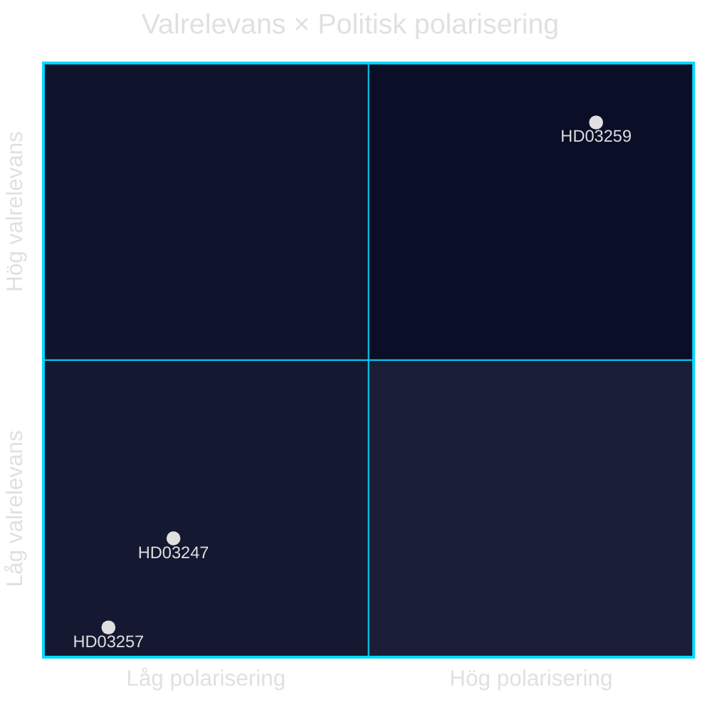

# Election 2026 Analysis — Propositioner 2026-04-28

**Author**: James Pether Sörling · **Date**: 2026-04-29 · **Confidence**: MEDIUM

## Electoral Relevance Summary

Samtliga tre propositioner/skrivelser har koppling till valet 2026 men med varierande direkt valrelevans.

### HD03259 — Transportinfrastrukturplan 2026–2037 (Mycket hög valrelevans)

**Politisk positionering**:
- Koalitionen (M+SD+KD+L) presenterar 875 Mdr kr som "den mest ambitiösa infrastruktursatsning i modern tid"
- S och V antas kräva högre järnvägsandel; MP kräver klimatprofilering
- Geografisk fördelning av investeringarna avgörande för Sverigedemokraternas regionala väljarbase

**Opinionseffekter** (uppskattade):
- Satsning på norra Sverige (E4 Sundsvall-Härnösand, Norrbotniabanan) → +2–3 % SD i Norrland
- ERTMS-utbyggnad → neutral till lätt positiv för M
- Järnvägsmissnöje → risk för oppositionens M→S switchers om satsning ses som vägtung

### HD03247 — OTC-läkemedelsrådgivning (Låg direkt valrelevans)

**Politisk positionering**:
- Jakob Forssmed (KD) genomför EU-direktivet — inga politiska vinnare eller förlorare
- Apotekstillgång i glesbygd är ett latent väljarärende (SD och C-fråga)

### HD03257 — Kommunalt lantmäteri IT (Negligerbar valrelevans)

**Politisk positionering**:
- Teknisk-administrativ reform, inga direkta väljareffekter
- Kan indirekt mobilisera kommunalt kritiska röster om IT-kostnader läggs på kommunskatten

## Mandatpåverkan (indirekta effekter)

| Parti | Effekt av HD03259 | Effekt av HD03247 | Netto 2026 |
|-------|-------------------|-------------------|------------|
| M | Lätt positiv (infrastrukturprofil) | Neutral | +0,3 % |
| SD | Positiv om järnväg > 250 Mdr | Neutral | +0,5–1,0 % |
| KD | Neutral | Positiv (KD-minister) | +0,2 % |
| L | Neutral (liberalt frihandelsarg) | Neutral | 0 % |
| S | Negativ (opposition) | Neutral | −0,5 % |
| V | Negativ (vill ha mer järnväg) | Neutral | −0,2 % |
| MP | Negativ om vägandel hög | Neutral | −0,3 % |
| C | Positiv (glesbygd-väg) | Neutral | +0,2 % |

## Valstrategiska observationer

1. Transportplanen är ett **anchor issue** för M och SD — om den antas Q3 2026 stärker den koalitionens narrativ inför höstvalet
2. Oppositionens motstrategier förväntas fokusera på **klimatprofil** (MP/V) och **järnvägsandel** (S/V)
3. Genomföranderisk (inflation, byggtider) kan bli **valvapen** om delar av planen förskjuts före valet

