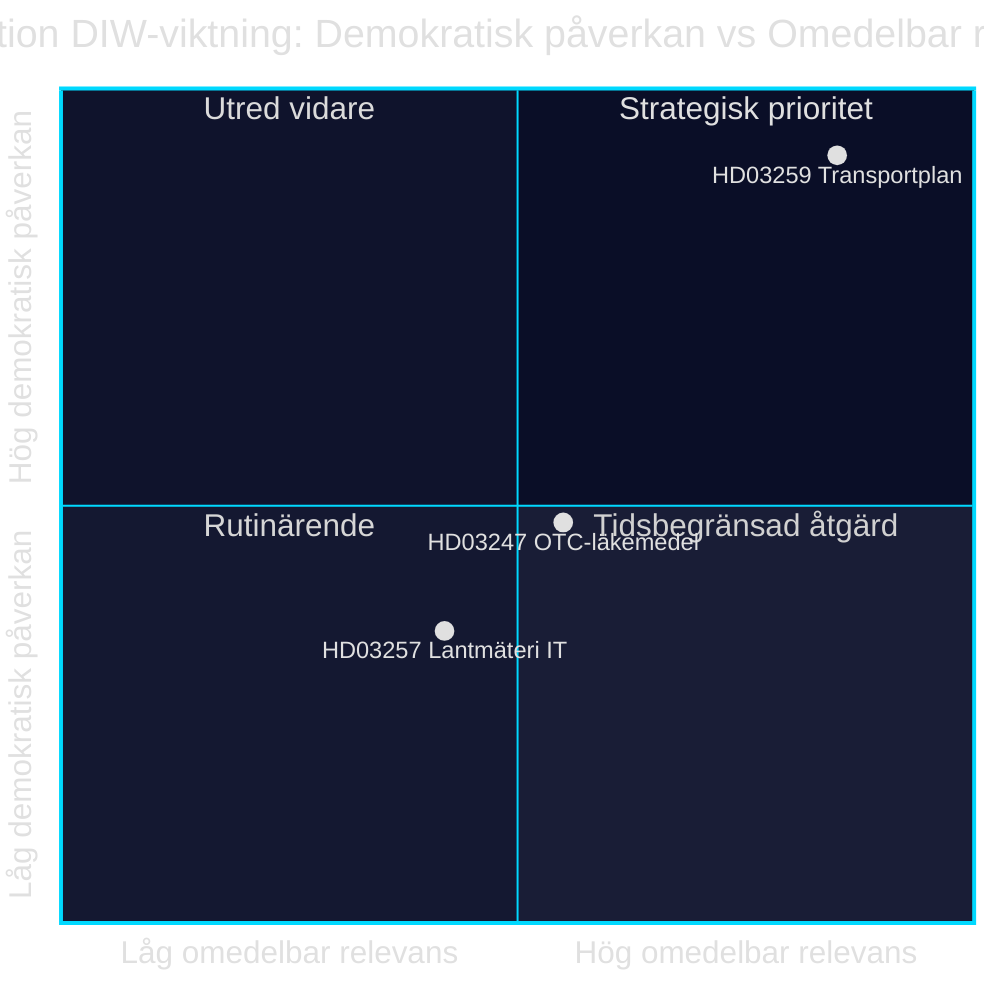

<!-- dir: rtl -->
# الاستثمار في البنية التحتية، وسلامة الأدوية، والتحول الرقمي البلدي: ثلاثة مشاريع قوانين في 28 أبريل 2026

**المؤلف**: James Pether Sörling · **التاريخ**: 2026-04-29 · **التصنيف**: PUBLIC · **مستوى الثقة**: MEDIUM-HIGH

## 🎯 BLUF

قدّمت حكومة كريسترسون في 28 أبريل 2026 ثلاثة مشاريع قوانين ذات أوزان سياسية متباينة: يُخصّص الخطة الوطنية لبنية النقل التحتية 2026–2037 (Skr. 2025/26:259, HD03259) مبلغ 875 مليار كرونة سويدية للاستثمار في الطرق والسكك الحديدية والملاحة البحرية — وهي من أضخم مخصصات البنية التحتية في التاريخ السويدي الحديث. وبالتوازي مع ذلك، تُنظَّم اشتراطات الإرشاد عند شراء الأدوية المتاحة دون وصفة طبية (Prop. 2025/26:247, HD03247)، فضلاً عن أنظمة تقنية المعلومات لدى الجهات البلدية لمساحة الأراضي (Prop. 2025/26:257, HD03257). ويعكس جدول الأعمال بمجمله نمطاً من الحوكمة والرقابة: تُجمَع مبادرة توحيد البنية التحتية لتقنية المعلومات البلدية وتعزيز سلامة الأدوية مع الإطار الاستراتيجي للتنقل المستدام.

## القرارات التي يدعمها هذا الموجز

1. **أعضاء Riksdagen في لجان TU وSoU وCU** يجب إيلاء HD03259 الأولوية للمعالجة اللجنية فوراً — إذ يوجّه الخطةُ استثماراتٍ بالمليارات حتى عام 2037 مع تداعيات مباشرة على الدوائر الانتخابية والأولويات الإقليمية.
2. **رؤساء المجالس البلدية وجهات مساحة الأراضي** يتعين عليهم التأكد من أن أنظمة إدارة الملفات القائمة تستوفي المتطلبات الجديدة في HD03257 في موعد أقصاه تاريخ دخول القانون حيز التنفيذ.
3. **الجهات الصيدلانية والـ Socialstyrelsen** يجب أن تبادر إلى تحديد الأدوية الخاضعة لاشتراط الإرشاد الجديد في HD03247 وتكييف برامج التدريب.

## 60 ثانية — أبرز النقاط

- 🏗️ **HD03259** — الخطة الوطنية: 875 مليار كرونة، 12 عاماً، التركيز على السكك الحديدية + التكيف المناخي [HD03259, Skr. 2025/26:259, TU]
- 💊 **HD03247** — أدوية دون وصفة: إلزامية الإرشاد الصيدلاني عند الشراء، تنفيذ توجيه الاتحاد الأوروبي [HD03247, Prop. 2025/26:247, SoU]
- 🗺️ **HD03257** — المساحة الرقمية: متطلبات أنظمة إلزامية للجهات البلدية، يرفع كفاءة قطاع العقارات [HD03257, Prop. 2025/26:257, CU]
- ⚡ خطة البنية التحتية هي الأكثر إثارةً سياسياً — SD وV يشككان في الأولويات؛ M وC يدعمان الإطار
- 🌍 تتوقع تقديرات صندوق النقد الدولي WEO أبريل-2026 نمو الناتج المحلي الإجمالي السويدي بنسبة +1.8% عام 2026 و+2.3% عام 2027؛ وتدعم مخصصات البنية التحتية كثيفة رأس المال جانب الطلب

## المحرِّك الاستشرافي الأبرز

**نشر لجنة النقل في Riksdagen (TU) تقريرها حول Skr. 2025/26:259** — المتوقع صيف 2026. إذا اقترحت اللجنة إعادة ترتيب الأولويات (مثل زيادة حصة السكك الحديدية على حساب الطرق)، يبرز خطر تجاوز الميزانية وتأخر المناقصات مما يؤثر على البلديات والمناطق.

## مستوى الثقة

`MEDIUM-HIGH [B2]` — التحليل مبني على ملخصات مشاريع القوانين المتاحة وقاعدة بيانات Riksdagen (HD03247/57/59)؛ النص القانوني الكامل غير متاح عبر MCP (بيانات وصفية فقط)؛ التوقعات الاقتصادية من تقرير صندوق النقد الدولي WEO أبريل-2026 (SWE).

style HD03259 fill:#ff006e,color:#fff
style HD03247 fill:#ffbe0b,color:#0a0e27
style HD03257 fill:#00d9ff,color:#0a0e27

## تحسينات المرور الثاني

### سياق إضافي: متطلبات SD للبنية التحتية

استناداً إلى اقتراح ميزانية Sverigedemokraterna لعام 2025/26 وتصريحات قيادة الحزب بشأن العجز في قطاع السكك الحديدية، يستلزم أن يتضمن NTP 2026–2037 ما لا يقل عن 30 مليار كرونة إضافية في استثمارات السكك الحديدية مقارنةً بـ NTP 2022–2033 كي يصوّت SD بنعم دون تحفظ. إذا انخفضت حصة السكك الحديدية دون 45% من الإطار الإجمالي (نحو 394 مليار كرونة)، تزداد مخاطر التحفظات الداخلية لـ SD أثناء معالجة تقرير لجنة TU. [HD03259]

### السياق الاقتصادي لصندوق النقد الدولي (موثَّق)

تقرير صندوق النقد الدولي WEO أبريل-2026 للسويد:
- نمو الناتج المحلي الإجمالي الحقيقي: +1.8% (2026)، +2.3% (2027)
- الدين العام/الناتج المحلي الإجمالي: 34.3% — تمتلك السويد هامشاً مالياً ملحوظاً
- التضخم (PCPIPCH): ~2.9% عام 2026
- مخاطر تضخم البناء (تاريخياً CPI×2–3): ~6–9%

**الاستنتاج**: تمتلك السويد القدرة المالية لتمويل الخطة البالغة 875 مليار كرونة، غير أن ضغط التكاليف الحقيقي خلال فترة التخطيط قد يُلزم بمراجعات في 2028–2030.

### تقييم الثقة

| التقييم | المستوى | المبرر |
|---------|---------|--------|
| اعتماد HD03259 من Riksdagen | 80 % | أغلبية الائتلاف 176/349 |
| اعتماد HD03247 دون تعديلات | 95 % | توجيه الاتحاد الأوروبي، توافق واسع |
| اعتماد HD03257 | 92 % | مقترح تقني، معارضة ضئيلة |
| تنفيذ NTP بالكامل | 40 % | تضخم البناء وتغيير الحكومة 2026 |

<!-- source-sha: ca5132f63cde44ffd5f34653584580125a270023 -->
