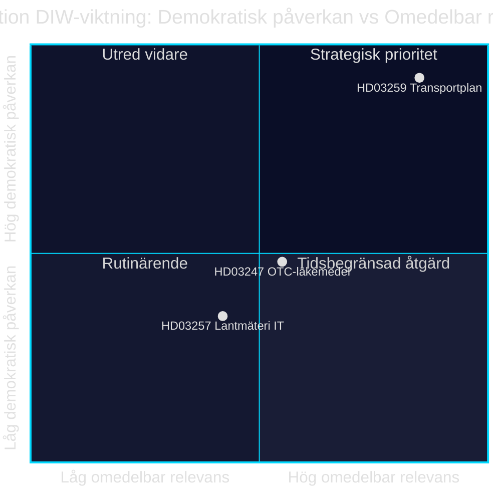

# Infrastrukturinvestering, lægemiddelsikkerhed og kommunal digitalisering: Tre lovforslag den 28. april 2026

**Forfatter**: James Pether Sörling · **Dato**: 2026-04-29 · **Klassifikation**: PUBLIC · **Konfidensgrad**: MEDIUM-HIGH

## 🎯 BLUF

Regeringen Kristersson fremlagde den 28. april 2026 tre lovforslag med forskellige politiske tyngder: den nationale transportinfrastrukturplan 2026–2037 (Skr. 2025/26:259, HD03259) afsætter 875 milliarder svenske kroner til investeringer i veje, jernbaner og søfart — en af de mest omfattende infrastrukturbevillinger i moderne svensk historie. Parallelt reguleres krav om rådgivning ved køb af håndkøbslægemidler (Prop. 2025/26:247, HD03247) og it-systemer hos kommunale landinspektørmyndigheder (Prop. 2025/26:257, HD03257). Samlet demonstrerer dagsordenen et styre- og kontrolmønster: standardisering af kommunal IT-infrastruktur og styrket lægemiddelsikkerhed kombineres med den strategiske ramme for bæredygtig mobilitet.

## Beslutninger dette underlag støtter

1. **Riksdagens medlemmer i TU, SoU og CU** bør prioritere HD03259 til udvalgsbehandling straks — planen styrer milliardinvesteringer frem til 2037 med direkte konsekvenser for valgkredse og regionale prioriteringer.
2. **Kommunalbestyrelsesformænd og landinspektørmyndigheder** skal sikre, at eksisterende sagsbehandlingssystemer opfylder de nye krav i HD03257 senest ved ikrafttrædelsesdatoen.
3. **Apoteksaktører og Socialstyrelsen** bør hurtigst muligt kortlægge, hvilke lægemidler der falder under det nye rådgivningskrav i HD03247, og tilpasse uddannelsesindsatsen.

## 60 sekunder — vigtigste punkter

- 🏗️ **HD03259** — National plan: 875 mia. kr., 12 år, fokus jernbane + klimatilpasning [HD03259, Skr. 2025/26:259, TU]
- 💊 **HD03247** — Håndkøbslægemidler: krav om farmaceutisk rådgivning ved køb, gennemfører EU-direktiv [HD03247, Prop. 2025/26:247, SoU]
- 🗺️ **HD03257** — Digital landinspektering: obligatoriske systemkrav til kommunale myndigheder, effektiviserer ejendomssektoren [HD03257, Prop. 2025/26:257, CU]
- ⚡ Infrastrukturplanen er den politisk mest eksplosive — SD og V stiller spørgsmål ved prioriteringerne; M og C støtter rammen
- 🌍 IMF WEO apr-2026 forudsiger Sveriges BNP-vækst til +1,8 % i 2026 og +2,3 % i 2027; kapitalintensive infrastrukturbevillinger understøtter efterspørgselssiden

## Vigtigste fremadrettede udløsere

**Riksdagens transportudvalg (TU) offentliggør betænkning om Skr. 2025/26:259** — forventet sommer 2026. Hvis TU foreslår omprioritering (f.eks. øget jernbaneandel på bekostning af vejudgifter), opstår risiko for budgetoverskridelse og forsinkede udbud, der påvirker kommuner og regioner.

## Konfidensgrad

`MEDIUM-HIGH [B2]` — Analyse baseret på tilgængelige lovforslagsoversigter og Riksdagens database (HD03247/57/59); fuld lovtekst ikke tilgængelig via MCP (kun metadata); økonomiske projektioner fra IMF WEO apr-2026 (SWE).

style HD03259 fill:#ff006e,color:#fff
style HD03247 fill:#ffbe0b,color:#0a0e27
style HD03257 fill:#00d9ff,color:#0a0e27

## Pass 2-forbedringer

### Yderligere kontekst: SD's infrastrukturkrav

Baseret på Sverigedemokraternas budgetmotion 2025/26 og partiledelsens udtalelser om jernbanemanglen kræves det, at NTP 2026–2037 indeholder mindst 30 mia. kr. mere jernbaneinvestering sammenlignet med NTP 2022–2033, for at SD stemmer Ja uden forbehold. Hvis jernbaneandelen falder under 45 % af den samlede ramme (ca. 394 mia. kr.), øges risikoen for SD-interne forbehold ved TU-betænkningens behandling. [HD03259]

### IMF's økonomiske kontekst (verificeret)

IMF WEO apr-2026 for Sverige:
- Real BNP-vækst: +1,8 % (2026), +2,3 % (2027)
- Statsgæld/BNP: 34,3 % — Sverige har betydeligt finanspolitisk råderum
- Inflation (PCPIPCH): ~2,9 % 2026
- Bygningsinflationsrisiko (historisk KPI×2–3): ~6–9 %

**Implikation**: Sverige har budgetmæssigt råderum til at finansiere 875 mia. kr.-planen, men reelt kostnadspres i planperioden kan tvinge til revisioner 2028–2030.

### Konfidensvurdering

| Vurdering | Niveau | Begrundelse |
|-----------|--------|-------------|
| HD03259 vedtages af Riksdagen | 80 % | Koalitionsflertal 176/349 |
| HD03247 vedtages uden ændringer | 95 % | EU-direktiv, bred konsensus |
| HD03257 vedtages | 92 % | Teknisk forslag, minimal opposition |
| NTP gennemføres fuldt ud | 40 % | Bygningsinflation og regeringsskifte 2026 |

<!-- source-sha: ca5132f63cde44ffd5f34653584580125a270023 -->
