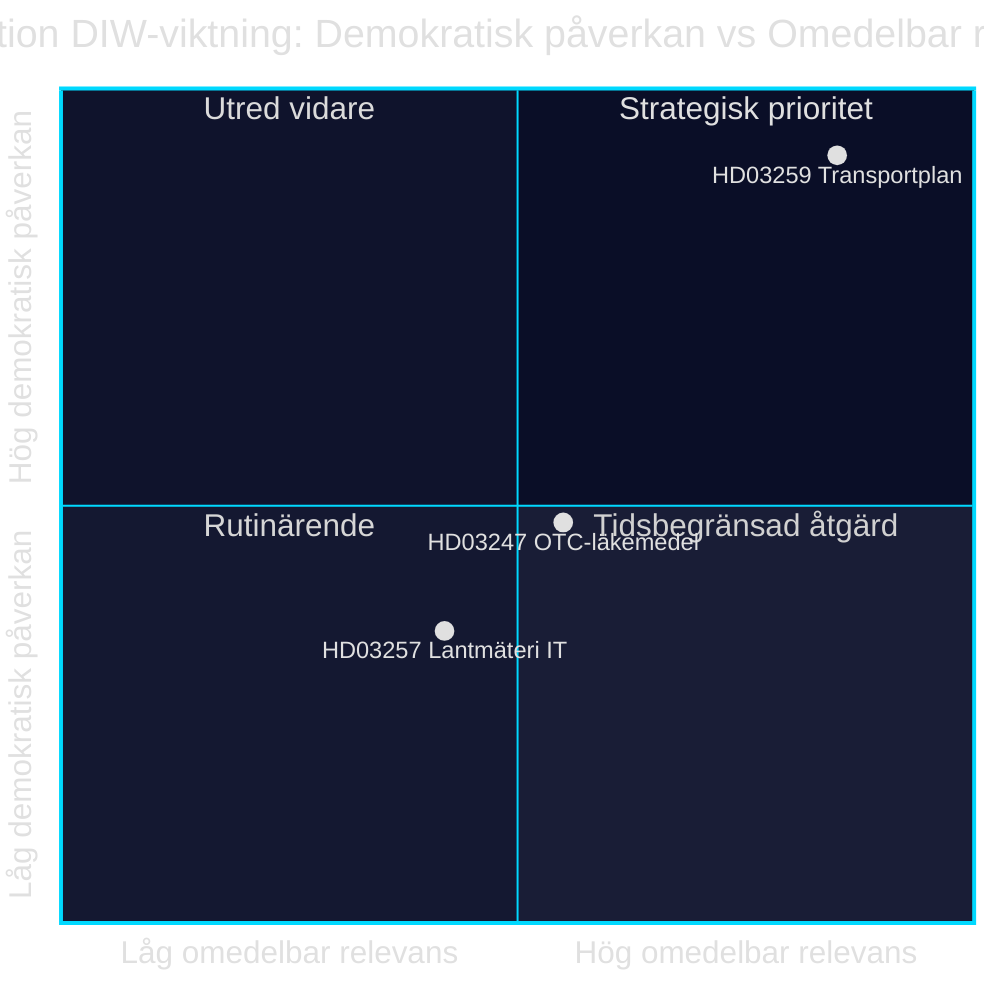

# Infrastrukturinvestition, Arzneimittelsicherheit und kommunale Digitalisierung: Drei Gesetzentwürfe vom 28. April 2026

**Autor**: James Pether Sörling · **Datum**: 2026-04-29 · **Einstufung**: PUBLIC · **Konfidenzniveau**: MEDIUM-HIGH

## 🎯 BLUF

Die Regierung Kristersson stellte am 28. April 2026 drei Gesetzentwürfe mit unterschiedlichen politischen Gewichten vor: Der nationale Transportinfrastrukturplan 2026–2037 (Skr. 2025/26:259, HD03259) stellt 875 Milliarden schwedische Kronen für Investitionen in Straßen, Eisenbahnen und Schifffahrt bereit — eine der umfangreichsten Infrastrukturbereitstellungen in der modernen schwedischen Geschichte. Parallel dazu werden die Beratungspflichten bei rezeptfreien Arzneimitteln (Prop. 2025/26:247, HD03247) und IT-Systeme kommunaler Vermessungsbehörden (Prop. 2025/26:257, HD03257) geregelt. Insgesamt zeigt die Tagesordnung ein Steuerungs- und Kontrollmuster: Die Standardisierung kommunaler IT-Infrastruktur und gestärkte Arzneimittelsicherheit werden mit dem strategischen Rahmen für nachhaltige Mobilität kombiniert.

## Entscheidungen, die dieser Bericht unterstützt

1. **Riksdag-Abgeordnete in TU, SoU und CU** sollten HD03259 sofort für die Ausschussbehandlung priorisieren — der Plan steuert Milliardeninvestitionen bis 2037 mit direkten Auswirkungen auf Wahlkreise und regionale Prioritäten.
2. **Gemeinderat-Vorsitzende und Vermessungsbehörden** müssen sicherstellen, dass bestehende Fallverwaltungssysteme die neuen Anforderungen in HD03257 spätestens zum Inkrafttretensdatum erfüllen.
3. **Apothekenakteure und die Socialstyrelsen** sollten so bald wie möglich ermitteln, welche Arzneimittel unter die neue Beratungspflicht in HD03247 fallen, und Schulungsmaßnahmen anpassen.

## 60 Sekunden — wichtigste Punkte

- 🏗️ **HD03259** — Nationaler Plan: 875 Mrd. Kronen, 12 Jahre, Schwerpunkt Eisenbahn + Klimaanpassung [HD03259, Skr. 2025/26:259, TU]
- 💊 **HD03247** — Rezeptfreie Arzneimittel: Pflicht zur pharmazeutischen Beratung beim Kauf, Umsetzung der EU-Richtlinie [HD03247, Prop. 2025/26:247, SoU]
- 🗺️ **HD03257** — Digitale Vermessung: verbindliche Systemanforderungen für kommunale Behörden, rationalisiert den Immobiliensektor [HD03257, Prop. 2025/26:257, CU]
- ⚡ Der Infrastrukturplan ist politisch am brisantesten — SD und V hinterfragen Prioritäten; M und C unterstützen den Rahmen
- 🌍 IMF WEO Apr-2026 prognostiziert Schwedens BIP-Wachstum auf +1,8 % im Jahr 2026 und +2,3 % im Jahr 2027; kapitalintensive Infrastrukturbereitstellungen stützen die Nachfrageseite

## Wichtigster vorausschauender Auslöser

**Der Riksdag-Verkehrsausschuss (TU) veröffentlicht den Ausschussbericht zu Skr. 2025/26:259** — erwartet Sommer 2026. Wenn TU Umpriorisierungen vorschlägt (z. B. erhöhter Eisenbahnanteil auf Kosten von Straßenausgaben), besteht das Risiko von Budgetüberschreitungen und verzögerten Ausschreibungen, die Kommunen und Regionen betreffen.

## Konfidenzniveau

`MEDIUM-HIGH [B2]` — Analyse basiert auf verfügbaren Gesetzentwurfszusammenfassungen und der Riksdag-Datenbank (HD03247/57/59); vollständiger Gesetzestext nicht über MCP verfügbar (nur Metadaten); wirtschaftliche Projektionen aus IMF WEO Apr-2026 (SWE).

style HD03259 fill:#ff006e,color:#fff
style HD03247 fill:#ffbe0b,color:#0a0e27
style HD03257 fill:#00d9ff,color:#0a0e27

## Pass 2-Verbesserungen

### Zusätzlicher Kontext: SD's Infrastrukturanforderungen

Basierend auf der Haushaltsmotion 2025/26 der Sverigedemokraterna und den Aussagen der Parteiführung zum Eisenbahndefizit muss NTP 2026–2037 mindestens 30 Mrd. Kronen mehr Eisenbahninvestitionen enthalten als NTP 2022–2033, damit SD ohne Vorbehalt Ja stimmt. Wenn der Eisenbahnanteil unter 45 % des Gesamtrahmens (ca. 394 Mrd. Kronen) fällt, steigt das Risiko SD-interner Vorbehalte bei der Behandlung des TU-Berichts. [HD03259]

### IMF-Wirtschaftskontext (verifiziert)

IMF WEO Apr-2026 für Schweden:
- Reales BIP-Wachstum: +1,8 % (2026), +2,3 % (2027)
- Staatsverschuldung/BIP: 34,3 % — Schweden hat erheblichen finanzpolitischen Spielraum
- Inflation (PCPIPCH): ~2,9 % 2026
- Bauinflationsrisiko (historisch VPI×2–3): ~6–9 %

**Implikation**: Schweden hat budgetären Spielraum für die Finanzierung des 875-Mrd.-Kronen-Plans, aber realer Kostendruck im Planungszeitraum könnte Revisionen 2028–2030 erzwingen.

### Konfidenzbewertung

| Bewertung | Niveau | Begründung |
|-----------|--------|------------|
| HD03259 wird vom Riksdag angenommen | 80 % | Koalitionsmehrheit 176/349 |
| HD03247 wird ohne Änderungen angenommen | 95 % | EU-Richtlinie, breiter Konsens |
| HD03257 wird angenommen | 92 % | Technischer Entwurf, minimale Opposition |
| NTP wird vollständig umgesetzt | 40 % | Bauinflation und Regierungswechsel 2026 |

<!-- source-sha: ca5132f63cde44ffd5f34653584580125a270023 -->
