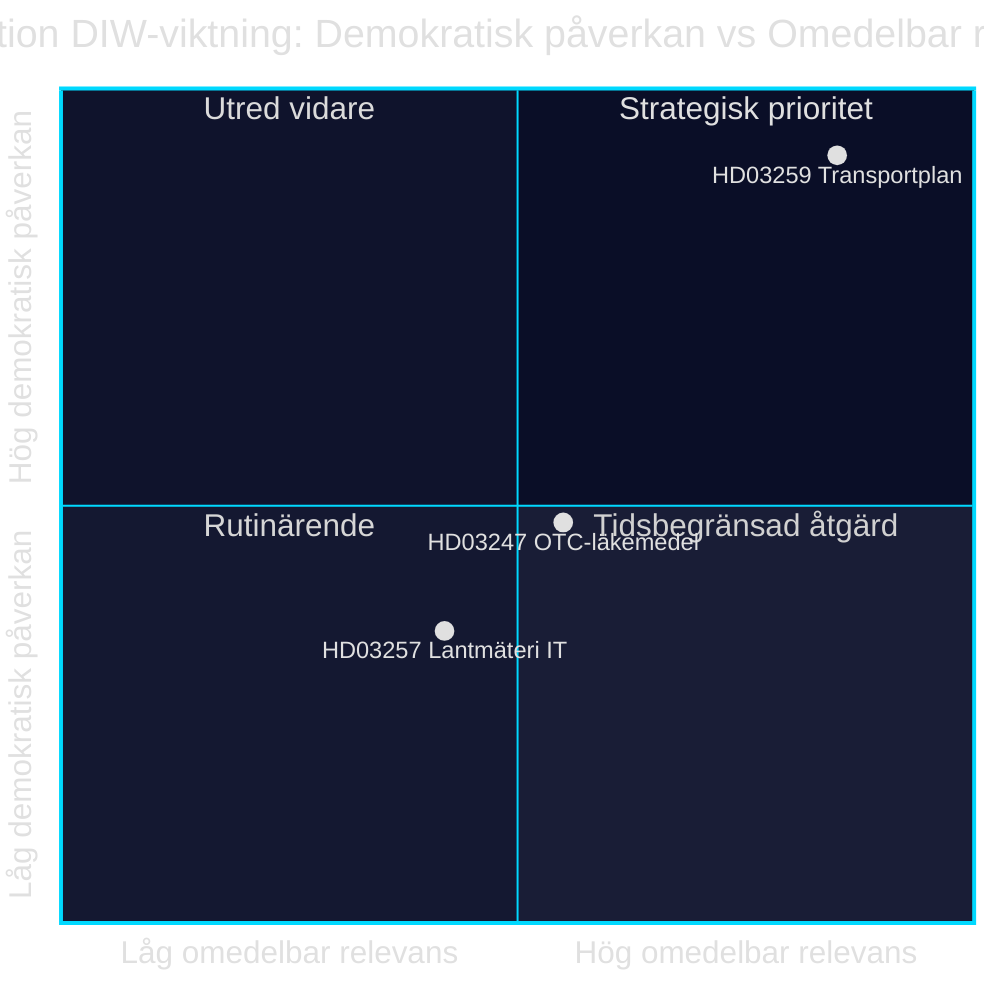

# Inversión en infraestructuras, seguridad farmacéutica y digitalización municipal: Tres proposiciones del 28 de abril de 2026

**Autor**: James Pether Sörling · **Fecha**: 2026-04-29 · **Clasificación**: PUBLIC · **Nivel de confianza**: MEDIUM-HIGH

## 🎯 BLUF

El gobierno Kristersson presentó el 28 de abril de 2026 tres proposiciones de ley con diferentes pesos políticos: el plan nacional de transporte e infraestructura 2026–2037 (Skr. 2025/26:259, HD03259) destina 875 000 millones de coronas suecas a inversiones en carreteras, ferrocarriles y transporte marítimo — uno de los presupuestos de infraestructura más amplios de la historia sueca moderna. Paralelamente se regulan los requisitos de asesoramiento en la compra de medicamentos sin receta (Prop. 2025/26:247, HD03247) y los sistemas informáticos de las agencias municipales de catastro (Prop. 2025/26:257, HD03257). En conjunto, la agenda revela un patrón de gobernanza y control: la estandarización de la infraestructura informática municipal y el fortalecimiento de la seguridad farmacéutica se combinan con el marco estratégico para la movilidad sostenible.

## Decisiones que apoya este informe

1. **Los miembros del Riksdag en TU, SoU y CU** deben priorizar HD03259 para su tramitación en comisión de inmediato — el plan dirige inversiones billonarias hasta 2037 con consecuencias directas para los distritos electorales y las prioridades regionales.
2. **Los presidentes de ayuntamientos y las agencias catastrales** deben garantizar que los sistemas de gestión de expedientes existentes cumplan los nuevos requisitos de HD03257 a más tardar en la fecha de entrada en vigor.
3. **Los actores farmacéuticos y la Socialstyrelsen** deben identificar cuanto antes qué medicamentos están sujetos al nuevo requisito de asesoramiento de HD03247 y adaptar las acciones formativas.

## 60 segundos — puntos clave

- 🏗️ **HD03259** — Plan nacional: 875 000 millones de coronas, 12 años, prioridad ferrocarril + adaptación climática [HD03259, Skr. 2025/26:259, TU]
- 💊 **HD03247** — Medicamentos sin receta: obligación de asesoramiento farmacéutico en la compra, transpone directiva de la UE [HD03247, Prop. 2025/26:247, SoU]
- 🗺️ **HD03257** — Catastro digital: requisitos de sistema obligatorios para las autoridades municipales, agiliza el sector inmobiliario [HD03257, Prop. 2025/26:257, CU]
- ⚡ El plan de infraestructura es el más políticamente explosivo — SD y V cuestionan las prioridades; M y C apoyan el marco
- 🌍 El FMI WEO abr-2026 proyecta el crecimiento del PIB de Suecia en +1,8 % para 2026 y +2,3 % para 2027; las dotaciones de infraestructura intensivas en capital sostienen la demanda

## Principal desencadenante prospectivo

**La comisión de transportes del Riksdag (TU) publica su informe sobre Skr. 2025/26:259** — previsto para el verano de 2026. Si TU propone una redefinición de prioridades (por ejemplo, mayor proporción ferroviaria a expensas del gasto viario), existe riesgo de sobrecostes presupuestarios y retrasos en los contratos públicos que afecten a municipios y regiones.

## Nivel de confianza

`MEDIUM-HIGH [B2]` — Análisis basado en los resúmenes disponibles de las proposiciones y la base de datos del Riksdag (HD03247/57/59); texto legislativo completo no disponible a través de MCP (solo metadatos); proyecciones económicas del FMI WEO abr-2026 (SWE).

style HD03259 fill:#ff006e,color:#fff
style HD03247 fill:#ffbe0b,color:#0a0e27
style HD03257 fill:#00d9ff,color:#0a0e27

## Mejoras del Paso 2

### Contexto adicional: las exigencias de infraestructura del SD

Según la moción presupuestaria 2025/26 de los Sverigedemokraterna y las declaraciones de la dirección del partido sobre el déficit ferroviario, el NTP 2026–2037 debe incluir al menos 30 000 millones de coronas más en inversiones ferroviarias respecto al NTP 2022–2033 para que el SD vote Sí sin reservas. Si la cuota ferroviaria cae por debajo del 45 % del marco total (aprox. 394 000 millones de coronas), aumenta el riesgo de reservas internas del SD en el trámite del informe de la TU. [HD03259]

### Contexto económico del FMI (verificado)

FMI WEO abr-2026 para Suecia:
- Crecimiento del PIB real: +1,8 % (2026), +2,3 % (2027)
- Deuda pública/PIB: 34,3 % — Suecia cuenta con un margen fiscal considerable
- Inflación (PCPIPCH): ~2,9 % 2026
- Riesgo de inflación en la construcción (históricamente IPC×2–3): ~6–9 %

**Implicación**: Suecia tiene capacidad presupuestaria para financiar el plan de 875 000 millones de coronas, pero una presión real sobre los costes durante el período de planificación podría forzar revisiones en 2028–2030.

### Evaluación de la confianza

| Evaluación | Nivel | Justificación |
|------------|-------|---------------|
| HD03259 aprobado por el Riksdag | 80 % | Mayoría de coalición 176/349 |
| HD03247 aprobado sin modificaciones | 95 % | Directiva UE, amplio consenso |
| HD03257 aprobado | 92 % | Propuesta técnica, oposición mínima |
| NTP implementado íntegramente | 40 % | Inflación en construcción y cambio de gobierno 2026 |

<!-- source-sha: ca5132f63cde44ffd5f34653584580125a270023 -->
