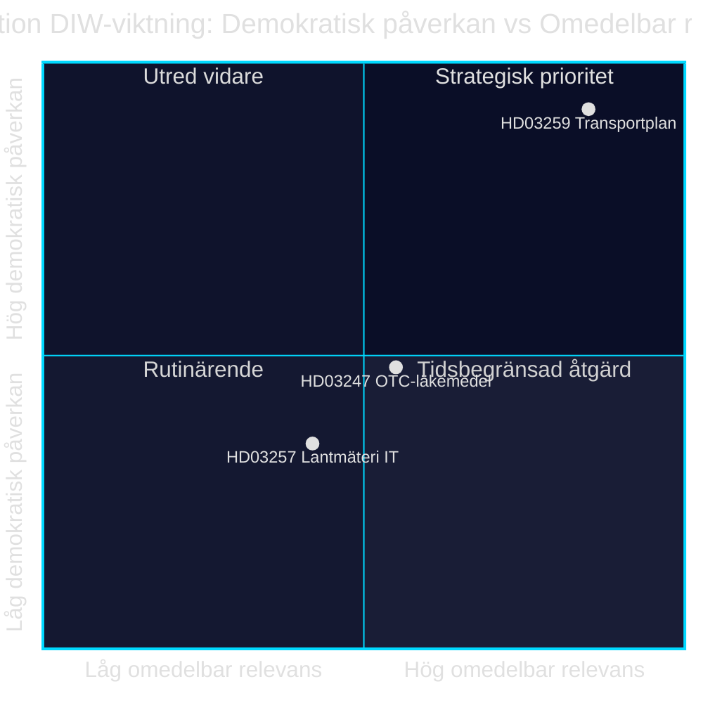

# Infrastruktuuri-investointi, lääketurvallisuus ja kunnallinen digitalisaatio: Kolme lakiesitystä 28. huhtikuuta 2026

**Tekijä**: James Pether Sörling · **Päivämäärä**: 2026-04-29 · **Luokittelu**: PUBLIC · **Luottamustaso**: MEDIUM-HIGH

## 🎯 BLUF

Kristersson-hallitus esitteli 28. huhtikuuta 2026 kolme lakiesitystä eri poliittisin painoarvoin: kansallinen liikenneinfrastruktuurisuunnitelma 2026–2037 (Skr. 2025/26:259, HD03259) varaa 875 miljardia Ruotsin kruunua teiden, rautateiden ja merenkulun investointeihin — yksi nykyaikaisen Ruotsin historian laajimmista infrastruktuurimäärärahoista. Samaan aikaan säännellään apteekissa myytävien lääkkeiden neuvontavaatimuksia (Prop. 2025/26:247, HD03247) ja kunnallisten maanmittausviranomaisten tietojärjestelmiä (Prop. 2025/26:257, HD03257). Kokonaisuudessaan esityslista osoittaa ohjaus- ja valvontamallin: kunnallisen IT-infrastruktuurin standardisointi ja lääketurvallisuuden vahvistaminen yhdistetään kestävän liikkumisen strategiseen viitekehykseen.

## Päätökset, joita tämä tukee

1. **Riksdagenin jäsenet TU:ssa, SoU:ssa ja CU:ssa** tulee priorisoida HD03259 valiokuntakäsittelyyn välittömästi — suunnitelma ohjaa miljardi-investointeja vuoteen 2037 asti suorin vaikutuksin vaalipiireihin ja alueellisiin prioriteetteihin.
2. **Kunnanhallitusten puheenjohtajien ja maanmittausviranomaisten** on varmistettava, että nykyiset asianhallintajärjestelmät täyttävät HD03257:n uudet vaatimukset viimeistään voimaantulopäivänä.
3. **Apteekkialan toimijoiden ja Socialstyrelsenin** tulee pikaisesti kartoittaa, mitkä lääkkeet kuuluvat HD03247:n uuden neuvontavaatimuksen piiriin, ja mukauttaa koulutustoimenpiteet.

## 60 sekuntia — tärkeimmät kohdat

- 🏗️ **HD03259** — Kansallinen suunnitelma: 875 mrd. kruunua, 12 vuotta, painopiste rautatie + ilmastonmuutokseen sopeutuminen [HD03259, Skr. 2025/26:259, TU]
- 💊 **HD03247** — Käsikauppalääkkeet: farmaseuttisen neuvonnan vaatimus oston yhteydessä, EU-direktiivin täytäntöönpano [HD03247, Prop. 2025/26:247, SoU]
- 🗺️ **HD03257** — Digitaalinen maanmittaus: pakolliset järjestelmävaatimukset kunnallisille viranomaisille, tehostaa kiinteistösektoria [HD03257, Prop. 2025/26:257, CU]
- ⚡ Infrastruktuurisuunnitelma on poliittisesti räjähtävin — SD ja V kyseenalaistavat prioriteetit; M ja C tukevat kehystä
- 🌍 IMF WEO huhti-2026 ennustaa Ruotsin BKT-kasvulle +1,8 % vuonna 2026 ja +2,3 % vuonna 2027; pääomaintensiiviset infrastruktuurimäärärahat tukevat kysyntäpuolta

## Tärkein ennakoiva laukaisija

**Riksdagenin liikennevaliokunta (TU) julkaisee mietintönsä Skr. 2025/26:259:stä** — odotettu kesä 2026. Jos TU ehdottaa uudelleenpriorisointi (esim. rautateiden osuuden kasvattaminen tiekustannusten kustannuksella), syntyy riski budjettien ylittymisestä ja viivästyneistä hankinnoista, jotka vaikuttavat kuntiin ja alueisiin.

## Luottamustaso

`MEDIUM-HIGH [B2]` — Analyysi perustuu saatavilla oleviin lakiesitysten tiivistelmiin ja Riksdagenin tietokantaan (HD03247/57/59); täyttä lakitekstiä ei saatavilla MCP:n kautta (vain metadata); taloudelliset projektiot IMF WEO huhti-2026 (SWE).

style HD03259 fill:#ff006e,color:#fff
style HD03247 fill:#ffbe0b,color:#0a0e27
style HD03257 fill:#00d9ff,color:#0a0e27

## Pass 2 -parannukset

### Lisäkonteksti: SD:n infrastruktuurivaatimukset

Sverigedemokraternan budjettimotionin 2025/26 ja puoluejohdon rautatievajetta koskevien lausuntojen perusteella NTP 2026–2037:n on sisällettävä vähintään 30 mrd. kruunua enemmän rautatieinvestointeja verrattuna NTP 2022–2033:een, jotta SD äänestäisi Kyllä ilman varauksia. Jos rautatieosuus alittaa 45 % kokonaisviitekehyksestä (n. 394 mrd. kruunua), SD:n sisäisten varausten riski TU:n mietinnön käsittelyssä kasvaa. [HD03259]

### IMF:n taloudellinen konteksti (vahvistettu)

IMF WEO huhti-2026 Ruotsille:
- Reaalinen BKT-kasvu: +1,8 % (2026), +2,3 % (2027)
- Valtionvelka/BKT: 34,3 % — Ruotsilla on merkittävä finanssipoliittinen liikkumavara
- Inflaatio (PCPIPCH): ~2,9 % 2026
- Rakennusinflaatioriski (historiallinen KPI×2–3): ~6–9 %

**Vaikutus**: Ruotsilla on budjettikapasiteettia rahoittaa 875 mrd. kruunun suunnitelma, mutta suunnittelukauden todellinen kustannuspaine voi pakottaa revisioihin 2028–2030.

### Luottamusarvio

| Arvio | Taso | Perustelu |
|-------|------|-----------|
| HD03259 hyväksytään Riksdagenissa | 80 % | Koalition enemmistö 176/349 |
| HD03247 hyväksytään ilman muutoksia | 95 % | EU-direktiivi, laaja konsensus |
| HD03257 hyväksytään | 92 % | Tekninen esitys, minimaalinen vastustus |
| NTP toteutetaan täysimääräisesti | 40 % | Rakennusinflaatio ja hallituksen vaihtuminen 2026 |

<!-- source-sha: ca5132f63cde44ffd5f34653584580125a270023 -->
