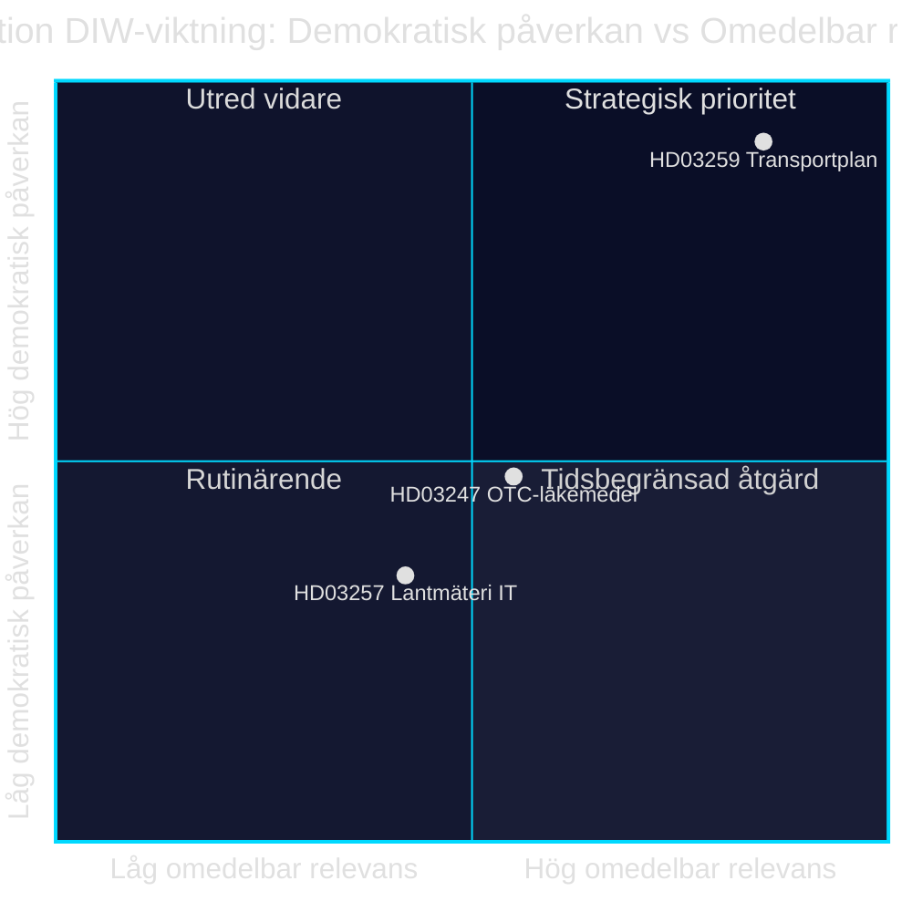

# Investissement infrastructurel, sécurité pharmaceutique et numérisation municipale : Trois propositions de loi du 28 avril 2026

**Auteur** : James Pether Sörling · **Date** : 2026-04-29 · **Classification** : PUBLIC · **Niveau de confiance** : MEDIUM-HIGH

## 🎯 BLUF

Le gouvernement Kristersson a présenté le 28 avril 2026 trois propositions de loi aux enjeux politiques différents : le plan national de transport et d'infrastructure 2026–2037 (Skr. 2025/26:259, HD03259) alloue 875 milliards de couronnes suédoises aux investissements dans les routes, les chemins de fer et la navigation — l'une des plus importantes dotations infrastructurelles de l'histoire moderne de la Suède. Parallèlement sont réglementés les exigences de conseil lors de l'achat de médicaments sans ordonnance (Prop. 2025/26:247, HD03247) et les systèmes informatiques des agences municipales de cadastre (Prop. 2025/26:257, HD03257). Dans l'ensemble, l'ordre du jour révèle un schéma de gouvernance et de contrôle : la standardisation de l'infrastructure informatique municipale et le renforcement de la sécurité pharmaceutique se combinent avec le cadre stratégique pour la mobilité durable.

## Décisions soutenues par ce bref

1. **Les membres du Riksdag au sein des commissions TU, SoU et CU** doivent prioriser HD03259 pour examen en commission sans délai — le plan oriente des investissements milliardaires jusqu'en 2037 avec des conséquences directes sur les circonscriptions et les priorités régionales.
2. **Les présidents de conseils municipaux et les agences cadastrales** doivent s'assurer que les systèmes de gestion des dossiers existants répondent aux nouvelles exigences de HD03257 au plus tard à la date d'entrée en vigueur.
3. **Les acteurs pharmaceutiques et la Socialstyrelsen** doivent rapidement identifier quels médicaments relèvent de la nouvelle obligation de conseil dans HD03247 et adapter les actions de formation.

## 60 secondes — points clés

- 🏗️ **HD03259** — Plan national : 875 milliards de couronnes, 12 ans, priorité chemin de fer + adaptation climatique [HD03259, Skr. 2025/26:259, TU]
- 💊 **HD03247** — Médicaments sans ordonnance : obligation de conseil pharmaceutique lors de l'achat, transposition de la directive UE [HD03247, Prop. 2025/26:247, SoU]
- 🗺️ **HD03257** — Cadastre numérique : exigences système obligatoires pour les autorités municipales, rationalise le secteur immobilier [HD03257, Prop. 2025/26:257, CU]
- ⚡ Le plan d'infrastructure est le plus politiquement explosif — SD et V remettent en question les priorités ; M et C soutiennent le cadre
- 🌍 Le FMI WEO avr-2026 projette la croissance du PIB suédois à +1,8 % en 2026 et +2,3 % en 2027 ; les dotations d'infrastructure à forte intensité capitalistique soutiennent la demande

## Principal déclencheur prospectif

**La commission des transports du Riksdag (TU) publie son rapport sur Skr. 2025/26:259** — attendu à l'été 2026. Si TU propose des redéfinitions de priorités (par ex. une part ferroviaire accrue au détriment des dépenses routières), il existe un risque de dépassement budgétaire et de retards dans les marchés publics affectant les communes et les régions.

## Niveau de confiance

`MEDIUM-HIGH [B2]` — Analyse fondée sur les résumés disponibles des propositions de loi et la base de données du Riksdag (HD03247/57/59) ; texte législatif complet non disponible via MCP (métadonnées uniquement) ; projections économiques du FMI WEO avr-2026 (SWE).

style HD03259 fill:#ff006e,color:#fff
style HD03247 fill:#ffbe0b,color:#0a0e27
style HD03257 fill:#00d9ff,color:#0a0e27

## Améliorations Pass 2

### Contexte supplémentaire : les exigences infrastructurelles du SD

Sur la base de la motion budgétaire 2025/26 des Sverigedemokraterna et des déclarations de la direction du parti sur le déficit ferroviaire, le NTP 2026–2037 doit inclure au moins 30 milliards de couronnes supplémentaires en investissements ferroviaires par rapport au NTP 2022–2033 pour que le SD vote Oui sans réserve. Si la part ferroviaire descend sous les 45 % du cadre total (environ 394 milliards de couronnes), le risque de réserves internes au SD lors de l'examen du rapport TU augmente. [HD03259]

### Contexte économique du FMI (vérifié)

FMI WEO avr-2026 pour la Suède :
- Croissance du PIB réel : +1,8 % (2026), +2,3 % (2027)
- Dette publique/PIB : 34,3 % — la Suède dispose d'une marge de manœuvre budgétaire notable
- Inflation (PCPIPCH) : ~2,9 % 2026
- Risque d'inflation dans la construction (historiquement IPC×2–3) : ~6–9 %

**Implication** : La Suède dispose d'une capacité budgétaire pour financer le plan à 875 milliards de couronnes, mais une pression réelle sur les coûts durant la période de planification pourrait contraindre des révisions en 2028–2030.

### Évaluation de la confiance

| Évaluation | Niveau | Justification |
|------------|--------|---------------|
| HD03259 adopté par le Riksdag | 80 % | Majorité de coalition 176/349 |
| HD03247 adopté sans modifications | 95 % | Directive UE, large consensus |
| HD03257 adopté | 92 % | Proposition technique, opposition minimale |
| NTP mis en œuvre intégralement | 40 % | Inflation dans la construction et changement de gouvernement 2026 |

<!-- source-sha: ca5132f63cde44ffd5f34653584580125a270023 -->
