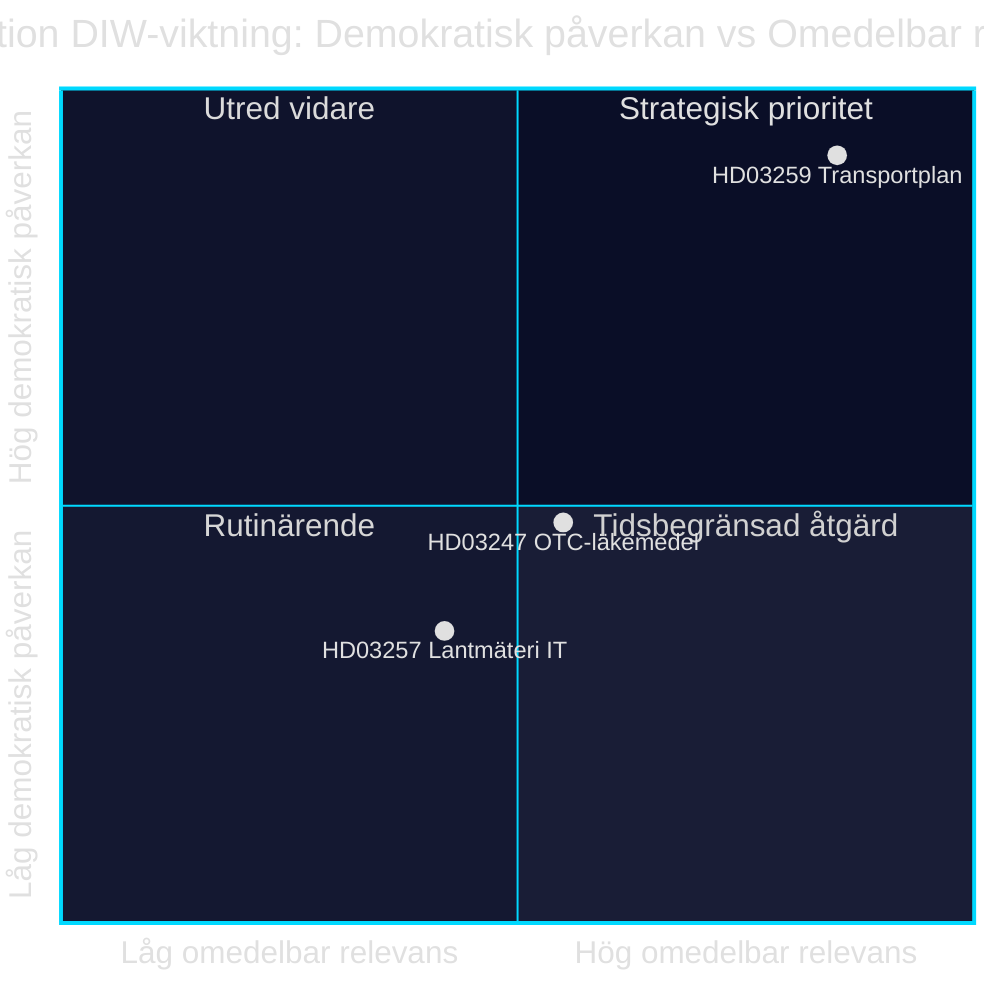

<!-- dir: rtl -->
# השקעה בתשתיות, בטיחות תרופות ודיגיטליזציה עירונית: שלושה הצעות חוק ב-28 באפריל 2026

**מחבר**: James Pether Sörling · **תאריך**: 2026-04-29 · **סיווג**: PUBLIC · **רמת ביטחון**: MEDIUM-HIGH

## 🎯 BLUF

ממשלת קריסטרסון הגישה ב-28 באפריל 2026 שלוש הצעות חוק בעלות משקל פוליטי שונה: תכנית התחבורה והתשתיות הלאומית 2026–2037 (Skr. 2025/26:259, HD03259) מקצה 875 מיליארד כתר שוודי להשקעות בכבישים, מסילות ברזל וספנות — אחת מן הקצאות התשתיות הרחבות ביותר בהיסטוריה השוודית המודרנית. במקביל, מוסדרים דרישות הייעוץ לרכישת תרופות ללא מרשם (Prop. 2025/26:247, HD03247) ומערכות מידע של רשויות מדידה עירוניות (Prop. 2025/26:257, HD03257). כמכלול, סדר היום מגלה דפוס ממשל ובקרה: תקנון תשתיות מידע עירוניות ושיפור בטיחות התרופות משולבים עם המסגרת האסטרטגית לניידות בת-קיימא.

## ההחלטות שמסמך זה תומך בהן

1. **חברי Riksdagen בוועדות TU, SoU ו-CU** צריכים להעדיף את HD03259 לדיון ועדתי מיידי — התכנית מנחה השקעות של מיליארדים עד 2037 עם השלכות ישירות על מחוזות הבחירה ועדיפויות אזוריות.
2. **יושבי ראש מועצות עיר ורשויות מדידה** חייבים לוודא שמערכות ניהול התיקים הקיימות עומדות בדרישות החדשות של HD03257 לכל המאוחר בתאריך הכניסה לתוקף.
3. **גורמי הרוקחות וה-Socialstyrelsen** צריכים לפרט בהקדם אילו תרופות כפופות לדרישת הייעוץ החדשה ב-HD03247 ולהתאים את תכניות ההדרכה.

## 60 שניות — נקודות מפתח

- 🏗️ **HD03259** — תכנית לאומית: 875 מיליארד כתר, 12 שנים, דגש מסילות ברזל + הסתגלות לשינויי אקלים [HD03259, Skr. 2025/26:259, TU]
- 💊 **HD03247** — תרופות ללא מרשם: חובת ייעוץ פארמצבטי ברכישה, יישום הנחיית האיחוד האירופי [HD03247, Prop. 2025/26:247, SoU]
- 🗺️ **HD03257** — מדידה דיגיטלית: דרישות מערכת חובה לרשויות עירוניות, ייעול ענף הנדל"ן [HD03257, Prop. 2025/26:257, CU]
- ⚡ תכנית התשתיות היא המתלהמת פוליטית ביותר — SD ו-V מטילים ספק בסדרי העדיפויות; M ו-C תומכים במסגרת
- 🌍 קרן המטבע הבינלאומית WEO אפר-2026 מתחזה צמיחת תמ"ג שוודי ב-+1.8% ב-2026 וב-+2.3% ב-2027; הקצאות תשתיות אינטנסיביות בהון תומכות בצד הביקוש

## הטריגר העתידי החשוב ביותר

**ועדת התחבורה של Riksdagen (TU) מפרסמת את דוחה בנוגע ל-Skr. 2025/26:259** — צפוי קיץ 2026. אם TU תציע שינוי עדיפויות (כגון הגדלת נתח מסילות הברזל על חשבון הכבישים), קיים סיכון לחריגות תקציביות ועיכובים במכרזים המשפיעים על עיריות ומחוזות.

## רמת ביטחון

`MEDIUM-HIGH [B2]` — ניתוח מבוסס על תקצירי הצעות החוק הזמינים ומסד הנתונים של Riksdagen (HD03247/57/59); הטקסט החוקי המלא אינו זמין דרך MCP (מטה-נתונים בלבד); תחזיות כלכליות מ-IMF WEO אפר-2026 (SWE).

style HD03259 fill:#ff006e,color:#fff
style HD03247 fill:#ffbe0b,color:#0a0e27
style HD03257 fill:#00d9ff,color:#0a0e27

## שיפורי Pass 2

### הקשר נוסף: דרישות התשתית של SD

על פי הצעת התקציב של Sverigedemokraterna לשנת 2025/26 והצהרות הנהגת המפלגה בנוגע למחסור ברכבות, NTP 2026–2037 חייב לכלול לפחות 30 מיליארד כתר השקעות נוספות במסילות ברזל בהשוואה ל-NTP 2022–2033 כדי ש-SD יצביע בעד ללא הסתייגות. אם נתח מסילות הברזל יירד מתחת ל-45% מהמסגרת הכוללת (כ-394 מיליארד כתר), גדל הסיכון להסתייגויות פנימיות ב-SD בדיון דוח ה-TU. [HD03259]

### הקשר כלכלי של קרן המטבע הבינלאומית (מאומת)

IMF WEO אפר-2026 לשוודיה:
- צמיחת תמ"ג ריאלי: +1.8% (2026), +2.3% (2027)
- חוב ציבורי/תמ"ג: 34.3% — לשוודיה יש מרחב פיסקלי ניכר
- אינפלציה (PCPIPCH): ~2.9% ב-2026
- סיכון אינפלציית בנייה (היסטורית CPI×2–3): ~6–9%

**השלכה**: לשוודיה יש יכולת תקציבית לממן את תכנית 875 מיליארד הכתר, אך לחץ עלויות ריאלי בתקופת התכנון עשוי לאלץ תיקונים ב-2028–2030.

### הערכת רמת ביטחון

| הערכה | רמה | הנמקה |
|-------|-----|--------|
| HD03259 מאושר על ידי Riksdagen | 80 % | רוב קואליציוני 176/349 |
| HD03247 מאושר ללא שינויים | 95 % | הנחיית האיחוד האירופי, קונצנזוס רחב |
| HD03257 מאושר | 92 % | הצעה טכנית, התנגדות מינימלית |
| NTP מיושם במלואו | 40 % | אינפלציית בנייה והחלפת ממשלה 2026 |

<!-- source-sha: ca5132f63cde44ffd5f34653584580125a270023 -->
