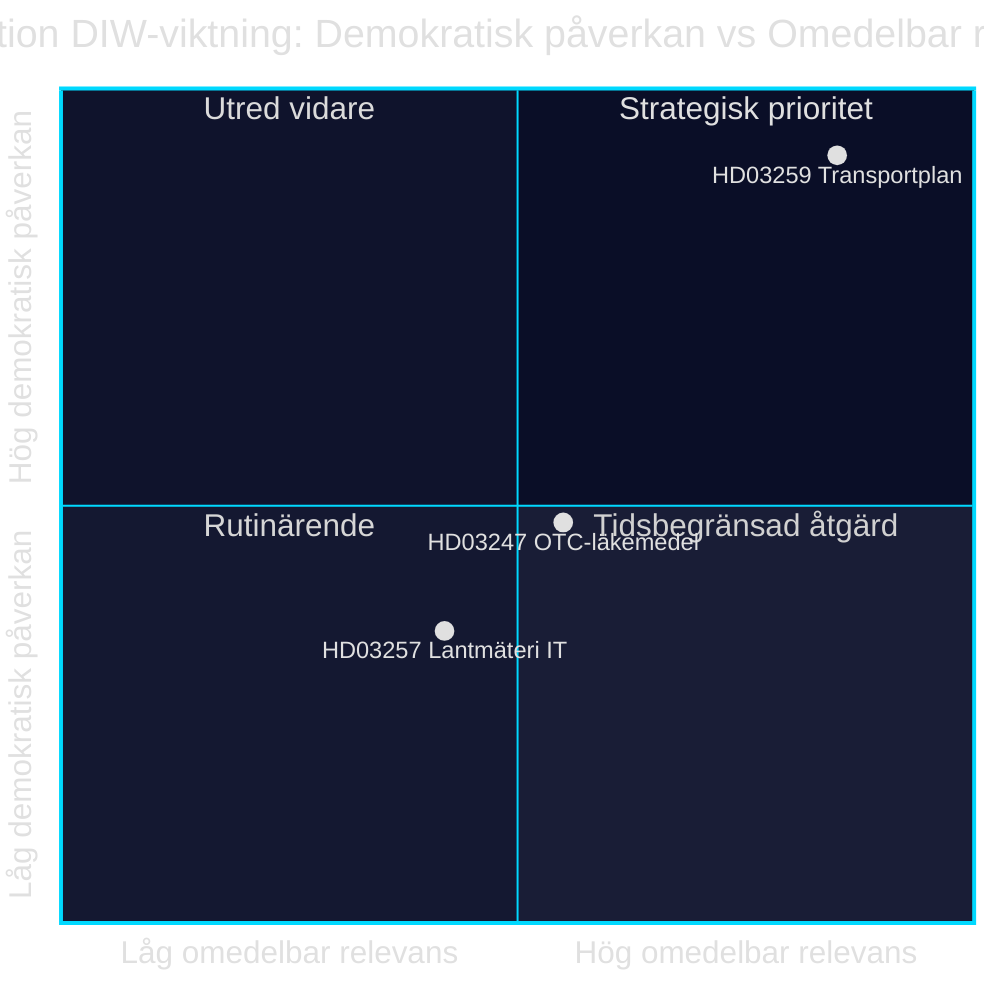

# インフラ投資、医薬品安全、自治体デジタル化：2026年4月28日の3つの法案

**著者**：James Pether Sörling · **日付**：2026-04-29 · **分類**：PUBLIC · **信頼度**：MEDIUM-HIGH

## 🎯 BLUF

クリステション政権は2026年4月28日、それぞれ異なる政治的重みを持つ3つの法案を提出しました。国家交通インフラ計画2026–2037（Skr. 2025/26:259, HD03259）は道路・鉄道・海運への投資として8,750億スウェーデンクローナを充当しており、スウェーデン近代史上最大規模のインフラ予算のひとつです。同時に、市販薬の購入時における薬学的助言の義務（Prop. 2025/26:247, HD03247）および自治体測量機関のITシステム（Prop. 2025/26:257, HD03257）も規制されます。全体として、今日の議事日程は統治・管理のパターンを示しています。自治体ITインフラの標準化と医薬品安全の強化が、持続可能なモビリティのための戦略的枠組みと組み合わされています。

## このブリーフが支援する意思決定

1. **TU、SoU、CU委員会のRiksdagen議員**は、HD03259を直ちに委員会審議の最優先事項とすべきです。この計画は2037年まで数兆円規模の投資を方向付け、選挙区や地域の優先事項に直接影響します。
2. **市町村議会議長および測量機関**は、既存の案件管理システムが遅くとも施行日までにHD03257の新要件を満たしていることを確認する必要があります。
3. **薬局事業者およびSocialstyrelsen**は、HD03247の新たな助言義務の対象となる医薬品を速やかに特定し、研修措置を適応させる必要があります。

## 60秒でわかるポイント

- 🏗️ **HD03259** — 国家計画：8,750億クローナ、12年間、鉄道重視＋気候適応 [HD03259, Skr. 2025/26:259, TU]
- 💊 **HD03247** — 市販薬：購入時の薬学的助言義務、EU指令の施行 [HD03247, Prop. 2025/26:247, SoU]
- 🗺️ **HD03257** — デジタル測量：自治体機関への必須システム要件、不動産セクターの効率化 [HD03257, Prop. 2025/26:257, CU]
- ⚡ インフラ計画は最も政治的に爆発的です — SDとVが優先事項を疑問視；MとCは枠組みを支持
- 🌍 IMF WEO 2026年4月版はスウェーデンのGDP成長率を2026年+1.8%、2027年+2.3%と予測；資本集約型のインフラ予算が需要側を支えます

## 最重要な先行指標

**Riksdagenの交通委員会（TU）がSkr. 2025/26:259に関する委員会報告書を公表** — 2026年夏予定。TUが優先順位の見直し（例：道路費を削減して鉄道比率を高める）を提案した場合、自治体・地域に影響するコスト超過と調達遅延のリスクが生じます。

## 信頼度

`MEDIUM-HIGH [B2]` — 利用可能な法案サマリーおよびRiksdagenデータベース（HD03247/57/59）に基づく分析；法律全文はMCP経由では利用不可（メタデータのみ）；経済予測はIMF WEO 2026年4月（SWE）。

style HD03259 fill:#ff006e,color:#fff
style HD03247 fill:#ffbe0b,color:#0a0e27
style HD03257 fill:#00d9ff,color:#0a0e27

## パス2改善点

### 追加コンテキスト：SDのインフラ要求

Sverigedemokraternaの2025/26年予算動議と鉄道不足に関する党首発言によれば、NTP 2026–2037にはNTP 2022–2033比で少なくとも300億クローナ多い鉄道投資が含まれていなければ、SDは留保なしにYesと投票しません。鉄道比率が総枠の45%（約3,940億クローナ）を下回る場合、TU報告書審議においてSD内部の留保リスクが高まります。[HD03259]

### IMFの経済的文脈（確認済）

IMF WEO 2026年4月 スウェーデン：
- 実質GDP成長率：+1.8%（2026年）、+2.3%（2027年）
- 政府債務/GDP：34.3% — スウェーデンは財政余地が大きい
- インフレ（PCPIPCH）：~2.9%（2026年）
- 建設インフレリスク（歴史的にCPI×2–3）：~6–9%

**含意**：スウェーデンは8,750億クローナ計画を財政的に賄う余裕がありますが、計画期間中の実際のコスト上昇により2028–2030年に改定が迫られる可能性があります。

### 信頼度評価

| 評価 | レベル | 根拠 |
|------|--------|------|
| HD03259がRiksdagenで採択 | 80 % | 連立多数176/349 |
| HD03247が修正なく採択 | 95 % | EU指令、広範なコンセンサス |
| HD03257が採択 | 92 % | 技術的法案、反対意見は最小限 |
| NTPが完全実施 | 40 % | 建設インフレと2026年政権交代 |

<!-- source-sha: ca5132f63cde44ffd5f34653584580125a270023 -->
