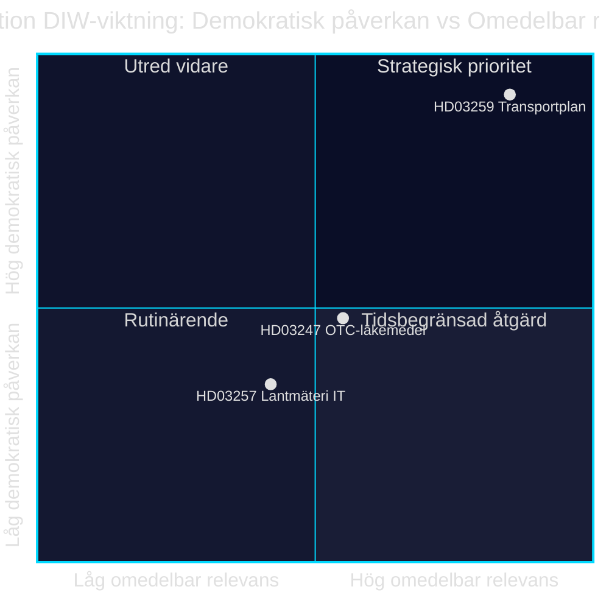

# 인프라 투자, 의약품 안전, 지자체 디지털화: 2026년 4월 28일의 세 가지 법안

**저자**: James Pether Sörling · **날짜**: 2026-04-29 · **분류**: PUBLIC · **신뢰도**: MEDIUM-HIGH

## 🎯 BLUF

크리스테르손 정부는 2026년 4월 28일 각기 다른 정치적 비중을 지닌 세 가지 법안을 발의하였습니다. 국가 교통인프라 계획 2026–2037(Skr. 2025/26:259, HD03259)은 도로·철도·해운 투자에 8,750억 스웨덴 크로나를 배정하며, 이는 스웨덴 현대사에서 가장 방대한 인프라 예산 중 하나입니다. 아울러 일반의약품 구매 시 약학적 상담 의무(Prop. 2025/26:247, HD03247)와 지자체 측량기관의 IT 시스템(Prop. 2025/26:257, HD03257)도 함께 규제됩니다. 전체적으로 볼 때, 이번 의제는 거버넌스 및 통제 패턴을 드러냅니다. 지자체 IT 인프라 표준화와 의약품 안전 강화가 지속 가능한 이동성을 위한 전략적 틀과 결합됩니다.

## 이 보고서가 지원하는 결정 사항

1. **TU, SoU, CU 위원회의 Riksdagen 의원**들은 HD03259를 즉시 위원회 심의에서 우선 처리해야 합니다. 이 계획은 2037년까지의 수조 원 규모 투자를 방향 짓고, 선거구와 지역 우선순위에 직접적인 영향을 미칩니다.
2. **지자체 의회 의장과 측량기관**은 기존 사례 관리 시스템이 늦어도 시행일까지 HD03257의 새 요건을 충족하는지 확인해야 합니다.
3. **약국 사업자와 Socialstyrelsen**은 HD03247의 새로운 상담 의무 대상 의약품을 신속히 파악하고 교육 조치를 조정해야 합니다.

## 60초 핵심 정리

- 🏗️ **HD03259** — 국가 계획: 8,750억 크로나, 12년, 철도 중점 + 기후 적응 [HD03259, Skr. 2025/26:259, TU]
- 💊 **HD03247** — 일반의약품: 구매 시 약학적 상담 의무, EU 지침 이행 [HD03247, Prop. 2025/26:247, SoU]
- 🗺️ **HD03257** — 디지털 측량: 지자체 기관 대상 필수 시스템 요건, 부동산 부문 효율화 [HD03257, Prop. 2025/26:257, CU]
- ⚡ 인프라 계획은 정치적으로 가장 민감합니다 — SD와 V는 우선순위에 의문 제기; M과 C는 틀 지지
- 🌍 IMF WEO 2026년 4월판은 스웨덴 GDP 성장률을 2026년 +1.8%, 2027년 +2.3%로 전망; 자본집약적 인프라 예산이 수요 측면을 뒷받침합니다

## 가장 중요한 선행 지표

**Riksdagen 교통위원회(TU)가 Skr. 2025/26:259 관련 위원회 보고서 공개** — 2026년 여름 예상. TU가 우선순위 재조정(예: 도로 비용을 줄이고 철도 비율 증가)을 제안할 경우, 지자체와 지역에 영향을 주는 예산 초과와 조달 지연 위험이 발생합니다.

## 신뢰도

`MEDIUM-HIGH [B2]` — 이용 가능한 법안 요약본 및 Riksdagen 데이터베이스(HD03247/57/59)에 기반한 분석; 전체 법률 텍스트는 MCP 통해 이용 불가(메타데이터만); 경제 전망은 IMF WEO 2026년 4월(SWE).

style HD03259 fill:#ff006e,color:#fff
style HD03247 fill:#ffbe0b,color:#0a0e27
style HD03257 fill:#00d9ff,color:#0a0e27

## Pass 2 개선사항

### 추가 맥락: SD의 인프라 요구 사항

Sverigedemokraterna의 2025/26 예산 동의와 철도 부족에 관한 당 지도부 발언에 따르면, NTP 2026–2037에는 SD가 유보 없이 찬성 투표를 하기 위해 NTP 2022–2033 대비 최소 300억 크로나 더 많은 철도 투자가 포함되어야 합니다. 철도 비율이 전체 틀의 45%(약 3,940억 크로나)에 미치지 못할 경우, TU 보고서 심의 시 SD 내부 유보 위험이 증가합니다. [HD03259]

### IMF 경제 맥락(확인됨)

IMF WEO 2026년 4월 스웨덴:
- 실질 GDP 성장률: +1.8%(2026), +2.3%(2027)
- 정부 부채/GDP: 34.3% — 스웨덴은 상당한 재정 여력 보유
- 인플레이션(PCPIPCH): ~2.9%(2026)
- 건설 인플레이션 위험(역사적으로 CPI×2–3): ~6–9%

**함의**: 스웨덴은 8,750억 크로나 계획을 재정적으로 감당할 능력이 있으나, 계획 기간 중 실제 비용 압박으로 인해 2028–2030년에 개정이 불가피할 수 있습니다.

### 신뢰도 평가

| 평가 | 수준 | 근거 |
|------|------|------|
| HD03259 Riksdagen 채택 | 80 % | 연립 다수 176/349 |
| HD03247 수정 없이 채택 | 95 % | EU 지침, 광범위한 합의 |
| HD03257 채택 | 92 % | 기술적 법안, 반대 최소 |
| NTP 완전 이행 | 40 % | 건설 인플레이션과 2026년 정권 교체 |

<!-- source-sha: ca5132f63cde44ffd5f34653584580125a270023 -->
