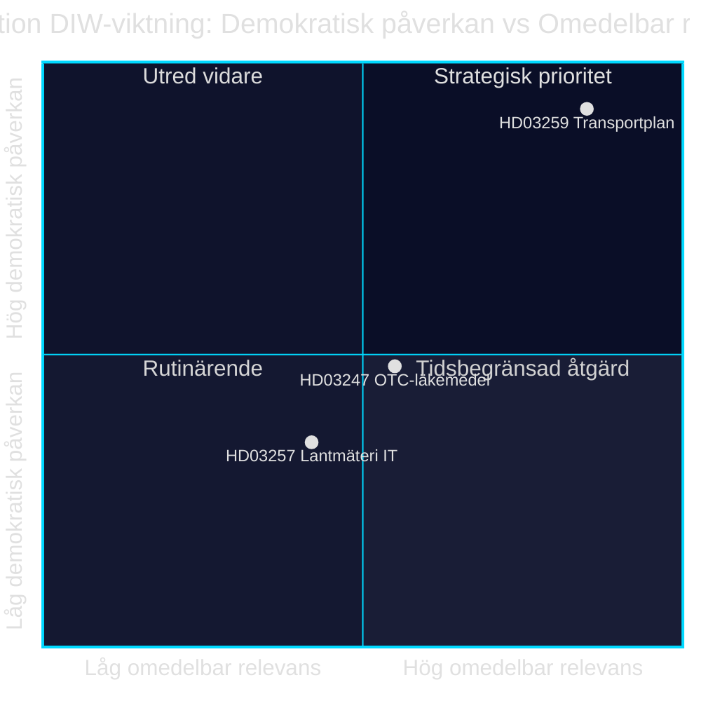

# Infrastructuurinvestering, geneesmiddelenveiligheid en gemeentelijke digitalisering: Drie wetsvoorstellen van 28 april 2026

**Auteur**: James Pether Sörling · **Datum**: 2026-04-29 · **Classificatie**: PUBLIC · **Betrouwbaarheidsniveau**: MEDIUM-HIGH

## 🎯 BLUF

De regering-Kristersson presenteerde op 28 april 2026 drie wetsvoorstellen met uiteenlopend politiek gewicht: het nationaal transportinfrastructuurplan 2026–2037 (Skr. 2025/26:259, HD03259) reserveert 875 miljard Zweedse kronen voor investeringen in wegen, spoorwegen en scheepvaart — een van de omvangrijkste infrastructuurkredieten in de moderne Zweedse geschiedenis. Parallel worden de advieskverplichtingen bij de aankoop van vrij verkrijgbare geneesmiddelen (Prop. 2025/26:247, HD03247) en de IT-systemen van gemeentelijke kadasterinstanties (Prop. 2025/26:257, HD03257) geregeld. Samenhangend toont de agenda een sturing- en controlemechanisme: standaardisering van gemeentelijke IT-infrastructuur en versterkte geneesmiddelenveiligheid worden gecombineerd met het strategisch kader voor duurzame mobiliteit.

## Besluiten die dit document ondersteunt

1. **Riksdag-leden in TU, SoU en CU** moeten HD03259 onmiddellijk prioriteren voor commissiebehandeling — het plan stuurt miljardaire investeringen tot en met 2037 met directe gevolgen voor kiesdistricten en regionale prioriteiten.
2. **Voorzitters van gemeenteraden en kadasterinstanties** moeten ervoor zorgen dat bestaande zaakbeheersystemen voldoen aan de nieuwe eisen in HD03257, uiterlijk op de datum van inwerkingtreding.
3. **Apotheekactoren en de Socialstyrelsen** moeten zo snel mogelijk in kaart brengen welke geneesmiddelen vallen onder de nieuwe adviesverplichting in HD03247 en opleidingsactiviteiten aanpassen.

## 60 seconden — belangrijkste punten

- 🏗️ **HD03259** — Nationaal plan: 875 mrd. kronen, 12 jaar, focus spoorwegen + klimaatadaptatie [HD03259, Skr. 2025/26:259, TU]
- 💊 **HD03247** — Vrij verkrijgbare geneesmiddelen: farmaceutisch advies verplicht bij aankoop, implementeert EU-richtlijn [HD03247, Prop. 2025/26:247, SoU]
- 🗺️ **HD03257** — Digitaal kadaster: verplichte systeemeisen voor gemeentelijke instanties, rationaliseert vastgoedsector [HD03257, Prop. 2025/26:257, CU]
- ⚡ Het infrastructuurplan is politiek het meest explosief — SD en V stellen prioriteiten ter discussie; M en C steunen het kader
- 🌍 IMF WEO apr-2026 projecteert de Zweedse bbp-groei op +1,8 % in 2026 en +2,3 % in 2027; kapitaalintensieve infrastructuurkredieten ondersteunen de vraagkant

## Belangrijkste vooruitblikkende trigger

**De transportcommissie van de Riksdag (TU) publiceert haar commissieverslag over Skr. 2025/26:259** — verwacht zomer 2026. Als TU herprioritering voorstelt (bijv. groter spoorwegaandeel ten koste van weguitgaven), bestaat het risico op budgetoverschrijdingen en vertraagde aanbestedingen die gemeenten en regio's treffen.

## Betrouwbaarheidsniveau

`MEDIUM-HIGH [B2]` — Analyse gebaseerd op beschikbare samenvattingen van wetsvoorstellen en de Riksdag-database (HD03247/57/59); volledige wettekst niet beschikbaar via MCP (alleen metadata); economische projecties van IMF WEO apr-2026 (SWE).

style HD03259 fill:#ff006e,color:#fff
style HD03247 fill:#ffbe0b,color:#0a0e27
style HD03257 fill:#00d9ff,color:#0a0e27

## Pass 2-verbeteringen

### Aanvullende context: SD's infrastructuurvereisten

Op basis van de begrotingsmotion 2025/26 van de Sverigedemokraterna en de uitspraken van de partijtop over het spoorwegtekort, moet NTP 2026–2037 minstens 30 mrd. kronen meer aan spoorweginvesteringen bevatten dan NTP 2022–2033, zodat SD zonder voorbehoud Ja stemt. Als het spoorwegaandeel onder de 45 % van het totale kader daalt (ca. 394 mrd. kronen), neemt het risico op SD-interne voorbehouden bij de behandeling van het TU-verslag toe. [HD03259]

### IMF-economische context (geverifieerd)

IMF WEO apr-2026 voor Zweden:
- Reële bbp-groei: +1,8 % (2026), +2,3 % (2027)
- Staatsschuld/bbp: 34,3 % — Zweden heeft aanzienlijke begrotingsruimte
- Inflatie (PCPIPCH): ~2,9 % 2026
- Bouwinflatierisico (historisch CPI×2–3): ~6–9 %

**Implicatie**: Zweden heeft begrotingscapaciteit voor het financieren van het 875 mrd. kronenplan, maar reële kostendruk in de planningsperiode kan herzieningen in 2028–2030 afdwingen.

### Betrouwbaarheidsbeoordeling

| Beoordeling | Niveau | Motivering |
|-------------|--------|------------|
| HD03259 aangenomen door de Riksdag | 80 % | Coalitionsmeerderheid 176/349 |
| HD03247 aangenomen zonder wijzigingen | 95 % | EU-richtlijn, breed draagvlak |
| HD03257 aangenomen | 92 % | Technisch voorstel, minimale oppositie |
| NTP volledig uitgevoerd | 40 % | Bouwinflatie en regeringswisseling 2026 |

<!-- source-sha: ca5132f63cde44ffd5f34653584580125a270023 -->
