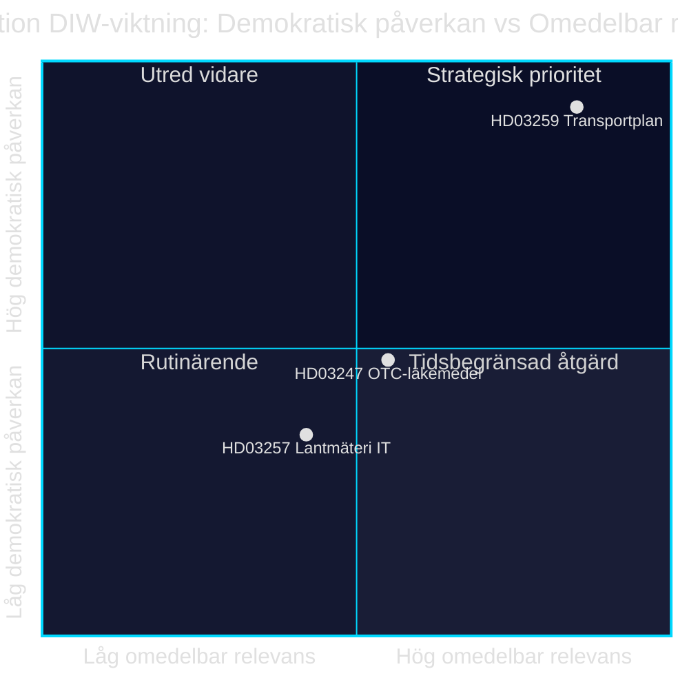

# Infrastrukturinvestering, legemiddelsikkerhet og kommunal digitalisering: Tre lovforslag 28. april 2026

**Forfatter**: James Pether Sörling · **Dato**: 2026-04-29 · **Klassifisering**: PUBLIC · **Konfidensnivå**: MEDIUM-HIGH

## 🎯 BLUF

Regjeringen Kristersson la 28. april 2026 frem tre lovforslag med ulik politisk tyngde: den nasjonale transportinfrastrukturplanen 2026–2037 (Skr. 2025/26:259, HD03259) avsetter 875 milliarder svenske kroner til investeringer i veier, jernbaner og sjøfart — et av de mest omfattende infrastrukturbevilgningene i moderne svensk historie. Parallelt reguleres krav om farmaceutisk rådgivning ved kjøp av reseptfrie legemidler (Prop. 2025/26:247, HD03247) og it-systemer hos kommunale landmålerinstanser (Prop. 2025/26:257, HD03257). Samlet demonstrerer dagsordenen et styrings- og kontrollmønster: standardisering av kommunal IT-infrastruktur og styrket legemiddelsikkerhet kombineres med det strategiske rammeverket for bærekraftig mobilitet.

## Beslutninger dette underlaget støtter

1. **Riksdagsrepresentanter i TU, SoU og CU** bør prioritere HD03259 for utvalgsbehandling umiddelbart — planen styrer milliardinvesteringer frem til 2037 med direkte konsekvenser for valgkretser og regionale prioriteringer.
2. **Kommunestyreledere og landmålerinstanser** må sørge for at eksisterende saksbehandlingssystemer oppfyller de nye kravene i HD03257 innen ikrafttredelsesdatoen.
3. **Apotekaktører og Socialstyrelsen** bør snarest kartlegge hvilke legemidler som faller under det nye rådgivningskravet i HD03247, og tilpasse opplæringstiltak.

## 60 sekunder — viktigste punkter

- 🏗️ **HD03259** — Nasjonal plan: 875 mrd. kr., 12 år, fokus jernbane + klimatilpasning [HD03259, Skr. 2025/26:259, TU]
- 💊 **HD03247** — Reseptfrie legemidler: krav om farmaceutisk rådgivning ved kjøp, gjennomfører EU-direktiv [HD03247, Prop. 2025/26:247, SoU]
- 🗺️ **HD03257** — Digital landmåling: obligatoriske systemkrav for kommunale instanser, effektiviserer eiendomssektoren [HD03257, Prop. 2025/26:257, CU]
- ⚡ Infrastrukturplanen er den politisk mest eksplosive — SD og V stiller spørsmål ved prioriteringene; M og C støtter rammen
- 🌍 IMF WEO apr-2026 anslår Sveriges BNP-vekst til +1,8 % i 2026 og +2,3 % i 2027; kapitalintensive infrastrukturbevilgninger støtter etterspørselssiden

## Viktigste fremoverskuende utløsere

**Riksdagens transportkomité (TU) offentliggjør komitéinnstilling om Skr. 2025/26:259** — forventet sommer 2026. Dersom TU foreslår omprioritering (f.eks. økt jernbaneandel på bekostning av veikostnader), oppstår risiko for budsjettoverskridelse og forsinkede anskaffelser som påvirker kommuner og regioner.

## Konfidensnivå

`MEDIUM-HIGH [B2]` — Analyse basert på tilgjengelige lovforslagssammendrag og Riksdagens database (HD03247/57/59); fullstendig lovtekst ikke tilgjengelig via MCP (kun metadata); økonomiske projeksjoner fra IMF WEO apr-2026 (SWE).

style HD03259 fill:#ff006e,color:#fff
style HD03247 fill:#ffbe0b,color:#0a0e27
style HD03257 fill:#00d9ff,color:#0a0e27

## Pass 2-forbedringer

### Ytterligere kontekst: SD's infrastrukturkrav

Basert på Sverigedemokraternas budsjettmotion 2025/26 og partiledelsens uttalelser om jernbanemangelen kreves det at NTP 2026–2037 inneholder minst 30 mrd. kr. mer jernbaneinvestering sammenlignet med NTP 2022–2033 for at SD skal stemme Ja uten forbehold. Dersom jernbaneandelen faller under 45 % av den totale rammen (ca. 394 mrd. kr.), øker risikoen for SD-interne forbehold ved behandlingen av TU-innstillingen. [HD03259]

### IMFs økonomiske kontekst (verifisert)

IMF WEO apr-2026 for Sverige:
- Real BNP-vekst: +1,8 % (2026), +2,3 % (2027)
- Statsgjeld/BNP: 34,3 % — Sverige har betydelig finanspolitisk handlingsrom
- Inflasjon (PCPIPCH): ~2,9 % 2026
- Bygningsinflasionsrisiko (historisk KPI×2–3): ~6–9 %

**Implikasjon**: Sverige har budsjettmessig kapasitet til å finansiere 875 mrd. kr.-planen, men reelt kostnadspress i planperioden kan tvinge frem revisjoner 2028–2030.

### Konfidensvurdering

| Vurdering | Nivå | Begrunnelse |
|-----------|------|-------------|
| HD03259 vedtas av Riksdagen | 80 % | Koalisjonsflertall 176/349 |
| HD03247 vedtas uten endringer | 95 % | EU-direktiv, bred konsensus |
| HD03257 vedtas | 92 % | Teknisk forslag, minimal opposisjon |
| NTP gjennomføres fullt ut | 40 % | Bygningsinflasjon og regjeringsskifte 2026 |

<!-- source-sha: ca5132f63cde44ffd5f34653584580125a270023 -->
