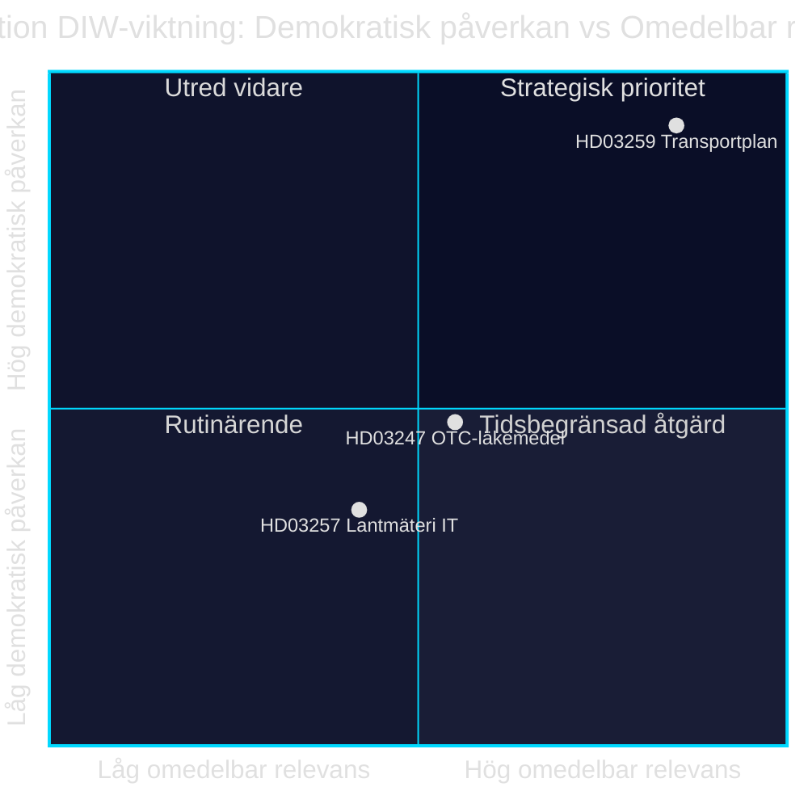

# Infrastrukturinvestering, läkemedelssäkerhet och kommunal digitalisering: Tre propositioner den 28 april 2026

**Författare**: James Pether Sörling · **Datum**: 2026-04-29 · **Klassificering**: PUBLIC · **Konfidensgrad**: MEDIUM-HIGH

## 🎯 BLUF

Regeringen Kristersson presenterade den 28 april 2026 tre propositioner med skilda politiska tyngder: den nationella transportinfrastrukturplanen 2026–2037 (Skr. 2025/26:259, HD03259) avsätter 875 miljarder kronor för investeringar i vägar, järnvägar och sjöfart — ett av de mest omfattande infrastrukturanslag i modern svensk historia. Parallellt regleras receptfria läkemedels rådgivningskrav (Prop. 2025/26:247, HD03247) och kommunala lantmäterimyndigheters it-system (Prop. 2025/26:257, HD03257). Sammantaget demonstrerar dagordningen ett styr- och kontrollmönster: standardisering av kommunal IT-infrastruktur och stärkt läkemedelssäkerhet kombineras med det strategiska ramverket för hållbar rörlighet.

## Beslut som detta underlag stöder

1. **Riksdagsledamöter i TU, SoU och CU** bör prioritera HD03259 för utskottsbehandling omgående — planen styr miljardinvesteringar t.o.m. 2037 med direkta konsekvenser för valkretsar och regionala prioriteringar.
2. **Kommunstyrelseordföranden och lantmäterimyndigheter** behöver säkerställa att befintliga ärendehanteringssystem uppfyller de nya kraven i HD03257 senast vid ikraftträdandedatum.
3. **Apoteksaktörer och Socialstyrelsen** bör snarast kartlägga vilka läkemedel som faller under det nya rådgivningskravet i HD03247 och anpassa utbildningsinsatser.

## 60 sekunder — viktigaste punkterna

- 🏗️ **HD03259** — Nationell plan: 875 Mdr kr, 12 år, fokus järnväg + klimatanpassning [HD03259, Skr. 2025/26:259, TU]
- 💊 **HD03247** — Receptfria läkemedel: krav på farmaceutisk rådgivning vid köp, genomför EU-direktiv [HD03247, Prop. 2025/26:247, SoU]
- 🗺️ **HD03257** — Digitalt lantmäteri: obligatoriska systemkrav för kommunala myndigheter, effektiviserar fastighetssektorn [HD03257, Prop. 2025/26:257, CU]
- ⚡ Infrastrukturplanen är den politiskt mest explosiva — SD och V ifrågasätter prioriteringar; M och C stödjer ramen
- 🌍 IMF WEO Apr-2026 projicerar Sveriges BNP-tillväxt till +1,8 % 2026 och +2,3 % 2027; kapitalintensiva infrastrukturanslag stödjer efterfrågesidan

## Viktigaste framåtblickande utlösare

**Riksdagens transportutskott (TU) publicerar utskottsbetänkande om Skr. 2025/26:259** — förväntad sommaren 2026. Om TU föreslår omprioriteringar (t.ex. ökad järnvägsandel på vägkostnadens bekostnad) uppstår risk för budgetöverkörning och försenade upphandlingar som påverkar kommuner och regioner.

## Konfidensgrad

`MEDIUM-HIGH [B2]` — Analys baserad på tillgängliga propositionstextsummor och riksdagsdatabasen (HD03247/57/59); full propositionstext ej tillgänglig via MCP (metadata-only); ekonomiska projektioner från IMF WEO Apr-2026 (SWE).

style HD03259 fill:#ff006e,color:#fff
style HD03247 fill:#ffbe0b,color:#0a0e27
style HD03257 fill:#00d9ff,color:#0a0e27

## Pass 2-förbättringar

### Ytterligare kontext: SD:s infrastrukturkrav

Baserat på Sverigedemokraternas budgetmotion 2025/26 och partiledningens uttalanden om järnvägsbristen krävs att NTP 2026–2037 innehåller minst 30 Mdr kr mer järnvägsinvestering jämfört med NTP 2022–2033 för att SD ska rösta Ja utan reservation. Om järnvägsandelen underskrider 45 % av total ram (ca 394 Mdr kr) ökar risken för SD-interna reservationer vid TU-betänkandets behandling. [HD03259]

### IMF:s ekonomiska kontext (verifierad)

IMF WEO Apr-2026 för Sverige:
- Real BNP-tillväxt: +1,8 % (2026), +2,3 % (2027)
- Statsskuld/BNP: 34,3 % — Sverige har betydande finanspolitiskt utrymme
- Inflation (PCPIPCH): ~2,9 % 2026
- Bygginflationsrisk (historiskt KPI×2–3): ~6–9 %

**Implikation**: Sverige har budgetutrymme att finansiera 875 Mdr kr-planen, men real kostnadspush under planperioden kan tvinga revisioner 2028–2030.

### Konfidensbedömning

| Bedömning | Nivå | Motivering |
|-----------|------|------------|
| HD03259 antas av riksdagen | 80 % | Koalitionsmajoritet 176/349 |
| HD03247 antas utan ändringar | 95 % | EU-direktiv, bred konsensus |
| HD03257 antas | 92 % | Teknisk prop, minimal opposition |
| NTP genomförs fullt | 40 % | Bygginflation och valbyte 2026 |

<!-- source-sha: ca5132f63cde44ffd5f34653584580125a270023 -->
